# AutoLitManager 自动文献报告

## 本次概览
- 生成时间: 2026-04-10 10:29:08
- 论文总数: 68
- 期刊数量: 4
- 数据库新增/更新/总数: 0/68/262
- 图片采集: 尝试 68 篇 / 命中 24 篇 / 保存 72 张
- ChatGPT 成功批次/总批次: 68/68
- ChatGPT 更新论文数: 68
- 含图论文数: 24
- 已生成流程图论文数: 68

## 期刊分布
- Computer Methods in Applied Mechanics and Engineering: 23 篇
- International Journal of Solids and Structures: 8 篇
- International Journal of Plasticity: 8 篇
- Journal of the Mechanics and Physics of Solids: 29 篇

## 与上次可比运行相比
- 对比运行: 20260404_100010
- 对比运行时间: 2026-04-04T10:38:16
- 上次运行论文数: 68
- 与本次重合论文数: 68
- 本次新增论文数: 0
- 本次未再出现论文数: 0

### 本次新增前沿点
- 将递归神经网络与显式物理结构相结合，而非单纯黑箱时序网络，提高了多尺度本构代理的可解释性与物理一致性。
- 采用分层代理替代直接端到端跨尺度映射，降低了大数据需求，并更适合复合材料这类具有天然层级结构的问题。
- 针对复杂循环载荷的外推泛化能力进行设计与验证，回应了数据驱动本构模型在非比例和历史依赖加载下易失真的前沿难点。
- 将多保真代理学习与延迟接受MCMC深度融合，实现了高维物理反演中采样效率与后验精度的兼顾。
- 支持异构低保真求解器共同参与层级推断，比只依赖单一粗模型的传统多层延迟接受方法更灵活。
- 把高保真调用限制在离线阶段，避免在线采样中昂贵有限元或PDE求解，为大规模逆问题提供可扩展路径。
- 把数据驱动计算力学中的优化问题与变分多尺度稳定化有限元系统结合，扩展了VMS在数据一致性求解中的应用边界。
- 系统比较ASGS与OSGS两类子网格尺度设计，并揭示通过调整稳定化参数可在离散原始与对偶形式之间切换。
- 从连续适定性到离散误差场评估形成完整链条，为后续更复杂数据驱动PDE反演和同化问题提供理论与算法基础。
- 将DeepONet用于复杂肿瘤生长PDE系统的贝叶斯反演，把算子学习与不确定性量化直接结合起来。

## 抓取信息
```json
{
  "journals": {
    "computer_methods_in_applied_mechanics_and_engineering": {
      "name": "Computer Methods in Applied Mechanics and Engineering",
      "source_type": "crossref",
      "issue_index": 0,
      "fetched_count": 23,
      "issue_samples": [
        "Volume 456"
      ],
      "selected_issue_label": "Volume 456",
      "selected_issue_key": "volume_456",
      "selected_issue_publish_date": "2026-07-01"
    },
    "international_journal_of_plasticity": {
      "name": "International Journal of Plasticity",
      "source_type": "crossref",
      "issue_index": 0,
      "fetched_count": 8,
      "issue_samples": [
        "Volume 201"
      ],
      "selected_issue_label": "Volume 201",
      "selected_issue_key": "volume_201",
      "selected_issue_publish_date": "2026-06-01"
    },
    "journal_of_the_mechanics_and_physics_of_solids": {
      "name": "Journal of the Mechanics and Physics of Solids",
      "source_type": "crossref",
      "issue_index": 0,
      "fetched_count": 29,
      "issue_samples": [
        "Volume 212"
      ],
      "selected_issue_label": "Volume 212",
      "selected_issue_key": "volume_212",
      "selected_issue_publish_date": "2026-06-01"
    },
    "international_journal_of_solids_and_structures": {
      "name": "International Journal of Solids and Structures",
      "source_type": "crossref",
      "issue_index": 0,
      "fetched_count": 8,
      "issue_samples": [
        "Volume 334"
      ],
      "selected_issue_label": "Volume 334",
      "selected_issue_key": "volume_334",
      "selected_issue_publish_date": "2026-06-01"
    }
  },
  "summary": {
    "journals_count": 4,
    "papers_before_dedup": 68,
    "papers_after_dedup": 68,
    "papers_after_issue_history_filter": 68,
    "issue_history_skipped_papers": 0,
    "issue_history_skipped_journals": 0,
    "papers_after_seen_filter": 68,
    "seen_skipped_count": 0,
    "seen_incomplete_reused_count": 68
  }
}
```

## 图表概览
### 期刊论文分布
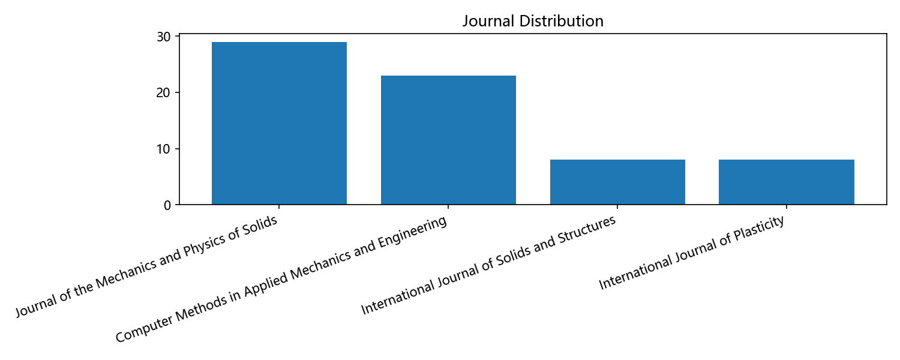

### 分类分布
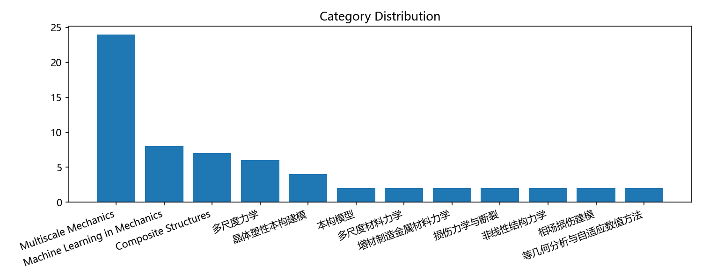

### 关注关键词分布
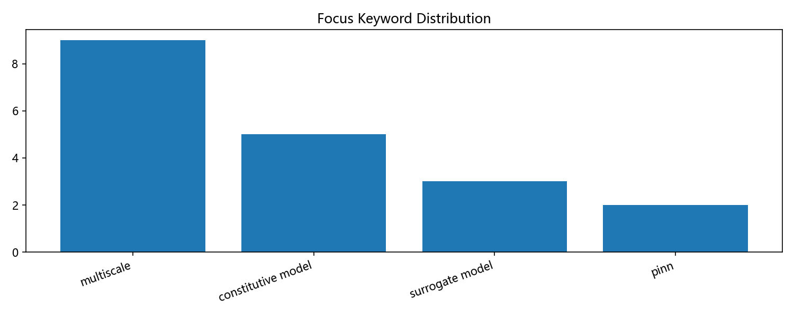

### 多次运行论文数趋势
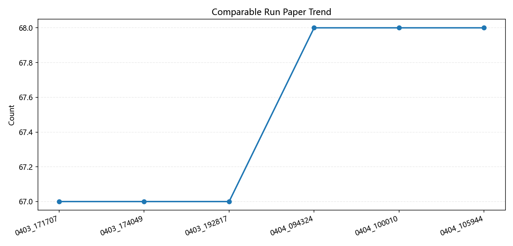

### 关注方向热点变化图
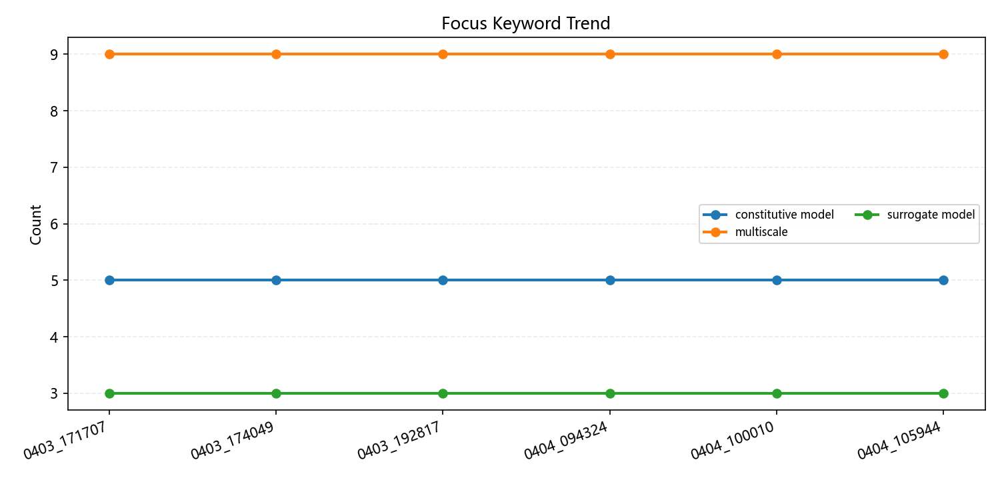

### 高频方法变化图
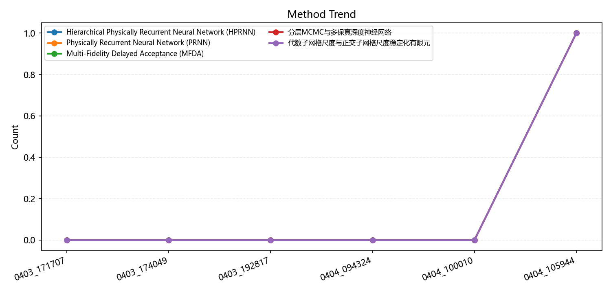

## 多次运行趋势分析

- 纳入统计的可比运行数: 6
- 统计范围: 20260403_171707 -> 20260404_105944
- 当前论文数 / 历史均值: 68 / 67.4
- 当前相对历史均值变化: +0.6
- 期刊范围: Computer Methods in Applied Mechanics and Engineering, International Journal of Plasticity, International Journal of Solids and Structures, Journal of the Mechanics and Physics of Solids

### 趋势图
#### 多次运行论文数趋势


#### 关注方向热点变化图


#### 高频方法变化图


## 总体前沿进展
- 将递归神经网络与显式物理结构相结合，而非单纯黑箱时序网络，提高了多尺度本构代理的可解释性与物理一致性。
- 采用分层代理替代直接端到端跨尺度映射，降低了大数据需求，并更适合复合材料这类具有天然层级结构的问题。
- 针对复杂循环载荷的外推泛化能力进行设计与验证，回应了数据驱动本构模型在非比例和历史依赖加载下易失真的前沿难点。
- 将多保真代理学习与延迟接受MCMC深度融合，实现了高维物理反演中采样效率与后验精度的兼顾。
- 支持异构低保真求解器共同参与层级推断，比只依赖单一粗模型的传统多层延迟接受方法更灵活。
- 把高保真调用限制在离线阶段，避免在线采样中昂贵有限元或PDE求解，为大规模逆问题提供可扩展路径。
- 把数据驱动计算力学中的优化问题与变分多尺度稳定化有限元系统结合，扩展了VMS在数据一致性求解中的应用边界。
- 系统比较ASGS与OSGS两类子网格尺度设计，并揭示通过调整稳定化参数可在离散原始与对偶形式之间切换。
- 从连续适定性到离散误差场评估形成完整链条，为后续更复杂数据驱动PDE反演和同化问题提供理论与算法基础。
- 将DeepONet用于复杂肿瘤生长PDE系统的贝叶斯反演，把算子学习与不确定性量化直接结合起来。
- 模型同时考虑双相连续体肿瘤力学生物过程与免疫微环境耦合，比仅做数据拟合的黑箱肿瘤模型更具机理解释性。
- 通过代理模型显著降低后验采样代价，为个体化参数识别和数据驱动精准医学建模提供可扩展方案。

## 重点关注论文
#### 基于分层物理递归神经网络的机织复合材料多尺度分析
- 英文标题: Multiscale analysis of woven composites using hierarchical physically recurrent neural networks
- 期刊: Computer Methods in Applied Mechanics and Engineering
- 日期/期次: 2026-07-01 / Volume 456
- DOI: 10.1016/j.cma.2026.118939
- 分类: Composite Structures, Machine Learning in Mechanics, Multiscale Mechanics, 多尺度力学, 数据驱动本构与代理建模
- 关注关键词: constitutive model, multiscale, surrogate model
- 价值分: 100
- 链接: https://doi.org/10.1016/j.cma.2026.118939
- 一句话摘要: 该文提出分层物理递归神经网络（HPRNN），在微-介-宏多尺度之间嵌入物理约束，实现机织复合材料非线性弹塑性响应的高效、可解释代理预测。
- 核心内容: 本文面向机织复合材料多尺度均匀化中细观计算代价高的问题，提出了分层物理递归神经网络（HPRNN）框架。第一层利用PRNN学习经纱与纬纱在微观力学数据驱动下的非线性弹塑性本构响应，第二层再将纱线代理模型与基体本构模型结合，完成介观到宏观的尺度过渡。该方法把物理性质直接编码进潜在空间，因此比纯数据驱动RNN或Transformer更不容易出现非物理预测。结果上，该框架在复杂循环载荷下具有更好的泛化能力，同时兼顾计算效率与可解释性。
- 图像摘要: 概览图展示了机织复合材料从宏观试样、到介观编织RVE、再到微观纱束内部纤维/基体分布的三层层级结构，并用箭头明确标出Micro-PRNN与Hierarchical PRNN在尺度传递中的位置。图中介观层以红绿两组交织纱束表示经纬纱结构，底部微观放大图进一步说明单根纱束内部由离散纤维与基体组成，强调“先学纱线、再学结构”的分层建模思想。结合图注可知，后续结构图进一步拆解机织复合材料的基本组成，而载荷路径图则区分了用于训练/验证的随机应变历程与用于外推测试的循环载荷历程，突出该方法对复杂历史依赖响应的建模目标。
- 模型/流程摘要: 整体流程是一个两级代理本构框架：先在微观尺度基于细观力学数据训练纱线级PRNN，分别表征经纱和纬纱的非线性弹塑性行为；再在更高尺度将这些纱线代理与基体本构一起嵌入物理编码的介-宏尺度模型中，形成HPRNN；最后利用该分层网络完成机织复合材料在复杂加载尤其是循环加载下的宏观响应预测与多尺度均匀化分析。
- 与关注方向的关系: 这篇工作与关注方向高度契合：它本质上是一个面向复合材料多尺度均匀化的物理约束代理本构模型，兼具多尺度、本构建模和surrogate model三类关键词；虽然不是典型PINN，但同样强调将物理知识嵌入神经网络结构中，以改善泛化与非物理行为问题。
- 方法关键词: Hierarchical Physically Recurrent Neural Network (HPRNN), Physically Recurrent Neural Network (PRNN)
- 应用方向: 复杂循环载荷下复合材料宏观本构响应预测, 机织复合材料多尺度均匀化分析
- 前沿要点: 将递归神经网络与显式物理结构相结合，而非单纯黑箱时序网络，提高了多尺度本构代理的可解释性与物理一致性。；采用分层代理替代直接端到端跨尺度映射，降低了大数据需求，并更适合复合材料这类具有天然层级结构的问题。；针对复杂循环载荷的外推泛化能力进行设计与验证，回应了数据驱动本构模型在非比例和历史依赖加载下易失真的前沿难点。
- 图像要点: 核心图明确给出了宏观试样—介观编织结构—微观纱束内部组织的三级层次，以及Micro-PRNN和HPRNN在不同尺度过渡中的功能分工。；训练与外推载荷示意强调该方法不是只拟合单一路径，而是面向随机加载训练和循环加载泛化，这与其“历史依赖本构代理模型”的定位一致。
- 研究流程: 基于微观力学计算数据构建经纱和纬纱的训练样本，并训练纱线级PRNN以学习历史相关的弹塑性响应。 -> 将纱线级PRNN与基体本构模型耦合，在介观编织结构层面建立带有物理编码潜空间的HPRNN。 -> 输入复杂随机或循环载荷历程，完成介-宏尺度响应传递，输出机织复合材料的宏观本构响应并进行泛化评估。
- 论文图像:
图像角色: 摘要/概览图
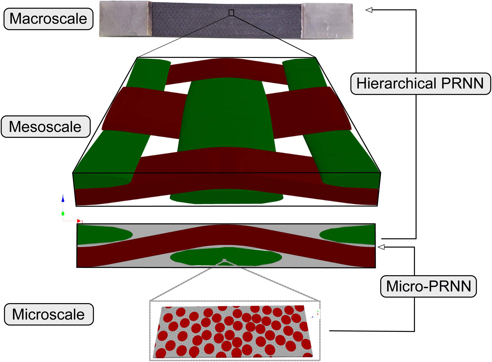
_图注: Fig. 1 Hierarchical structure of woven composites and the transition across two scales with PRNN and the proposed HPRNN. The macroscopic sample taken by E. Ghane [44] is included only to clarify the concept._
_选图理由: 首图优先视作摘要附近概览图_
图像角色: 模型/方法图
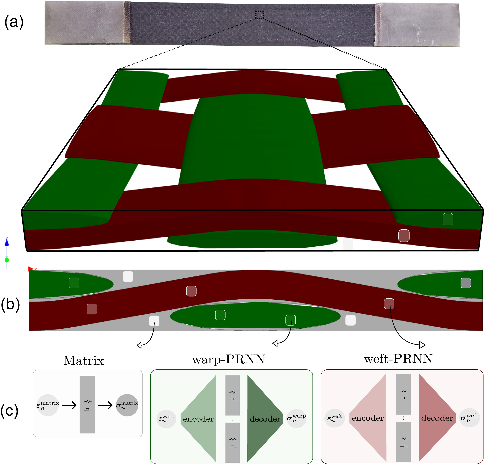
_图注: Fig. 6 Multi-scale structure of a woven composite. (a) Photograph of a carbon fiber woven composite taken by E. Ghane, adapted from [44] , (b) Schematic representation of the mesoscale woven RVE, (c) The three fundamental components of a fictitious material point used in the HPRNN architecture: (I) matrix constitutive model, (II) weft-PRNN, and (III) warp-PRNN._
_选图理由: 图注含 framework/workflow/model 强信号；图注偏方法或结构示意；第二图优先视作模型或方法图_
图像角色: 结果/实验图
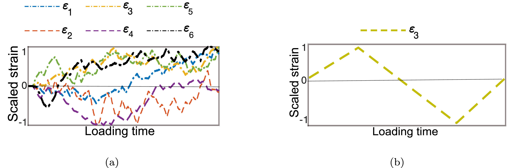
_图注: Fig. 3 Samples of scaled (normalized between 1 and -1) strain components ε j generated in (a) random loading used for training and validation and (b) cyclic loading to be used in extrapolation._
_选图理由: 图注含 results/experiment/validation 强信号；图注偏结果或响应展示；后续图优先视作结果或实验图_
- 自动生成流程图:
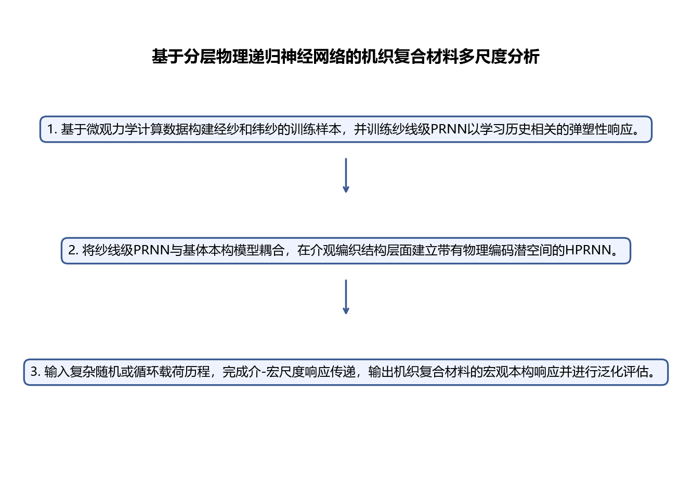

#### 基于深度神经网络融合多求解器的多保真延迟接受：用于贝叶斯逆问题的分层MCMC采样
- 英文标题: Multi-fidelity delayed acceptance: Hierarchical MCMC sampling for Bayesian inverse problems combining multiple solvers through deep neural networks
- 期刊: Computer Methods in Applied Mechanics and Engineering
- 日期/期次: 2026-07-01 / Volume 456
- DOI: 10.1016/j.cma.2026.118916
- 分类: Machine Learning in Mechanics, 代理模型与贝叶斯反演, 多保真计算与不确定性量化
- 关注关键词: surrogate model
- 价值分: 57
- 链接: https://doi.org/10.1016/j.cma.2026.118916
- 一句话摘要: 该文提出一种将多保真神经网络嵌入分层延迟接受MCMC中的贝叶斯反演框架，以低成本近似高保真似然并加速后验采样。
- 核心内容: 本文针对基于偏微分方程的贝叶斯逆问题中高保真求解器反复调用代价过高的问题，提出了多保真延迟接受（MFDA）方法。该方法在多层延迟接受MCMC框架下，引入多保真神经网络，将多个低保真求解器的输出映射为更接近高保真模型的似然评估结果。其核心思想是在离线阶段使用有限的高保真数据训练代理网络，而在线采样阶段仅调用粗尺度求解器和训练好的网络，从而避免额外高保真仿真。结果表明，该策略能够改善粗模型的近似精度，提升链的混合性与子链长度，并在地下水流和反应-扩散反演问题中实现显著加速。
- 图像摘要: 概览图展示了一个三层链式延迟接受结构：左侧是多层MCMC子链，其中上两层对应两个低保真层级，底层对应高保真层级；右侧是各层的似然评估模块，低保真求解器输出先进入对应的近似似然，再决定接受率，最高层则采用真实高保真似然。图中橙、蓝、紫三色分别表示不同保真级别，清楚地体现了“先用便宜模型筛选，再用更精确模型校正”的层级接受机制。结合图注可知，方法图进一步强调MFDA包含离线训练和在线推断两阶段：先生成参数样本并同时调用不同保真求解器构建训练集，再训练多保真神经网络；结果图则比较了不同训练样本量和不同粗求解器输入组合下代理模型精度，说明多源低保真信息可有效提升高保真近似质量。
- 模型/流程摘要: 该方法首先在离线阶段采集同一组参数下多个低保真与高保真求解器的响应，并训练多保真神经网络学习从粗求解器输出到高保真似然或高保真响应的映射关系；随后在在线阶段，将该网络嵌入多层延迟接受MCMC中，每一层使用相应低保真求解器与网络近似似然进行候选筛选；最终仅通过粗求解器和已训练好的网络即可完成后验采样，从而在保持精度的同时降低贝叶斯反演成本。
- 与关注方向的关系: 该文虽然不是PINN或经典本构模型工作，但与代理模型和多尺度/多保真计算高度相关，核心是用深度网络替代昂贵高保真物理求解器进行贝叶斯反演加速。这类方法对复杂力学模型、参数识别、损伤参数反演和多尺度模型校准都有很强借鉴意义。
- 方法关键词: Multi-Fidelity Delayed Acceptance (MFDA), 分层MCMC与多保真深度神经网络
- 应用方向: 地下水流与反应-扩散系统的不确定性量化, 基于PDE的参数识别与贝叶斯逆问题
- 前沿要点: 将多保真代理学习与延迟接受MCMC深度融合，实现了高维物理反演中采样效率与后验精度的兼顾。；支持异构低保真求解器共同参与层级推断，比只依赖单一粗模型的传统多层延迟接受方法更灵活。；把高保真调用限制在离线阶段，避免在线采样中昂贵有限元或PDE求解，为大规模逆问题提供可扩展路径。
- 图像要点: 首图的核心信息是多层子链与多层似然评估并行耦合，体现了MFDA在MLDA基础上把不同低保真层统一接入同一分层采样框架。；方法与结果图共同说明：高保真模型只在离线训练中被调用一次性提供监督，而在线推断不再需要高保真求解器。
- 研究流程: 离线生成参数样本，并在多个低保真和高保真求解器上计算对应响应，构建多保真训练数据集。 -> 训练多保真深度神经网络，学习利用多个粗尺度求解器输出来逼近高保真模型的似然评估或响应映射。 -> 在线阶段在分层延迟接受MCMC中仅调用低保真求解器与代理网络完成多级筛选和后验采样，加速贝叶斯反演。
- 论文图像:
图像角色: 摘要/概览图
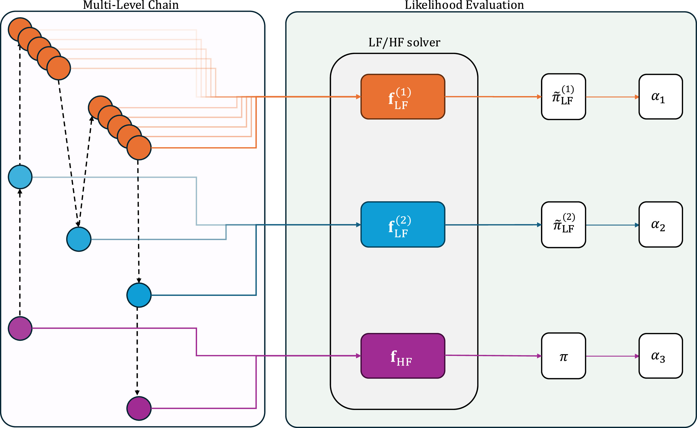
_图注: Fig. 1 Schematic representation of the MLDA scheme, for an instance of two low-fidelity solvers and one high-fidelity solver. At each level, a candidate θ ′ is proposed by generating a sub-chain of length J l − 1 . Each coarse level l uses the surrogate f LF ( l ) and its corresponding likelihood π ˜ LF ( l ) , while the finest level uses f HF and its corresponding likelihood π ._
_选图理由: 图注偏概览或示意；首图优先视作摘要附近概览图_
图像角色: 模型/方法图
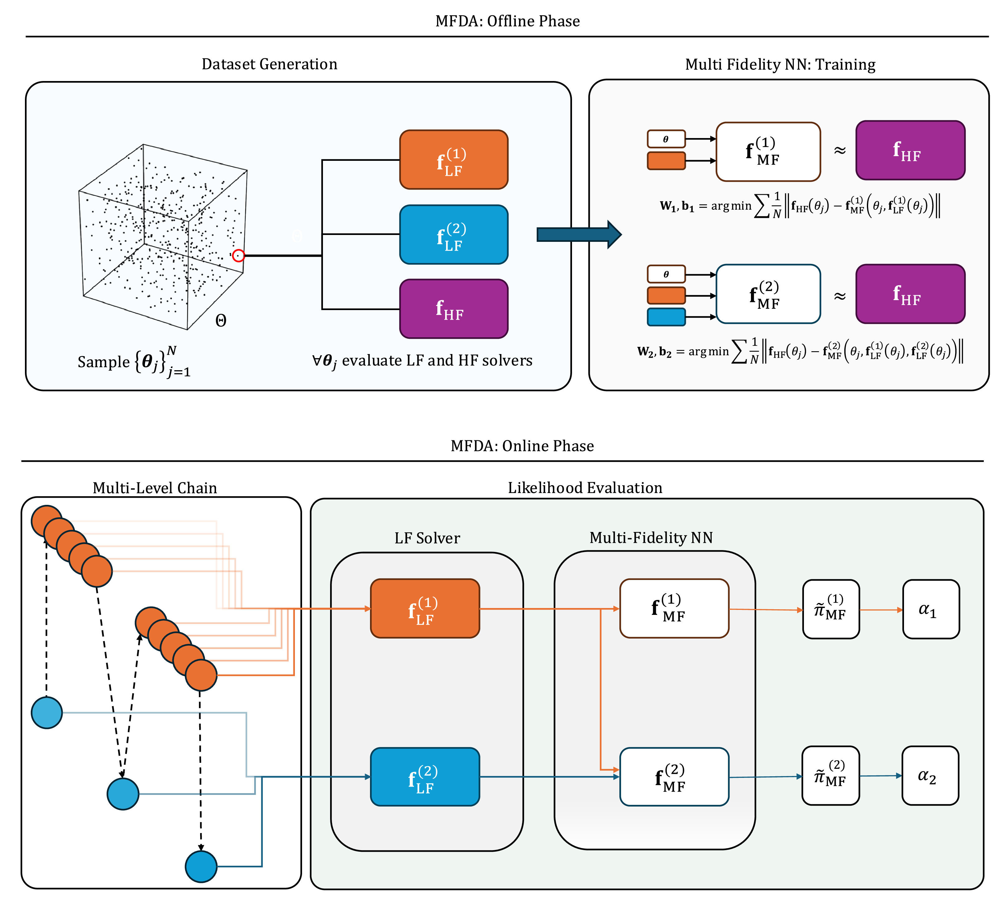
_图注: Fig. 3 Schematic representation of the Multi-Fidelity Delayed Acceptance (MFDA) framework for an instance of two low-fidelity solvers and one high-fidelity solver. First row: offline phase. A dataset of parameter samples is generated and each solver is evaluated for every parameter instance. Then multi-fidelity neural networks are trained to approximate the high-fidelity reference. Second row: online phase. A Markov chain of parameter samples is generated using a multi-level structure. At each level we evaluate the corresponding low-fidelity solvers and neural networks to compute the likelihood and acceptance rate._
_选图理由: 图注含 framework/workflow/model 强信号；图注偏方法或结构示意；第二图优先视作模型或方法图_
图像角色: 结果/实验图
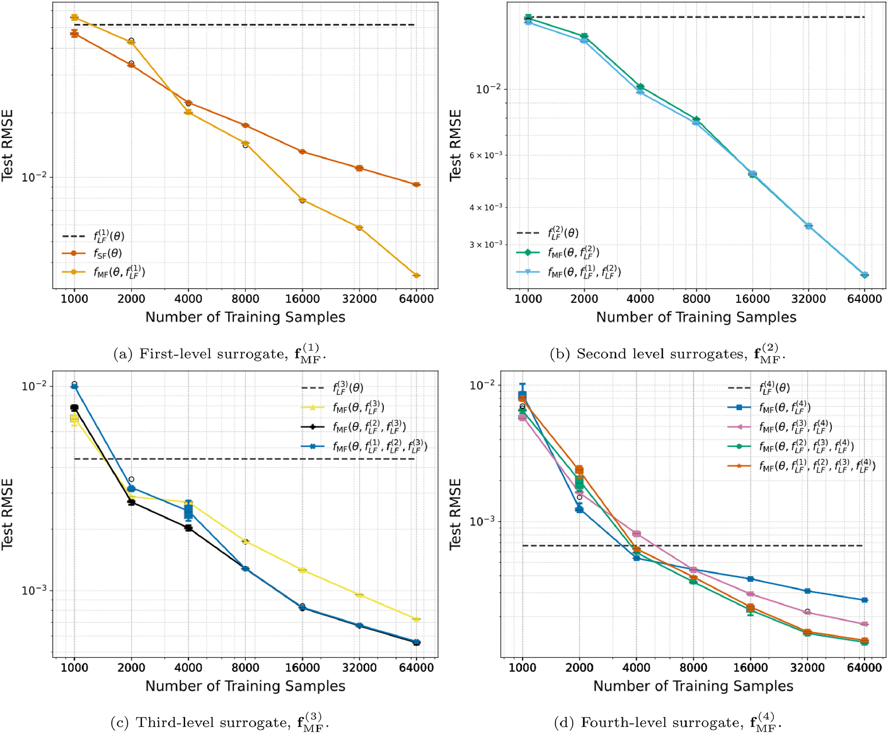
_图注: Fig. 6 Accuracy of the multi-fidelity surrogate models for different levels and training sample sizes, varying the amount of input coarse solver information._
_选图理由: 图注含 results/experiment/validation 强信号；后续图优先视作结果或实验图_
- 自动生成流程图:
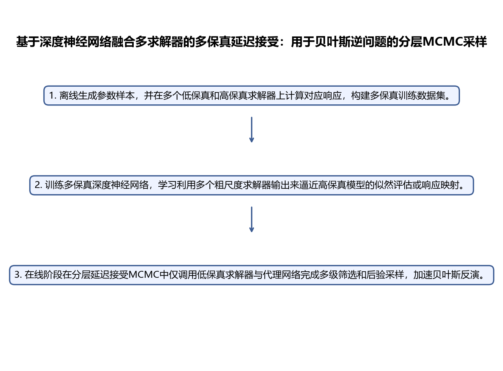

#### 面向数据驱动计算力学中PDE约束优化问题的变分多尺度方法
- 英文标题: A variational multiscale approach to PDE-constrained optimization problems arising in data-driven computational mechanics
- 期刊: Computer Methods in Applied Mechanics and Engineering
- 日期/期次: 2026-07-01 / Volume 456
- DOI: 10.1016/j.cma.2026.118944
- 分类: Multiscale Mechanics, PDE约束优化与数据驱动计算力学, 多尺度有限元方法
- 关注关键词: multiscale
- 价值分: 57
- 链接: https://doi.org/10.1016/j.cma.2026.118944
- 一句话摘要: 该文针对数据驱动计算力学中的反应-扩散型PDE约束优化，构建了基于变分多尺度稳定化的原始-对偶有限元框架。
- 核心内容: 本文研究了数据驱动计算力学中由PDE约束优化引出的最优性条件，并将其专门化到反应-扩散问题背景下。作者从连续层面分析了原始形式与对偶形式的适定性，随后基于变分多尺度（VMS）思想提出稳定且一致的有限元离散方法。文中重点考察了两类典型子网格尺度设计，即代数子网格尺度（ASGS）和正交子网格尺度（OSGS），并讨论了它们在拟一致网格上的理论性质。数值实验通过多个渐进复杂案例比较原始与对偶离散方案的误差场、网格收敛和稳定性表现，验证了所提方法的有效性。
- 图像摘要: 首图并不是传统的网络结构图，而是一个概览型数值场图，展示了制造解下的原始场、对偶场以及数据场s̃和ẽ，帮助读者理解该优化问题中状态变量、伴随变量和数据项之间的对应关系。第二组图以不同网格细化等级下的等值线形式给出Primal-ASGS方案中的u、s、e、λ和μ等场变量，核心视觉信息是随着网格加密，各场分布更加平滑且稳定化后的数值解保持一致结构。结果图则直接对比Primal-ASGS与Dual-ASGS的误差场，例如u-u_h与s-s_h的空间分布，用以说明原始与对偶离散方案在误差传播和局部偏差上的差异。
- 模型/流程摘要: 整体流程是先从数据驱动计算力学中的PDE约束优化问题出发，写出相应的原始和对偶最优性系统；再利用变分多尺度框架对其进行稳定化有限元离散，并分别采用ASGS或OSGS子网格尺度设计；最后在一系列制造解和更复杂算例中，对比不同原始/对偶离散方案的场变量重建效果、误差分布和数值稳定性。
- 与关注方向的关系: 这篇文章与关注方向的契合点主要在多尺度和数据驱动计算框架上。它不是PINN、损伤力学或典型神经网络代理模型论文，但其VMS稳定化思想、原始-对偶优化结构和PDE约束求解框架，对多尺度计算、数据同化、参数识别以及后续物理约束代理模型设计都有较强参考价值。
- 方法关键词: 代数子网格尺度与正交子网格尺度稳定化有限元, 变分多尺度方法（VMS）
- 应用方向: 反应-扩散型PDE约束优化问题求解, 数据驱动计算力学中的场重建与数值稳定化分析
- 前沿要点: 把数据驱动计算力学中的优化问题与变分多尺度稳定化有限元系统结合，扩展了VMS在数据一致性求解中的应用边界。；系统比较ASGS与OSGS两类子网格尺度设计，并揭示通过调整稳定化参数可在离散原始与对偶形式之间切换。；从连续适定性到离散误差场评估形成完整链条，为后续更复杂数据驱动PDE反演和同化问题提供理论与算法基础。
- 图像要点: 图像重点不是黑箱机器学习结构，而是原始场、对偶场、数据场和误差场的空间分布可视化，突出该工作的核心在于稳定化变分离散与优化系统求解。；不同网格细化下的等值线图和误差场对比图共同说明，VMS稳定化能够在原始和对偶两类离散中提供可控且可比较的数值表现。
- 研究流程: 建立反应-扩散型数据驱动计算力学问题的原始与对偶最优性方程，并分析连续问题的适定性。 -> 基于变分多尺度思想构造稳定化有限元离散，选择ASGS或OSGS作为子网格尺度近似方案。 -> 通过制造解与多组数值算例比较原始和对偶格式在不同网格下的场分布、误差场与数值性能。
- 论文图像:
图像角色: 摘要/概览图
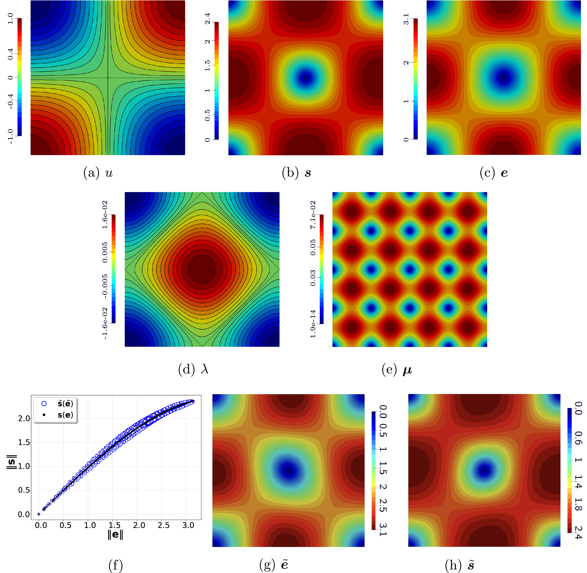
_图注: Fig. 1 Manufactured solution for the example 1 showing the primal and dual fields as well as the data fields s ˜ and e ˜ ._
_选图理由: 首图优先视作摘要附近概览图_
图像角色: 模型/方法图
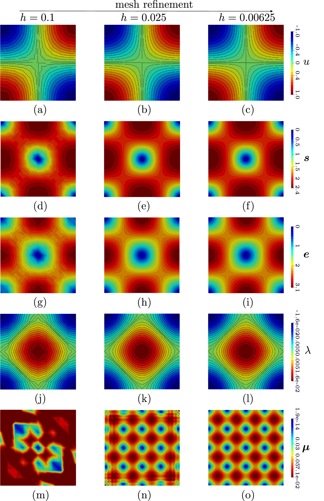
_图注: Fig. 2 Contours of fields u , s , e , λ and μ for the Primal-ASGS formulation for different levels of mesh refinement._
_选图理由: 第二图优先视作模型或方法图_
图像角色: 结果/实验图
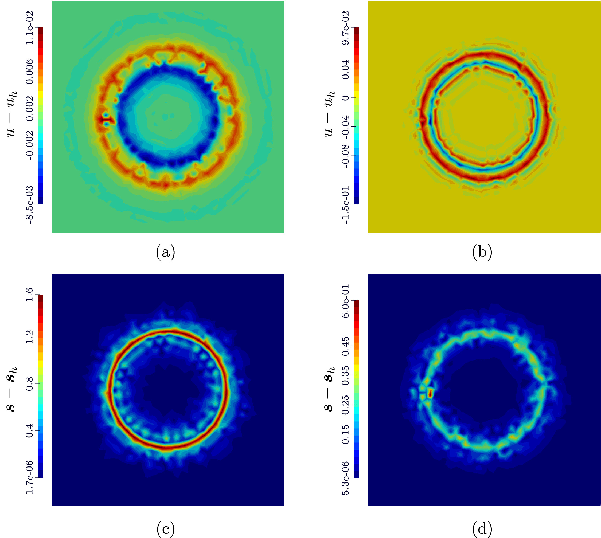
_图注: Fig. 14 Figures (a)–(b) present the error field u − u h for the Primal - and Dual-ASGS formulations. In the same way, Figures (c)– (d) present the error field s − s h for the Primal - and Dual-ASGS formulations._
_选图理由: 图注含 results/experiment/validation 强信号；图注偏结果或响应展示；后续图优先视作结果或实验图_
- 自动生成流程图:
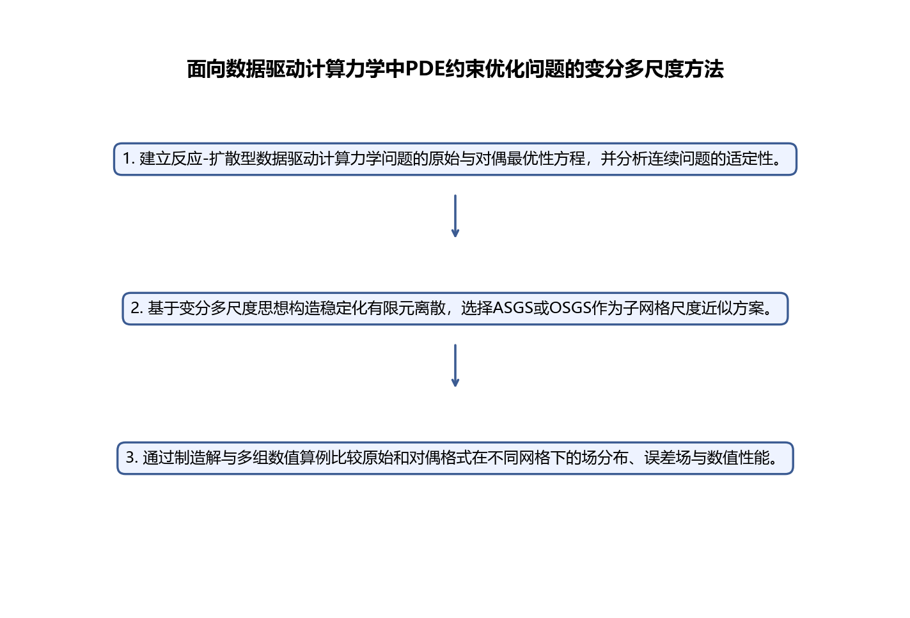

#### 用于双相肿瘤生长建模的DeepONet增强贝叶斯推断
- 英文标题: DeepONet-enhanced bayesian inference for biphasic tumor growth modeling
- 期刊: Computer Methods in Applied Mechanics and Engineering
- 日期/期次: 2026-07-01 / Volume 456
- DOI: 10.1016/j.cma.2026.118919
- 分类: Machine Learning in Mechanics, 代理模型与算子学习, 生物力学中的贝叶斯反演
- 关注关键词: surrogate model
- 价值分: 57
- 链接: https://doi.org/10.1016/j.cma.2026.118919
- 一句话摘要: 该文将连续介质双相肿瘤生长模型、DeepONet代理和贝叶斯推断结合起来，以更低代价完成肿瘤生长参数识别与预测。
- 核心内容: 本文提出了一个面向肿瘤生长建模的数据驱动计算框架，将双相肿瘤生长模型、免疫微环境耦合机制和贝叶斯参数推断结合起来。其核心困难在于肿瘤生长模型由多个强耦合非线性PDE组成，直接用于贝叶斯反演计算成本很高。为此，作者引入DeepONet作为算子代理模型，在保持高保真模拟精度的同时显著加速肿瘤体积随时间演化的预测。最终，该框架可利用实验数据反演关键模型参数，为个体化癌症建模与数据同化提供高效路径。
- 图像摘要: 概览图展示了肿瘤微环境中的核心生物耦合过程：中心是癌细胞，周围包含氧气、先天免疫细胞、CD8细胞、抗原以及APC/未成熟APC等组分，箭头和抑制符号表示促炎细胞因子、抗原呈递和免疫抑瘤之间的相互作用，因此首图本质上是一个机理性肿瘤生长模型示意图，而不是单纯的数据流程图。根据图注，第二图应为DeepONet代理结构图，用于根据输入参数和仿真时间预测肿瘤体积，突出“以算子网络替代昂贵PDE求解器”的方法主线。第三图则比较高保真肿瘤生长模拟与DeepONet预测在代表性样本上的时间演化曲线，核心证据是代理模型能够准确重现肿瘤体积随时间的变化。
- 模型/流程摘要: 整体流程是先建立包含肿瘤组织、氧输运和免疫响应的双相连续体肿瘤生长模型，并用高保真PDE求解器生成训练数据；再训练DeepONet学习从输入参数与时间到肿瘤体积演化的映射；最后把该代理模型嵌入贝叶斯推断框架中，利用实验数据高效评估后验分布并识别关键生长参数。
- 与关注方向的关系: 这篇文章与关注方向高度相关，因为它同时涉及代理模型、物理机制建模和多场耦合PDE系统。虽然不是传统PINN或本构模型论文，但DeepONet本质上是算子级代理学习方法，适合借鉴到复杂连续介质、多尺度生物力学或损伤演化参数反演问题中。
- 方法关键词: DeepONet代理模型, 双相肿瘤生长模型与贝叶斯参数推断
- 应用方向: 基于实验数据的癌症模型参数识别与个体化建模, 肿瘤生长动力学预测
- 前沿要点: 将DeepONet用于复杂肿瘤生长PDE系统的贝叶斯反演，把算子学习与不确定性量化直接结合起来。；模型同时考虑双相连续体肿瘤力学生物过程与免疫微环境耦合，比仅做数据拟合的黑箱肿瘤模型更具机理解释性。；通过代理模型显著降低后验采样代价，为个体化参数识别和数据驱动精准医学建模提供可扩展方案。
- 图像要点: 首图的重点是肿瘤微环境内部多组分耦合机理，包括癌细胞、氧气、先天与适应性免疫反应、抗原产生与呈递的相互作用网络。；方法图与结果图共同说明，DeepONet不仅承担代理求解器角色，而且在时间演化预测上能较好逼近高保真双相肿瘤生长模拟。
- 研究流程: 构建耦合癌细胞、氧气、免疫细胞、抗原呈递与炎症因子的双相肿瘤生长PDE模型，并生成高保真仿真数据。 -> 训练DeepONet代理模型，学习由输入参数和时间到肿瘤体积或生长响应的算子映射。 -> 在贝叶斯推断中用DeepONet替代昂贵高保真求解器，结合实验数据反演关键模型参数并进行预测。
- 论文图像:
图像角色: 摘要/概览图
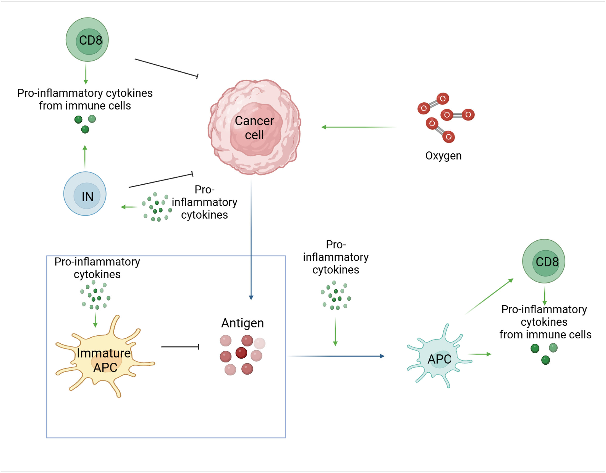
_图注: Fig. 1 Schematic overview of the coupled biological processes included in the mechanistic TGM, illustrating interactions between cancer cells, innate and adaptive immune cells, antigen production and presentation, and immune-mediated tumor cell killing._
_选图理由: 图注含 overview/graphical abstract 强信号；图注偏概览或示意；首图优先视作摘要附近概览图_
图像角色: 模型/方法图
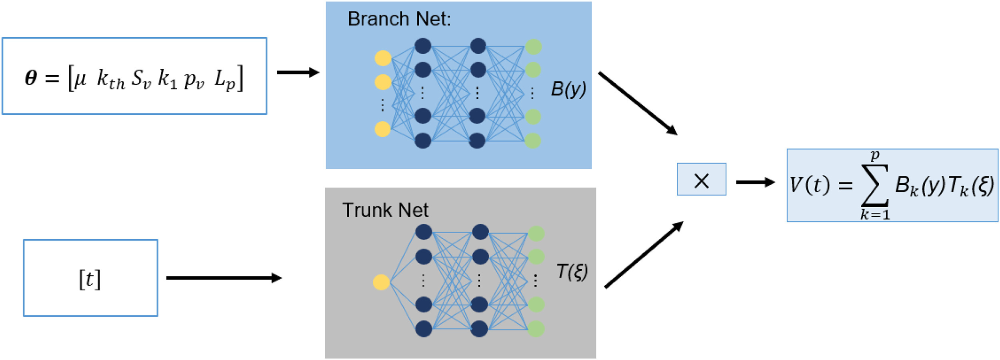
_图注: Fig. 4 Surrogate architecture to model the tumor volume depending on simulation time and input parameters._
_选图理由: 图注含 framework/workflow/model 强信号；图注偏方法或结构示意；第二图优先视作模型或方法图_
图像角色: 结果/实验图
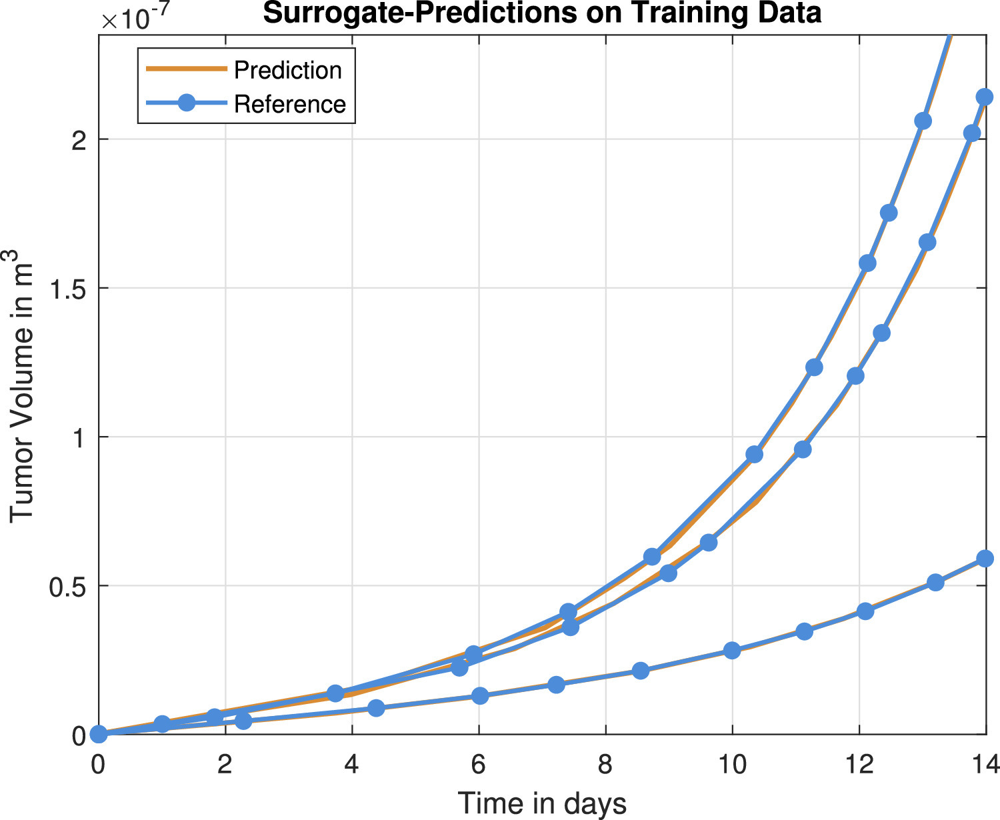
_图注: Fig. 7 Comparison between high-fidelity tumor growth simulations and the corresponding predictions of the DeepONet surrogate model for representative training samples, demonstrating accurate reproduction of the temporal tumor volume evolution used during surrogate training._
_选图理由: 图注含 results/experiment/validation 强信号；后续图优先视作结果或实验图_
- 自动生成流程图:
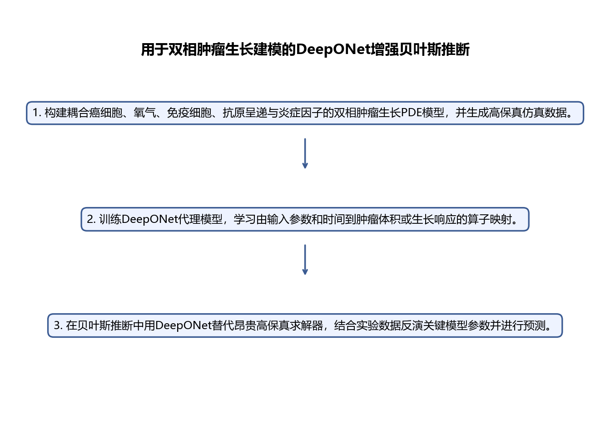

#### 具有载荷诱导边界转角缺陷的全连接晶格屈曲研究
- 英文标题: Buckling of fully-connected lattices with load-induced boundary rotation imperfections
- 期刊: International Journal of Solids and Structures
- 日期/期次: 2026-06-01 / Volume 334
- DOI: 10.1016/j.ijsolstr.2026.113961
- 分类: Machine Learning in Mechanics, 晶格超材料与仿生层级结构, 结构稳定性与屈曲力学
- 关注关键词: pinn
- 价值分: 57
- 链接: https://doi.org/10.1016/j.ijsolstr.2026.113961
- 一句话摘要: 该文针对无关节全连接晶格中的载荷诱导边界转角效应，建立解析与半解析屈曲模型并揭示其会显著降低承载能力。
- 核心内容: 本文研究全连接、无关节晶格结构中一个常被忽略的失稳来源：相邻杆件变形会对原本笔直受压杆施加随载荷演化的端部转角，从而形成载荷诱导的边界转角缺陷。作者将这种效应与传统预存几何初始缺陷区分开来，推导了带规定边界转角的柱体非线性载荷-挠度闭式解，并进一步发展了考虑柱长缩短的半解析方法。随后通过非线性有限元分析对理论结果进行验证，并在多种代表性工况下系统评估临界载荷下降规律。结果表明，这类由边界耦合变形引起的旋转缺陷会显著削弱全连接晶格和机械超材料的抗屈曲能力。
- 图像摘要: 首图并不是传统的理论框架图，而是一个工程与生物结构对照的概览图。左上展示了激光粉末床熔融制备的多种钛合金晶格试样，右上展示了带有八面体桁架界面的双悬臂梁结构，说明工程化无关节晶格与架构化界面的实际形式；左下给出了海绵骨针的内部层级晶格显微形貌，右下展示了乌贼骨的轻质蜂窝/晶格微结构，强调生物结构中同样存在无关节、刚性连接且受相邻构件耦合影响的层级格构。结合图注可知，这张图的核心作用是说明工程晶格与仿生天然结构在连接形式和屈曲机理上的平行性，为后续载荷诱导边界转角失稳分析提供背景。
- 模型/流程摘要: 整体思路是先从工程晶格与生物格构中抽象出无关节刚性连接、相邻杆件变形会强制施加端部转角的受压杆问题；然后建立带边界转角和初始缺陷的非线性柱屈曲解析模型，并用考虑柱长缩短的半解析方法补充；最后通过非线性有限元验证，并在点载、弯矩、分布载荷、架构化界面及与初始缺陷耦合等多个场景中评估临界载荷衰减。
- 与关注方向的关系: 这篇文章与关注方向的匹配点主要在多尺度/层级晶格、结构稳定性和力学机理建模上。它并非PINN、代理模型或经典本构模型论文，但对架构化材料、仿生晶格和失稳主导型力学问题的理论建模很有参考价值，尤其适合与多尺度超材料设计和损伤/屈曲失效分析结合阅读。
- 方法关键词: 带边界转角缺陷的非线性解析屈曲模型, 考虑柱长缩短的半解析方法与非线性有限元验证
- 应用方向: 无关节全连接晶格与机械超材料的稳定性评估, 架构化界面结构和仿生层级格构的抗屈曲设计
- 前沿要点: 将载荷诱导边界转角缺陷与传统预存几何初始缺陷明确区分，为全连接晶格屈曲研究提供了新的失稳机制视角。；给出了带规定边界转角的非线性闭式载荷-挠度解，并结合考虑柱长缩短的半解析方法，兼顾理论可解释性与工程适用性。；揭示在某些典型构型下临界力可降至等效铰接柱的22%，表明边界耦合效应对机械超材料稳定性评估至关重要。
- 图像要点: 图1的重点是把增材制造晶格、架构化界面梁以及天然层级格构并列展示，说明研究对象不是单根理想柱，而是存在强运动学耦合的全连接格构体系。；该图传达的核心物理直觉是：在无关节刚性连接晶格中，相邻构件变形会把端部转角传递给受压杆，从而诱发不同于静态初始缺陷的边界旋转型失稳。
- 研究流程: 从全连接无关节晶格和仿生格构中识别由相邻构件变形引起的载荷诱导边界转角缺陷问题。 -> 建立带规定边界转角的柱体非线性载荷-挠度解析解，并发展考虑柱长缩短的半解析模型。 -> 结合非线性有限元在多类代表性受载场景下验证模型并量化临界载荷降低幅度。
- 论文图像:
图像角色: 摘要/概览图
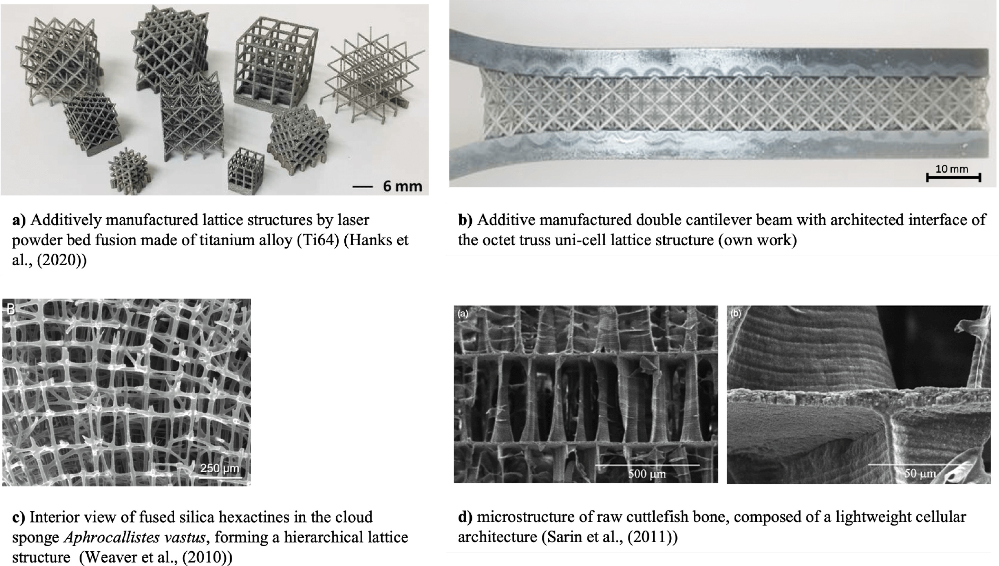
_图注: Fig. 1 Comparison of engineered and biological structures exhibiting joint-free, rigid connections of lattice structures. In both cases, mechanical response is influenced by kinematically coupled deformations, highlighting parallels between artificial mechanical metamaterials and natural lattice structures. (Reprinted with permission: for a) from Additive Manufacturing, Volume 35, Article 101301, 2020. Elsevier; for (c) from The Journal of Adhesion, Volume 86, Issue 1, 2010, Pages 72–95. Taylor & Francis.; for (d) from Journal of the American Ceramic Society, Volume 94, Issue 8, 2011, Pages 2362–2370. Wiley.)._
_选图理由: 图注含 results/experiment/validation 强信号；图注偏结果或响应展示；为满足展示顺序补足“摘要/概览图”_
图像角色: 模型/方法图
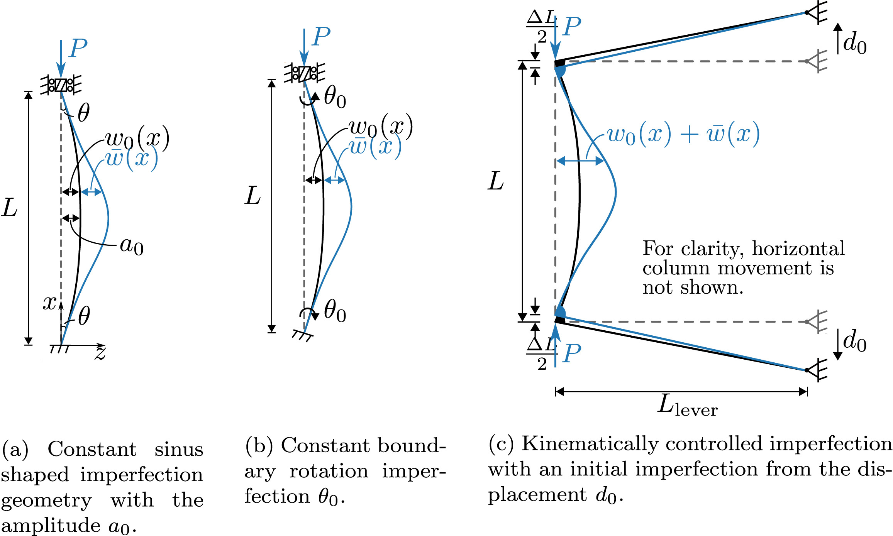
_图注: Fig. 3 Representation of the clamped–clamped columns with imperfections and their deformation. Black marks the initial state of the column with the imperfection, and blue shows the final deformation under the axial compression by the force P . Dashed lines represent the reference geometry._
_选图理由: 图注偏方法或结构示意；第二图优先视作模型或方法图_
图像角色: 结果/实验图
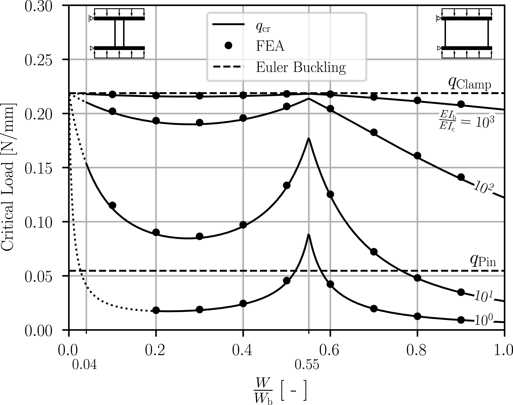
_图注: Fig. 13 Critical load for the column deflection of | δ ̃ max | = 0 . 04 . Values of W / W b > 0 . 04 are excluded as buckling will result in contact between the columns. For E I b / E I c = 1 , the values below W / W b > 0 . 2 are excluded as large deflection results in an unstable finite element solution. Parameters as listed in Table 1 ._
_选图理由: 图注含 results/experiment/validation 强信号；图注偏结果或响应展示；后续图优先视作结果或实验图_
- 自动生成流程图:
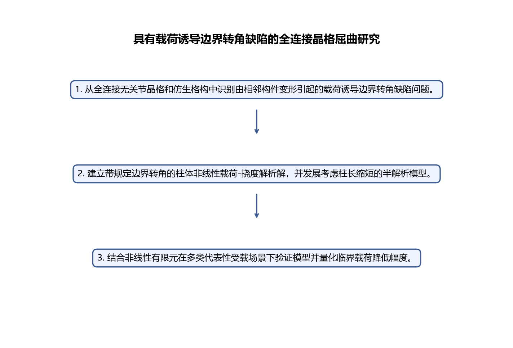

#### 玻璃态聚合物中水解降解与黏塑性的本构建模：一种有效温度方法
- 英文标题: Constitutive modelling of hydrolytic degradation and viscoplasticity in glassy polymers: An effective temperature approach
- 期刊: International Journal of Plasticity
- 日期/期次: 2026-06-01 / Volume 201
- DOI: 10.1016/j.ijplas.2026.104690
- 分类: 本构建模, 聚合物降解与多物理耦合力学
- 关注关键词: constitutive model
- 价值分: 47
- 链接: https://doi.org/10.1016/j.ijplas.2026.104690
- 一句话摘要: 该文提出一种耦合水扩散、水解断链与黏塑性变形的玻璃态聚合物本构模型，并用有效温度统一表征降解对力学性能的影响。
- 核心内容: 本文针对可降解玻璃态聚合物在水环境中的水解劣化行为，建立了一个同时考虑水扩散、水解链断裂和黏塑性变形的耦合本构模型。作者用有效温度来刻画吸水和分子量下降导致的玻璃化转变温度降低，从而把降解状态与力学响应联系起来。模型利用PLA在干燥未降解和湿态降解条件下的热-力学实验数据进行了标定，并较好重现了分子量、水浓度分布及不同降解阶段的变形行为。文中还通过代表性案例展示了该模型在弱耦合模拟中的应用潜力，为可降解聚合物器件设计提供了实用工具。
- 图像摘要: 首图是一个清晰的实验概览图：左侧展示PLA圆棒在PBS溶液中的恒温水解降解装置，包括加热垫、PID温控和热电偶；中间示意将降解后的棒材切除两端后加工为圆柱试样；右侧给出8 mm×8 mm圆柱试样的轴向压缩测试方式。因此，这张图主要承担“实验流程总览”的作用，把材料处理、试样制备和力学测试串联起来。根据图注，第二图应展示不同孔隙结构在10天和35天降解后的含水率与平均分子量等值分布，用来说明孔结构设计如何影响降解场演化；第三图则给出不同温度下干燥未降解PLA的压缩真应力-应变曲线以及上下屈服应力和屈服降落，作为本构标定的重要实验依据。
- 模型/流程摘要: 整体流程是先通过PLA水解降解实验和压缩实验获取热-力学与劣化数据，再建立耦合水扩散、链断裂和黏塑性变形的本构模型；随后引入有效温度，把水吸收和平均分子量降低对玻璃化转变温度及机械性能的影响统一映射到材料参数中；最后利用实验数据完成模型标定，并对不同降解阶段及多孔结构中的降解-力学响应进行预测。
- 与关注方向的关系: 这篇文章与关注方向高度匹配，因为它是一篇典型的本构模型论文，核心是把化学降解、扩散和黏塑性变形进行多物理耦合描述。虽然不是PINN或代理模型工作，但在损伤/劣化演化、本构建模和结构尺度预测之间建立了明确联系，对研究材料时变性能、可降解器件和多场耦合力学问题都很有参考价值。
- 方法关键词: 有效温度本构方法, 耦合水扩散-水解断链-黏塑性模型
- 应用方向: PLA等可降解玻璃态聚合物器件设计与分析, 多孔可降解结构在水环境中的劣化与力学行为预测
- 前沿要点: 将水扩散、水解链断裂与黏塑性本构统一耦合，面向可降解玻璃态聚合物给出更完整的劣化-力学关联描述。；采用有效温度这一物理启发参数，把吸水和分子量衰减共同引起的玻璃化转变温度下降映射到力学性能变化中，兼顾简洁性与可解释性。；不仅能够预测均匀试样的降解阶段力学行为，还可分析多孔结构中由结构架构引起的空间非均匀降解效应。
- 图像要点: 首图突出的是从降解环境、试样截取到压缩测试的完整实验链条，说明该工作高度依赖多阶段实验支撑本构建模。；后续图像分别对应空间降解场分布和力学响应曲线，表明该模型既关注材料内部水解演化，也关注由此引起的屈服与压缩行为变化。
- 研究流程: 开展PLA在PBS环境中的受控水解降解实验，并制备圆柱压缩试样获取热-力学和劣化演化数据。 -> 建立耦合水扩散、水解链断裂与玻璃态聚合物黏塑性变形的本构模型，并用有效温度表征吸水和分子量下降效应。 -> 利用实验数据标定模型参数，进而预测不同降解阶段及不同孔结构下的水分布、分子量演化和力学响应。
- 论文图像:
图像角色: 摘要/概览图
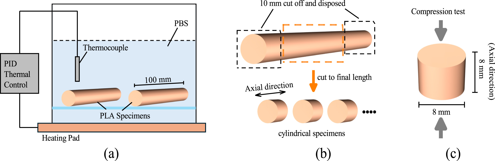
_图注: Fig. 1 Schematic illustration of (a) the experimental setup for the degradation of PLA rods; (b) specimen preparation for mechanical testing; (c) compression testing on cylinder specimens._
_选图理由: 图注偏概览或示意；首图优先视作摘要附近概览图_
图像角色: 模型/方法图
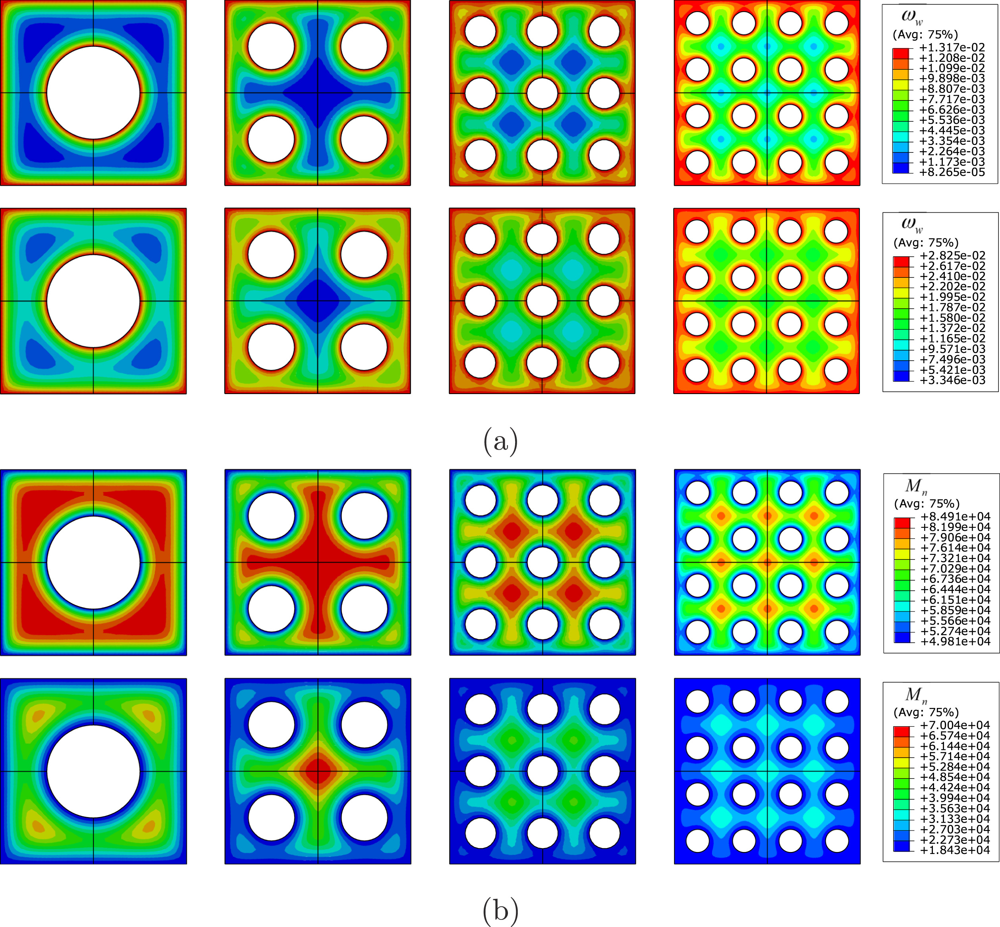
_图注: Fig. 14 Effect of pore architecture on degradation behaviour of porous structures. Contours of (a) water fraction and (b) average molecular weight after 10 days (first row) and 35 days (second row) degradation for different designs._
_选图理由: 图注含 framework/workflow/model 强信号；第二图优先视作模型或方法图_
图像角色: 结果/实验图
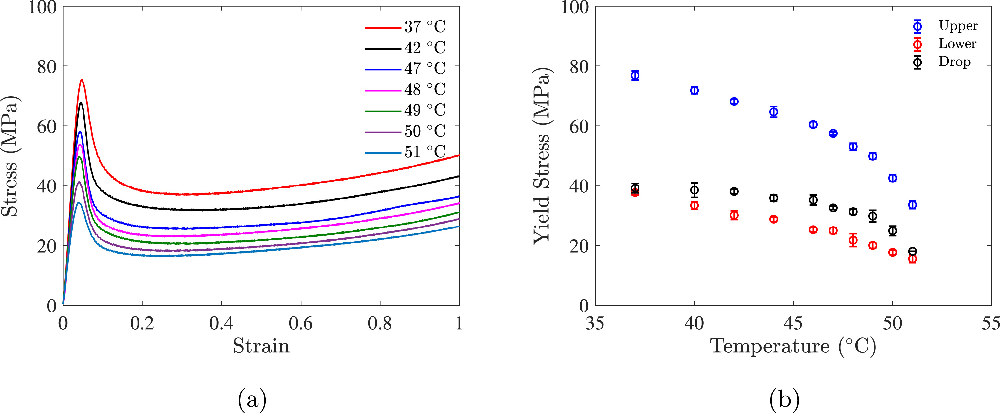
_图注: Fig. 4 (a) Compressive true stress strain curves and (b) upper yield stress, lower yield stress, and yield stress drop of dry, undegraded PLA before at different temperatures._
_选图理由: 图注含 results/experiment/validation 强信号；图注偏结果或响应展示；后续图优先视作结果或实验图_
- 自动生成流程图:
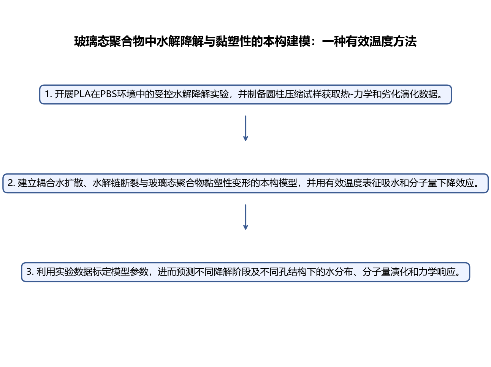

#### 硅橡胶中的变形诱导畴
- 英文标题: Deformation-induced domains in silicone rubber
- 期刊: Journal of the Mechanics and Physics of Solids
- 日期/期次: 2026-06-01 / Volume 212
- DOI: 10.1016/j.jmps.2026.106592
- 分类: 本构模型, 软材料中的相变与局域化力学
- 关注关键词: constitutive model
- 价值分: 47
- 链接: https://doi.org/10.1016/j.jmps.2026.106592
- 一句话摘要: 该文结合原位X射线断层观测与本构建模，揭示硅橡胶中可移动相取向切换所诱发的力学畴形成与空间非均匀变形机制。
- 核心内容: 本文研究了一类含可移动相的硅橡胶在受载时出现的空间非均匀变形现象。作者通过原位X射线计算机断层成像和示踪掺杂实验表明，这种非均匀性与材料内部可移动相的迁移和重排有关，并提出其可能表现出类似液晶的向列畴行为。基于这一认识，文中建立了含可移动相的橡胶本构模型，并针对轴对称单轴加载进行了分析。模型给出了一个相图，将响应划分为三种变形区域，并成功解释了拉伸与压缩下试样芯部和外层体积变化相反的现象。
- 图像摘要: 首图更适合作为实验现象概览图，而不是纯方法图。图(a)展示了硅橡胶梁的四点弯曲加载装置，图(b)给出了弯曲后梁内部体积应变det(Fij)-1的空间分布，颜色场显示在看似均匀的宏观弯曲下，梁厚度方向出现明显非均匀体积变化；图(c)和(d)则利用ZnI2示踪剂对比未变形与变形后的内部迁移分布，并比较普通梁与含过量催化剂梁的差异，直观说明材料内部可移动相会在受弯后发生重排，形成拉伸侧与压缩侧不同的畴化响应。根据图注，第二图应展示胶粘端面约束下圆柱试样受压时Fij分量及det(Fij)的空间分布，用于说明轴对称单轴加载中的非均匀场；第三图则为相图，横纵轴分别与平均占据参数和施加轴向应变有关，划分出三种变形机制区域，并给出转变半径轮廓，是连接实验观察与理论预测的关键结果图。
- 模型/流程摘要: 整体流程是先通过四点弯曲和X射线断层成像观察硅橡胶中体积应变的空间非均匀性，再借助ZnI2示踪剂证明这种异质性与材料内部可移动相迁移有关；在此基础上，将可移动相视为具有取向切换能力的类似向列相组分，建立橡胶-可移动相耦合本构模型；最后针对轴对称单轴加载分析其解结构，构建相图并解释变形诱导畴的形成条件与不同区域的体积膨胀/收缩特征。
- 与关注方向的关系: 这篇工作与关注方向高度相关，因为它是一篇典型的机理驱动本构建模论文，并且涉及内部相演化、空间非均匀变形和类似损伤/畴形成的局域化现象。虽然不是PINN或代理模型论文，但其将内部微观相行为映射到宏观力学响应的思路，对研究复杂软材料本构、多场耦合和局域化演化问题很有借鉴意义。
- 方法关键词: 原位X射线断层观测与相图分析, 含可移动相的硅橡胶本构建模
- 应用方向: 具有内部可移动相材料的力学响应预测与设计, 硅橡胶等软聚合物的非均匀变形机理分析
- 前沿要点: 将硅橡胶内部可移动相视为具有液晶样向列特征的组分，为软材料中机械诱导畴形成提供了新的微观物理解释。；把原位CT观测、示踪剂迁移证据与连续体本构模型结合起来，实现了从实验现象到相图预测的闭环分析。；模型能够预测拉伸与压缩下芯部和外层体积变化符号相反的反常分布，为理解软聚合物中的空间非均匀变形提供了新框架。
- 图像要点: 首图的核心证据是：即便外部施加的是表面上较规则的弯曲载荷，材料内部仍会出现显著空间非均匀的体积应变与示踪剂重分布，说明内部存在受变形驱动的相重排。；后续方法图和相图共同表明，非均匀变形并非简单边界效应，而是与可移动相分子取向切换、畴半径演化和相区转换密切相关。
- 研究流程: 通过四点弯曲与原位X射线断层成像获取硅橡胶内部体积应变的空间分布，并用示踪剂观察可移动相的迁移。 -> 提出可移动相具有类似液晶向列取向行为的物理假设，并建立含该相的硅橡胶本构模型。 -> 在轴对称单轴加载下求解模型并绘制相图，识别不同变形区域及机械诱导畴形成机制。
- 论文图像:
图像角色: 摘要/概览图
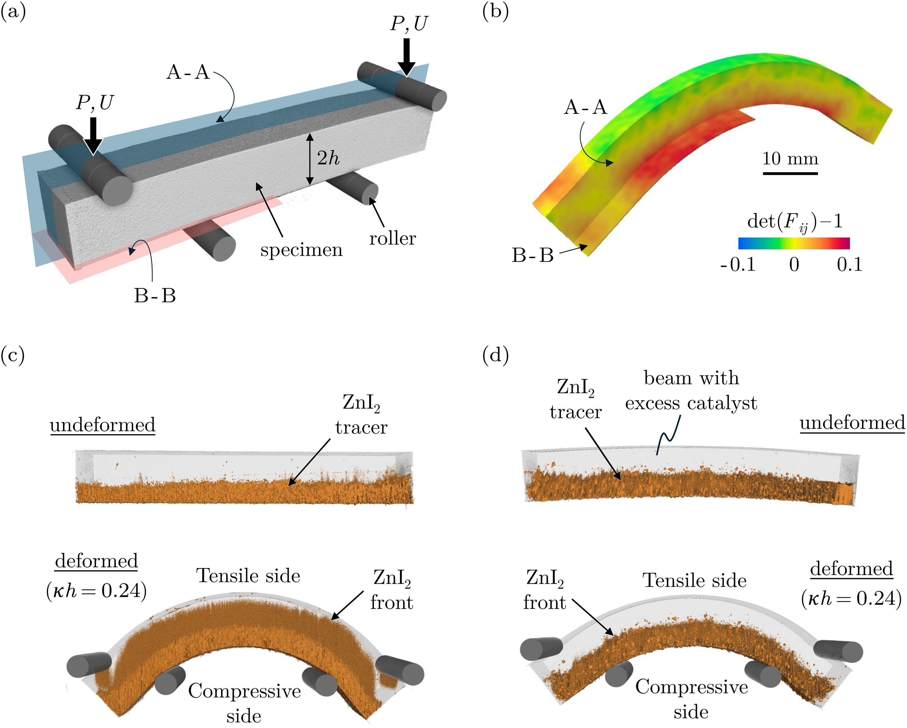
_图注: Fig. 1 Summary of the key observations of Wang et al. (2024) for the 4-point bend loading of a silicone rubber beam of height 2 h (a) Sketch of the 4-point bending setup. (b) Measurements of the spatial distribution of the volumetric strain parameterised by det ( F i j ) upon loading the beam to a normalised curvature κ h = 0.24 . Internal deformation is shown by sectioning the beam on plane A-A and B-B indicated in (a). (c) An undeformed silicone rubber beam with Zn I 2 added as a tracer for the mobile phase molecules. The tracer is only added on the one side of the neutral axis. The distribution of the tracer after loading the beam to κ h = 0.24 with the initial tracers on the compressive side. (d) A similar tracer experiment with an excess of catalyst added to the silicone rubber to nearly eliminate the mobile phase. The tracer is now seen to not diffuse into the tensile side._
_选图理由: 图注含 results/experiment/validation 强信号；图注偏结果或响应展示；为满足展示顺序补足“摘要/概览图”_
图像角色: 模型/方法图
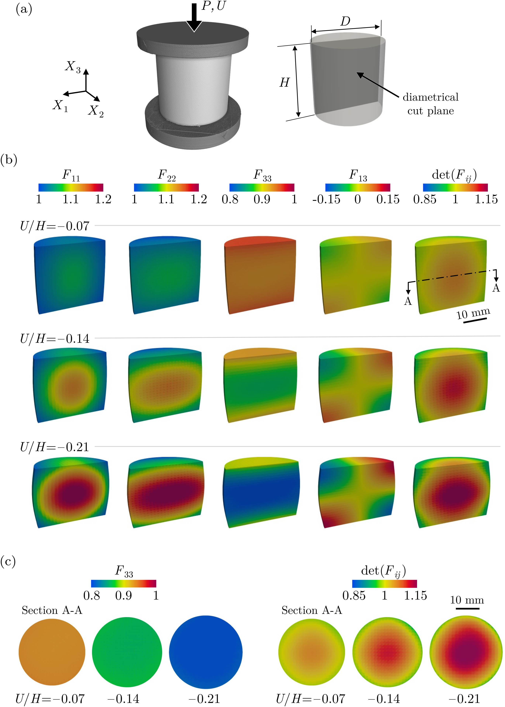
_图注: Fig. 2 (a) Sketch of the compressive loading of a cylindrical specimen with top and bottom surfaces glued to platens. The global coordinate system X i is also shown. (b) Spatial distribution of select components of F i j and det ( F i j ) of the H / D = 1 specimen subject to compressive loading. The distributions are shown on the diametrical plane indicated in (a) at three levels of the applied nominal compressive strain U / H . (c) Distributions of F 33 and det ( F i j ) on the central symmetry plane A-A indicated in (b) for the same three levels of U / H ._
_选图理由: 图注偏结果或响应展示；为满足展示顺序补足“模型/方法图”_
图像角色: 结果/实验图
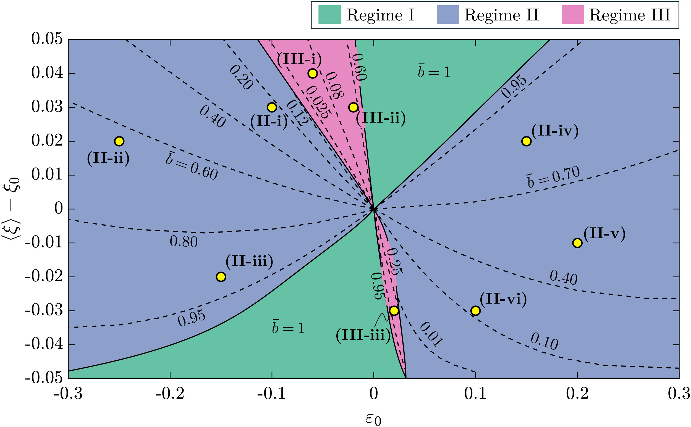
_图注: Fig. 6 A phase map with axes of average occupancy parameterised by 〈 ξ 〉 − ξ 0 and imposed axial strain ε 0 . The map shows the regions over which the 3 regimes of deformation exist along with contours of the normalised transition radius b ¯ at which the orientation of the mobile phase molecules switches to result in a spatially heterogeneous solution. Locations at which detailed distributions of the fields are shown in Fig. 7 are also indicated._
_选图理由: 图注含 results/experiment/validation 强信号；图注偏结果或响应展示；后续图优先视作结果或实验图_
- 自动生成流程图:
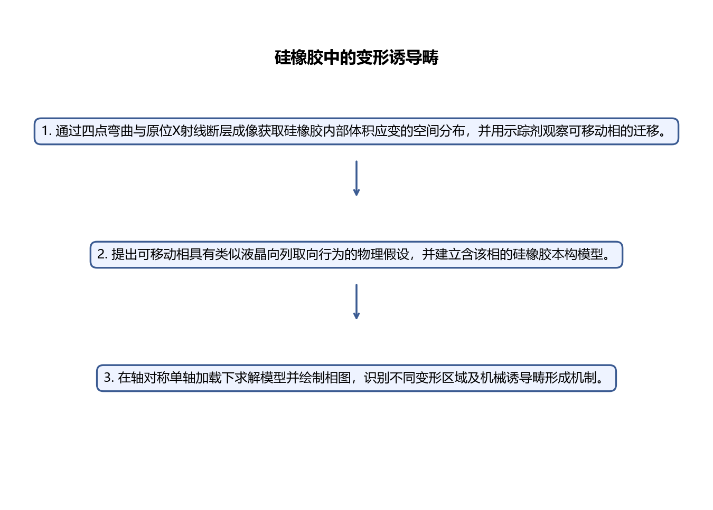

#### 用于非线性复合材料并发多尺度建模的热力学信息引导注意力网络
- 英文标题: Thermodynamics-informed attention networks for concurrent multiscale modeling of nonlinear composites
- 期刊: International Journal of Plasticity
- 日期/期次: 2026-06-01 / Volume 201
- DOI: 10.1016/j.ijplas.2026.104681
- 分类: Composite Structures, Machine Learning in Mechanics, Multiscale Mechanics, 多尺度力学, 物理约束代理本构模型
- 关注关键词: multiscale
- 价值分: 77
- 链接: https://doi.org/10.1016/j.ijplas.2026.104681
- 一句话摘要: 该文提出MulTIAN热力学信息引导双注意力网络，用于任意加载路径下非线性单向复合材料及结构的并发多尺度建模。
- 核心内容: 本文提出一种新的并发多尺度神经网络框架MulTIAN，用于预测单向复合材料在复杂加载-卸载路径下的非弹性响应。其核心是双网络结构：主注意力网络用于预测表征历史效应的内部状态变量，辅助网络用于预测Helmholtz自由能势，并由此导出本构关系。作者在损失函数中显式嵌入热力学约束，使模型在数据驱动预测的同时保持物理一致性。该框架还被集成到ABAQUS中，用于结构尺度分析，并在多个典型复合材料结构与实验测试中验证了精度，同时实现了显著的时间和内存节省。
- 图像摘要: 本题未提供附图，因此无法依据图像总结具体网络结构图、流程图或结果曲线。仅从摘要可知，论文的核心视觉主线应包括：并发多尺度框架、双注意力网络结构、由自由能导出本构关系的热力学约束设计，以及与经典多尺度方法和实验结果的对比验证。若对应论文常规配图，最关键的应是网络-多尺度耦合示意、典型结构算例响应对比，以及计算效率提升结果。
- 模型/流程摘要: 整体流程是先在材料点层面构建热力学信息引导的双注意力网络，其中主网络学习内部状态变量演化，辅助网络学习自由能势；再通过热力学约束损失保证由自由能导出的应力和内变量演化满足物理一致性；最后将该代理本构模型嵌入ABAQUS，实现结构模型与微观胞元的直接耦合，并用于复杂路径下复合材料结构的并发多尺度分析与实验对照。
- 与关注方向的关系: 这篇文章与关注方向高度吻合，因为它同时覆盖多尺度建模、非线性复合材料本构、物理约束神经网络和代理模型几个核心主题。它不是传统PINN，但本质上属于热力学约束的数据驱动本构建模框架，尤其适合参考其内部状态变量设计、自由能建模思路以及在ABAQUS中的实现方式。
- 方法关键词: MulTIAN热力学信息引导注意力网络, 基于自由能势的双网络并发多尺度建模
- 应用方向: 单向复合材料在任意加载路径下的非线性响应预测, 复合材料结构的ABAQUS并发多尺度模拟与实验验证
- 前沿要点: 把注意力网络、内部状态变量建模和自由能势学习统一到一个热力学约束框架中，提升了复杂历史路径下的泛化能力与可解释性。；实现了复合材料结构与微观单胞之间的并发多尺度耦合，并可直接嵌入ABAQUS开展工程结构分析。；在保持高精度的同时显著降低多尺度模拟的时间和内存开销，为非线性复合材料高效结构分析提供了新路径。
- 图像要点: 核心方法应是双注意力网络与自由能本构推导的结合，而不是单一黑箱应力回归网络。；关键结果应集中在复杂加载路径下的响应精度，以及相对传统多尺度方法的显著降内存和降耗时效果。
- 研究流程: 构建双网络MulTIAN框架，分别预测历史相关内部状态变量和Helmholtz自由能势。 -> 在训练中显式加入热力学约束，使自由能、状态变量与本构响应之间满足物理一致性。 -> 将训练后的模型集成到ABAQUS，完成材料点和结构层面的并发多尺度模拟，并与传统方法及实验结果比较。
- 自动生成流程图:
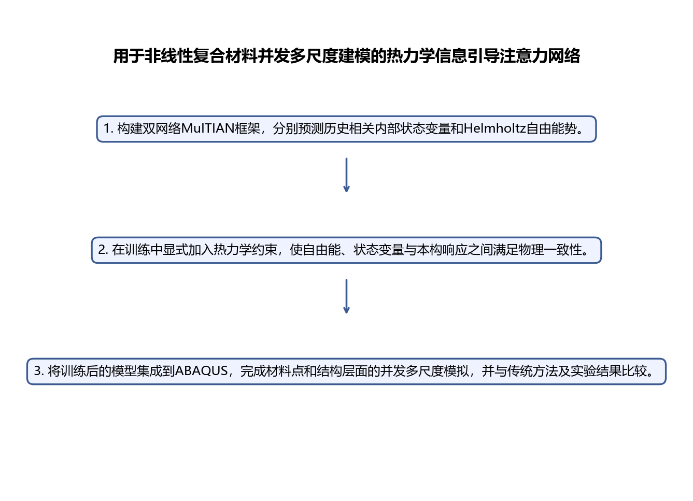

#### 基于直接循环分析的全时域全局-局部耦合：用于多尺度安定评估及接触问题应用
- 英文标题: Global-in-time global-local coupling using direct cyclic analysis for multiscale shakedown assessment and application to problems with contact
- 期刊: Computer Methods in Applied Mechanics and Engineering
- 日期/期次: 2026-07-01 / Volume 456
- DOI: 10.1016/j.cma.2026.118940
- 分类: Multiscale Mechanics, 多尺度力学, 循环塑性与结构安定分析
- 关注关键词: multiscale
- 价值分: 57
- 链接: https://doi.org/10.1016/j.cma.2026.118940
- 一句话摘要: 该文将全局-局部迭代耦合推广到全时域直接循环框架，以高效评估含局部弹塑性与接触非线性的结构安定极限循环。
- 核心内容: 本文针对整体上线性、局部存在弹塑性非线性区域的循环受载结构，提出了一种基于直接循环分析（DCA）的全时域全局-局部耦合方法。作者将传统Global-Local Iterative Coupling（GLIC）扩展为可直接求解稳定极限循环的框架，从而避免了增量式时间同步带来的计算负担。该方法在全局问题和局部问题中均采用DCA，因此能够高效捕捉局部非线性对整体稳定循环响应的影响。方法已在Abaqus/Standard中实现，并通过多个算例及含接触情形验证了精度、效率和适用性。
- 图像摘要: 本题未提供附图，因此无法依据图像总结具体耦合示意、算法流程图或结果云图。仅从摘要可判断，论文最关键的可视化内容应包括：全局线性结构与局部弹塑性补丁之间的全局-局部耦合框架、基于DCA直接求解稳定循环的流程，以及与传统增量方法在稳定循环响应和计算成本上的对比结果。对于接触算例，典型图像应进一步展示局部接触非线性区域对整体极限循环响应的影响。
- 模型/流程摘要: 整体流程是先将结构划分为全局线性区域与局部非线性补丁区域，再在全局和局部层面同时采用直接循环分析求解稳定循环，而不是逐时间步同步推进；随后通过全局-局部迭代交换边界信息，实现局部弹塑性或接触效应对整体循环响应的反馈；最终直接得到结构的极限循环与安定状态，并据此进行多尺度安定评估。
- 与关注方向的关系: 这篇文章与关注方向的契合点在于多尺度分析和复杂非线性结构响应预测。它虽然不是PINN、代理模型或经典数据驱动本构论文，但其全局-局部多尺度耦合、局部弹塑性处理及Abaqus实现方式，对研究多尺度结构计算、局部非线性降阶与高效循环响应分析都很有参考价值。
- 方法关键词: Direct Cyclic Analysis（DCA）全时域耦合方法, Global-Local Iterative Coupling（GLIC）
- 应用方向: 含局部弹塑性区域结构的安定极限循环评估, 含接触非线性问题的高效多尺度循环响应分析
- 前沿要点: 将GLIC从传统时步同步思路扩展到全时域直接循环框架，是面向循环载荷安定分析的重要算法推进。；在全局与局部层面统一使用DCA，可直接求解极限循环而非逐步逼近，显著提升多尺度循环分析效率。；方法不仅适用于局部弹塑性补丁，还扩展到接触非线性问题，增强了工程复杂局部现象分析的适用范围。
- 图像要点: 核心图像应围绕全局线性域与局部非线性补丁的耦合关系展开，突出该方法并不是全模型全非线性求解，而是有针对性的多尺度局部增强。；关键结果图应强调DCA驱动的全时域方法能够直接到达稳定循环，并在保证精度的同时显著降低计算成本，尤其适用于含接触的复杂局部非线性问题。
- 研究流程: 将问题分解为全局线性结构与局部弹塑性或接触非线性区域，建立全局-局部耦合框架。 -> 在全局和局部子问题中统一采用直接循环分析，避免传统增量式时间同步求解稳定循环。 -> 通过迭代耦合传递边界与响应信息，直接获得极限循环并评估局部非线性对整体安定行为的影响。
- 自动生成流程图:
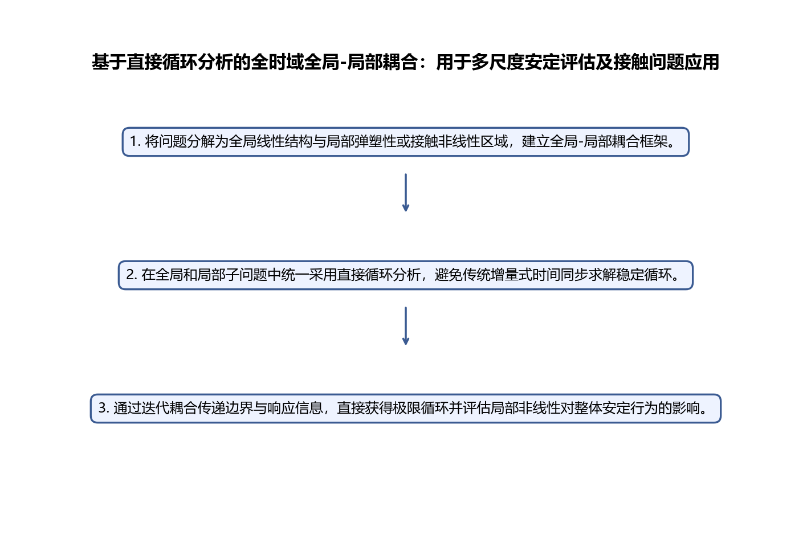

#### 用于变分多尺度湍流建模的半显式Runge-Kutta积分器：迈向时空高阶精度
- 英文标题: Half-explicit Runge-Kutta integrators for variational multiscale turbulence modeling: Toward higher-order accuracy in space and time
- 期刊: Computer Methods in Applied Mechanics and Engineering
- 日期/期次: 2026-07-01 / Volume 456
- DOI: 10.1016/j.cma.2026.118930
- 分类: Multiscale Mechanics, 多尺度数值方法, 计算流体力学与湍流建模
- 关注关键词: multiscale
- 价值分: 57
- 链接: https://doi.org/10.1016/j.cma.2026.118930
- 一句话摘要: 该文将半显式Runge-Kutta时间积分一致地引入残差型变分多尺度湍流模型，以提升大涡模拟在时空上的精度、稳定性与流动结构保真度。
- 核心内容: 本文针对残差型变分多尺度（VMS）湍流大涡模拟在时间离散上长期局限于二阶隐式格式的问题，提出了与VMS框架一致耦合的半显式Runge-Kutta积分方法。作者在Rothe方法指导下，选用适用于指标2微分-代数方程的半显式RK格式，并据此推导了新的子网格尺度模型。与传统基于线性化或扰动展开的处理不同，该方法在显式处理非线性项的同时保持了清晰的空间问题结构，并表明子网格参数不依赖于网格尺寸。数值结果在Taylor-Green涡和开腔流中显示，该方法在动能演化、能谱、涡结构以及极限环捕捉方面均优于传统VMS格式。
- 图像摘要: 本题未提供附图，因此无法依据图像总结具体算法流程图、频谱对比图或流场涡结构可视化。仅从摘要判断，论文最关键的图形证据应包括：半显式RK-VMS与传统VMS在Taylor-Green涡中的动能衰减和能谱对比、涡结构可视化，以及在开腔流中对超临界Hopf分岔引起周期极限环的捕捉结果。这类图通常用于展示该方法在耗散、色散、稳定域和非定常流动保真度方面的优势。
- 模型/流程摘要: 整体流程是先从残差型VMS大涡模拟框架出发，将时间离散从传统二阶隐式格式推广为与指标2微分-代数系统相容的半显式Runge-Kutta方法；随后在Rothe方法下重新分析空间子问题，并构造无需依赖线性化扰动假设的子网格尺度模型；最后通过Fourier分析和典型湍流基准算例，验证新格式在对流主导流动中的稳定性、耗散色散特性及流动不稳定性预测能力。
- 与关注方向的关系: 这篇文章与关注方向的契合点主要在多尺度和物理建模方面。它不是PINN、损伤力学或代理模型论文，但属于典型的变分多尺度方法拓展工作，对理解多尺度思想在复杂非线性PDE、时空离散一致性以及高保真数值模拟中的作用很有参考价值。
- 方法关键词: 半显式Runge-Kutta积分与Rothe方法, 残差型变分多尺度方法（VMS）
- 应用方向: Taylor-Green涡与开腔流等非定常不稳定流动预测, 湍流大涡模拟中的高保真时空离散
- 前沿要点: 把半显式Runge-Kutta方法系统性引入VMS大涡模拟，突破了该类方法时间离散长期停留在二阶隐式格式的限制。；在Rothe方法框架下构造无需线性化扰动展开的子网格模型，并得到与网格尺寸无关的关键模型参数结论。；同时改善对流主导问题中的耗散、色散与稳定域表现，使其更适合高敏感非定常湍流和分岔流动的高保真模拟。
- 图像要点: 核心结果应体现半显式RK-VMS相较传统VMS在动能演化、能谱与涡结构重构上的更高保真度。；另一个关键证据应是开腔流中的周期极限环捕捉，说明该方法对高敏感流动不稳定性问题具有更好的时间积分质量。
- 研究流程: 将半显式Runge-Kutta时间积分一致地嵌入残差型VMS大涡模拟框架，并以Rothe方法组织时空离散。 -> 基于显式非线性项处理后的空间问题结构推导新的子网格尺度模型，避免传统线性化与扰动展开假设。 -> 通过Fourier分析、Taylor-Green涡和开腔流算例评估方法在精度、稳定性、能谱和极限环预测方面的表现。
- 自动生成流程图:
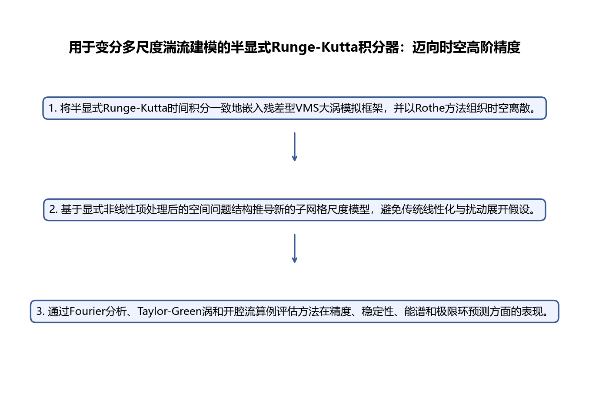

#### 利用深度算子网络学习隐藏物理规律与系统参数
- 英文标题: Learning hidden physics and system parameters with deep operator networks
- 期刊: Computer Methods in Applied Mechanics and Engineering
- 日期/期次: 2026-07-01 / Volume 456
- DOI: 10.1016/j.cma.2026.118926
- 分类: Machine Learning in Mechanics, 算子学习与物理发现, 逆问题与参数识别
- 关注关键词: pinn
- 价值分: 57
- 链接: https://doi.org/10.1016/j.cma.2026.118926
- 一句话摘要: 该文提出基于DeepONet的两套框架，在稀疏观测下同时实现未知物理算子发现与系统参数高精度反演。
- 核心内容: 本文针对从稀疏观测中发现隐藏物理规律和识别控制参数这一关键问题，提出了两种基于深度算子网络的统一框架。第一种方法Deep Hidden Physics Operator（DHPO）将隐藏物理发现扩展到算子学习范式中，用于识别不同PDE族中的未知算子项；第二种方法则结合预训练DeepONet与物理约束反演，实现从少量传感器数据中直接识别系统参数。相比PINN和稀疏回归等传统数据驱动方法，该方法减少了重复训练需求，并提升了对噪声和方程族变化的泛化能力。作者在反应-扩散方程、Burgers方程、二维热传导方程和二维Helmholtz方程上验证了方法的有效性，在有限且含噪观测下仍取得较高精度。
- 图像摘要: 本题未提供附图，因此无法依据图像总结具体网络结构图、物理发现流程图或参数识别结果图。仅从摘要判断，论文最关键的可视化内容应包括两部分：一是DHPO框架如何从观测数据中恢复未知物理算子映射，二是预训练DeepONet如何与物理约束反演结合进行参数识别。若有结果图，通常会展示不同PDE基准问题上的解场重建误差、未知项恢复效果以及参数估计在噪声条件下的稳定性。
- 模型/流程摘要: 整体流程是先通过DeepONet学习一类PDE问题中的解算子，再在此基础上发展两个下游框架：其一是DHPO，用于从稀疏观测中识别隐藏的未知物理算子；其二是参数识别框架，将预训练DeepONet作为快速前向代理，与物理约束逆问题求解结合，从而从有限传感器数据中反演系统参数。该思路把算子学习、物理约束建模和逆问题求解统一起来，实现了跨方程族、低数据量条件下的物理发现与参数估计。
- 与关注方向的关系: 这篇文章与关注方向高度相关，因为它直接涉及PINN相关问题的替代思路、DeepONet算子学习、物理发现和参数反演。虽然它不是传统本构模型或损伤力学论文，但其“预训练算子网络+物理约束反演”的思想非常适合迁移到复杂材料本构识别、多尺度PDE反演和代理模型构建中。
- 方法关键词: Deep Hidden Physics Operator（DHPO）, 预训练DeepONet结合物理约束反演
- 应用方向: 反应扩散、Burgers、二维热传导和二维Helmholtz方程的参数识别, 稀疏观测下的PDE未知物理项发现
- 前沿要点: 把隐藏物理发现从传统点对点回归提升到算子学习层面，使方法能够跨不同PDE族泛化，而不必针对每个新问题重新完整训练。；将预训练DeepONet与物理约束逆建模结合，提供了一种高效的稀疏观测参数识别框架，缓解了PINN反演中训练代价高和不稳定的问题。；在有限且含噪观测下仍保持较高识别精度，表明该方法在复杂动力系统逆问题中具有较强的数据效率与鲁棒性。
- 图像要点: 核心方法应体现两个互补分支：一个用于隐藏物理发现，另一个用于参数识别，而它们都建立在预训练DeepONet的算子泛化能力之上。；关键结果应展示在多类PDE和稀疏含噪观测条件下，解重建误差与参数估计误差都保持在较低水平。
- 研究流程: 预训练DeepONet，学习给定PDE家族中的输入到解之间的算子映射。 -> 基于算子学习构建DHPO框架，从稀疏观测中识别未知物理项或隐藏算子结构。 -> 将预训练DeepONet嵌入物理约束反演流程，利用少量含噪传感器数据高效识别系统参数。
- 自动生成流程图:
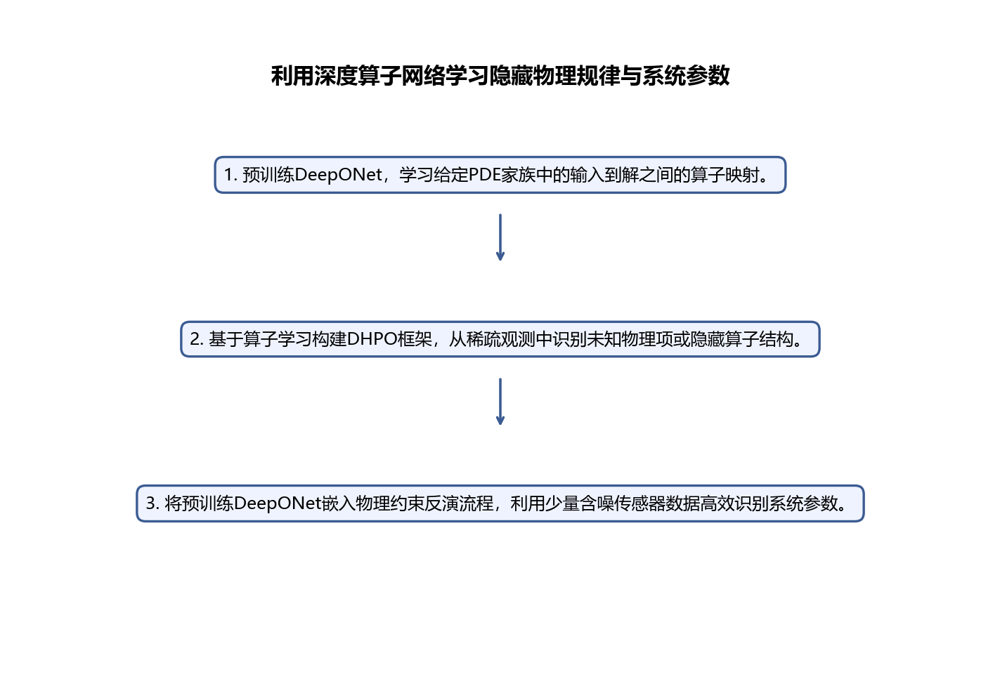

#### 在近乎完全再结晶的DED镍基多主元合金中调控层错能与分级析出相
- 英文标题: Engineering stacking fault energy and hierarchical precipitates in a near-fully recrystallized DED Ni-based multi-principal element alloy
- 期刊: International Journal of Plasticity
- 日期/期次: 2026-06-01 / Volume 201
- DOI: 10.1016/j.ijplas.2026.104682
- 分类: Multiscale Mechanics, 增材制造金属材料, 多尺度材料力学
- 关注关键词: multiscale
- 价值分: 57
- 链接: https://doi.org/10.1016/j.ijplas.2026.104682
- 一句话摘要: 该文通过调控层错能和分级析出相，促进DED镍基多主元合金动态再结晶，并实现强度与塑性的协同提升。
- 核心内容: 本文针对激光增材制造镍基多主元合金中快速凝固、元素偏析和残余应力导致的组织不稳定与性能劣化问题，提出了通过调控层错能与分级析出相来促进近乎完全再结晶的设计策略。作者结合相图计算和第一性原理计算，设计了以Ni-Cr-Fe-Co为基体并添加Al/Ti/V的合金体系，使其保持中等层错能并在直接能量沉积过程中原位形成分级析出相。析出相主要在晶内均匀形核，抑制晶界处过度析出，从而有利于严重塑性变形条件下的动态再结晶。最终，材料获得约92%的再结晶晶粒，并表现出较高的屈服强度、抗拉强度和均匀延伸率，显示出优异的强塑协同性能。
- 图像摘要: 本题未提供附图，因此无法依据图像总结具体显微组织图、相结构示意或力学曲线。仅从摘要判断，论文最关键的视觉证据应包括：合金成分设计与层错能调控思路、晶内主次分级析出相的多尺度显微表征、再结晶组织分布，以及拉伸性能与变形机制分析。这类图通常会用于展示从成分设计到组织演化再到力学响应之间的因果链条。
- 模型/流程摘要: 整体流程是先利用相图计算和密度泛函理论设计具有中等本征层错能的Ni基多主元合金成分；再通过DED原位合金化制备材料，并诱导形成一级BCC/B2与二级纳米针状析出相组成的分级结构；随后结合多尺度组织表征分析析出相与再结晶晶粒之间的相互作用，最终揭示层错能和分级析出共同促进动态再结晶及强塑性协同提升的机制。
- 与关注方向的关系: 这篇文章与关注方向的契合点主要在多尺度组织演化与力学性能关联方面。它不是PINN、代理模型或经典连续体本构论文，但其通过成分设计、析出调控和再结晶机制实现多尺度结构优化的思路，对理解复杂材料的组织-性能关系、构建多尺度力学模型以及发展数据驱动材料设计方法都很有参考价值。
- 方法关键词: 层错能工程与分级析出相设计, 相图计算结合密度泛函理论与多尺度组织表征
- 应用方向: DED镍基多主元合金的组织调控与性能优化, 增材制造高强高塑Ni基合金设计
- 前沿要点: 将层错能工程与分级析出相设计结合到DED增材制造多主元合金中，为解决快速凝固引起的亚稳组织与性能劣化提供了新思路。；通过促进晶内均匀析出并限制晶界析出，增强动态再结晶能力，实现近乎完全再结晶而不牺牲强化效果。；建立了从热力学设计、电子结构调控到增材制造组织演化和力学性能提升的一体化策略，具有较强可推广性。
- 图像要点: 核心图像应突出晶内优先生核的分级析出相及其与再结晶晶粒的空间对应关系，这是论文机理链条的关键证据。；另一类关键结果图应展示高再结晶比例下材料仍保持高强高塑，说明层错能调控与析出设计实现了组织与性能的协同优化。
- 研究流程: 结合相图计算与第一性原理设计Ni-Cr-Fe-Co基多主元合金成分，并通过Al、Ti、V调控层错能与析出倾向。 -> 采用直接能量沉积原位合金化制备材料，在快速凝固与热变形条件下形成分级析出相和高比例再结晶组织。 -> 通过多尺度组织表征和力学测试分析析出相-再结晶耦合作用，并验证强度与延展性的协同提升。
- 自动生成流程图:
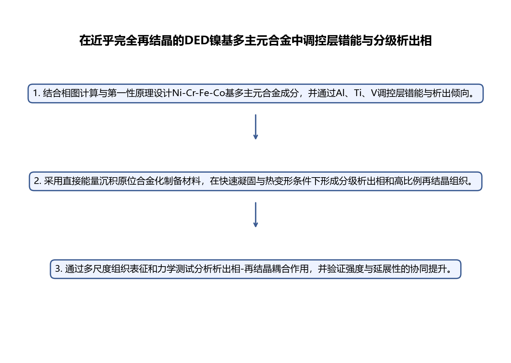

## 图像与模型摘要论文

#### 镍基高温合金中非Schmid效应分析
- 英文标题: Analysis of non-Schmid effects in a Ni-based superalloy
- 期刊: International Journal of Plasticity
- 日期/期次: 2026-06-01 / Volume 201
- DOI: 10.1016/j.ijplas.2026.104683
- 分类: Multiscale Mechanics, 多尺度力学, 晶体塑性本构建模
- 关注关键词: multiscale
- 价值分: 57
- 链接: https://doi.org/10.1016/j.ijplas.2026.104683
- 一句话摘要: 该文结合原子模拟、晶体塑性有限元与实验，建立了面向Ni基合金690非Schmid效应的原子信息驱动多尺度晶体塑性框架。
- 核心内容: 本文围绕固溶强化Ni基合金690中的非Schmid效应展开研究，综合使用分子动力学、晶体塑性有限元分析和单轴拉压实验揭示其屈服张压不对称机理。作者首先通过室温单晶分子动力学模拟展示了屈服应力的拉压不对称性，并基于滑移系与分解应力分析提出能够预测塑性起始阶段非Schmid效应的单晶滑移启动准则。进一步地，文中分析了不同取向和加载条件下孪晶变体的激活规律，并用原子模拟标定晶体塑性屈服准则中的非Schmid系数及位错滑移活化能参数。最终，原子信息驱动的晶体塑性模型在室温准静态拉伸和压缩实验中得到了验证，表明该多尺度框架能够较好预测多晶Alloy 690的非Schmid响应。
- 图像摘要: 本题未提供附图，因此无法依据图像总结具体位错构型、单晶取向示意、晶体塑性模拟结果或实验曲线。仅从摘要判断，论文最关键的可视化内容应包括：分子动力学下单晶拉伸与压缩屈服差异、不同滑移系和孪晶变体的激活分析、非Schmid系数标定流程，以及多晶晶体塑性预测与实验拉压曲线对比。这类图通常用于展示从原子尺度机制到连续体晶体塑性模型再到宏观实验验证的完整多尺度链条。
- 模型/流程摘要: 整体流程是先利用分子动力学在单晶尺度揭示Ni基合金690的非Schmid屈服与张压不对称现象，并分析滑移系分解应力和孪晶激活规律；随后据此建立单晶滑移启动准则，并将原子尺度得到的非Schmid系数和位错滑移活化能参数嵌入晶体塑性模型；最后通过晶体塑性有限元模拟多晶聚集体的拉压响应，并与室温准静态实验结果进行对比验证。
- 与关注方向的关系: 这篇文章与关注方向高度契合，因为它是典型的多尺度力学与本构建模工作：一方面研究晶体塑性中的非Schmid效应这一复杂本构问题，另一方面通过原子模拟向连续体模型传递参数，形成跨尺度机制驱动框架。虽然不是PINN或代理模型论文，但其“原子机制—本构参数—结构响应”的建模逻辑，对发展更高保真材料本构和多尺度数据驱动模型都很有参考价值。
- 方法关键词: 分子动力学结合晶体塑性有限元的原子信息驱动多尺度框架, 含非Schmid系数与位错滑移活化能的晶体塑性模型
- 应用方向: Ni基合金690的拉压不对称屈服与非Schmid效应分析, 面向高温合金多晶聚集体的多尺度塑性响应预测
- 前沿要点: 将非Schmid效应的研究从经验晶体塑性参数拟合推进到原子模拟驱动的物理标定，提高了模型的机制解释性。；同时考虑滑移启动准则、孪晶变体激活和位错滑移活化能参数，使多尺度框架不仅能描述屈服起始，也能增强后续塑性演化建模的稳健性。；实现了分子动力学、晶体塑性有限元与实验之间的参数贯通，为Ni基高温合金等复杂晶体材料的非经典屈服建模提供了通用思路。
- 图像要点: 核心图像应体现单晶分子动力学下拉压屈服不对称和不同滑移/孪晶机制的取向依赖激活，这是非Schmid效应来源的直接证据。；另一类关键结果图应展示原子信息驱动晶体塑性模型在多晶聚集体中的预测结果与实验拉压曲线吻合，从而证明多尺度参数传递的有效性。
- 研究流程: 开展单晶分子动力学模拟，分析室温下Ni基合金690在拉伸和压缩中的屈服差异、滑移启动和孪晶变体激活行为。 -> 基于原子模拟结果标定晶体塑性屈服准则中的非Schmid系数以及表征位错滑移的活化能参数，建立原子信息驱动的晶体塑性模型。 -> 在多晶尺度进行晶体塑性有限元模拟，并与单轴拉压实验对比，验证模型对非Schmid效应和张压不对称性的预测能力。
- 自动生成流程图:
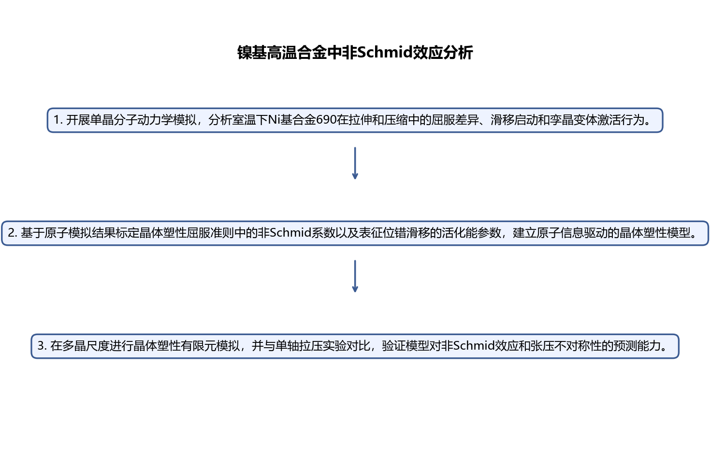

#### 考虑拉压不对称与成形取向效应的LPBF AlSi10Mg合金各向异性本构模型
- 英文标题: An anisotropic constitutive model for LPBF AlSi10Mg alloy considering tension-compression asymmetry and build-orientation effect
- 期刊: International Journal of Plasticity
- 日期/期次: 2026-06-01 / Volume 201
- DOI: 10.1016/j.ijplas.2026.104677
- 分类: Multiscale Mechanics, 增材制造金属材料力学, 本构模型
- 关注关键词: constitutive model
- 价值分: 57
- 链接: https://doi.org/10.1016/j.ijplas.2026.104677
- 一句话摘要: 该文针对LPBF AlSi10Mg合金的成形取向相关拉压不对称与循环软硬化行为，提出了一个各向异性弹塑性循环本构模型。
- 核心内容: 本文通过单调拉伸、压缩和对称应变控制循环试验，揭示了LPBF成形AlSi10Mg合金的力学响应显著依赖于成形取向和加载方式。实验表明，该材料在0°、45°和90°三种成形方向下均表现出明显的屈服应力差异、拉压不对称性以及先循环软化后循环硬化的特征。为描述这些复杂行为，作者基于修正Hill48屈服准则构建了一个新的各向异性弹塑性本构模型，并结合非关联流动法则、各向异性修正Chaboche运动硬化、各向同性与畸变硬化以及记忆面机制。结果显示，该模型能够较准确地再现LPBF AlSi10Mg合金在不同成形取向和循环加载条件下的各向异性循环变形特征。
- 图像摘要: 本题未提供附图，因此无法依据图像总结显微组织、屈服面演化图或循环应力-应变曲线。仅从摘要判断，论文最关键的图形证据应包括：不同成形取向下单调拉伸/压缩曲线对比、循环加载中的峰值与谷值应力演化，以及模型预测与实验结果在各取向下的吻合情况。这类图通常用于突出LPBF材料由制造路径引入的各向异性、拉压不对称性和循环历史依赖行为。
- 模型/流程摘要: 整体流程是先通过不同成形取向下的单调拉压与循环试验识别LPBF AlSi10Mg合金的各向异性屈服、拉压不对称和循环软硬化规律；再基于修正Hill48屈服准则构建考虑取向效应的各向异性弹塑性模型，并用von Mises塑性势函数配合非关联流动法则描述塑性流动；最后结合各向异性修正Chaboche运动硬化、各向同性与畸变硬化以及记忆面机制，统一模拟材料在不同取向和应变幅值下的循环响应。
- 与关注方向的关系: 这篇文章与关注方向高度契合，因为它是一篇典型的本构模型工作，核心问题正是增材制造材料中的各向异性、拉压不对称和循环变形行为。虽然不是PINN或代理模型论文，但对建立高保真金属材料循环本构、理解工艺-组织-性能关联以及后续发展数据驱动本构模型都很有参考价值。
- 方法关键词: 各向异性修正Chaboche运动硬化与记忆面循环硬化建模, 基于修正Hill48的各向异性弹塑性本构模型
- 应用方向: LPBF AlSi10Mg合金在不同成形取向下的循环变形预测, 增材制造结构件的拉压不对称与疲劳响应分析
- 前沿要点: 将成形取向效应与拉压不对称性统一纳入LPBF铝合金循环本构建模，面向增材制造材料的复杂各向异性提供了更完整描述。；通过非关联流动法则结合各向异性修正Chaboche运动硬化、各向同性硬化和畸变硬化，增强了模型对循环屈服面演化的表达能力。；引入记忆面机制捕捉应变幅依赖性，使模型更适用于实际复杂循环载荷下的疲劳和结构响应预测。
- 图像要点: 核心结果应突出不同成形取向和拉压模式对屈服应力、应变硬化和循环峰谷应力的显著影响，说明LPBF工艺引入了强烈的方向相关性。；关键模型验证图应展示所提本构模型能够同时捕捉初始循环软化、后续循环硬化以及明显的拉压不对称。
- 研究流程: 开展0°、45°和90°成形取向下的单调拉伸、压缩及对称应变控制循环试验，提取屈服、硬化和拉压不对称特征。 -> 基于修正Hill48屈服准则与非关联流动法则建立各向异性弹塑性模型，并引入各向异性修正Chaboche运动硬化。 -> 叠加各向同性硬化、畸变硬化和Chaboche记忆面机制，标定参数并验证模型对循环软化/硬化及取向效应的预测能力。
- 自动生成流程图:
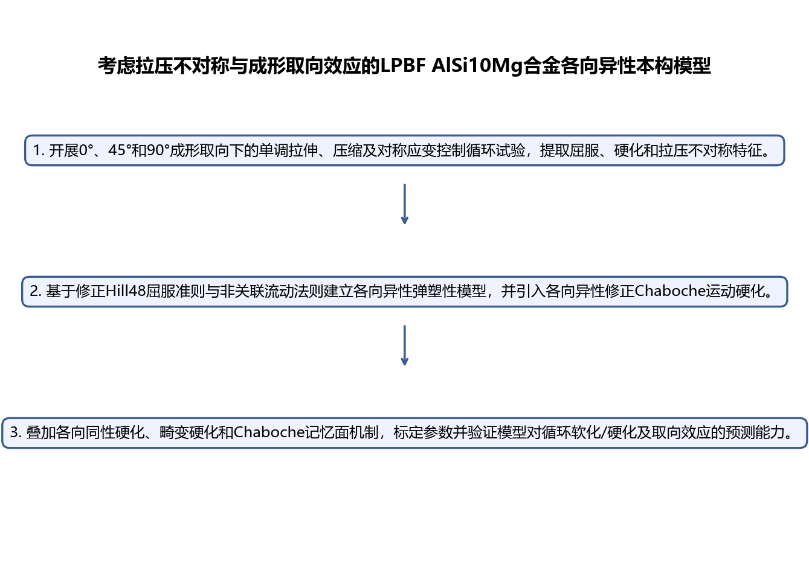

#### 基于任意曲梁晶格通用非线性力学框架的仿生网络超材料物理引导逆向设计
- 英文标题: Physics-guided inverse design of bio-inspired network metamaterials via a general non-linear mechanical framework for arbitrary curved-beam lattices
- 期刊: Journal of the Mechanics and Physics of Solids
- 日期/期次: 2026-06-01 / Volume 212
- DOI: 10.1016/j.jmps.2026.106571
- 分类: Multiscale Mechanics, 仿生网络超材料设计, 多尺度力学
- 关注关键词: multiscale
- 价值分: 57
- 链接: https://doi.org/10.1016/j.jmps.2026.106571
- 一句话摘要: 该文提出一种面向任意曲梁周期网络的通用非线性力学框架，并据此实现仿生网络超材料的高效物理引导逆向设计。
- 核心内容: 本文受生物软组织分级纤维结构启发，研究由任意曲梁构成的周期性网络超材料的非线性力学行为与逆向设计问题。作者建立了一个通用非线性力学框架，能够从单根曲梁的力学响应出发，系统连接到晶格层级的相互作用与有限变形下的整体响应，从而捕捉多尺度变形传递机制。该框架突破了以往仅适用于特定理想几何的模型局限，并通过有限元模拟和实验在多类网络构型与载荷条件下验证了预测能力。基于这一物理可解释框架，论文进一步发展出高效逆向设计方法，可按目标力学性能精确调控网络结构，适用于软机器人、生物电子和组织工程等场景。
- 图像摘要: 本题未提供附图，因此无法依据图像总结具体结构示意、理论流程图或实验曲线。仅从摘要判断，论文最关键的可视化内容应包括：任意曲梁网络单胞与周期晶格的几何示意、从单梁到网络层级的力学传递框架、典型J形应力-应变响应，以及逆向设计后目标结构与预测/实验结果对比。这类图通常用于展示仿生分级结构如何产生非线性顺应性，并证明理论框架与逆向设计策略的有效性。
- 模型/流程摘要: 整体流程是先从生物软组织的分级纤维网络中抽象出由任意曲梁组成的周期性网络超材料，再建立一个连接单根曲梁非线性力学与晶格层级相互作用的通用理论框架，用于预测有限拉伸下的整体响应；随后通过有限元与实验验证该框架在不同网络几何和载荷条件下的适用性；最后基于这一物理模型开展逆向设计，在无需大规模数据训练的前提下按目标力学指标反推最优网络架构。
- 与关注方向的关系: 这篇文章与关注方向高度契合，因为它聚焦多尺度力学、结构超材料和物理引导设计。虽然不是PINN或数据驱动代理模型论文，但其“通用非线性力学框架+逆向设计”的思路非常适合借鉴到仿生结构设计、多尺度力学建模以及复杂超材料性能定制问题中。
- 方法关键词: 任意曲梁晶格的通用非线性力学框架, 物理引导的逆向设计方法
- 应用方向: 组织工程和仿生机械系统的非线性力学性能定制, 软机器人与生物集成电子中的柔性网络结构设计
- 前沿要点: 提出适用于任意曲梁周期网络的通用非线性力学框架，突破了以往模型对理想化几何的依赖。；系统捕捉从单梁到晶格层级的多尺度变形传递机制，为解释仿生网络材料的非线性顺应性和韧性提供了物理基础。；基于透明可解释的力学模型实现逆向设计，避免依赖大规模训练数据和黑箱神经网络，为超材料定制提供高效路径。
- 图像要点: 核心图像应突出任意曲梁网络从梁级变形到晶格级响应的层级传递关系，这是论文区别于特定几何专用模型的关键。；关键结果图应展示所设计网络能够实现类似生物软组织的J形应力-应变曲线，并且理论、有限元和实验结果保持一致。
- 研究流程: 从仿生软组织出发抽象出由任意曲梁组成的周期性网络超材料，并建立单梁到网络层级的非线性力学描述。 -> 利用通用理论框架分析有限变形下的多尺度力学传递机制，并通过有限元与实验验证不同构型下的预测精度。 -> 在物理模型基础上开展逆向设计，根据目标非线性力学响应高效调控网络几何与架构参数。
- 自动生成流程图:
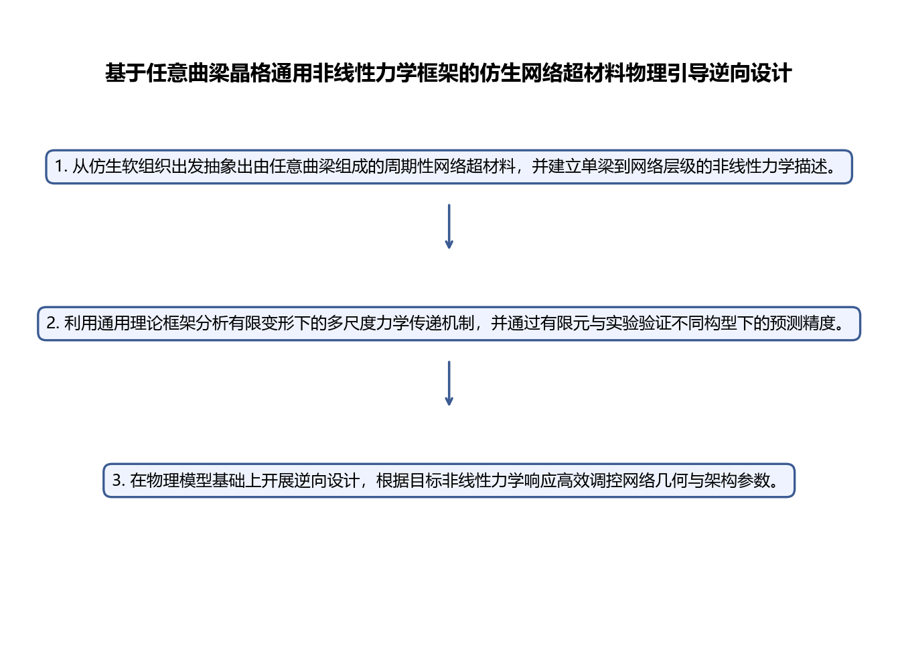

#### 铜中电塑性效应的多尺度研究：实验与晶体塑性建模
- 英文标题: A multiscale investigation into the electroplastic effects in copper: Experiments and crystal plasticity modeling
- 期刊: Journal of the Mechanics and Physics of Solids
- 日期/期次: 2026-06-01 / Volume 212
- DOI: 10.1016/j.jmps.2026.106597
- 分类: Multiscale Mechanics, 多尺度力学, 晶体塑性本构建模
- 关注关键词: multiscale
- 价值分: 57
- 链接: https://doi.org/10.1016/j.jmps.2026.106597
- 一句话摘要: 该文结合温控脉冲电流辅助变形实验与电耦合晶体塑性模型，系统揭示了铜中电塑性无热机制与位错演化之间的关联。
- 核心内容: 本文针对金属电塑性效应机理仍不清晰的问题，以铜为对象开展了实验与计算结合的多尺度研究。作者通过温度受控的脉冲电流辅助变形试验尽可能突出无热贡献，并结合大面积EBSD、双束TEM和高分辨EBSD表征织构演化、滑移系活动和位错密度变化。随后构建了包含电塑性相关机制及热力学演化关系的晶体塑性模型，用于解释实验中观察到的应力响应波动和加工硬化减弱现象。研究表明，脉冲电流诱导的统计存储位错恢复是宏观软化与两阶段应力下降行为的重要来源。
- 图像摘要: 本题未提供附图，因此无法依据图像总结具体实验装置、显微组织表征图或模拟结果云图。仅从摘要判断，论文最关键的视觉证据应包括：脉冲电流辅助拉伸或压缩下的应力-应变曲线及其快速下降—缓慢衰减的局部响应特征，大面积EBSD和HR-EBSD给出的织构与位错密度演化，以及晶体塑性模型与实验在流动应力、加工硬化率和位错相关指标上的对比。这类图通常用于把短时电流脉冲引起的局部软化事件与宏观力学响应演化联系起来。
- 模型/流程摘要: 整体流程是先通过温度受控的脉冲电流辅助变形实验分离铜中电塑性的无热效应，并利用EBSD、TEM和HR-EBSD对织构、滑移活动和位错状态进行多尺度表征；再建立包含电流作用下位错恢复等机制的电耦合晶体塑性模型，并通过热力学演化公式描述内部变量变化；最后把电流脉冲期间的短时局部软化过程与宏观应力-应变和加工硬化响应联系起来，从而解释铜中电塑性的机理来源。
- 与关注方向的关系: 这篇文章与关注方向高度契合，因为它是典型的多尺度力学与本构建模工作，核心在于把实验表征、位错机制和晶体塑性模型连接起来解释复杂材料响应。虽然不是PINN或代理模型论文，但其“实验—机制—本构”闭环思路对研究多场耦合塑性、电致软化和高保真材料模型很有参考价值。
- 方法关键词: 包含电塑性机制的电耦合晶体塑性模型, 温控脉冲电流辅助变形实验结合EBSD/TEM/HR-EBSD表征
- 应用方向: 电塑性效应机理解释与多场耦合塑性建模, 铜及其他金属在电辅助成形过程中的力学响应分析
- 前沿要点: 将温控电辅助变形实验与多尺度显微表征结合起来，更有针对性地分离和量化电塑性的无热机制。；把短时电流脉冲诱导的局部响应波动通过电耦合晶体塑性模型映射到宏观应力-应变演化，实现了跨尺度机制解释。；将统计存储位错恢复纳入热力学一致的晶体塑性框架，为金属电塑性效应的机制建模和工艺利用提供了更清晰的物理基础。
- 图像要点: 关键结果应突出脉冲电流作用下局部应力响应呈现“快速下降+缓慢衰减”的两阶段行为，并最终累积为宏观流动应力降低和加工硬化减弱。；另一类关键图像应展示实验表征与晶体塑性模拟在织构、滑移活动和位错密度演化上的一致性，从而支持统计存储位错恢复这一机制解释。
- 研究流程: 开展温度受控的脉冲电流辅助变形实验，以突出铜中电塑性的无热贡献并记录宏观应力响应。 -> 利用大面积EBSD、双束TEM和高分辨EBSD表征织构演化、滑移系活动和半定量位错密度变化。 -> 建立并标定电耦合晶体塑性模型，将电流脉冲诱导的位错恢复与宏观软化、加工硬化率变化联系起来。
- 自动生成流程图:
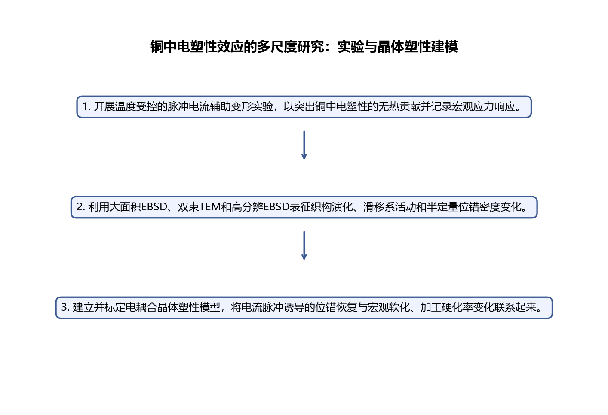

#### 作为分岔现象的损伤局部化及其在软材料中的断裂图样
- 英文标题: Damage localization as a bifurcation phenomenon and the resulting fracture patterns in soft materials
- 期刊: Journal of the Mechanics and Physics of Solids
- 日期/期次: 2026-06-01 / Volume 212
- DOI: 10.1016/j.jmps.2026.106567
- 分类: 损伤力学与断裂, 软材料非线性失稳
- 关注关键词: constitutive model
- 价值分: 47
- 链接: https://doi.org/10.1016/j.jmps.2026.106567
- 一句话摘要: 该文将软材料中的损伤局部化视为一种分岔失稳现象，并通过梯度损伤-超弹性框架揭示径向膨胀下多瓣断裂图样的形成机制。
- 核心内容: 本文研究软不可压圆柱体在径向膨胀过程中出现的损伤局部化与断裂图样演化问题。作者采用梯度损伤模型与超弹性本构耦合，从分岔角度分析对称空腔扩张何时转变为局部化的多瓣断裂模式。理论分析明确指出，几何尺寸、材料韧性以及内禀损伤长度尺度共同决定了分岔阈值与断裂花样选择。与有限元结果的比较还表明，现有数值方法会推迟预测分岔起始点，凸显了解析基准在断裂起裂预测中的重要性。
- 图像摘要: 本题未提供附图，因此无法依据图像总结具体空腔扩张形态、损伤场分布或多瓣断裂模式。仅从摘要判断，论文最关键的视觉证据应包括：径向膨胀圆柱体从轴对称空腔增长到非对称多瓣损伤局部化的转变过程、不同几何和材料参数下的分岔模态图，以及解析预测与有限元损伤场或临界阈值的对比结果。这类图通常用于展示损伤诱导失稳如何改变断裂形貌，并验证不同模态的出现条件。
- 模型/流程摘要: 整体流程是先建立不可压软材料圆柱体径向膨胀问题的梯度损伤-超弹性耦合模型；随后对轴对称空腔扩张解进行分岔分析，求解从对称增长到局部化多瓣断裂模式的临界条件，并考察几何、韧性和内禀长度的作用；最后将解析结果与有限元模拟对比，评估数值方法对分岔阈值和断裂图样预测的偏差。
- 与关注方向的关系: 这篇文章与关注方向高度相关，因为它同时涉及本构建模、损伤力学和失稳分岔分析。虽然不是PINN或代理模型论文，但其梯度损伤-超弹性耦合框架和对局部化断裂图样的机制分析，对研究软材料损伤演化、模式选择和高保真失效预测非常有参考价值。
- 方法关键词: 梯度损伤模型与超弹性本构耦合, 解析分岔分析结合有限元比较
- 应用方向: 软不可压圆柱和管状结构在径向膨胀下的断裂模式预测, 软材料中损伤局部化、起裂阈值和多瓣断裂形貌分析
- 前沿要点: 将软材料中的损伤局部化和断裂图样选择统一放入分岔理论框架中，拓展了传统仅从弹性失稳理解形态转变的视角。；通过梯度损伤模型显式引入内禀长度尺度，使几何、韧性和损伤扩散效应能够共同决定断裂模式选择与临界条件。；提出了解析分岔基准来检验有限元断裂预测能力，为软材料起裂阈值和复杂断裂图样的准确数值模拟提供参考。
- 图像要点: 核心结果应体现空腔扩张从对称模式向局部化多瓣断裂模式的对称性破缺转变，说明损伤局部化本质上是分岔失稳现象。；另一类关键图应展示解析分岔阈值与有限元预测之间的偏差，从而强调现有数值方法在断裂起裂判定上可能存在延迟。
- 研究流程: 建立软不可压圆柱体径向膨胀的梯度损伤与超弹性耦合模型，描述空腔增长和损伤演化。 -> 对轴对称解开展解析分岔分析，求取损伤局部化和多瓣断裂模式出现的临界阈值及模态选择规律。 -> 将解析分岔结果与有限元模拟比较，分析几何、韧性和损伤长度尺度对断裂图样与起裂预测的影响。
- 自动生成流程图:
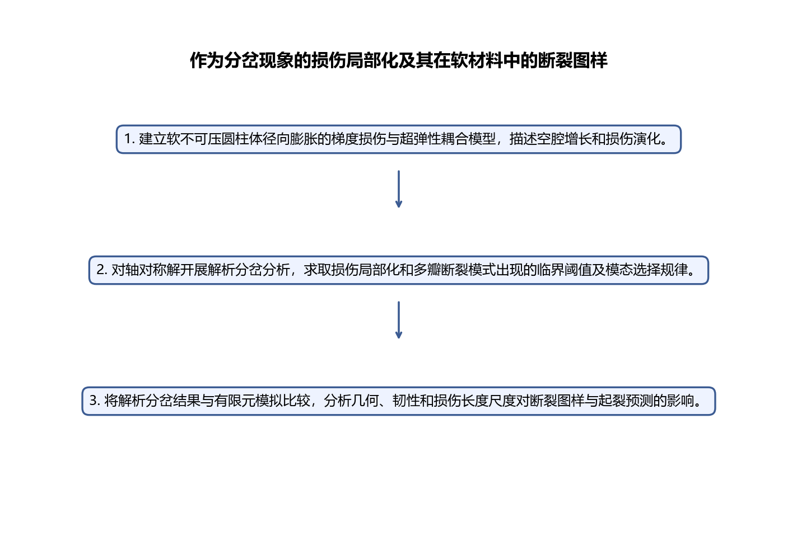

#### 用于模拟润湿液滴诱导膜重塑与拓扑变化的相场模型
- 英文标题: A phase-field model to simulate membrane remodeling and topology changes induced by wetting droplets
- 期刊: Computer Methods in Applied Mechanics and Engineering
- 日期/期次: 2026-07-01 / Volume 456
- DOI: 10.1016/j.cma.2026.118938
- 分类: Multiscale Mechanics, 相场方法与界面演化, 膜力学与多物理耦合
- 关注关键词: N/A
- 价值分: 45
- 链接: https://doi.org/10.1016/j.cma.2026.118938
- 一句话摘要: 该文提出一个耦合三相Cahn–Hilliard流动与膜力学的相场框架，用于模拟液滴润湿驱动下的膜出芽、融合和断裂等拓扑变化。
- 核心内容: 本文研究液态生物分子凝聚体与膜之间的相互作用，重点关注润湿液滴如何诱导膜发生出芽、融合和剪切断裂等复杂重塑行为。作者建立了一个相场模型，将三相Cahn–Hilliard描述与热力学一致的膜力学相耦合，显式考虑弯曲刚度、高斯曲率、不可伸长性和线张力等效应。为处理高曲率界面和拓扑变化，方法采用自适应有限元离散，在保证精度的同时提高了计算效率。基准测试表明该模型能够准确重现平衡润湿构型和理论形状预测，并进一步揭示液滴润湿与膜性质共同控制的非线性形态演化机制。
- 图像摘要: 首图是问题定义的概览图，而不是实验结果图。图中用三个相场c1、c2、c3表示三相体系：粉色区域c1代表被可变形闭合膜包裹的囊泡内部相，蓝色区域c2代表与其接触的润湿液滴，外部区域c3=1代表周围介质；三相之间以有限厚度ε的弥散界面连接，并在三相接触处形成接触角θ。图中同时标出了三条界面张力σ12、σ13和σ23，以及沿c1外边界的膜Γ，清楚传达了“液滴-膜-外界介质”三相耦合与膜变形问题的核心几何。根据图注，第二图应进一步把三维轴对称情形约化到二维计算域，用于数值求解；第三图则比较相场模拟的稳态构型与解析解，验证液滴表面和膜形状预测的准确性。
- 模型/流程摘要: 整体流程是先用三个相场变量定义液滴、囊泡内部相和外部介质，并在囊泡边界上引入膜力学能量；随后将三相Cahn–Hilliard方程与包含弯曲刚度、高斯曲率、不可伸长性和线张力的膜力学模型耦合，构建热力学一致的演化方程；最后借助自适应有限元对高曲率界面和拓扑变化进行高精度求解，模拟液滴润湿驱动下的出芽、融合和剪切断裂过程。
- 与关注方向的关系: 这篇文章与关注方向有较强相关性，尤其体现在多物理耦合、相场建模和复杂界面演化方面。它不是PINN或传统本构代理模型论文，但属于典型的物理机制驱动模型，适合借鉴其相场描述、拓扑变化处理和膜力学耦合思路到损伤、断裂和界面重构问题中。
- 方法关键词: 三相Cahn–Hilliard相场模型, 耦合弯曲刚度与线张力的热力学一致膜力学框架
- 应用方向: 生物膜与液滴相互作用下的出芽、融合和剪切断裂模拟, 细胞内液滴诱导膜重塑与弹毛细动力学研究
- 前沿要点: 把三相Cahn–Hilliard流动与热力学一致的膜力学统一到同一相场框架中，可自然处理出芽、融合和剪切断裂等拓扑变化。；同时考虑弯曲刚度、高斯曲率、不可伸长性和线张力，使模型能够更真实地描述生物膜在润湿驱动下的复杂形态响应。；通过自适应有限元高效解析高曲率局部区域，为研究弹毛细主导的膜重塑提供了稳定且可扩展的计算工具。
- 图像要点: 图1的核心信息是三相相场、弥散界面厚度ε、接触角θ以及三种界面张力σ12、σ13、σ23如何共同定义液滴润湿膜的问题。；后续图应分别承担轴对称降维计算示意和模拟-解析对比验证两项功能，说明该模型既有清晰的数值实现路径，也有可靠的基准精度。
- 研究流程: 用三个相场变量描述液滴、膜包裹相和外部介质，建立三相润湿几何与界面能表示。 -> 耦合三相Cahn–Hilliard动力学与膜弯曲、高斯曲率、不可伸长性及线张力等膜力学效应，形成热力学一致模型。 -> 采用自适应有限元求解高曲率和拓扑变化问题，并通过稳态基准与动态重塑案例验证模型。
- 论文图像:
图像角色: 摘要/概览图
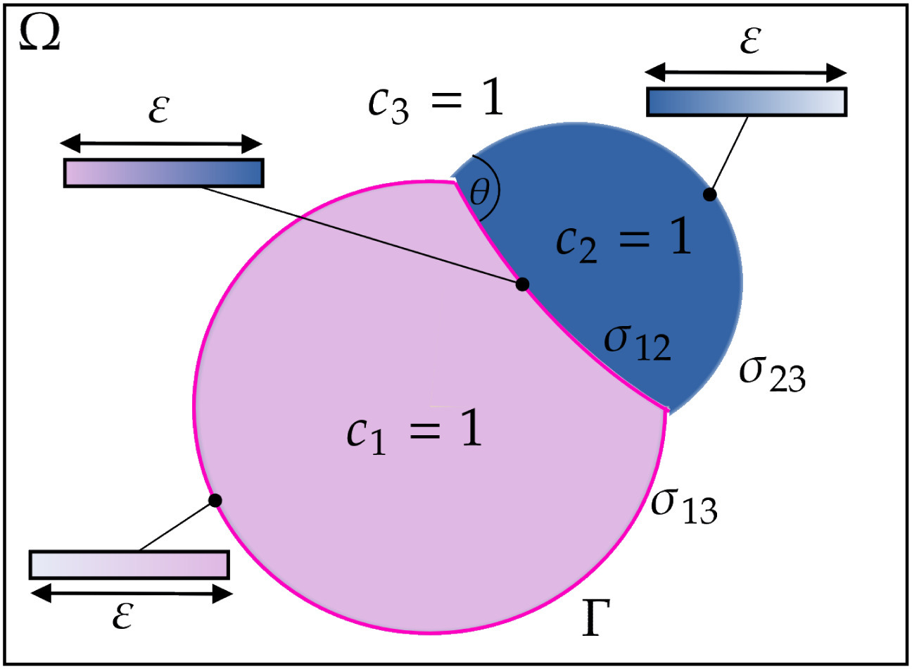
_图注: Fig. 1 Illustration of the wetting scenario in 2D. The three phases are represented by three phase fields c 1 , c 2 and c 3 with interface thickness ε. The c 1 phase is enclosed by a deformable, closed membrane. Surface tensions σ 12 , σ 13 , and σ 23 act at the interfaces between each pair of phases. The macroscopic contact angle θ can be determined from experiments._
_选图理由: 图注偏概览或示意；首图优先视作摘要附近概览图_
图像角色: 模型/方法图
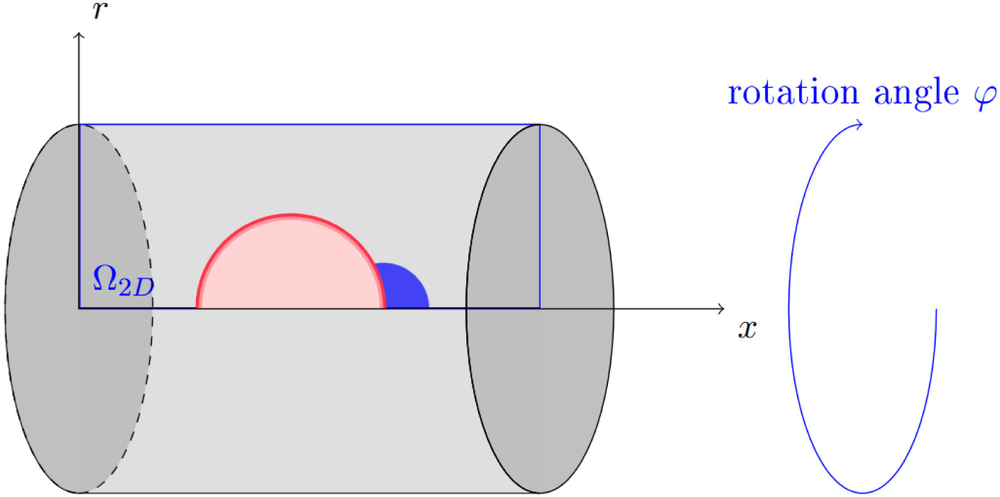
_图注: Fig. 2 Illustration of the axisymmetric case. The 3D cylindrical domain is reduced to a 2D domain Ω 2 D . In our standard setup, we place a half-spherical droplet (blue) alongside a spherical vesicle (pink) in this domain. (For interpretation of the references to colour in this figure legend, the reader is referred to the web version of this article.)_
_选图理由: 图注偏方法或结构示意；第二图优先视作模型或方法图_
图像角色: 结果/实验图
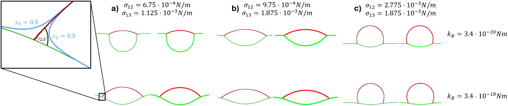
_图注: Fig. 3 Comparison of the stationary states of the simulations (each on the left side) and the analytical solutions from [16] (each on the right side). Perfect agreement of the droplet surface (red) and membrane (green) shape is visible in regimes of both small (top) and large (bottom) bending stiffness. In our visualizations, the membrane (green) is represented by the { c 1 = 0.5 } level set and the free droplet surface (red) by the { c 2 = c 3 , c 1 > 0.5 } contour. Inset : Closeup of the triple point shows agreement of the microscopic contact angle with the theoretical Young’s angle (black arc) of 72.5°. Contour lines for c 2 = 0.5 and c 3 = 0.5 are included in blue and show the diffuse nature of the triple point. Parameters : Initial droplet radius is 50 nm, surface tension σ 23 = 1.5 m N / m . No line tension because of a 2D simulation, κ r = 0 1 m , k P = 0 N / m 3 , ξ = ∞ , η = 10 − 3 Pa · s , k G = 0 Nm and ε = 10 nm . (For interpretation of the references to colour in this figure legend, the reader is referred to the web version of this article.)_
_选图理由: 图注含 results/experiment/validation 强信号；图注偏结果或响应展示；后续图优先视作结果或实验图_
- 自动生成流程图:
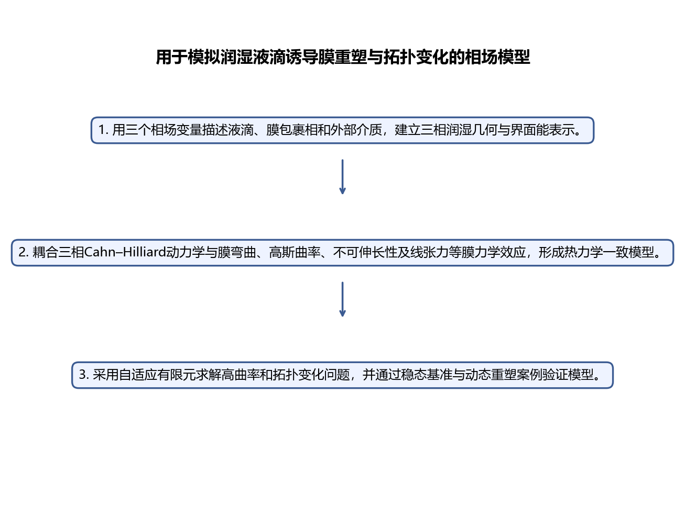

#### 基于Gap–Shifted Boundary Method的任意加密与参数化等几何多补丁耦合
- 英文标题: Isogeometric multipatch coupling with arbitrary refinement and parametrization using the Gap–Shifted Boundary Method
- 期刊: Computer Methods in Applied Mechanics and Engineering
- 日期/期次: 2026-07-01 / Volume 456
- DOI: 10.1016/j.cma.2026.118913
- 分类: Multiscale Mechanics, 嵌入式高阶数值方法, 等几何分析与多补丁耦合
- 关注关键词: N/A
- 价值分: 45
- 链接: https://doi.org/10.1016/j.cma.2026.118913
- 一句话摘要: 该文提出一种基于Gap–SBM的等几何多补丁嵌入式耦合方法，可在任意网格尺度、阶次和参数化不匹配条件下实现稳健高阶耦合。
- 核心内容: 本文提出一种新的等几何多补丁耦合技术Gap–SBM，用于处理非一致补丁之间的高阶嵌入式耦合问题。与传统需要严格水密接口和匹配节点向量的方法不同，该方法允许补丁在单元尺寸、多项式阶次、方向和参数化上任意不一致，同时无需引入额外自由度。其核心是通过无罚Nitsche形式在间隙区域内积分，并借助移位边界思想保持离散系统的良好条件性。数值结果表明，该方法即使在薄间隙和高度非协调补丁条件下，仍能实现最优收敛和稳定线性系统。
- 图像摘要: 首图是方法概览图，展示了Shifted Boundary框架的核心几何：蓝色曲线表示真实边界Γ，红色阶梯状折线表示代理边界，绿色积分点分布在背景网格上，黑色箭头表示从代理边界到真实边界的最近点投影，用于后续Taylor展开和边界信息转移。左图给出整体圆形边界在笛卡尔网格上的嵌入表示，右图放大了局部区域，清楚说明代理边界以阶梯方式逼近真实曲边界，并通过投影建立两者之间的几何联系。结合图注，第二图应进一步展示Gap–SBM中基函数如何从代理边界向间隙区域延拓以进行体积分；第三图则给出单补丁、贴体多补丁和Gap–SBM多补丁三种方案的收敛对比，验证所提方法的精度与稳定性。
- 模型/流程摘要: 整体流程是先用代理边界替代真实曲边界，将复杂边界嵌入背景等几何网格中；再通过最近点投影和Taylor展开把真实边界条件与界面信息映射到代理边界，并在补丁间的间隙区域内完成耦合积分；最后采用无罚Nitsche形式实现多补丁弱耦合，同时允许局部子补丁按需进行h或p加密，从而在保持全局一致离散的同时获得高阶精度和良好条件性。
- 与关注方向的关系: 这篇文章与关注方向的相关性主要体现在多尺度/多区域数值耦合和高阶计算框架上。它不是PINN、损伤力学或代理模型论文，但其非协调多补丁耦合、局部加密和嵌入式边界处理思路，对复杂多尺度结构、局部细观补丁建模和高保真数值实现都很有参考价值。
- 方法关键词: Gap–Shifted Boundary Method（Gap–SBM）, 无罚Nitsche等几何多补丁耦合
- 应用方向: 二维非协调等几何多补丁边界值问题求解, 复杂曲边界附近局部加密与嵌入式高阶离散分析
- 前沿要点: 突破了传统等几何多补丁方法对水密接口和匹配节点向量的依赖，支持任意网格尺度、阶次、方向和参数化不一致的补丁耦合。；通过在间隙区域积分而非显式构造过渡自由度，实现了高阶、稳健且条件性良好的嵌入式耦合。；支持围绕嵌入边界局部插入细化子补丁，使局部h/p加密与全局一致离散兼容，适合复杂几何和局部高梯度问题。
- 图像要点: 图1最关键的信息是：真实边界与代理边界不需要重合，方法通过最近点投影在两者之间建立稳定的几何-数值联系。；图像还表明该方法本质上是嵌入式边界处理与多补丁耦合的结合，能够在不增加额外自由度的前提下处理复杂曲边界和非匹配补丁。
- 研究流程: 构造真实边界与代理边界，并在背景等几何网格中识别活跃knot spans与间隙区域。 -> 利用最近点投影和Taylor展开，将真实边界/界面信息从真实边界转移到代理边界，并扩展基函数进入间隙区域完成积分。 -> 采用无罚Nitsche形式实现非协调多补丁耦合，并结合局部h/p加密开展数值求解与收敛验证。
- 论文图像:
图像角色: 摘要/概览图
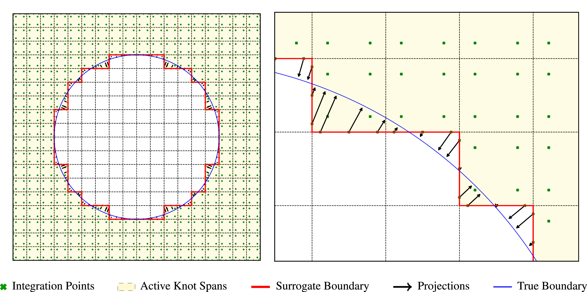
_图注: Fig. 1 Shifted boundary framework. The true and surrogate boundaries, Γ and Γ ˜ respectively, are shown along with the closest-point projections (black arrows) used for the Taylor expansions.._
_选图理由: 图注含 framework/workflow/model 强信号；首图也常承载总体方法示意；为满足展示顺序补足“摘要/概览图”_
图像角色: 模型/方法图
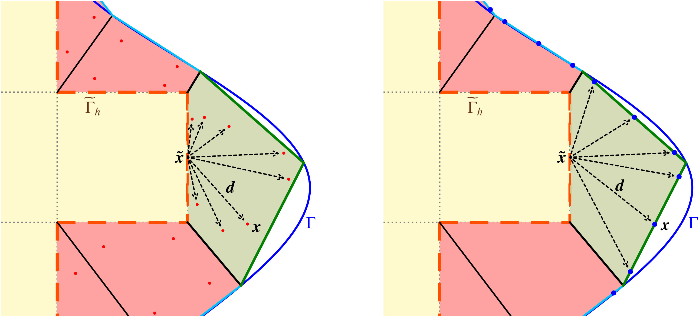
_图注: Fig. 2 Gap–SBM. The dashed black arrows symbolize the extension of the basis functions from the surrogate boundary into the gap region. Left: Extension of the basis functions from x ˜ to integrate the gap volume. Right: Extension of the basis functions from x ˜ to impose the boundary conditions on an approximation of the true boundary Γ._
_选图理由: 第二图优先视作模型或方法图_
图像角色: 结果/实验图
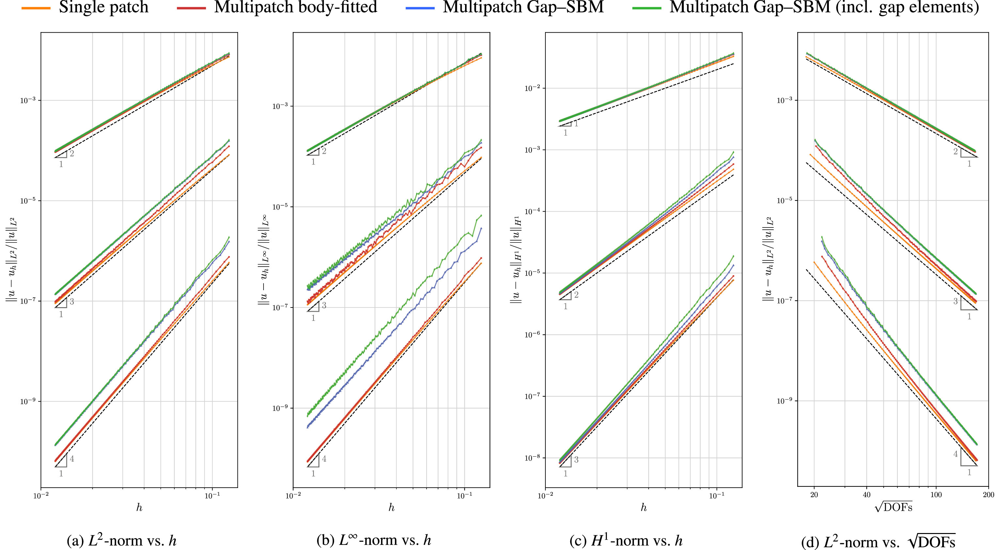
_图注: Fig. 6 Convergence study for the manufactured solution using the single-patch, the multipatch body-fitted coupling, and the multipatch Gap–SBM coupling. The Gap–SBM results including gap element contributions are highlighted in green. (For interpretation of the references to colour in this figure legend, the reader is referred to the web version of this article.)_
_选图理由: 图注含 results/experiment/validation 强信号；后续图优先视作结果或实验图_
- 自动生成流程图:
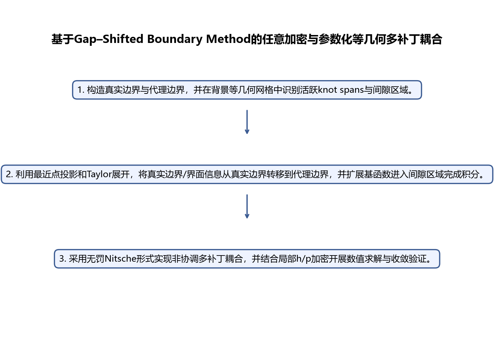

#### 面向几何非线性结构的非侵入式无数据参数化降阶模型
- 英文标题: Non-intrusive data-free parametric reduced order model for geometrically nonlinear structures
- 期刊: Computer Methods in Applied Mechanics and Engineering
- 日期/期次: 2026-07-01 / Volume 456
- DOI: 10.1016/j.cma.2026.118937
- 分类: Multiscale Mechanics, 几何非线性结构计算, 降阶代理模型
- 关注关键词: N/A
- 价值分: 45
- 链接: https://doi.org/10.1016/j.cma.2026.118937
- 一句话摘要: 该文提出一种完全非侵入、无需额外数据采样的参数化降阶建模方法，用于高效预测具有几何变化的几何非线性结构响应。
- 核心内容: 本文提出了一种针对几何非线性结构的非侵入式参数化降阶模型（PROM）方法，适用于存在几何参数变化的结构分析。方法以由振型和模态导数构建的Galerkin降阶模型为基础，并从标准有限元输出中识别线性刚度、二次/三次非线性张量、Rayleigh阻尼参数和降阶基等算子。作者进一步利用径向基函数对这些降阶算子进行参数空间插值，并通过两层POD压缩和基于MAC的重排序策略构建全局平滑降阶基。数值结果表明，该方法在曲面板和翼盒等算例上与高保真模拟高度一致，同时显著降低参数分析的计算成本。
- 图像摘要: 首图实际上是方法概览图，展示了在二维参数空间中进行降阶基重排序的迭代过程，而不是结果图。图中蓝色多边形和绿色多边形分别表示当前已处理和待匹配的参数区域或样本集合，黑色叉号表示参数采样点，洋红色与红色叉号表示两组待匹配的代表点，箭头d_min表示按最小距离准则进行配对和重排序；三个子图对应iteration 1到3，直观说明算法如何逐步建立参数样本之间的平滑对应关系，从而保证降阶基在参数空间中的连续性。根据图注，第二图应给出ROM数据库构建算法流程，第三图则展示测试集中载荷时程和跨中面外位移时程对比，用于验证PROM对动态非线性响应的预测精度。
- 模型/流程摘要: 整体流程是先在若干训练参数点上，从标准有限元结果构建基于振型与模态导数的方程驱动ROM数据库；再对各训练样本中的降阶基和相关降阶算子进行MAC引导重排序，并通过两层POD压缩提取全局降阶基；随后用径向基函数对线性刚度、非线性张量、阻尼参数和基向量等降阶算子进行参数插值；最终在新参数点处快速重建保持对称性和多项式结构的PROM，并直接获得灵敏度信息。
- 与关注方向的关系: 这篇文章与关注方向相关性很强，尤其体现在 surrogate model、结构非线性和参数化高效计算方面。它虽然不是PINN或传统本构模型论文，但属于典型的高保真力学模型降阶代理方法，对复杂结构参数分析、非线性动力响应预测以及后续结合机器学习的ROM/PROM发展都很有参考价值。
- 方法关键词: RBF插值结合两层POD与MAC引导重排序, 非侵入式参数化降阶模型（PROM）
- 应用方向: 具有几何变化的曲面板和翼盒结构非线性响应快速预测, 参数化结构动力学分析与灵敏度计算
- 前沿要点: 提出完全非侵入且无数据自由的数据需求极低PROM框架，无需修改高保真求解器内部结构即可获得参数化非线性降阶模型。；通过MAC引导重排序加两层POD压缩，解决了几何参数变化下降阶基跨参数空间不连续的问题，是实现稳健PROM插值的关键。；插值对象不仅包括降阶基，还包括线性刚度、二次/三次非线性张量和阻尼参数，从而保留了降阶方程的对称性与多项式结构。
- 图像要点: 图1的核心是参数空间中的降阶基重排序，不是几何模型本身；它解决的是不同参数样本下模态/基向量顺序不一致导致的插值不平滑问题。；三个迭代子图共同说明，算法通过最小距离匹配逐步建立样本间对应关系，为后续全局基构建和RBF插值提供平滑、可追踪的参数化表示。
- 研究流程: 在训练参数样本上由有限元输出构建局部ROM，提取振型、模态导数、刚度矩阵及二次/三次非线性张量等降阶算子。 -> 利用MAC引导的重排序策略和两层POD压缩，对不同参数点的降阶基进行统一和全局化处理。 -> 采用径向基函数对各类降阶算子与全局基进行插值，在新参数下快速生成PROM并预测非线性结构响应。
- 论文图像:
图像角色: 摘要/概览图
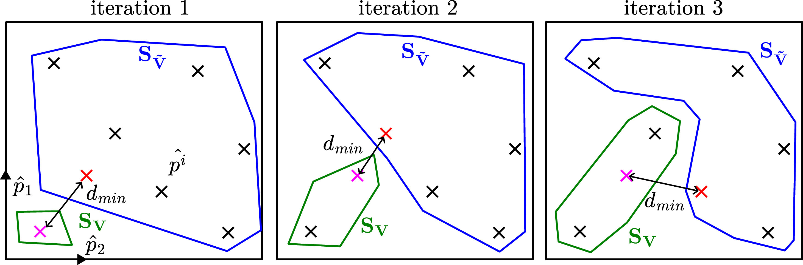
_图注: Fig. 1 Schematic illustration of the reordering scheme used for RB reordering for a 2D parameter space, for the first three iterations. At each iteration, we denote in magenta and red, respectively, the parameter points corresponding to the reference RB and to the RB that is reordered at the current iteration. (For interpretation of the references to colour in this figure legend, the reader is referred to the web version of this article.)_
_选图理由: 图注偏概览或示意；首图优先视作摘要附近概览图_
图像角色: 模型/方法图
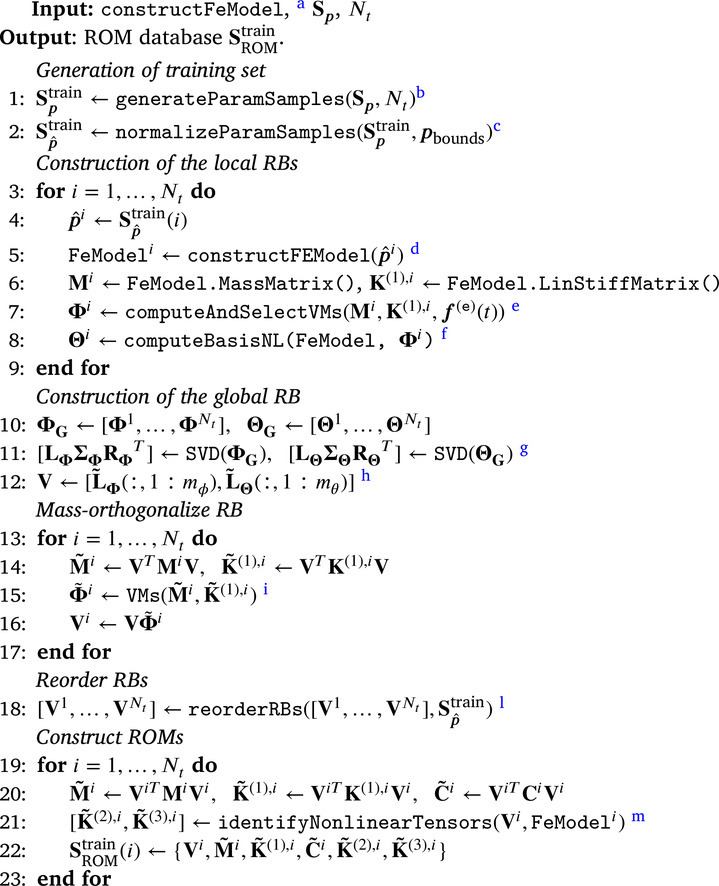
_图注: Algorithm 1 ROM database construction._
_选图理由: 图注含 framework/workflow/model 强信号；第二图优先视作模型或方法图_
图像角色: 结果/实验图
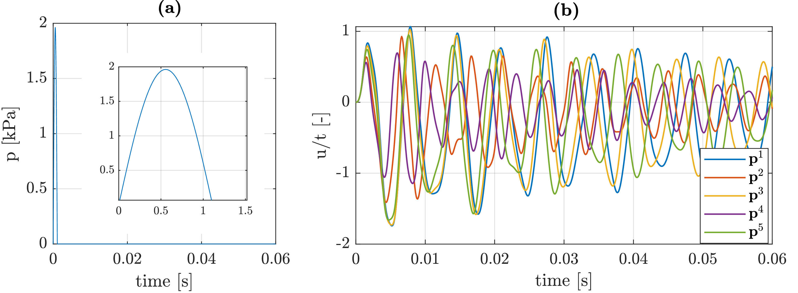
_图注: Fig. 6 In (a) uniform pressure load time history, in (b) out-of-plane displacement time history of the midspan (normalized to the panel thickness) for the individual parameter realizations in the test set._
_选图理由: 图注含 results/experiment/validation 强信号；图注偏结果或响应展示；后续图优先视作结果或实验图_
- 自动生成流程图:
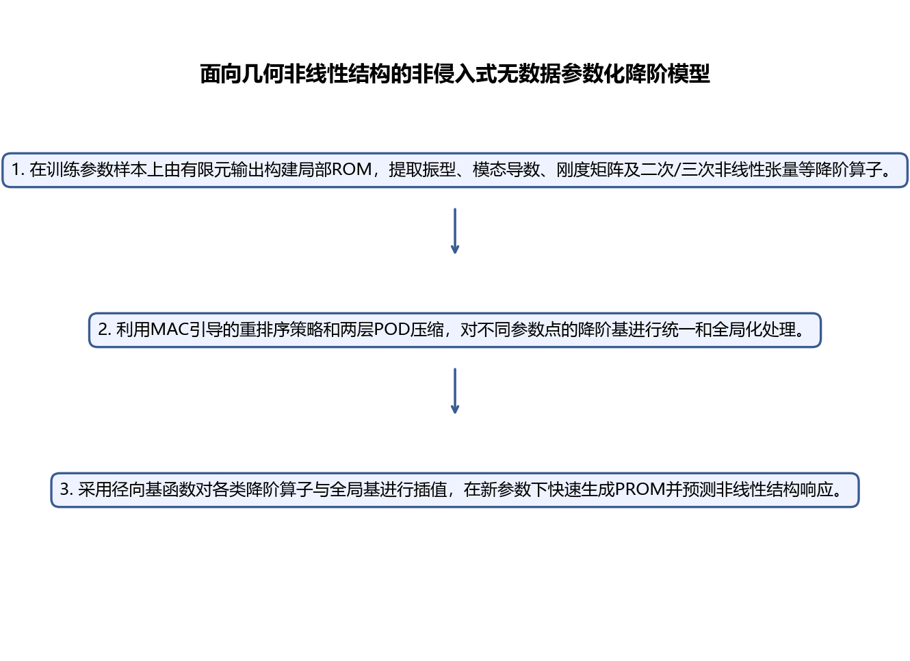

#### 动态碎裂中相场裂纹展宽起源的解释
- 英文标题: Origins of phase-field crack widening in dynamic fragmentation explained
- 期刊: Computer Methods in Applied Mechanics and Engineering
- 日期/期次: 2026-07-01 / Volume 456
- DOI: 10.1016/j.cma.2026.118942
- 分类: Multiscale Mechanics, 损伤力学与断裂, 相场方法与动态碎裂
- 关注关键词: N/A
- 价值分: 45
- 链接: https://doi.org/10.1016/j.cma.2026.118942
- 一句话摘要: 该文揭示动态相场断裂中裂纹弥散区异常展宽源于弹性波的非物理滞留，并提出通过质量侵蚀抑制伪损伤扩散。
- 核心内容: 本文研究相场断裂方法在动态裂纹扩展与碎裂模拟中的一个关键问题：裂纹正则化区会随时间逐渐变宽。作者指出，这种展宽并非真实断裂物理，而是由于损伤区内对弹性波的非物理困陷，导致波与损伤场相互作用并诱发额外损伤。为减弱这一伪扩散现象，论文提出采用质量侵蚀策略，使受损区域中的弹性波速得到合理保持，从而抑制裂纹带异常增宽。数值结果还表明，在正则化长度足够小且网格足够细时，无论是否采用质量侵蚀，动态裂纹速度和能量释放率都可收敛到线弹性断裂力学预测。
- 图像摘要: 首图本质上是方法概览图，说明如何用连续损伤场d(x)对尖锐裂纹Γ进行相场正则化。左侧示意了受外载f和位移边界条件作用的连续体Ω及内部尖锐裂纹，右侧则用灰度损伤带表示弥散裂纹区Γ_l0，其中黑色代表损伤接近1、白色代表未损伤，并标出损伤带宽度与内禀长度尺度l0的关系；旁边的AT1与AT2曲线进一步比较了两类相场裂纹剖面函数，显示AT1具有有限支撑而AT2呈指数型长尾衰减。根据图注，第二图应给出扩张球形膜碎裂问题及其二维等效径向扩张板问题的几何与边界条件，是主要算例设定；第三图则比较有无质量退化时弹性、动能和耗散能随时间的演化，直接证明裂纹带展宽与额外耗散之间的联系。
- 模型/流程摘要: 整体流程是先采用相场断裂框架用连续损伤变量对尖锐裂纹进行正则化，并分析不同裂纹密度函数下的弥散裂纹带特征；随后在动态裂纹扩展和碎裂问题中考察弹性波与损伤带的相互作用，识别出波在受损区内的非物理滞留会引起额外损伤和裂纹带展宽；最后引入质量侵蚀策略修正受损区动力学响应，并通过能量演化、裂纹速度和能量释放率分析验证其对动态相场断裂收敛性的改善。
- 与关注方向的关系: 这篇文章与关注方向高度相关，因为它直接涉及 damage mechanics 和相场断裂这一典型连续体损伤建模主题。虽然不是PINN或代理模型论文，但它对动态断裂中的数值损伤扩散、内禀长度尺度作用和物理一致性问题进行了深入分析，对发展高保真损伤/断裂模型和理解相场方法局限性很有参考价值。
- 方法关键词: 动态相场断裂模型, 质量侵蚀修正策略
- 应用方向: 动态裂纹扩展与碎裂过程模拟, 扩张膜或板类结构的高速断裂分析
- 前沿要点: 明确指出动态相场断裂中裂纹带展宽并非真实断裂物理，而与受损区内弹性波的非物理滞留有关，澄清了长期存在的数值现象来源。；提出质量侵蚀这一动力学修正策略，在不改变相场断裂总体框架的前提下有效抑制伪损伤扩散和额外耗散。；通过数值证据表明，在合适正则化长度和网格分辨率下，动态相场裂纹传播仍可收敛到线弹性断裂力学结果，为相场动态碎裂模拟提供了更可靠的适用边界。
- 图像要点: 图1清楚说明相场方法中的裂纹并不是几何零厚度界面，而是由长度尺度l0控制的弥散损伤带，这正是后续讨论动态展宽问题的基础。；AT1与AT2裂纹剖面对比强调不同相场正则化函数会影响裂纹带尾部形态和扩散特征，从而与动态波传播耦合问题密切相关。
- 研究流程: 构建动态相场断裂模型，用连续损伤场d(x)正则化尖锐裂纹，并区分AT1与AT2等不同裂纹密度函数。 -> 在动态裂纹扩展与碎裂算例中分析弹性波在损伤区内的传播与反射，识别裂纹弥散区异常展宽的机理。 -> 引入质量侵蚀策略抑制伪损伤扩散，并通过能量、裂纹速度和能量释放率对模型表现进行验证。
- 论文图像:
图像角色: 摘要/概览图
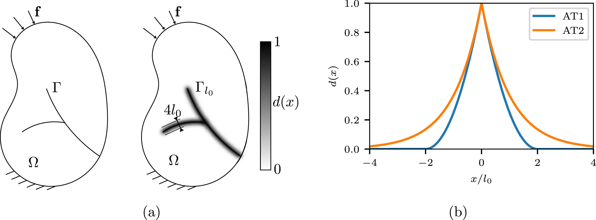
_图注: Fig. 1 (a)Regularization of a sharp crack Γ by a diffusive damage field d ( x ) in a continuous domain Ω subject to traction f and imposed displacement. The regularized fracture corresponds to the region Γ l 0 = { x ∈ Ω | d ( x ) > 0 } of width related to l 0 . (b)Optimal damage profile for a 1D crack located at x = 0 . Note the limited support of the damage for the AT1 formulation._
_选图理由: 图注含 results/experiment/validation 强信号；图注偏结果或响应展示；为满足展示顺序补足“摘要/概览图”_
图像角色: 模型/方法图
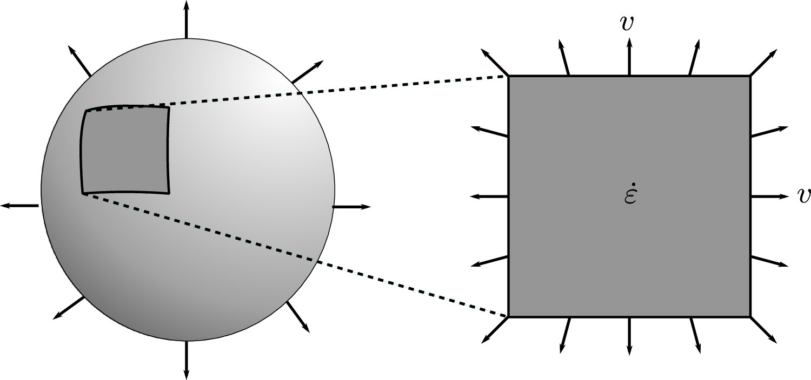
_图注: Fig. 2 Geometry and boundary conditions for the fragmentation of an expanding spherical membrane, and the equivalent 2D problem, a plate in radial expansion._
_选图理由: 图注偏方法或结构示意；第二图优先视作模型或方法图_
图像角色: 结果/实验图
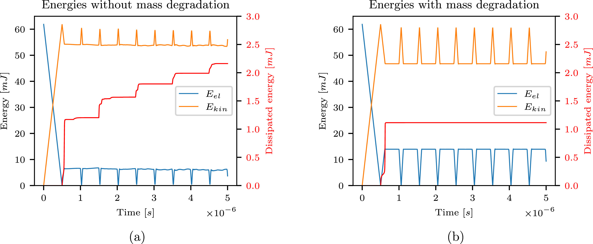
_图注: Fig. 12 Evolution of the elastic, kinetic and dissipated energy as a function of time for the oscillation test. (a) The plot for the simulation without mass degradation shows the increase in dissipated energy corresponding to the widening of the damage band. (b) With mass degradation, the dissipated energy reaches a steady state._
_选图理由: 图注含 results/experiment/validation 强信号；图注偏结果或响应展示；后续图优先视作结果或实验图_
- 自动生成流程图:
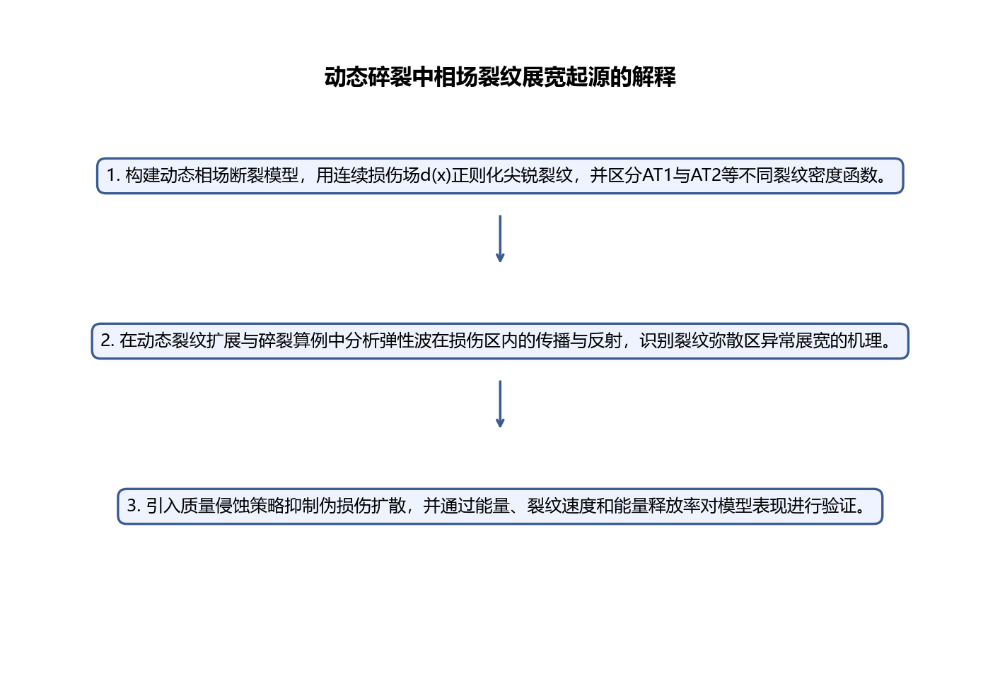

#### 用于物理信息前向与逆问题学习的条件自适应增广拉格朗日方法
- 英文标题: Conditionally adaptive augmented Lagrangian method for physics-informed learning of forward and inverse problems
- 期刊: Computer Methods in Applied Mechanics and Engineering
- 日期/期次: 2026-07-01 / Volume 456
- DOI: 10.1016/j.cma.2026.118953
- 分类: Machine Learning in Mechanics, 前向与逆问题约束优化, 物理信息神经网络与科学机器学习
- 关注关键词: N/A
- 价值分: 45
- 链接: https://doi.org/10.1016/j.cma.2026.118953
- 一句话摘要: 该文在PECANN框架中提出条件自适应增广拉格朗日策略CAPU，并结合约束聚合、Fourier特征与时间窗推进，提升复杂PDE前向和逆问题的物理信息学习能力。
- 核心内容: 本文对Physics and Equality Constrained Artificial Neural Networks（PECANN）框架进行了系统扩展，以提高其求解复杂偏微分方程前向与逆问题的鲁棒性和效率。核心改进包括：支持多独立罚参数的增广拉格朗日方法、缓解逐点约束低效性的约束聚合策略、用于高频多尺度解的单次Fourier特征映射，以及适用于长时间输运问题的时间窗方法。最关键的是，作者提出了条件自适应罚参数更新策略CAPU，可针对违反更严重的约束更快增长拉格朗日乘子，并协调多个罚参数的更新。该框架在跨声速稀疏波、可逆涡旋平流、高波数Helmholtz/Poisson方程以及逆热源识别中都表现出有竞争力的精度与效率。
- 图像摘要: 首图实际上是结果对比图，而不是方法示意图。图(a)给出复合介质热传导问题在t=1时的温度剖面u(x,1.0)，图(b)给出对应热流q(x,1.0)，黑线为精确解，蓝色MPU、绿色CPU和红色CAPU分别对应不同罚参数更新策略；从曲线可见，CAPU在温度和热流两项上都更接近精确解，尤其在界面附近和热流跃迁区域优势更明显。根据图注，第二图应展示带局部源项的二维Helmholtz方程中参考解、CAPU预测解及误差分布，用于体现其处理高波数振荡解的能力；第三图则针对时变复合介质导热问题比较约束聚合与逐点约束下的结果，说明CAPU与约束聚合结合后在时间依赖问题中的效果。
- 模型/流程摘要: 整体流程是先在PECANN物理约束神经网络框架中把PDE、边界条件和逆问题参数识别统一写为等式约束优化；随后采用支持多罚参数的增广拉格朗日法进行求解，并通过约束聚合降低逐点残差约束的计算负担，同时加入单次Fourier特征映射以增强对高频多尺度解的表示能力；最后用CAPU按约束违反程度自适应更新拉格朗日乘子和罚参数，并在长时间问题中结合时间窗策略逐段推进，从而稳健求解前向和逆问题。
- 与关注方向的关系: 这篇文章与关注方向高度相关，因为它属于PINN/物理信息学习方法的重要改进工作，核心聚焦于复杂PDE约束优化、前向-逆问题统一求解和多尺度振荡解处理。虽然不是传统本构模型论文，但其约束执行、Fourier特征、多罚参数增广拉格朗日和自适应优化思路，对发展物理约束代理模型和高鲁棒科学机器学习框架很有参考价值。
- 方法关键词: PECANN-CAPU框架, 多罚参数增广拉格朗日法结合约束聚合与Fourier特征映射
- 应用方向: 复合介质热传导与逆热源识别, 高波数Helmholtz/Poisson方程及时间依赖输运问题求解
- 前沿要点: 提出CAPU条件自适应罚参数更新，使不同物理约束可按违反程度差异化强化，提升复杂PDE约束优化的收敛效率与稳定性。；通过约束聚合、多罚参数ALM和单次Fourier特征映射的组合，显著增强了PECANN处理异质约束、高波数振荡解和多尺度问题的能力。；引入时间窗策略后，框架不依赖离散时间模型即可处理长时输运演化，为物理信息学习扩展到更复杂时变问题提供了通用途径。
- 图像要点: 首图直接表明CAPU相较MPU和CPU能更准确逼近复合介质热传导中的温度与热流精确解，尤其在热流不连续或陡变区域更有优势。；图像强调评价物理信息学习方法不能只看场变量回归误差，还应检查通量等派生物理量，因为这些量对约束执行质量更敏感。
- 研究流程: 将PDE残差、边界条件和待识别参数统一纳入PECANN的等式约束学习框架，并构建增广拉格朗日目标函数。 -> 引入多独立罚参数、约束聚合和Fourier特征映射，增强对异质约束和高频多尺度解的表达与优化能力。 -> 采用CAPU策略自适应更新乘子与罚参数，并结合时间窗方法处理长时间演化问题，完成前向或逆问题求解。
- 论文图像:
图像角色: 摘要/概览图
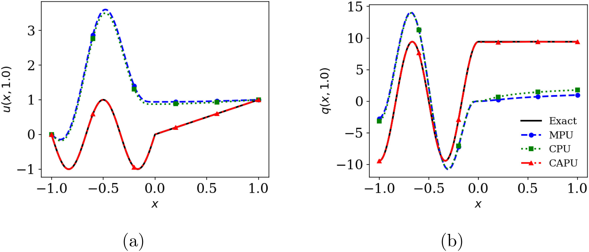
_图注: Fig. 1 Heat transfer in a composite medium: Profiles of (a) predicted temperature and (b) predicted heat flux at t = 1 , obtained using different penalty update strategies with the point-wise constraint formulation from Section 3.1.1 ._
_选图理由: 首图优先视作摘要附近概览图_
图像角色: 模型/方法图
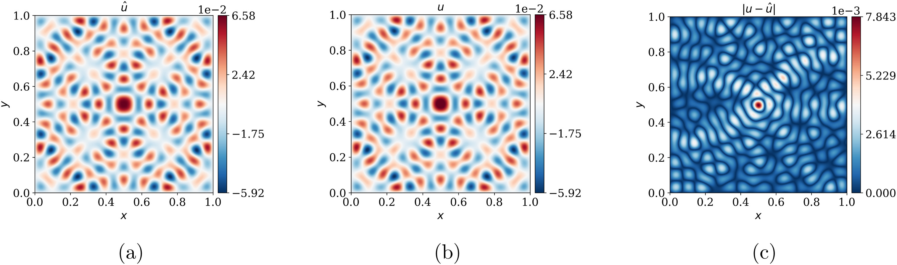
_图注: Fig. 15 2D Helmholtz equation with a localized source term ( Eq. (35) with L = 5 ): (a) reference solution, (b) prediction of the best-performing trial using the CAPU algorithm with Fourier-featured network of 3 hidden layers and 60 neurons per layer, (c) the corresponding absolute point-wise error._
_选图理由: 图注含 framework/workflow/model 强信号；图注偏方法或结构示意；第二图优先视作模型或方法图_
图像角色: 结果/实验图
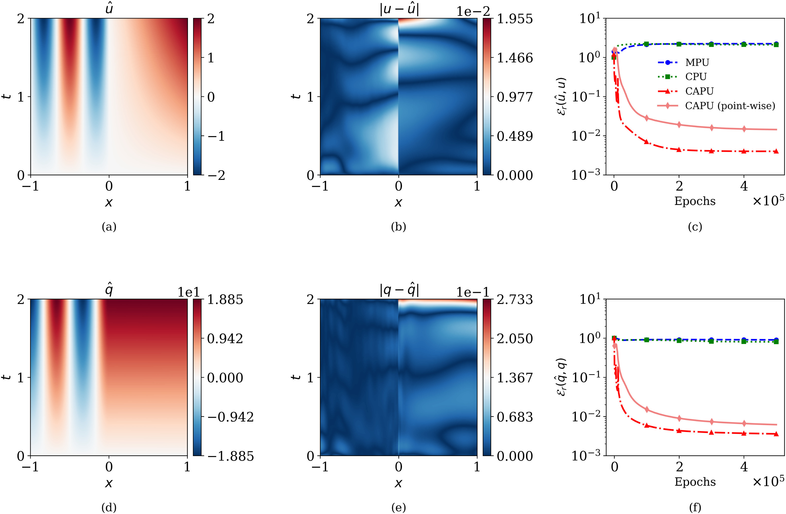
_图注: Fig. 3 Time-dependent heat conduction in a composite medium: Results are obtained using the constraint-aggregation formulation described in Section 3.1.2 . The prediction using CAPU with point-wise constraints is also included. Panels (a)-(c) show the contours of predicted temperature, the absolute error obtained with CAPU, and the evolution of the relative l 2 error E r ( u ^ , u ) , respectively, with the latter including comparisons among MPU, CPU, and CAPU (point-wise); panels (d)-(f) present the corresponding heat flux results._
_选图理由: 图注含 results/experiment/validation 强信号；图注偏结果或响应展示；后续图优先视作结果或实验图_
- 自动生成流程图:
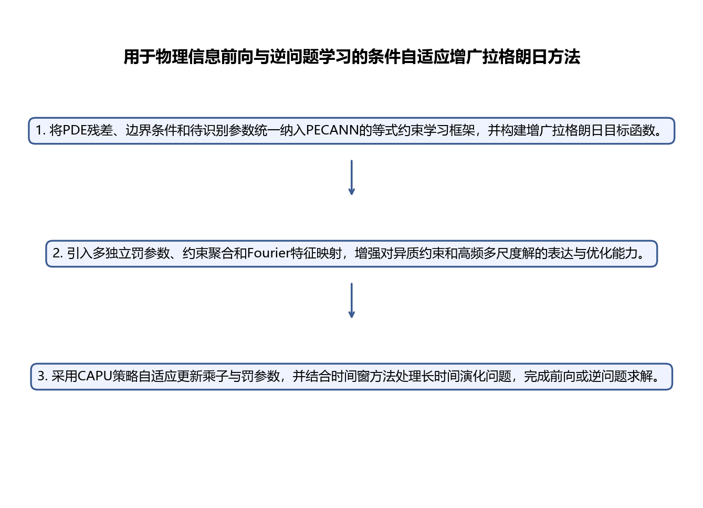

## 关注方向专题

### PINN

- 命中文章数: 2
- 涉及期刊: International Journal of Solids and Structures(1), Computer Methods in Applied Mechanics and Engineering(1)
- 高频方法: 带边界转角缺陷的非线性解析屈曲模型；考虑柱长缩短的半解析方法与非线性有限元验证；Deep Hidden Physics Operator（DHPO）；预训练DeepONet结合物理约束反演

#### 该方向前沿要点
- 将载荷诱导边界转角缺陷与传统预存几何初始缺陷明确区分，为全连接晶格屈曲研究提供了新的失稳机制视角。
- 给出了带规定边界转角的非线性闭式载荷-挠度解，并结合考虑柱长缩短的半解析方法，兼顾理论可解释性与工程适用性。
- 揭示在某些典型构型下临界力可降至等效铰接柱的22%，表明边界耦合效应对机械超材料稳定性评估至关重要。
- 把隐藏物理发现从传统点对点回归提升到算子学习层面，使方法能够跨不同PDE族泛化，而不必针对每个新问题重新完整训练。
- 将预训练DeepONet与物理约束逆建模结合，提供了一种高效的稀疏观测参数识别框架，缓解了PINN反演中训练代价高和不稳定的问题。
- 在有限且含噪观测下仍保持较高识别精度，表明该方法在复杂动力系统逆问题中具有较强的数据效率与鲁棒性。

#### 该方向重点论文
- 该方向命中的重点论文已在前文展示，避免重复展开。

### constitutive model

- 命中文章数: 5
- 涉及期刊: International Journal of Plasticity(2), Journal of the Mechanics and Physics of Solids(2), Computer Methods in Applied Mechanics and Engineering(1)
- 高频方法: Hierarchical Physically Recurrent Neural Network (HPRNN)；Physically Recurrent Neural Network (PRNN)；有效温度本构方法；耦合水扩散-水解断链-黏塑性模型；原位X射线断层观测与相图分析

#### 该方向前沿要点
- 将递归神经网络与显式物理结构相结合，而非单纯黑箱时序网络，提高了多尺度本构代理的可解释性与物理一致性。
- 采用分层代理替代直接端到端跨尺度映射，降低了大数据需求，并更适合复合材料这类具有天然层级结构的问题。
- 针对复杂循环载荷的外推泛化能力进行设计与验证，回应了数据驱动本构模型在非比例和历史依赖加载下易失真的前沿难点。
- 将水扩散、水解链断裂与黏塑性本构统一耦合，面向可降解玻璃态聚合物给出更完整的劣化-力学关联描述。
- 采用有效温度这一物理启发参数，把吸水和分子量衰减共同引起的玻璃化转变温度下降映射到力学性能变化中，兼顾简洁性与可解释性。
- 不仅能够预测均匀试样的降解阶段力学行为，还可分析多孔结构中由结构架构引起的空间非均匀降解效应。

#### 该方向重点论文
- 该方向命中的重点论文已在前文展示，避免重复展开。

### multiscale

- 命中文章数: 9
- 涉及期刊: Computer Methods in Applied Mechanics and Engineering(4), International Journal of Plasticity(3), Journal of the Mechanics and Physics of Solids(2)
- 高频方法: Hierarchical Physically Recurrent Neural Network (HPRNN)；Physically Recurrent Neural Network (PRNN)；代数子网格尺度与正交子网格尺度稳定化有限元；变分多尺度方法（VMS）；MulTIAN热力学信息引导注意力网络

#### 该方向前沿要点
- 将递归神经网络与显式物理结构相结合，而非单纯黑箱时序网络，提高了多尺度本构代理的可解释性与物理一致性。
- 采用分层代理替代直接端到端跨尺度映射，降低了大数据需求，并更适合复合材料这类具有天然层级结构的问题。
- 针对复杂循环载荷的外推泛化能力进行设计与验证，回应了数据驱动本构模型在非比例和历史依赖加载下易失真的前沿难点。
- 把数据驱动计算力学中的优化问题与变分多尺度稳定化有限元系统结合，扩展了VMS在数据一致性求解中的应用边界。
- 系统比较ASGS与OSGS两类子网格尺度设计，并揭示通过调整稳定化参数可在离散原始与对偶形式之间切换。
- 从连续适定性到离散误差场评估形成完整链条，为后续更复杂数据驱动PDE反演和同化问题提供理论与算法基础。

#### 该方向重点论文
- 该方向命中的重点论文已在前文展示，避免重复展开。

### damage mechanics

- 本轮没有命中该关注方向的论文。

### surrogate model

- 命中文章数: 3
- 涉及期刊: Computer Methods in Applied Mechanics and Engineering(3)
- 高频方法: Hierarchical Physically Recurrent Neural Network (HPRNN)；Physically Recurrent Neural Network (PRNN)；Multi-Fidelity Delayed Acceptance (MFDA)；分层MCMC与多保真深度神经网络；DeepONet代理模型

#### 该方向前沿要点
- 将递归神经网络与显式物理结构相结合，而非单纯黑箱时序网络，提高了多尺度本构代理的可解释性与物理一致性。
- 采用分层代理替代直接端到端跨尺度映射，降低了大数据需求，并更适合复合材料这类具有天然层级结构的问题。
- 针对复杂循环载荷的外推泛化能力进行设计与验证，回应了数据驱动本构模型在非比例和历史依赖加载下易失真的前沿难点。
- 将多保真代理学习与延迟接受MCMC深度融合，实现了高维物理反演中采样效率与后验精度的兼顾。
- 支持异构低保真求解器共同参与层级推断，比只依赖单一粗模型的传统多层延迟接受方法更灵活。
- 把高保真调用限制在离线阶段，避免在线采样中昂贵有限元或PDE求解，为大规模逆问题提供可扩展路径。

#### 该方向重点论文
- 该方向命中的重点论文已在前文展示，避免重复展开。

## 按期刊精读

### Computer Methods in Applied Mechanics and Engineering
- 本次论文数: 23
- 与关注方向相关: 7
- 含图论文数: 10
- 相比上次新增: 0

#### 本刊前沿要点
- 将递归神经网络与显式物理结构相结合，而非单纯黑箱时序网络，提高了多尺度本构代理的可解释性与物理一致性。
- 采用分层代理替代直接端到端跨尺度映射，降低了大数据需求，并更适合复合材料这类具有天然层级结构的问题。
- 针对复杂循环载荷的外推泛化能力进行设计与验证，回应了数据驱动本构模型在非比例和历史依赖加载下易失真的前沿难点。
- 将多保真代理学习与延迟接受MCMC深度融合，实现了高维物理反演中采样效率与后验精度的兼顾。
- 支持异构低保真求解器共同参与层级推断，比只依赖单一粗模型的传统多层延迟接受方法更灵活。
- 把高保真调用限制在离线阶段，避免在线采样中昂贵有限元或PDE求解，为大规模逆问题提供可扩展路径。

#### 本刊重点论文
#### 基于样条最小二乘形式的弹性杆网络快速仿真与设计优化
- 英文标题: Accelerated simulation and design optimization of elastic rod networks with a spline-based least-squares formulation
- 期刊: Computer Methods in Applied Mechanics and Engineering
- 日期/期次: 2026-07-01 / Volume 456
- DOI: 10.1016/j.cma.2026.118925
- 分类: Multiscale Mechanics, 弹性杆网络与形状优化, 非线性结构力学
- 关注关键词: N/A
- 价值分: 45
- 链接: https://doi.org/10.1016/j.cma.2026.118925
- 一句话摘要: 该文提出一种基于Bezier样条与最小二乘Kirchhoff杆边值求解的高效方法，用于多稳态弹性杆网络的快速仿真与形状优化。
- 核心内容: 本文针对多稳态弹性杆网络在仿真和设计优化中面临的强非线性与不稳定平衡附近雅可比病态问题，提出了一种高效稳健的计算框架。方法将Kirchhoff杆边值问题改写为最小二乘求解形式，并用Bezier曲线建立由bigon单元组成的杆网络模型。基于这一求解器，作者进一步构建了面向目标曲线和目标端平面的形状优化方法，把形状目标直接并入最小二乘函数中。数值实验和实体原型表明，该方法相比传统边值问题求解器更高效、更抗噪，并能有效实现多稳态弹性杆网络的物理驱动设计。
- 图像摘要: 首图是结构概览图，展示了bigon基本单元的几何与构型转变。图(a)中两根长度为l、宽度为w、厚度为t的细条以交角γ刚性连接，形成一个近似平面的透镜状单元；图(b)则显示当交角增大后，bigon单元发生明显几何重构，形成更强弯曲和闭合趋势的多稳态形态，这正是后续bigon arm建模与优化的基本力学单元。根据图注，第二图应给出启发式初始化算法流程，用于为最小二乘求解提供稳定初值；第三图则展示面向正弦目标曲线的优化结果，并将数值设计形状与实体样机平面视图进行对比验证。
- 模型/流程摘要: 整体流程是先把由bigon单元组成的弹性杆网络视为Kirchhoff杆边值问题，并用Bezier曲线参数化bigon arm的几何形状；随后通过最小二乘形式求解非线性平衡，从而提高在不稳定平衡附近的鲁棒性和计算效率；最后在同一最小二乘框架中加入目标曲线或目标端平面等设计目标，实现多稳态弹性杆网络的快速形状优化与物理验证。
- 与关注方向的关系: 这篇文章与关注方向的契合点主要在非线性结构、多稳态网络和高效物理建模。它不是PINN、损伤力学或传统本构代理模型论文，但其基于低维样条参数化和最小二乘物理求解的快速设计思路，对柔性结构、超材料单元和物理引导优化问题很有参考价值。
- 方法关键词: Bezier样条参数化与物理驱动形状优化, 基于Kirchhoff杆边值问题的最小二乘求解
- 应用方向: 软体机器人与自适应结构中的多稳态弹性杆网络设计, 面向目标曲线和端平面的可制造网络结构优化
- 前沿要点: 将Kirchhoff杆边值问题改写为最小二乘形式，缓解了多稳态结构在不稳定平衡附近传统求解器易失稳和病态的问题。；以Bezier曲线统一描述bigon arm几何，使仿真与优化共享同一参数化表示，提升了设计过程的一致性与效率。；把物理平衡求解与形状优化直接耦合，避免纯数据驱动黑箱设计，为多稳态杆网络提供可解释、可制造的逆向设计路径。
- 图像要点: 图1的核心信息是bigon单元由两条刚接细条组成，其交角γ控制了从近平面构型到强弯曲多稳态构型的转变。；该图说明论文研究对象不是普通单杆，而是由可调曲率、可多稳态跳转的bigon单元拼接形成的弹性杆网络。
- 研究流程: 以bigon单元为基础建立弹性杆网络几何模型，并用Bezier样条参数化bigon arm形状。 -> 将Kirchhoff杆边值问题转化为最小二乘求解，结合启发式初始化提高非线性求解的稳定性与效率。 -> 把目标曲线或目标端平面等设计指标加入最小二乘目标函数，完成网络形状优化并与实体原型对比验证。
- 论文图像:
图像角色: 摘要/概览图
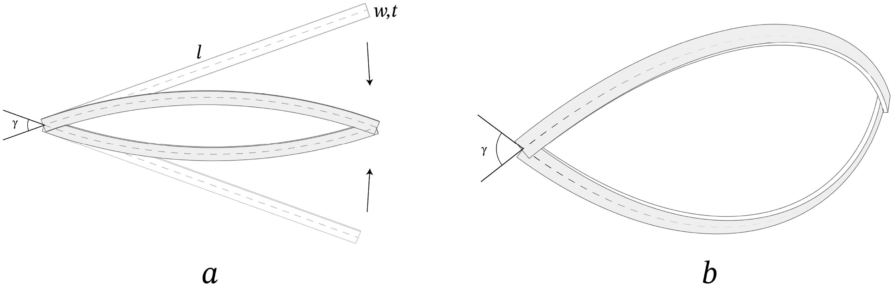
_图注: Fig. 1 Bigon unit, with strip length l , width w , thickness t and intersection angle γ . The bigon unit is formed from rigidly connecting two flat strips and remains planar for small values of γ (a). When γ is sufficiently large, the bigon unit buckles out of plane (b)._
_选图理由: 首图优先视作摘要附近概览图_
图像角色: 模型/方法图
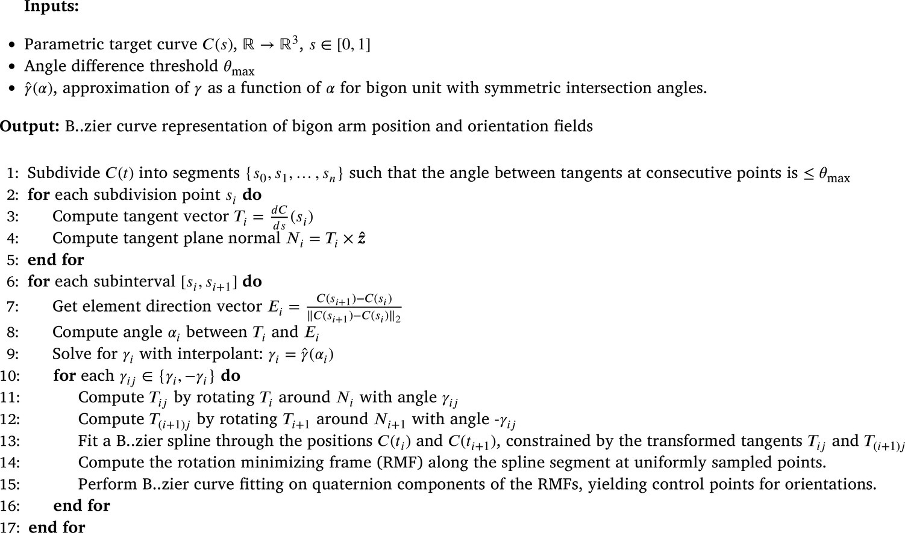
_图注: Algorithm 1 Heuristic initialization algorithm._
_选图理由: 图注含 framework/workflow/model 强信号；第二图优先视作模型或方法图_
图像角色: 结果/实验图
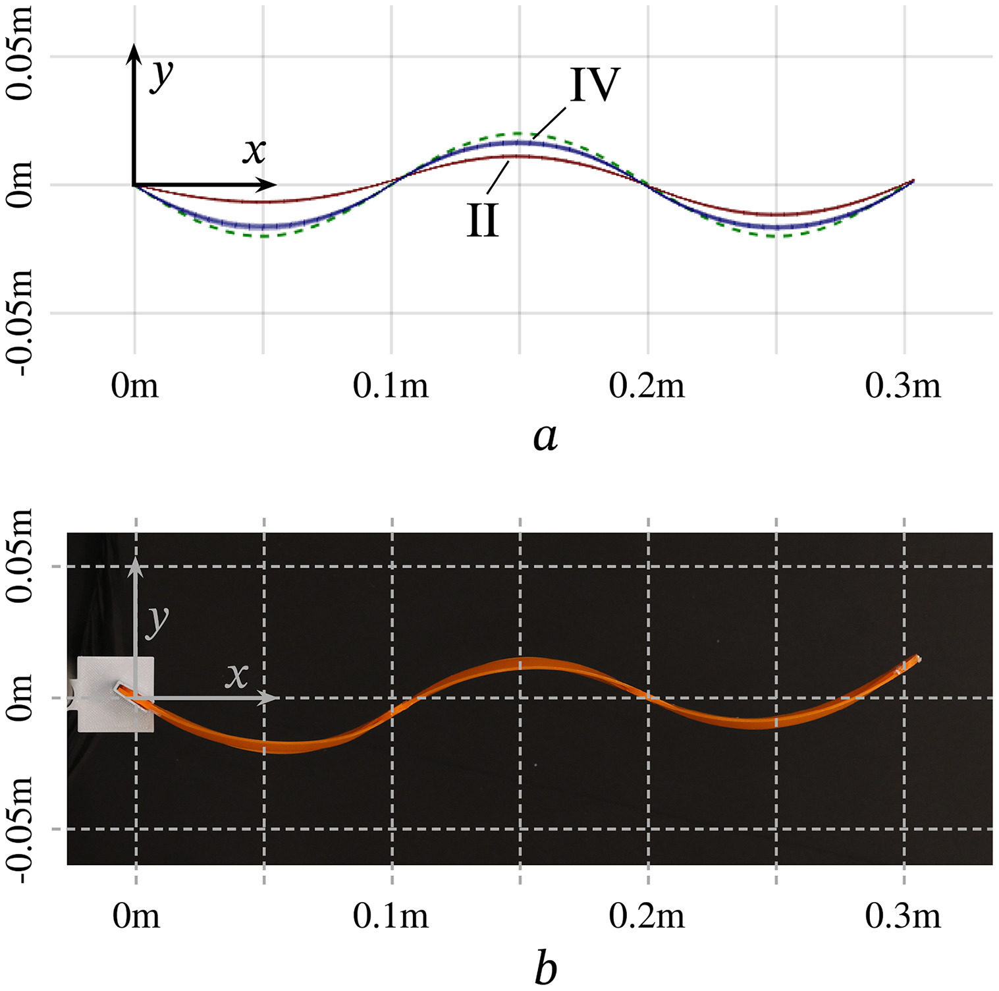
_图注: Fig. 9 Optimization results for sinusoidal target curve. Top: numerical results, plan view. Bottom: physical model, plan view._
_选图理由: 图注含 results/experiment/validation 强信号；图注偏结果或响应展示；后续图优先视作结果或实验图_
- 自动生成流程图:
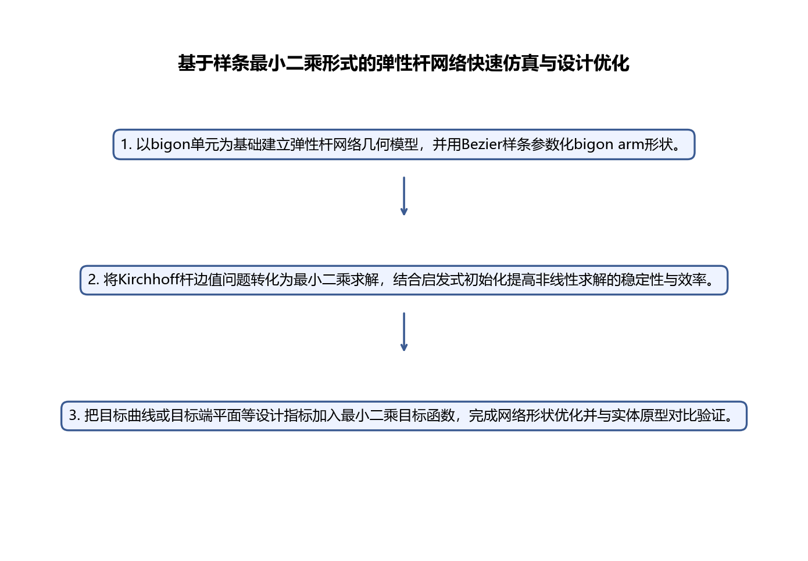

#### 面向最大一阶固有频率的三维连续纤维增强复合材料GPU加速大规模拓扑优化
- 英文标题: GPU-accelerated large-scale topology optimization of 3D continuous fiber-reinforced composites for maximum fundamental eigenfrequency
- 期刊: Computer Methods in Applied Mechanics and Engineering
- 日期/期次: 2026-07-01 / Volume 456
- DOI: 10.1016/j.cma.2026.118895
- 分类: Composite Structures, 复合材料结构优化, 高性能计算与拓扑优化
- 关注关键词: N/A
- 价值分: 45
- 链接: https://doi.org/10.1016/j.cma.2026.118895
- 一句话摘要: 该文提出一种GPU加速的大规模三维连续纤维增强复合材料拓扑优化框架，以高效求解最大化基频的密度-纤维取向协同设计问题。
- 核心内容: 本文针对三维连续纤维增强复合材料在最大一阶固有频率目标下的拓扑优化计算量巨大的问题，提出了一种GPU加速求解框架。核心思想是采用SIAD方法，把近似特征值分析与设计变量更新合并到单循环中，替代传统昂贵的双循环流程。作者进一步结合多重网格预条件共轭梯度求解器、基于Taylor近似改进的单元刚度矩阵计算方法，以及面向密度和纤维取向的解耦更新策略，显著提升了效率与可扩展性。数值算例表明，该方法不仅能够处理数百万单元的大规模问题，而且优化得到的复合材料结构可在更低质量下获得高于铝结构的基频。
- 图像摘要: 本题未提供附图，因此无法依据图像总结具体结构拓扑、纤维取向场分布或频率优化结果云图。仅从摘要判断，论文最关键的可视化内容应包括：三维连续纤维增强复合材料的拓扑优化结果、纤维取向的空间分布、GPU加速求解流程，以及优化前后基频和质量对比图。这类图通常会用于展示密度与纤维方向协同设计如何共同提高结构动态性能。
- 模型/流程摘要: 整体流程是先建立以最大一阶固有频率为目标的三维连续纤维增强复合材料拓扑优化模型，并同时把材料密度和纤维取向作为设计变量；随后采用SIAD将特征值分析与设计更新合并，在每一步中用MGPCG加速逆迭代求解，并通过改进Taylor近似提高单元刚度矩阵与稀疏乘法效率；最后结合高效灵敏度分析和密度-取向解耦更新策略，在GPU上完成大规模迭代优化。
- 与关注方向的关系: 这篇文章与关注方向的契合点主要在复合材料、多尺度各向异性设计和高效代理式数值求解。它不是PINN或传统本构模型论文，但涉及连续纤维复合材料的结构-材料协同优化、超大规模计算加速和设计变量高维耦合，对复合材料结构设计和高性能计算方法都很有参考价值。
- 方法关键词: GPU加速MGPCG求解与纤维取向-密度解耦更新, SIAD单循环拓扑优化方法
- 应用方向: 三维连续纤维增强复合材料结构的基频最大化设计, 大规模轻量化高动态性能复合材料构件优化
- 前沿要点: 将SIAD用于三维连续纤维增强复合材料特征值拓扑优化，把分析与设计更新合并，显著减少传统双层迭代带来的计算开销。；面向GPU实现多重网格预条件共轭梯度与改进Taylor近似刚度计算，使数百万单元级问题具备实际可计算性。；同时优化密度和纤维取向，并采用解耦更新策略，为高性能轻量化复合材料动态设计提供了高效可扩展框架。
- 图像要点: 核心结果应突出拓扑布局与纤维取向场的协同优化，而不是仅优化材料分布，因为该问题同时面向结构形态和各向异性增强方向设计。；关键性能图应展示在更低质量下复合材料优化结构获得更高一阶固有频率，并体现GPU求解在超大规模问题上的效率优势。
- 研究流程: 建立以最大基频为目标的三维连续纤维增强复合材料拓扑优化问题，并定义密度与纤维取向设计变量。 -> 采用SIAD单循环策略结合MGPCG加速特征值分析，同时利用改进Taylor近似提高单元刚度计算效率。 -> 执行灵敏度分析与密度/纤维取向解耦更新，在GPU上完成大规模迭代并获得优化结构。
- 自动生成流程图:
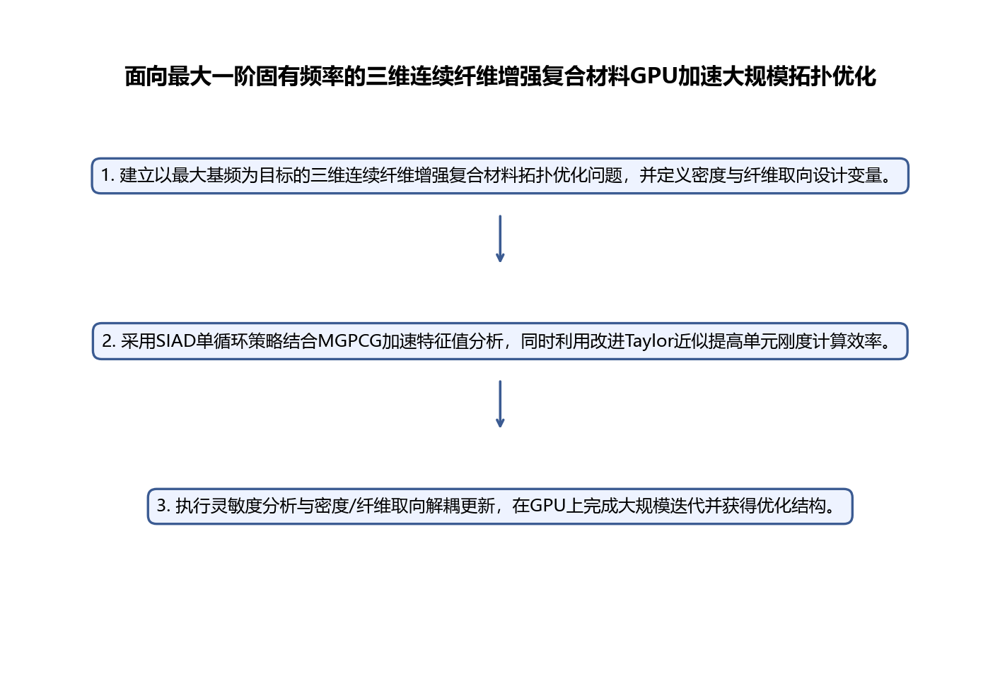

#### 复合材料板裂纹演化建模：基于高阶板理论的分层相场方法
- 英文标题: Modeling of crack evolution in composite plates: A layerwise phase field approach with higher order plate theory
- 期刊: Computer Methods in Applied Mechanics and Engineering
- 日期/期次: 2026-07-01 / Volume 456
- DOI: 10.1016/j.cma.2026.118935
- 分类: Composite Structures, 复合材料断裂力学, 相场损伤建模
- 关注关键词: N/A
- 价值分: 45
- 链接: https://doi.org/10.1016/j.cma.2026.118935
- 一句话摘要: 该文提出一种结合高阶板理论与分层各向异性相场的复合层合板裂纹演化模型，可预测纤维方向敏感的层间/层内损伤路径及多次跳跃失稳平衡路径。
- 核心内容: 本文建立了一个面向层合复合材料板裂纹演化的三维分层各向异性相场框架。位移场采用三阶剪切变形板理论，并加入厚度拉伸和zig-zag项，以描述层间处面内位移斜率不连续等特征。相场变量在厚度方向采用二次分布，并结合各向异性裂纹表面密度函数，从而能够刻画单层内受纤维取向控制的损伤扩展，并抑制垂直纤维方向的裂纹传播。作者基于有限元、交替最小化与弧长法实现求解，并通过文献中的解析、数值和实验结果验证，表明该方法能够有效预测不同铺层角和长厚比条件下的裂纹路径、层状损伤和多次snap-through平衡路径。
- 图像摘要: 本题未提供附图，因此无法依据图像总结具体层合板几何、裂纹路径云图或平衡路径曲线。仅从摘要判断，论文最关键的可视化内容应包括：分层板理论中的厚度位移分布与zig-zag运动学示意、各铺层中纤维方向相关的相场损伤分布、不同纤维角度下的裂纹路径演化，以及含极限点和多次snap-through的载荷-位移平衡路径。这类图通常用于说明该方法如何同时处理层内各向异性断裂、层间运动学不连续和后屈曲/失稳路径追踪。
- 模型/流程摘要: 整体流程是先基于三阶剪切变形板理论建立分层位移场，并引入厚度拉伸与zig-zag项以描述层间运动学特征；再在每层内采用厚度方向二次变化的相场变量和各向异性裂纹表面密度函数，表征纤维方向依赖的损伤扩展；随后通过Newton-Raphson与交替最小化交替求解位移场和相场，并结合载荷控制与弧长控制追踪极限点前后的平衡路径；最后在FEniCS中实现并通过基准问题和参数分析验证。
- 与关注方向的关系: 这篇文章与关注方向高度契合，因为它同时涉及复合材料、相场损伤/断裂和各向异性建模。虽然不是PINN或代理模型论文，但它属于典型的 constitutive/damage modeling 与复合板多层力学耦合问题，对研究纤维增强层合板断裂、层状损伤演化和复杂平衡路径追踪很有参考价值。
- 方法关键词: 交替最小化结合弧长控制的有限元求解, 基于高阶板理论的分层各向异性相场方法
- 应用方向: 含多次snap-through失稳的复合板平衡路径分析, 层合复合板中纤维方向敏感的裂纹路径与损伤演化预测
- 前沿要点: 将高阶分层板理论与各向异性相场断裂统一起来，在较低计算代价下实现对层合复合板三维层状损伤演化的高保真描述。；通过厚度方向二次相场分布和纤维方向相关裂纹表面密度函数，使模型能够更自然地表达单层内方向依赖的裂纹扩展阻抗。；结合弧长法追踪极限点后的平衡路径，使该框架不仅能预测裂纹路径，还能处理多次snap-through等复杂失稳响应。
- 图像要点: 核心结果应突出该方法能够在板理论框架下保留层状细节，既描述层间位移斜率突变，又预测各铺层内受纤维方向控制的裂纹扩展。；关键验证图应展示不同纤维角和长厚比下的裂纹路径、损伤图样及载荷-位移曲线，并体现对极限点后多次snap-through过程的稳定追踪能力。
- 研究流程: 建立含厚度拉伸和zig-zag项的三阶剪切变形分层板理论位移场，描述层合板多层运动学特征。 -> 在各层中引入厚度方向二次变化的各向异性相场变量，结合纤维方向相关裂纹表面密度函数描述层内断裂演化。 -> 采用Newton-Raphson、交替最小化以及载荷/弧长控制进行有限元求解，并通过基准算例和参数研究评估裂纹路径与平衡响应。
- 自动生成流程图:
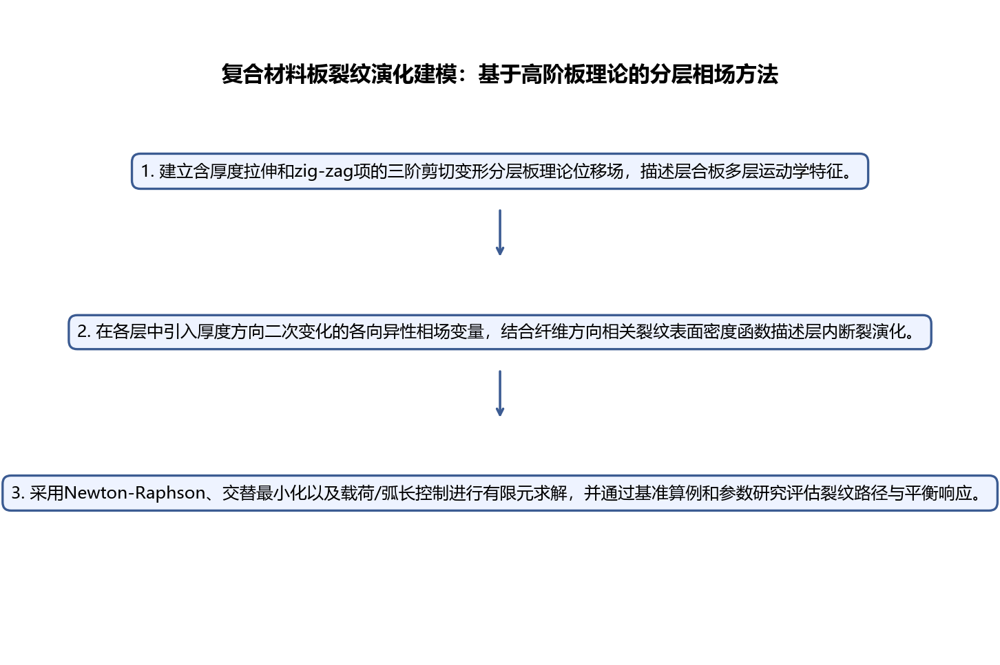

#### 利用算子网络预测复杂几何上的时变流动
- 英文标题: Predicting time-dependent flow over complex geometries using operator networks
- 期刊: Computer Methods in Applied Mechanics and Engineering
- 日期/期次: 2026-07-01 / Volume 456
- DOI: 10.1016/j.cma.2026.118931
- 分类: 算子学习与科学机器学习, 非定常流动代理建模
- 关注关键词: N/A
- 价值分: 35
- 链接: https://doi.org/10.1016/j.cma.2026.118931
- 一句话摘要: 该文提出一种考虑几何信息的时变DeepONet代理模型，用于跨复杂几何快速预测中等雷诺数非定常流场。
- 核心内容: 本文针对复杂几何上的非定常流动快速预测问题，提出了一种时间相关、几何感知的深度算子网络框架。模型利用带符号距离函数编码几何信息，并通过卷积分支网络提取流动历史，从而实现对速度场演化的时序预测。作者基于FlowBench数据集中的841组高保真模拟进行训练，并在262个未见测试几何上验证，获得了约5%的单步相对L2误差和最高约1000倍于CFD的加速比。研究还通过探针相位滞后和Strouhal频率等物理诊断分析长期滚动预测误差，指出尖角几何尾迹中的细尺度误差累积是主要失效模式之一。
- 图像摘要: 本题未提供附图，因此无法依据图像总结网络结构示意、SDF几何编码方式或不同几何尾迹中的流场预测对比。仅从摘要判断，论文最关键的可视化内容应包括：算子网络的几何分支与历史流场分支结构图、复杂几何周围的瞬态速度场预测与CFD真值对比图，以及长时间滚动预测中的相位、频率和尾迹误差分析图。这类图通常用于展示模型如何把几何信息与时间历史共同编码，并在跨几何泛化中保持较高精度。
- 模型/流程摘要: 整体流程是先用带符号距离函数对参数化和非参数化复杂几何进行统一编码，再用CNN分支提取过去若干时刻的流动历史特征，并通过DeepONet型结构学习从“几何+历史流场”到下一时刻速度场的算子映射；随后在高保真FlowBench数据集上进行监督训练；最后通过单步误差、长时间滚动预测、探针相位滞后和Strouhal频率等物理诊断评估模型的短时准确性与长期稳定性。
- 与关注方向的关系: 这篇文章与关注方向高度契合，因为它属于典型的 surrogate model 与 operator learning 在计算力学/流体中的应用。虽然不是PINN或传统本构模型论文，但其在复杂几何、时变场预测和长时滚动稳定性方面的设计思路，对发展几何泛化型算子网络和高效物理代理模型非常有参考价值。
- 方法关键词: 几何感知的时间相关DeepONet, 基于SDF几何编码与CNN历史分支的流场预测
- 应用方向: 复杂几何周围中等雷诺数非定常流动的快速预测, 替代高成本CFD进行跨几何流场时序模拟与长期滚动分析
- 前沿要点: 将几何的SDF表示与时间历史流场的卷积编码结合到算子网络中，使非定常流动代理模型具备更强的跨几何泛化能力。；不仅报告单步误差，还引入探针相位滞后和Strouhal频率等物理诊断指标，提升了对长期滚动预测可信度的评价深度。；明确分析了尖角几何尾迹中的误差累积机理，并提出物理正则化与扩散式细化等改进方向，为后续高保真流动代理模型发展提供了路线。
- 图像要点: 关键结果应突出该模型不仅能跨参数化与非参数化复杂几何泛化，而且在单步预测上达到约5%的相对L2误差。；另一类关键图应展示长时间滚动时近场瞬态预测仍较准确，但尖角几何尾迹中的细尺度结构会逐渐积累误差。
- 研究流程: 利用带符号距离函数表示复杂几何，并收集对应的高保真非定常流动数据作为训练样本。 -> 构建几何感知的时变DeepONet，结合SDF trunk与CNN branch学习几何和流动历史到未来速度场的映射。 -> 在未见几何上进行单步与长时间滚动预测，并通过相位滞后、Strouhal频率和尾迹误差分析评估模型性能。
- 自动生成流程图:
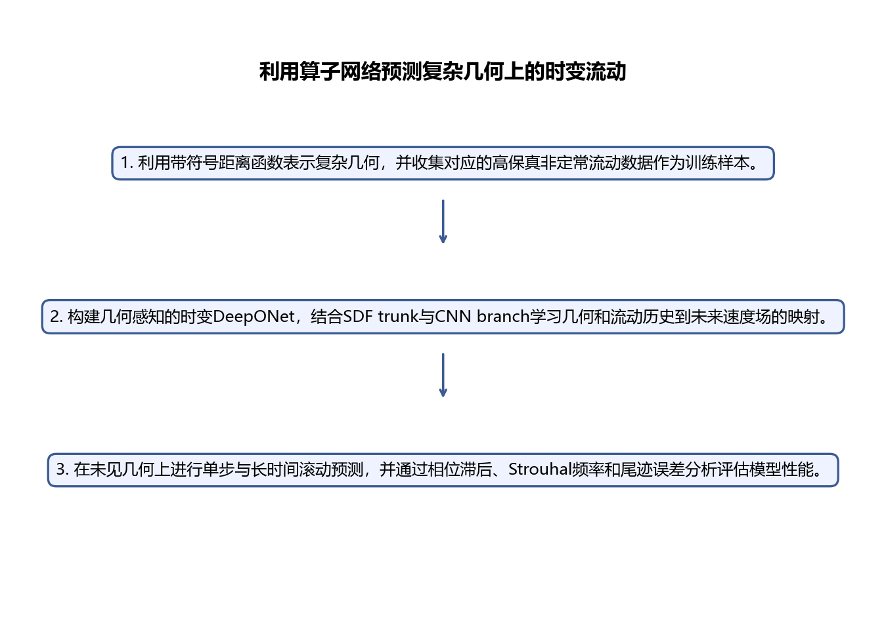

#### 本刊其余论文速览
#### 利用半范数论证改进混合问题的稳定性估计
- 英文标题: Refined stability estimates for mixed problems by exploiting semi norm arguments
- 期刊: Computer Methods in Applied Mechanics and Engineering
- 日期/期次: 2026-07-01 / Volume 456
- DOI: 10.1016/j.cma.2026.118928
- 分类: 数值分析与有限元理论, 混合问题稳定性分析
- 关注关键词: N/A
- 价值分: 35
- 链接: https://doi.org/10.1016/j.cma.2026.118928
- 一句话摘要: 该文通过在经典混合问题中引入数据泛函半范数，建立了更精细的稳定性估计，并解释了其与特定物理工况及一致性误差之间的联系。
- 核心内容: 本文研究经典混合问题的稳定性分析，并提出一种基于数据泛函半范数的精细估计框架。作者受到不可压Navier–Stokes方程中压力鲁棒离散化研究的启发，强调传统稳定性界中常被忽视的半范数结构具有重要意义。研究表明，这些半范数的核空间与应用中的某些物理工况密切相关，同时也对应于经典混合离散中广为人知的一致性误差来源。基于这一认识，论文得到了对接近这些特殊物理工况的解更为锐利的稳定性估计。

#### 基于表面速度测量的塑性应变局部化四维重建
- 英文标题: Four-dimensional reconstruction of plastic strain localization from surface-velocity measurements
- 期刊: Computer Methods in Applied Mechanics and Engineering
- 日期/期次: 2026-07-01 / Volume 456
- DOI: 10.1016/j.cma.2026.118932
- 分类: 多尺度塑性与位错动力学, 数据同化与逆问题重建
- 关注关键词: N/A
- 价值分: 35
- 链接: https://doi.org/10.1016/j.cma.2026.118932
- 一句话摘要: 该文提出一种基于集合变分数据同化的计算框架，可由高频表面速度测量重建金属材料内部塑性应变局部化及其位错动力学演化。
- 核心内容: 本文面向金属材料失效前的塑性应变局部化问题，提出了一种由表面观测反推内部位错动力学与局部化演化的四维重建方法。核心思路是将高频表面速度测量与集合变分数据同化相结合，从有限表面信息中反演时空演化的内部塑性状态。作者使用三维离散位错弹性动力学模拟生成的合成数据进行测试，结果表明该方法能够较高精度地重建塑性应变局部化。该研究为未来结合声发射、激光干涉等高时间分辨表面测量技术研究不可直接观测的位错活动提供了基础。

#### 用于Brinkman问题速度-压力形式并带压力混合边界条件的基于Nitsche方法和Grad-Div稳定化的有限元方法
- 英文标题: A Nitsche-based FEM with Grad-Div stabilization for the velocity-pressure formulation of the Brinkman problem with mixed boundary conditions on the pressure
- 期刊: Computer Methods in Applied Mechanics and Engineering
- 日期/期次: 2026-07-01 / Volume 456
- DOI: 10.1016/j.cma.2026.118923
- 分类: 多孔介质与混合流动问题, 有限元数值分析
- 关注关键词: N/A
- 价值分: 35
- 链接: https://doi.org/10.1016/j.cma.2026.118923
- 一句话摘要: 该文提出一种结合Nitsche弱施加边界与Grad-Div稳定化的Brinkman方程有限元格式，可稳健处理压力上的混合和非标准边界条件。
- 核心内容: 本文研究Brinkman方程速度-压力形式下的一种新有限元离散方法，重点解决压力变量上混合及非标准边界条件的弱施加问题。作者构造了一种一致且稳定的Nitsche型离散变分格式，并在Babuška-Brezzi理论框架下证明了离散问题的适定性。论文进一步给出了先验误差估计，且相关常数与黏度无关，体现了方法对参数变化的鲁棒性。数值实验验证了理论分析结果，并表明该格式在复杂边界条件处理上具有良好的稳定性和精度。

#### 基于反应-扩散方程的自适应等几何拓扑优化框架
- 英文标题: An adaptive isogeometric framework for topology optimization based on a reaction-diffusion equation
- 期刊: Computer Methods in Applied Mechanics and Engineering
- 日期/期次: 2026-07-01 / Volume 456
- DOI: 10.1016/j.cma.2026.118924
- 分类: 拓扑优化, 等几何分析与自适应数值方法
- 关注关键词: N/A
- 价值分: 35
- 链接: https://doi.org/10.1016/j.cma.2026.118924
- 一句话摘要: 该文提出一种结合CAD精确几何、自适应等几何分析与反应-扩散演化的拓扑优化框架，以更低计算代价获得平滑且可制造的结构拓扑。
- 核心内容: 本文提出了一种面向拓扑优化的自适应等几何框架，将反应-扩散驱动的材料演化与多补丁等几何分析统一起来。该方法在保持原生NURBS几何描述不变的前提下，利用GIFT映射和PHT样条对分析场进行局部层次h加密，实现几何与分析的解耦自适应 refinement。反应-扩散方程通过耦合反应项和扩散项，使材料场能够平滑演化，孔洞可自然生成、合并或消失，而无需显式拓扑操作或经验滤波。数值结果表明，该框架在二维和三维问题中均能显著减少自由度和计算量，同时保持设计质量和清晰的材料-空域边界。

#### 具有五参数可伸长法向矢的变厚度几何精确壳体
- 英文标题: A variable-thickness geometrically exact shell with five-parameter extensible director
- 期刊: Computer Methods in Applied Mechanics and Engineering
- 日期/期次: 2026-07-01 / Volume 456
- DOI: 10.1016/j.cma.2026.118952
- 分类: 几何精确连续体建模, 非线性壳体有限元
- 关注关键词: N/A
- 价值分: 35
- 链接: https://doi.org/10.1016/j.cma.2026.118952
- 一句话摘要: 该文提出一种7自由度几何精确壳单元，通过五参数可伸长法向矢统一描述厚度拉伸与大变形响应，并能直接嵌入三维超弹性本构。
- 核心内容: 本文提出了一种新的7自由度几何精确壳体公式，用五参数可伸长法向矢场描述厚度方向的拉伸与变形。与传统仅在中面定义法向的壳模型不同，该方法在整个壳体域内定义director，使其运动学更接近三维实体单元，同时保留几何精确壳理论中对转动处理的严格性。模型可直接引入完整三维超弹性本构关系，而不依赖平面应力等假设，因此特别适合复杂非线性材料分析。数值结果表明，完整公式在不可压或近不可压材料、强泊松效应以及大变形条件下表现出更优的精度、鲁棒性与收敛性。

#### 基于梯度损伤模型的热-机械疲劳断裂分析计算框架
- 英文标题: A computational framework with gradient damage model for thermo-mechanical fatigue fracture analysis
- 期刊: Computer Methods in Applied Mechanics and Engineering
- 日期/期次: 2026-07-01 / Volume 456
- DOI: 10.1016/j.cma.2026.118941
- 分类: 疲劳断裂与损伤力学, 等几何分析与自适应数值方法
- 关注关键词: N/A
- 价值分: 35
- 链接: https://doi.org/10.1016/j.cma.2026.118941
- 一句话摘要: 该文提出一种结合自适应多补丁等几何分析与梯度损伤模型的非局部计算框架，用于高效预测热-机械疲劳裂纹扩展路径与寿命。
- 核心内容: 本文提出了一种面向热-机械疲劳断裂的非局部计算框架，将自适应多补丁等几何分析与梯度损伤模型相结合。作者引入了新的疲劳退化函数和能量限制理论，以更准确地描述循环热-机械耦合载荷下的材料劣化过程。为处理复杂几何，方法采用Nitsche方法耦合多个几何补丁，同时通过截断层次NURBS实现局部自适应网格加密，并结合自适应循环跳跃策略显著提升计算效率。齿轮齿和缺口板等算例表明，该框架能够较准确预测裂纹路径和疲劳寿命，并将计算时间降低70%以上。

#### 利用监测数据进行可靠性更新
- 英文标题: Reliability updating using monitoring data
- 期刊: Computer Methods in Applied Mechanics and Engineering
- 日期/期次: 2026-07-01 / Volume 456
- DOI: 10.1016/j.cma.2026.118943
- 分类: 结构健康监测与可靠性分析, 贝叶斯不确定性量化
- 关注关键词: N/A
- 价值分: 35
- 链接: https://doi.org/10.1016/j.cma.2026.118943
- 一句话摘要: 该文提出一种基于分层贝叶斯建模的结构可靠性更新框架，以更合理地融合多源监测数据并评估结构安全性。
- 核心内容: 本文针对结构健康监测中多源数据融合下的可靠性更新问题，提出了一种基于分层贝叶斯建模的结构可靠性更新方法。与经典贝叶斯建模相比，该方法通过引入超参数层次结构，显式区分数据集内部不确定性与数据集之间的差异性，从而避免后验分布过窄和不确定性低估。作者还系统比较了渐近近似、变分推断和全采样三种后验推断策略在精度与计算效率上的差异。在线性和非线性多自由度动力系统算例中，该框架表现出更稳健的参数识别能力和更合理的可靠性评估结果。

### International Journal of Solids and Structures
- 本次论文数: 8
- 与关注方向相关: 1
- 含图论文数: 3
- 相比上次新增: 0

#### 本刊前沿要点
- 将载荷诱导边界转角缺陷与传统预存几何初始缺陷明确区分，为全连接晶格屈曲研究提供了新的失稳机制视角。
- 给出了带规定边界转角的非线性闭式载荷-挠度解，并结合考虑柱长缩短的半解析方法，兼顾理论可解释性与工程适用性。
- 揭示在某些典型构型下临界力可降至等效铰接柱的22%，表明边界耦合效应对机械超材料稳定性评估至关重要。
- 揭示了带环压扁中的新型弯曲-拉伸耦合机制，说明高斯曲率变化会直接驱动外缘拉伸和内缘压缩。
- 指出内缘周向屈曲与轴对称条件下的截面横向屈曲是同一几何约束问题下的两种关键失稳模式。
- 建立了解析预测、有限元仿真与实验验证相一致的完整框架，为环形带簧类结构的设计与失稳分析提供了基础。

#### 本刊重点论文
#### 带环的压扁行为
- 英文标题: Flattening of tape-rings
- 期刊: International Journal of Solids and Structures
- 日期/期次: 2026-06-01 / Volume 334
- DOI: 10.1016/j.ijsolstr.2026.113969
- 分类: 薄壁曲面与失稳分析, 非线性结构力学
- 关注关键词: N/A
- 价值分: 35
- 链接: https://doi.org/10.1016/j.ijsolstr.2026.113969
- 一句话摘要: 该文研究一种环形带簧结构在双板压扁过程中的弯曲-拉伸耦合与屈曲行为，并通过解析、有限元和实验进行验证。
- 核心内容: 本文研究了一类由环面帽形几何构成的新型带环（tape-ring）结构在两平板之间被压扁时的力学响应。作者指出，该问题不同于常规带簧弯曲，压扁过程中高斯曲率变化会引发显著的弯曲-拉伸耦合：外缘受拉、内缘受压。由此，结构会出现内缘周向屈曲；若强制轴对称，则会转化为截面横向屈曲。论文给出了压扁应变与压扁力的解析预测，并证明其与有限元结果及实体实验吻合良好。
- 图像摘要: 首图是结构与坐标定义的概览图。上方(a)给出了带环截面几何，标出截面圆弧半径r、整体环半径R、厚度h以及截面张角α，说明该结构本质上是一个具有曲率的环形薄带；左下(b)进一步定义了两组坐标系统，一组是沿环向和截面方向的角坐标θ-ψ，另一组是局部曲线坐标x-y-z，并用点P表示一般观测点，为后续解析建模提供几何参数化基础；右下(c)则展示了实际制备出的带环样品照片，说明研究对象并非理想几何构想，而是可制造、可实验验证的实体结构。根据图注，第二图应展示模具截面、压扁试验布置以及部分压扁后内缘较均匀周向起皱的现象；第三图则给出拉伸试验结果，用于标定材料杨氏模量。
- 模型/流程摘要: 整体流程是先建立带环的几何描述与局部坐标系统，随后分析其在双板压扁过程中的曲率变化和由此产生的弯曲-拉伸耦合效应；在此基础上推导外缘拉伸、内缘压缩条件下的压扁应变和压扁力解析解，并识别内缘周向屈曲或轴对称约束下的横向屈曲模式；最后通过有限元模拟和物理实验对解析预测进行验证。
- 与关注方向的关系: 这篇文章与关注方向的契合点主要在非线性结构力学、几何耦合效应和失稳分析方面。它不是PINN、代理模型或本构识别论文，但其对曲率驱动耦合与屈曲机理的解析建模思路，对研究薄壁结构、环形柔性构件和复杂几何失稳问题很有参考价值。
- 方法关键词: 带环压扁的解析力学建模, 有限元仿真结合物理实验验证
- 应用方向: 受压曲面薄带构件的屈曲与载荷预测, 环形带簧与可展开柔性结构设计
- 前沿要点: 揭示了带环压扁中的新型弯曲-拉伸耦合机制，说明高斯曲率变化会直接驱动外缘拉伸和内缘压缩。；指出内缘周向屈曲与轴对称条件下的截面横向屈曲是同一几何约束问题下的两种关键失稳模式。；建立了解析预测、有限元仿真与实验验证相一致的完整框架，为环形带簧类结构的设计与失稳分析提供了基础。
- 图像要点: 图1清楚说明带环同时具有整体环向曲率和局部截面曲率，因此其压扁问题天然包含高斯曲率变化，而非简单的一维弯曲。；图中的坐标定义与实物样品并列展示，强调论文既关注严格几何建模，也关注后续解析推导与实验实现之间的一致性。
- 研究流程: 建立带环的截面几何、整体环形几何及相应局部坐标系，明确结构参数与曲率描述。 -> 分析双板压扁过程中高斯曲率变化引起的弯曲-拉伸耦合，推导压扁应变、压扁力及屈曲模式。 -> 通过有限元仿真与实体压扁实验、材料拉伸试验对理论结果进行校核和验证。
- 论文图像:
图像角色: 摘要/概览图
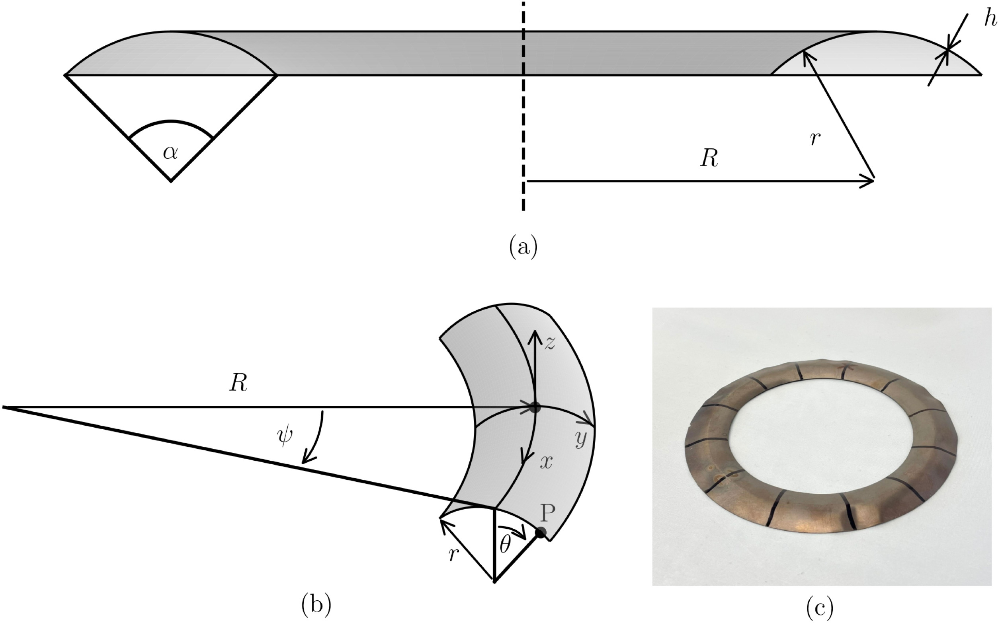
_图注: Fig. 1 (a) Tape-ring section elevation with geometry labelled; (b) two alternative coordinate systems: θ − ψ angular coordinates, and x − y curvilinear coordinates, where P denotes a point of interest; (c) perspective view of manufactured tape-ring specimen, with radial lines drawn to highlight the curvature._
_选图理由: 图注偏方法或结构示意；首图也常承载总体方法示意；为满足展示顺序补足“摘要/概览图”_
图像角色: 模型/方法图
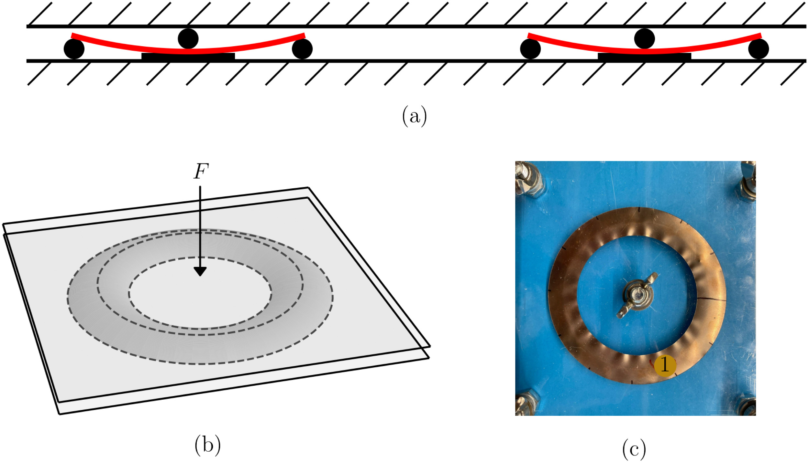
_图注: Fig. 2 (a) Schematic cross-section of tape-ring mould, with CuBe sheet in red (not to scale); (b) illustration of flattening arrangement; (c) tape-ring partially flattened, showing fairly uniform buckling around the inner edge._
_选图理由: 图注偏方法或结构示意；第二图优先视作模型或方法图_
图像角色: 结果/实验图
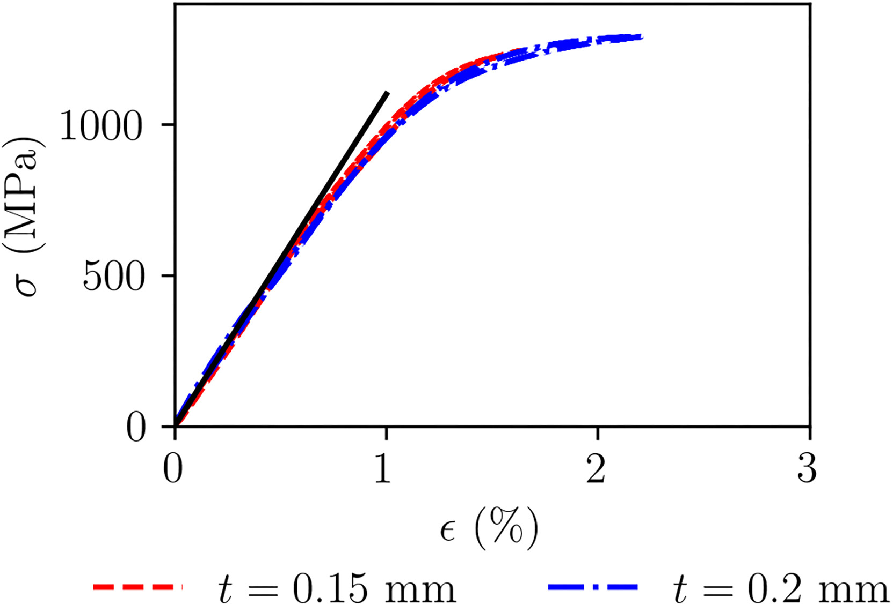
_图注: Fig. 22 Tensile test results. The fitted black line corresponds to a Young’s Modulus of 110 GPa ._
_选图理由: 图注含 results/experiment/validation 强信号；后续图优先视作结果或实验图_
- 自动生成流程图:
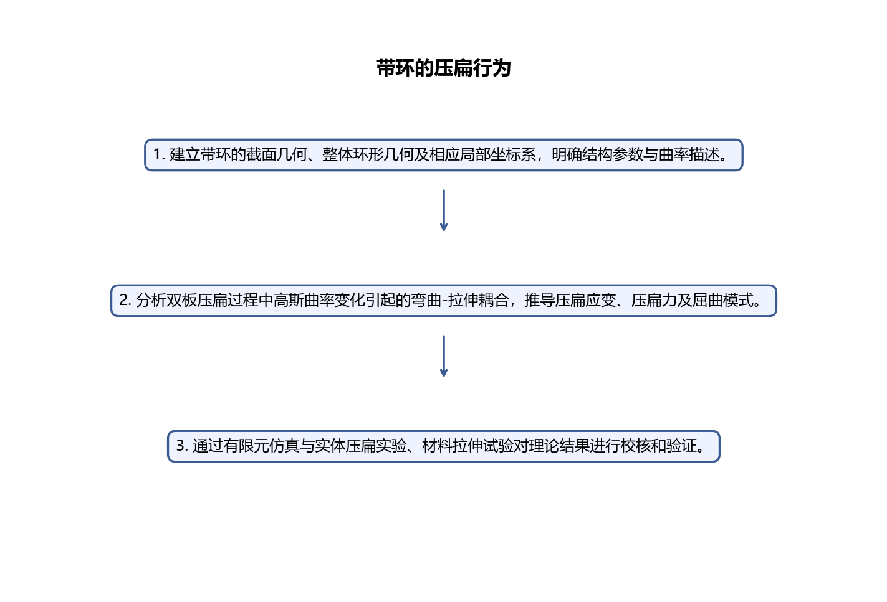

#### 用于准静态裂纹扩展相场模拟的路径跟踪方法
- 英文标题: Path-following methods for phase-field simulation of quasi-static crack propagation
- 期刊: International Journal of Solids and Structures
- 日期/期次: 2026-06-01 / Volume 334
- DOI: 10.1016/j.ijsolstr.2026.113974
- 分类: 相场断裂, 非线性路径跟踪与失稳分析
- 关注关键词: N/A
- 价值分: 35
- 链接: https://doi.org/10.1016/j.ijsolstr.2026.113974
- 一句话摘要: 该文系统研究相场断裂中的路径跟踪策略，以在裂纹突跳和回跳阶段保持准静态平衡并准确追踪平衡路径与耗散能。
- 核心内容: 本文针对相场断裂模拟中传统增量加载容易引发不稳定裂纹扩展、破坏准静态假设的问题，研究并比较了多种路径跟踪方法。作者重点关注可与交替迭代求解器方便耦合的分区式位移控制策略，并提出一种新的路径跟踪方法，其特点是限制裂纹区外的最大应变增量。论文进一步借助向尖锐裂纹模型的Γ收敛观点，在多个复杂度递增的断裂问题上评估这些方法。结果表明，所提方法能够更稳健地追踪平衡路径、保持力平衡，并更准确地估计回跳失稳过程中的耗散能。
- 图像摘要: 首图是问题设定的概览图，展示一个含内部裂纹Γ的不规则二维体Ω，在上边界施加随时间变化的力边界条件T=λ(t)T̄(x)，下部边界受约束支承。图中裂纹位于体内，载荷通过比例因子λ(t)逐步放大，说明该文研究的是力控制条件下裂纹扩展时如何通过路径跟踪调节外载，使系统始终停留在传播阈值附近。结合图注，第二图应展示含次生裂纹CT试样在不同网格尺寸下的平衡路径，用于评估路径跟踪方法的网格鲁棒性；第三图则将SENT试样的相场结果与LEFM尖锐裂纹平衡路径对比，并标出裂纹跳跃区间，从而验证不同路径跟踪约束对捕捉回跳和不稳定扩展的能力。
- 模型/流程摘要: 整体流程是先在变分相场断裂框架中，将外部载荷写成由时间相关比例因子控制的力边界条件；随后把路径跟踪控制方程与位移场、损伤场求解相结合，或以分区方式与交替迭代求解器解耦，从而在每一步自动调整载荷水平；最后通过平衡路径、裂纹跳跃、能量耗散和与尖锐裂纹模型的一致性，对多种路径跟踪方法进行比较，并验证新提出的应变增量限制策略。
- 与关注方向的关系: 这篇文章与关注方向高度相关，因为它直接属于 damage mechanics 与 phase-field fracture 数值方法领域。虽然不是PINN或代理模型论文，但它聚焦裂纹扩展路径控制、失稳段平衡追踪和耗散能计算，这对高保真断裂模拟、异质材料抗裂设计和后续物理约束学习方法都很有参考价值。
- 方法关键词: 准静态裂纹扩展的路径跟踪方法, 变分相场断裂模型
- 应用方向: SENT和CT等试样中的不稳定裂纹扩展与回跳模拟, 异质材料抗断裂设计中的平衡路径与耗散能评估
- 前沿要点: 将路径跟踪系统性引入相场准静态断裂模拟，专门解决传统增量加载在裂纹突跳和回跳阶段失稳的问题。；提出一种限制裂纹区外最大应变增量的新型路径跟踪策略，在保证实现简单的同时更稳健地保持准静态假设。；通过与尖锐裂纹模型的Γ收敛关联评估不同方法，使路径跟踪不只是数值技巧，而与物理一致性和耗散能可解释性直接挂钩。
- 图像要点: 图1清楚表明本文研究对象是力控制下的裂纹扩展问题，外载不是简单预设递增，而是需要通过λ(t)动态调节以维持准静态平衡。；该图还强调裂纹Γ位于体内，因此路径跟踪不仅影响整体载荷响应，也直接关系到内部裂纹何时起裂、扩展和发生突跳。
- 研究流程: 建立含内部裂纹的准静态相场断裂问题，并用比例因子λ(t)控制外部力边界条件。 -> 引入路径跟踪约束，在每个加载步中自动调整外载，使系统保持在裂纹传播临界路径附近并满足平衡。 -> 在SENT、CT等算例上比较不同路径跟踪方法对平衡路径、裂纹突跳和耗散能估计的表现。
- 论文图像:
图像角色: 摘要/概览图
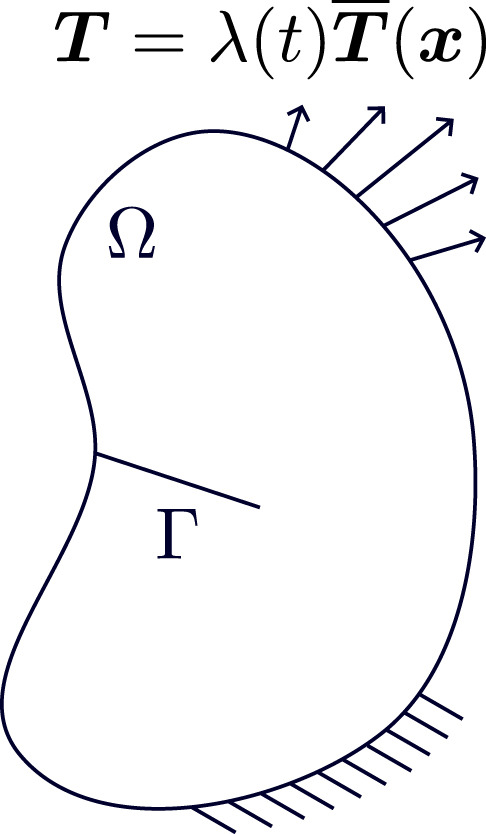
_图注: Fig. 1 Illustration of a crack propagation problem with prescribed force load._
_选图理由: 图注含 results/experiment/validation 强信号；图注偏结果或响应展示；为满足展示顺序补足“摘要/概览图”_
图像角色: 模型/方法图
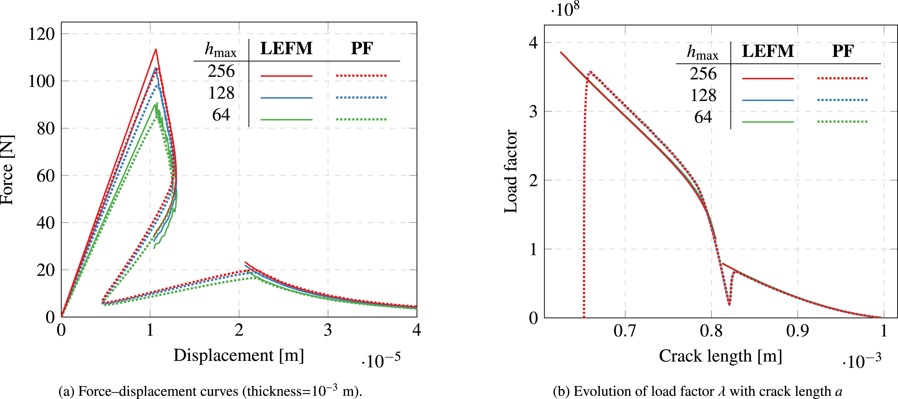
_图注: Fig. 10 Equilibrium paths of the CT specimen with a secondary crack obtained with the phase-field fracture model for varying bulk mesh sizes h max ( CMSIOC path-following method)._
_选图理由: 图注含 framework/workflow/model 强信号；图注偏方法或结构示意；第二图优先视作模型或方法图_
图像角色: 结果/实验图
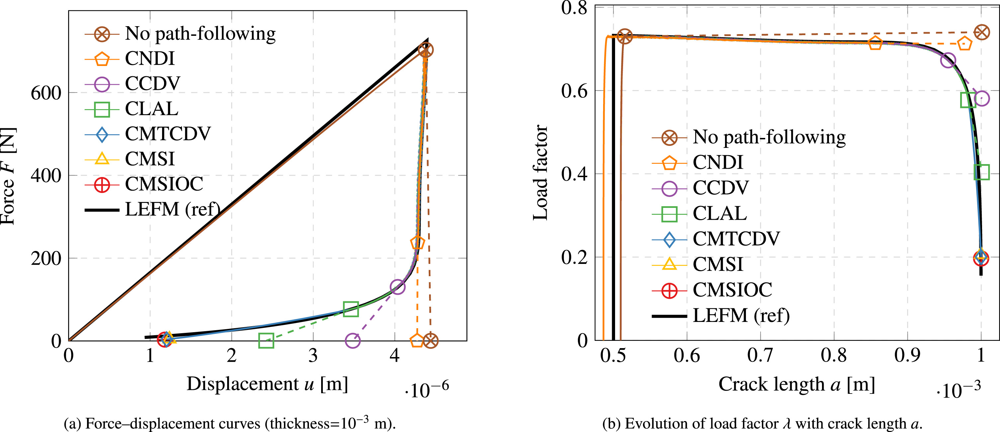
_图注: Fig. 5 Equilibrium path of the SENT specimen determined with the sharp crack model (LEFM) and the phase-field model with different path-following constraint. The dashed parts of the curves corresponds to a crack jump and the extremities of the jump are highlighted with markers (for CMTCDV , CMSI , and CMSIOC , the marker denotes the end of the simulation)._
_选图理由: 图注含 results/experiment/validation 强信号；图注偏结果或响应展示；后续图优先视作结果或实验图_
- 自动生成流程图:
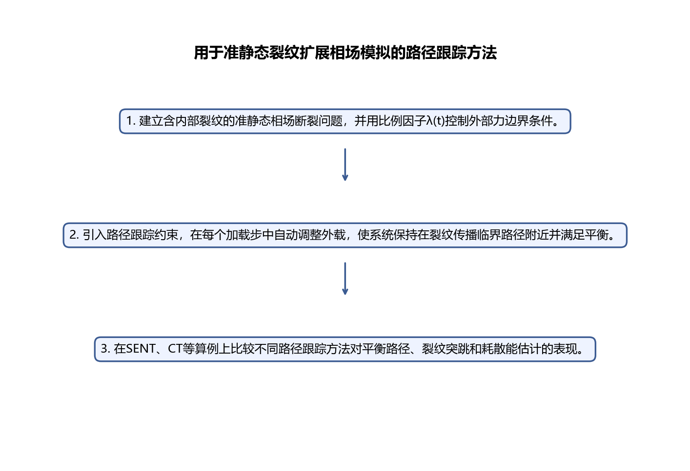

#### 基于逆微分求积的壳体强统一形式用于复合壳结构三维应力分析
- 英文标题: Inverse differential quadrature based shell strong unified formulation for 3D stress analysis of composite shell structures
- 期刊: International Journal of Solids and Structures
- 日期/期次: 2026-06-01 / Volume 334
- DOI: 10.1016/j.ijsolstr.2026.113882
- 分类: Composite Structures, 复合材料壳体分析, 高阶结构数值方法
- 关注关键词: N/A
- 价值分: 45
- 链接: https://doi.org/10.1016/j.ijsolstr.2026.113882
- 一句话摘要: 该文提出SSUF-iDQM强形式框架，以极低自由度实现复合与夹层壳结构高精度三维应力恢复分析。
- 核心内容: 本文针对复合壳结构中厚径比、铺层构型和弯曲主导效应导致的复杂三维应力问题，提出了一种新的强形式分析框架SSUF-iDQM。该方法将可变阶运动学的壳体强统一形式（SSUF）与逆微分求积法（iDQM）结合，避免了高阶系统中直接微分带来的误差累积。作者还构建了一个简洁而稳健的三维应力恢复策略，用于准确重建厚度方向层间横向应力及其应力反转行为。结果表明，该框架可适用于球壳、圆柱壳、平板以及软芯夹层壳等多类结构，在远低于三维有限元自由度的前提下仍保持极高精度。
- 图像摘要: 本题未提供附图，因此无法依据图像总结具体壳体几何、厚度方向应力分布或与三维有限元的对比曲线。仅从摘要判断，论文最关键的视觉内容应包括：SSUF-iDQM框架流程图、球壳/圆柱壳/平板与夹层壳的几何与铺层示意、厚度方向三维应力恢复结果，以及与三维有限元在位移、应变和层间横向应力上的对比图。这类图通常用于突出该方法在低自由度下仍可准确重建复杂厚度向应力行为的优势。
- 模型/流程摘要: 整体流程是先基于壳体强统一形式建立可变阶运动学模型，以适配从薄壳到厚壳的不同几何与力学行为；再采用逆微分求积法离散控制方程，避免直接高阶求导带来的数值误差；随后通过三维应力恢复技术，从壳体主变量重建厚度方向层间横向应力；最后在多类复合和夹层壳体算例中与三维有限元结果比较，验证精度和效率。
- 与关注方向的关系: 这篇文章与关注方向相关性较强，因为它聚焦复合壳结构中的高阶力学建模和三维应力恢复问题。虽然不是PINN、代理模型或损伤本构论文，但其在低维壳理论中重建三维应力场的思路，对复合材料结构分析、多尺度厚度向响应建模以及高效高保真数值方法都有参考价值。
- 方法关键词: Inverse Differential Quadrature Method（iDQM）与三维应力恢复, Shell Strong Unified Formulation（SSUF）
- 应用方向: 球壳、圆柱壳和平板复合壳结构的三维应力分析, 软芯夹层壳和厚复合壳中的层间横向应力重建
- 前沿要点: 将可变阶运动学壳体强统一形式与逆微分求积法结合，形成了适用于高阶壳理论的强形式高精度分析框架。；通过避免直接高阶微分，显著降低了高阶系统中的数值误差，使复杂复合壳三维应力分析更稳健可靠。；提出高精度三维应力恢复策略后，该方法不再局限于传统薄壳假设，可跨越薄壳到厚壳范围处理复合和夹层结构。
- 图像要点: 关键结果应突出该方法在极低自由度下即可逼近三维有限元精度，说明其在高效壳体三维应力分析中具有明显优势。；另一类关键图应展示厚度方向层间横向应力及其弯曲主导下的应力反转现象，从而证明应力恢复方案不仅准确，而且能捕捉复杂厚度向行为。
- 研究流程: 建立基于可变阶运动学的壳体强统一形式模型，描述复合壳和夹层壳从薄到厚的结构响应。 -> 采用逆微分求积法对强形式方程离散，减少高阶导数计算误差并提高位移、应变和应力预测精度。 -> 通过三维应力恢复方案重建厚度方向层间横向应力，并在球壳、圆柱壳、平板和夹层壳中验证方法性能。
- 自动生成流程图:
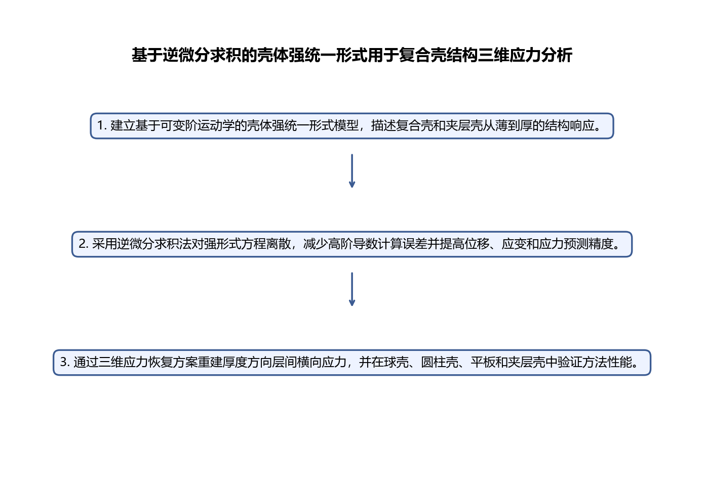

#### 薄膜深压入模型：理论、实验与应用
- 英文标题: Deep indentation model of thin film: Theory, experiment and application
- 期刊: International Journal of Solids and Structures
- 日期/期次: 2026-06-01 / Volume 334
- DOI: 10.1016/j.ijsolstr.2026.113972
- 分类: 薄膜与生物软材料力学表征, 非线性接触与压入分析
- 关注关键词: N/A
- 价值分: 35
- 链接: https://doi.org/10.1016/j.ijsolstr.2026.113972
- 一句话摘要: 该文提出一种适用于薄膜大压入深度的AFM力学表征模型，通过考虑有限厚度与法向几何非线性显著提高薄膜刚度测量的稳健性。
- 核心内容: 本文针对传统AFM浅压入法在薄膜杨氏模量测量中受表面粗糙度、表面张力和接触点误判等因素影响较大的问题，提出了一种深压入模型。该模型通过引入有限薄膜厚度效应和法向几何非线性修正，使压入深度可扩展到薄膜厚度的50%，远超传统10%的限制。作者通过PDMS薄膜实验和有限元模拟验证了模型在力-深度关系以及应力应变分布上的准确性。进一步应用于4T1乳腺癌细胞纳米力学表征时，该方法将刚度不确定性降低了十倍以上。
- 图像摘要: 本题未提供附图，因此无法依据图像总结具体AFM压头-薄膜接触几何、力-深度曲线或细胞刚度分布。仅从摘要判断，论文最关键的可视化内容应包括：深压入薄膜模型的几何示意、考虑有限厚度与法向几何非线性后的理论曲线与实验/有限元结果对比、薄膜内部应力应变分布云图，以及4T1细胞力学成像中深压入法与传统浅压入法的不确定性对比图。这类图通常用于说明深压入模型如何在更大压入深度下保持力学反演精度。
- 模型/流程摘要: 整体流程是先针对AFM薄膜压入问题建立包含有限厚度效应和法向几何非线性修正的深压入理论模型；随后通过PDMS薄膜实验和有限元模拟对模型进行验证，比较力-深度关系以及内部应力应变分布；最后将该模型应用于细胞纳米力学表征，评估其在减弱接触点误判和表面粗糙度伪影方面的优势，并据此反演更可靠的薄膜或细胞刚度。
- 与关注方向的关系: 这篇文章与关注方向相关，因为它涉及软材料/薄膜力学表征、非线性接触分析和实验-理论-数值结合。虽然不是PINN、代理模型或传统本构建模论文，但它对如何更稳健地从压入实验中反演材料刚度提供了很有价值的方法学参考。
- 方法关键词: 实验验证结合有限元模拟, 考虑有限厚度与几何非线性的AFM深压入理论模型
- 应用方向: 4T1细胞等生物样品的纳米力学成像与刚度反演, PDMS等超薄软材料的杨氏模量测量
- 前沿要点: 将有限厚度效应与法向几何非线性系统纳入AFM压入分析，突破了传统浅压入模型的适用深度限制。；通过理论、实验和有限元三者闭环验证，使深压入薄膜力学表征具有更强的可用性和可信度。；把该方法扩展到细胞纳米力学测量中，显示其不仅适用于工程薄膜，也适用于生物软材料和超薄体系的机械表征。
- 图像要点: 关键结果应突出该模型将可靠压入深度从传统薄膜厚度的10%扩展到50%，显著放宽了AFM测量的实验约束。；另一类关键图应展示深压入模型在细胞或薄膜刚度测量中显著降低不确定性，并有效抑制接触点误判与表面粗糙度带来的伪影。
- 研究流程: 建立考虑薄膜有限厚度和法向几何非线性的AFM深压入理论模型。 -> 通过PDMS薄膜实验与有限元模拟验证模型在力-深度关系和应力应变分布上的准确性。 -> 将模型应用于4T1细胞纳米力学表征，比较其与传统浅压入方法在刚度反演不确定性上的差异。
- 自动生成流程图:
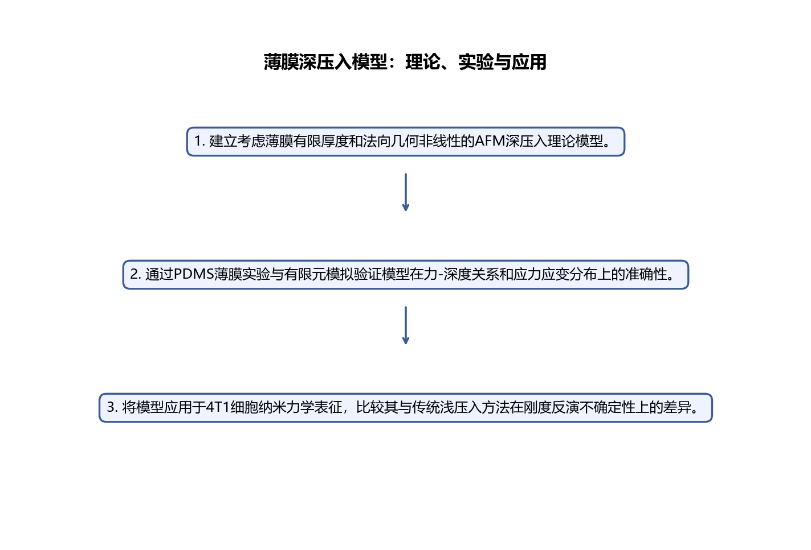

#### 本刊其余论文速览
#### 一种用于建筑应用的新型空间填充多面体单元研究
- 英文标题: Investigation of a novel space-filling polyhedral unit for construction applications
- 期刊: International Journal of Solids and Structures
- 日期/期次: 2026-06-01 / Volume 334
- DOI: 10.1016/j.ijsolstr.2026.113949
- 分类: 空间填充单元与桁架设计, 结构几何与机械超材料
- 关注关键词: N/A
- 价值分: 35
- 链接: https://doi.org/10.1016/j.ijsolstr.2026.113949
- 一句话摘要: 该文提出一种新型空间填充八面体及其衍生桁架/超结构，并通过实验与计算评估其力学强度、稳定性和工程应用潜力。
- 核心内容: 本文研究了一种可用于建筑与结构设计的新型空间填充多面体单元，其核心是一个独特的空间填充八面体。基于这一单元，作者进一步构造出一种24面、类似金刚烷笼状的空间填充实体，以及可形成类金刚石超结构的组装体系。由于该几何体具有较高对称性，堆叠后能够实现更均匀的空间力传递，因此适合用于承受复杂载荷或局部损伤的结构。论文结合3D打印实验、测试台测量与计算分析，对其强度、稳定性、材料杨氏模量和结构位移响应进行了系统评估。

#### 压入变形下三维马蹄形微结构晶格的冲击动力学
- 英文标题: Impact dynamics of three-dimensional horseshoe microstructure lattice under indentation deformation
- 期刊: International Journal of Solids and Structures
- 日期/期次: 2026-06-01 / Volume 334
- DOI: 10.1016/j.ijsolstr.2026.113965
- 分类: 冲击动力学与吸能设计, 机械超材料与微结构晶格
- 关注关键词: N/A
- 价值分: 35
- 链接: https://doi.org/10.1016/j.ijsolstr.2026.113965
- 一句话摘要: 该文研究三维马蹄形微结构晶格在不同压头压入冲击下的动态响应与吸能机理，并建立理论模型预测其压入吸能能力。
- 核心内容: 本文针对三维马蹄形微结构晶格在实际冲击场景中可能遭遇的不同压头几何，研究了其压入变形主导下的动态响应与能量吸收行为。作者基于单根梁的变形模式建立理论模型，用于预测晶格在压入条件下的吸能能力。结果表明，冲击下晶格梁会发生显著断裂，且断裂应变与弧角正相关，说明较大曲率可提升柔顺性。研究还揭示，该晶格存在先压入后整体压缩的两阶段变形机制，不同压头几何和最大压入深度会显著改变梁的拉伸、压缩及整体吸能分配。

#### 二维六方压电准晶中任意形状平面裂纹的理论与数值分析
- 英文标题: Theoretical and numerical analysis of arbitrarily shaped planar cracks in 2D hexagonal piezoelectric quasicrystals
- 期刊: International Journal of Solids and Structures
- 日期/期次: 2026-06-01 / Volume 334
- DOI: 10.1016/j.ijsolstr.2026.113975
- 分类: 多场耦合断裂力学, 边界元与奇异积分方法
- 关注关键词: N/A
- 价值分: 35
- 链接: https://doi.org/10.1016/j.ijsolstr.2026.113975
- 一句话摘要: 该文建立了二维六方压电准晶任意形状平面裂纹的多场耦合断裂分析框架，并结合超奇异积分方程与扩展位移间断边界元实现数值预测。
- 核心内容: 本文针对二维六方压电准晶中任意形状平面裂纹问题，构建了一个同时包含电场、声子场和位相子场耦合效应的理论与数值分析框架。作者基于Fabrikant分析方法和超奇异积分方程方法，将常规边界积分方程转化为超奇异形式，从而系统分析裂纹尖端的渐近奇异性并推导相应奇异解。进一步地，论文给出了扩展应力强度因子的表达，并建立了其与能量释放率之间的关系。为支撑理论结果，作者发展了基于扩展位移间断法的边界元数值格式，结果表明该方法能够有效分析多场耦合条件下压电准晶中的任意形状裂纹行为。

### International Journal of Plasticity
- 本次论文数: 8
- 与关注方向相关: 5
- 含图论文数: 1
- 相比上次新增: 0

#### 本刊前沿要点
- 将水扩散、水解链断裂与黏塑性本构统一耦合，面向可降解玻璃态聚合物给出更完整的劣化-力学关联描述。
- 采用有效温度这一物理启发参数，把吸水和分子量衰减共同引起的玻璃化转变温度下降映射到力学性能变化中，兼顾简洁性与可解释性。
- 不仅能够预测均匀试样的降解阶段力学行为，还可分析多孔结构中由结构架构引起的空间非均匀降解效应。
- 把注意力网络、内部状态变量建模和自由能势学习统一到一个热力学约束框架中，提升了复杂历史路径下的泛化能力与可解释性。
- 实现了复合材料结构与微观单胞之间的并发多尺度耦合，并可直接嵌入ABAQUS开展工程结构分析。
- 在保持高精度的同时显著降低多尺度模拟的时间和内存开销，为非线性复合材料高效结构分析提供了新路径。

#### 本刊重点论文
#### 加速蠕变谱绘：一种高通量温度梯度与应力梯度方法及其在增材和轧制不锈钢中的应用
- 英文标题: Accelerated creep profiling: a high-throughput thermal- and stress-gradient approach applied to additive and wrought stainless steel
- 期刊: International Journal of Plasticity
- 日期/期次: 2026-06-01 / Volume 201
- DOI: 10.1016/j.ijplas.2026.104680
- 分类: 增材制造金属材料力学, 蠕变与黏塑性行为表征
- 关注关键词: N/A
- 价值分: 35
- 链接: https://doi.org/10.1016/j.ijplas.2026.104680
- 一句话摘要: 该文提出一种高通量温度-应力梯度蠕变测试方法，用于快速识别增材与轧制316L不锈钢在近室温条件下的对数蠕变机制差异。
- 核心内容: 本文研究了轧制态和增材制造316L奥氏体不锈钢在接近室温条件下的对数蠕变行为。作者提出了一种高通量蠕变表征方法，通过引入温度梯度来同时获取材料蠕变对应力和温度的依赖关系，并基于104组为期两周的蠕变实验进行了系统分析。结果表明，增材材料相较轧制材料具有更高的激活能和更低的激活体积，说明两者在低于屈服应力条件下的位错滑移蠕变机制存在显著差异。作者将这种差异归因于两类材料在位错胞结构和析出物分布等细观组织上的不同，并指出该高通量方法可为近环境温度高应力服役合金设计提供关键数据。
- 图像摘要: 本题未提供附图，因此无法依据图像总结具体试样布置、温度梯度场或蠕变曲线图。仅从摘要判断，论文最关键的可视化内容应包括：高通量温度梯度蠕变测试装置示意、不同温度和应力位置对应的蠕变响应分布图、增材与轧制316L在激活能和激活体积上的对比图，以及与位错胞结构和析出物分布相关的组织表征图。这类图通常用于说明高通量方法如何把宏观蠕变差异与微观组织机制联系起来。
- 模型/流程摘要: 整体流程是先采用高通量温度梯度方法在单次实验中引入温度和应力变化，以加速获取近室温蠕变的参数谱；随后通过大量两周尺度蠕变实验对增材和轧制316L不锈钢的对数蠕变行为进行比较；最后结合激活能、激活体积和微观组织特征，解释两类材料在低于屈服应力条件下位错滑移蠕变机制的差异。
- 与关注方向的关系: 这篇文章与关注方向相关，因为它涉及材料时间依赖变形机制、细观组织影响以及高效表征方法。虽然不是PINN、代理模型或传统连续体本构建模论文，但其通过高通量实验快速提取蠕变机理参数的思路，对后续蠕变本构标定、增材金属性能比较和数据驱动材料设计都很有参考价值。
- 方法关键词: 基于激活能和激活体积的低温蠕变机制分析, 高通量温度梯度与应力梯度蠕变测试方法
- 应用方向: 增材制造与轧制316L不锈钢近室温蠕变性能比较, 近环境温度高应力服役合金的快速设计与优化
- 前沿要点: 提出了适用于近室温高应力条件的高通量蠕变谱绘方法，大幅提升了低温蠕变机制识别效率。；揭示了增材制造与传统轧制316L在激活能和激活体积上的显著差异，为理解增材金属的时间依赖变形提供了新证据。；将宏观蠕变参数与位错胞结构、析出物分布等微观组织特征关联起来，强化了工艺-组织-蠕变性能之间的机制联系。
- 图像要点: 关键结果应突出高通量温度-应力梯度方法能够显著加快近室温蠕变机制识别，而不再依赖传统低效率单点测试。；另一类关键图应展示增材316L与轧制316L在激活能和激活体积上的系统差异，从而支持其位错滑移蠕变机制不同的结论。
- 研究流程: 构建高通量温度梯度与应力梯度蠕变实验方案，在近室温条件下快速采集材料蠕变响应数据。 -> 对增材制造和轧制316L不锈钢开展大量两周蠕变测试，并提取应力和温度依赖的蠕变特征参数。 -> 结合激活能、激活体积以及位错胞结构和析出物分布等组织信息，分析两类材料的低温蠕变机制差异。
- 自动生成流程图:
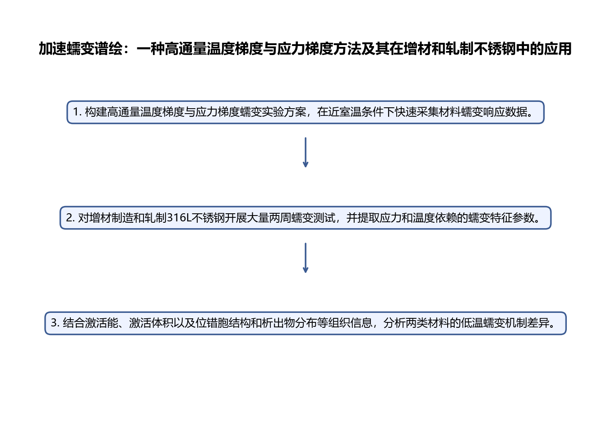

#### 冲击诱导相变压力范围内钛中与显微组织相关的变形与层裂演化
- 英文标题: Microstructure-dependent evolution of deformation and spallation in titanium across shock-induced phase transition pressures
- 期刊: International Journal of Plasticity
- 日期/期次: 2026-06-01 / Volume 201
- DOI: 10.1016/j.ijplas.2026.104676
- 分类: 冲击动力学与层裂断裂, 显微组织依赖塑性与相变
- 关注关键词: N/A
- 价值分: 35
- 链接: https://doi.org/10.1016/j.ijplas.2026.104676
- 一句话摘要: 该文研究显微组织与冲击诱导相变如何共同控制纯钛与近α钛合金在极端高速加载下的动态变形和层裂行为差异。
- 核心内容: 本文针对钛材料在冲击诱导相变压力范围内的层裂行为，比较了工业纯钛和近α钛合金在高应变率冲击下的动态响应。作者结合软回收平板撞击实验、自由表面测速和事后显微表征，分析了相变、位错、孪生和显微组织特征对层裂强度演化的耦合作用。结果表明，纯钛在α→ω相变前后表现出明显不同的强化机制：相变前主要由T1孪生和柱面<a>滑移引起应变硬化，相变后ω相形成进一步增强材料，但在更高应力下去孪生、动态再结晶和非晶化又会削弱层裂强度。相比之下，近α钛因合金元素稳定作用而不发生该相变，其层裂损伤萌生位置和演化路径更多受马氏体板条和先前β晶界控制。
- 图像摘要: 本题未提供附图，因此无法依据图像总结自由表面速度曲线、显微组织演化图或空洞萌生位置分布。仅从摘要判断，论文最关键的可视化内容应包括：纯钛与近α钛在不同冲击压力下的自由表面速度响应、层裂强度随峰值应力变化曲线、相变前后位错与孪晶活动的显微组织对比，以及空洞在晶界、孪晶界、相界和非晶区界面等处的萌生位置图。这类图通常用于揭示相变、塑性机制和损伤起始之间的联系。
- 模型/流程摘要: 整体流程是先通过软回收平板撞击实验在跨越冲击诱导相变压力的范围内对纯钛和近α钛施加高应变率加载；随后利用自由表面测速获得层裂强度等动态响应，并结合事后显微组织表征分析位错滑移、孪生、相变、去孪生、动态再结晶和非晶化等机制；最后把这些细观演化与不同材料的层裂强度变化和空洞萌生位置联系起来，从而解释显微组织依赖的层裂行为差异。
- 与关注方向的关系: 这篇文章与关注方向高度相关，因为它涉及显微组织-相变-损伤演化之间的多尺度联系，且核心问题正是极端条件下材料的动态变形与断裂机制。虽然不是PINN或代理模型论文，但对建立冲击损伤本构、理解相变强化与层裂失效耦合规律非常有参考价值。
- 方法关键词: 事后显微组织表征与几何相容性/Schmid因子分析, 软回收平板撞击实验结合自由表面测速
- 应用方向: 相变敏感金属材料的动态损伤机理研究与抗冲击设计, 纯钛和近α钛合金在极端冲击载荷下的层裂行为评估
- 前沿要点: 揭示了冲击诱导相变与显微组织并非独立作用，而是共同决定钛材料层裂强度和损伤演化路径。；系统区分了相变前孪生/滑移强化、相变后ω相强化以及更高应力下去孪生、动态再结晶和非晶化削弱之间的竞争关系。；通过几何相容性和Schmid因子分析，把细观取向与滑移传递机制直接连接到空洞萌生位置，为极端条件下损伤预测提供了更细致的组织尺度解释。
- 图像要点: 关键结果应突出纯钛和近α钛在层裂强度随冲击应力变化上的分化趋势，其中纯钛受α→ω相变影响更显著。；另一类关键图应展示空洞萌生位置随材料和相变状态而改变：纯钛主要在晶界、孪晶界及相界处萌生，而近α钛更多受马氏体板条和先前β晶界控制。
- 研究流程: 在跨越冲击诱导相变压力范围内，对纯钛和近α钛开展高应变率软回收平板撞击实验。 -> 通过自由表面测速提取层裂强度与动态响应，并用事后表征分析位错、孪生、相变和组织演化。 -> 结合显微组织特征、相变行为和损伤萌生位置，解释两类钛材料层裂机制与强度演化差异。
- 自动生成流程图:
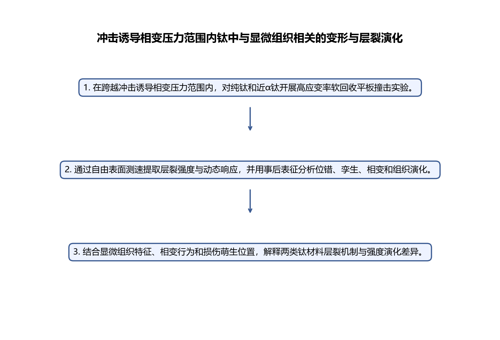

#### 分子动力学研究各向异性在辐照致脆中的作用
- 英文标题: Molecular dynamics study of the role of anisotropy in radiation-driven embrittlement
- 期刊: International Journal of Plasticity
- 日期/期次: 2026-06-01 / Volume 201
- DOI: 10.1016/j.ijplas.2026.104686
- 分类: 原子尺度塑性与各向异性, 辐照损伤与脆化断裂
- 关注关键词: N/A
- 价值分: 35
- 链接: https://doi.org/10.1016/j.ijplas.2026.104686
- 一句话摘要: 该文利用分子动力学揭示晶体取向如何通过调控位错-缺陷-裂纹过程区相互作用来放大辐照材料的脆化各向异性。
- 核心内容: 本文针对含辐照缺陷的Fe55Ni19Cr26合金晶体，研究了晶体学取向对断裂行为和力学各向异性的影响。作者通过分子动力学在三种高对称取向下模拟拉伸断裂过程，分析辐照缺陷如何改变局部变形机制，并推动延脆转变的各向异性演化。研究采用牵引-分离关系方法定量提取原子尺度断裂能，从而比较不同取向和缺陷条件下的断裂抗力。结果表明，辐照致脆并不能仅用缺陷累积解释，而是由取向敏感的位错活动、缺陷相互作用、应变局部化和裂纹过程区演化共同控制。
- 图像摘要: 本题未提供附图，因此无法依据图像总结具体裂纹扩展路径、原子构型演化或牵引-分离曲线。仅从摘要判断，论文最关键的可视化内容应包括：三种高对称晶向下含辐照缺陷晶体的裂纹扩展原子快照、不同取向的位错发射与应变局部化模式、延脆转变前后的断裂形貌变化，以及基于牵引-分离关系得到的原子尺度断裂能对比图。这类图通常用于展示晶体取向如何改变局部塑性、滑移系激活和裂纹过程区行为。
- 模型/流程摘要: 整体流程是先构建含辐照诱导缺陷的Fe-Ni-Cr合金原子模型，并选取三种典型高对称晶体学取向；随后在拉伸加载下开展分子动力学断裂模拟，追踪位错活动、缺陷相互作用、应变局部化和裂纹扩展；再利用牵引-分离分析定量提取不同取向下的原子尺度断裂能；最后比较不同晶向中延脆转变和断裂抗力的差异，解释辐照致脆的取向依赖机制。
- 与关注方向的关系: 这篇文章与关注方向高度相关，因为它涉及显微机制、断裂行为和各向异性塑性之间的多尺度联系。虽然不是PINN或代理模型论文，但它直接研究辐照缺陷如何通过细观机制改变材料脆化与断裂抗力，对建立辐照环境下材料损伤与断裂模型非常有参考价值。
- 方法关键词: 分子动力学断裂模拟, 基于牵引-分离关系的原子尺度断裂能分析
- 应用方向: 含辐照缺陷合金在极端服役环境下的断裂抗力评估, 核材料和辐照结构材料的各向异性脆化机理研究
- 前沿要点: 将辐照诱导缺陷演化与取向依赖断裂过程统一纳入原子尺度分析框架中，突破了仅从缺陷累积解释辐照脆化的传统视角。；通过牵引-分离分析定量提取含真实缺陷条件下的原子尺度断裂能，为辐照材料断裂抗力评价提供了更直接指标。；揭示了位错、缺陷与裂纹过程区之间的取向敏感耦合作用，是延脆转变各向异性增强的关键来源。
- 图像要点: 关键结果应突出不同晶体学取向下裂纹扩展模式和局部塑性机制明显不同，说明辐照缺陷会放大而非削弱材料的断裂各向异性。；另一类关键图应展示牵引-分离曲线或原子尺度断裂能对比，从而定量说明取向对辐照后断裂抗力的影响。
- 研究流程: 构建含辐照诱导缺陷的Fe55Ni19Cr26合金晶体原子模型，并设置不同高对称晶体学取向。 -> 在拉伸条件下进行分子动力学断裂模拟，分析位错活动、滑移系激活、应变局部化和裂纹传播行为。 -> 结合牵引-分离方法提取原子尺度断裂能，比较不同取向下的延脆转变和断裂抗力差异。
- 自动生成流程图:
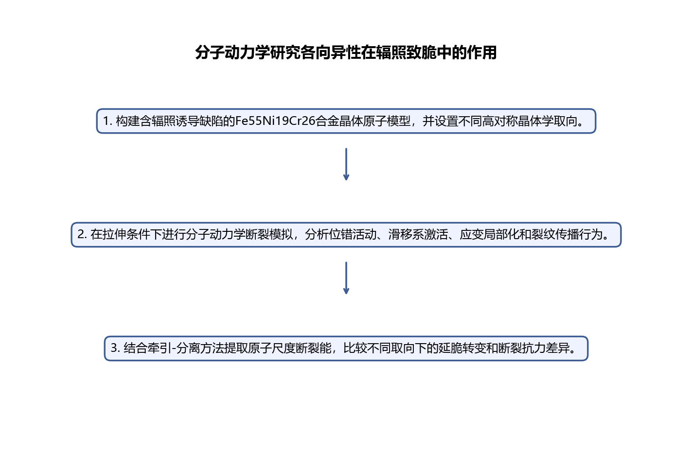

### Journal of the Mechanics and Physics of Solids
- 本次论文数: 29
- 与关注方向相关: 4
- 含图论文数: 10
- 相比上次新增: 0

#### 本刊前沿要点
- 将硅橡胶内部可移动相视为具有液晶样向列特征的组分，为软材料中机械诱导畴形成提供了新的微观物理解释。
- 把原位CT观测、示踪剂迁移证据与连续体本构模型结合起来，实现了从实验现象到相图预测的闭环分析。
- 模型能够预测拉伸与压缩下芯部和外层体积变化符号相反的反常分布，为理解软聚合物中的空间非均匀变形提供了新框架。
- 提出适用于任意曲梁周期网络的通用非线性力学框架，突破了以往模型对理想化几何的依赖。
- 系统捕捉从单梁到晶格层级的多尺度变形传递机制，为解释仿生网络材料的非线性顺应性和韧性提供了物理基础。
- 基于透明可解释的力学模型实现逆向设计，避免依赖大规模训练数据和黑箱神经网络，为超材料定制提供高效路径。

#### 本刊重点论文
#### 任意弹性失配下受压纤维增强双层体系起皱的尺度律揭示
- 英文标题: Unveiling scaling laws for wrinkling in compressed fiber-reinforced bilayers at any elastic mismatch
- 期刊: Journal of the Mechanics and Physics of Solids
- 日期/期次: 2026-06-01 / Volume 212
- DOI: 10.1016/j.jmps.2026.106564
- 分类: Multiscale Mechanics, 多尺度稳定性与分岔力学, 纤维增强复合材料建模
- 关注关键词: N/A
- 价值分: 45
- 链接: https://doi.org/10.1016/j.jmps.2026.106564
- 一句话摘要: 该文建立了纤维增强双层材料在任意弹性失配下受压起皱的统一理论，并给出了临界应变与临界波数的两类尺度律及其转变判据。
- 核心内容: 本文研究纤维增强双层体系在横向压缩下的起皱分岔问题，目标是在从高失配到中低失配的全范围内建立统一的尺度律。作者将上层薄膜建模为可轴向变形且具有弯曲刚度的弹性板，下层基底则采用有限弹性中的标准增强模型来描述纤维增强各向异性。通过对小应变与有限应变分岔起始进行渐近分析，论文得到了临界应变和临界波数的两组尺度律，分别对应薄膜主导区和基底主导区。研究还给出了两种机制之间的解析转变阈值，为生物组织和工程双层复合体中的起皱预测提供了统一判据。
- 图像摘要: 首图是整体物理模型的概览图。图(a)显示参考构型下的平面应变双层体系：上方为厚度h的薄膜，下方为远厚于薄膜的纤维增强基底，基底内嵌两组相对于X1方向呈±θ取向的纤维；图中还标出基底厚度H、初始长度L0以及h/H→0的薄层极限。图(b)展示受压后的起皱构型，体系沿X1方向压缩到λ1L0，表面出现周期性波纹，波长与当前纤维取向θ共同表征分岔后的几何响应，因此首图清楚传达了“各向异性纤维基底+薄膜受压起皱”的核心问题。根据图注，第二图应展示从高失配向中等失配过渡时色散关系中的对称性破缺现象；第三图则把三维标准增强模型结果与推导得到的尺度律进行对比，用于验证理论公式在不同纤维失配参数下的适用性。
- 模型/流程摘要: 整体流程是先建立由各向同性薄膜和纤维增强有限弹性基底组成的平面应变双层模型，并用两组对称纤维描述基底各向异性；随后对受压平衡态进行分岔分析，在小应变和有限应变两种情形下推导起皱临界条件；最后从渐近展开中提炼出临界应变和临界波数的两套尺度律，并用三维标准增强模型计算结果验证这些尺度律以及两种起皱机制之间的转变阈值。
- 与关注方向的关系: 这篇工作与关注方向的契合点主要在多尺度/多组分复合体系的稳定性与分岔建模。它不是PINN或代理模型论文，但属于典型的力学机理驱动理论研究，尤其适合参考其各向异性本构、分岔分析和尺度律推导思路，用于理解纤维复合体、软材料双层和类似失稳图样问题。
- 方法关键词: 有限弹性标准增强模型（SRM）, 起皱分岔的渐近分析与尺度律推导
- 应用方向: 工程双层复合结构表面形貌与失稳设计, 生物组织和纤维增强软材料中的受压起皱预测
- 前沿要点: 建立了覆盖任意弹性失配范围的统一起皱尺度律，而不再局限于传统各向同性双层中“大失配”近似。；揭示了纤维增强双层中存在薄膜主导和基底主导两种起皱机制，并给出了二者之间的解析转变判据。；指出当膜-基底失配降低时，色散关系会出现对称性破缺，这为理解各向异性复合体中的复杂分岔模式提供了新视角。
- 图像要点: 图1最重要的信息是：起皱问题中的材料各向异性来自基底中两组对称纤维，而不是单纯的各向同性薄膜-基底失配。；受压后不仅表面出现周期波纹，纤维有效取向也从参考状态θ演化到变形状态θ，说明各向异性会直接参与起皱分岔选择。
- 研究流程: 构建纤维增强双层体系的平面应变模型，上层薄膜具有弯曲刚度，下层基底采用标准增强模型并嵌入两组±θ纤维。 -> 在给定横向压缩下对基础状态进行分岔与渐近分析，分别处理小应变起皱和有限应变起皱情形。 -> 推导薄膜主导与基底主导两类尺度律及其转变阈值，并与三维模型结果进行系统比较验证。
- 论文图像:
图像角色: 摘要/概览图
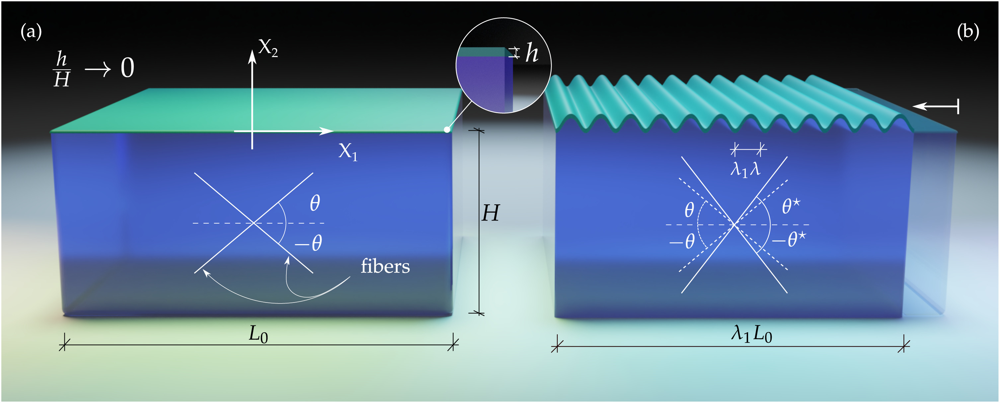
_图注: Fig. 1 Schematic of the plane strain bilayer model. Two fiber families are embedded within a neo-Hookean matrix, oriented at angles ± θ relative to the reference axis X 1 (a). The substrate has a depth significantly greater than the layer thickness ( h / H → 0) and a rest length L 0 . Under a contractile strain λ 1 (associated with the deformation ε L ), the bilayer uniformly deforms until wrinkling occurs (b), at a critical stretch λ 1 , c r = 1 − ε c r . During the homogeneous compression, the relative angle θ ⋆ changes, according to the relation θ ★ = 1 / 2 arccos ( ( F t 1 • F t 2 ) / ( | F t 1 | | F t 2 | ) ) ._
_选图理由: 图注偏概览或示意；首图优先视作摘要附近概览图_
图像角色: 模型/方法图
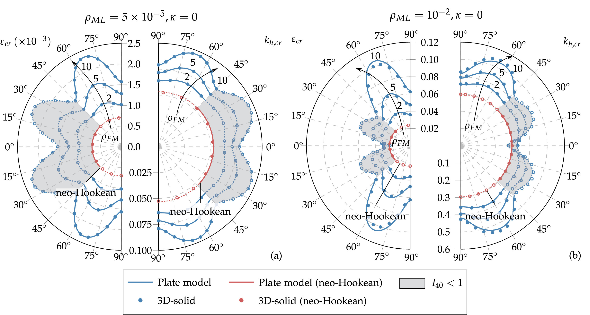
_图注: Fig. 2 Emerging symmetry breaking from very high-to-moderate elastic mismatches in bilayers formed by bilateral substrates (i.e., for which contracted fibers contribute to stiffen the resulting composite). When this is not the case, the gray region rules out compressed fibers according to inequality (13) . In these, and in the following figures, to make the trends and the simmetries more evident, a polar representation of the critical quantities has been adopted, in which a given angle θ corresponds to a bilayer with fiber families oriented along ± θ . Comparison between the critical strain obtained from the plate model (solid line) and the 3D-solid model (dots), both for SRM substrates, with respect to the fiber angle θ , and considering three values of ρ FM . In particular, the values of ρ FM are consistent with those used in Nguyen et al. (2020) . Two representative values of the matrix-layer elastic mismatch ρ ML are chosen to show the symmetry breaking in terms of critical strain and wavenumber as functions of the fiber’s orientation. For high layer-matrix mismatches, i.e., very low values of ρ ML , namely ρ M L = 5 × 10 − 5 in (a), the trend is symmetric with respect to θ = ± 45 ∘ . In contrast, even when compressed fibers contribute to the effective mechanical response of the substrate, such symmetry is broken when the stiffness of the matrix approaches that of the layer (b) (in this case ρ M L = 10 − 2 ). Both analyses are performed for highly polarized fibers, i.e., for κ = 0 . It is worth noting that both the critical strain and the wavenumber exhibit a peak around θ = 67 . 5 ∘ ._
_选图理由: 图注含 results/experiment/validation 强信号；图注偏结果或响应展示；为满足展示顺序补足“模型/方法图”_
图像角色: 结果/实验图
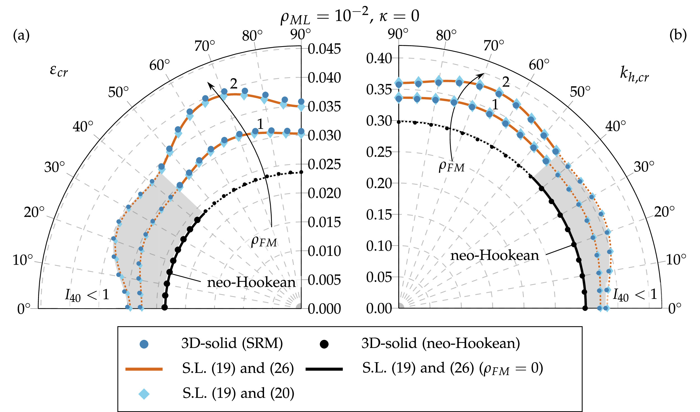
_图注: Fig. 6 Comparison between the 3D SRM model and the scaling laws (19), (20) (self-consistent) and (19), (26) (explicit). The assumed data for the bilayer are: ρ M L = 1 × 10 − 2 , κ = 0 , and values fiber mismatches, ρ FM , ranging from 0 to 2 are considered. It is worth noting that, in all the models considered here, a maximum of the critical strain and wavenumber is detected around θ = 67 . 5 ∘ . The relative error between the wavenumber predicted by the obtained scaling laws and the exact solution for the 3D model involving the SRM response for the substrate is displayed in Fig. H.1 in supplementary. There, the good agreement of the scaling laws with the exact solution is displayed. This occurs even for moderately-reinforced bilayers, as the maximum error is about 3 % when ρ F M = 2 ._
_选图理由: 图注含 results/experiment/validation 强信号；图注偏结果或响应展示；后续图优先视作结果或实验图_
- 自动生成流程图:
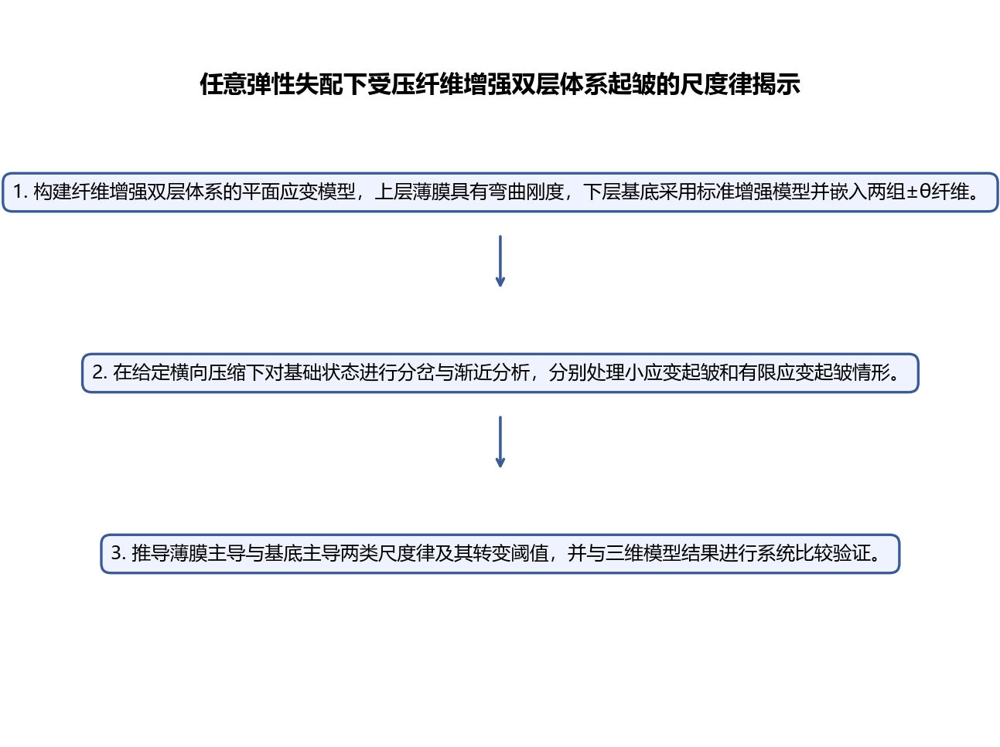

#### 零合力横向载荷作用下弹性杆的奇异力学行为
- 英文标题: The strange mechanics of an elastic rod under null-resultant transverse loads
- 期刊: Journal of the Mechanics and Physics of Solids
- 日期/期次: 2026-06-01 / Volume 212
- DOI: 10.1016/j.jmps.2026.106590
- 分类: Multiscale Mechanics, 细长体与弹性层力学, 非线性结构稳定性
- 关注关键词: N/A
- 价值分: 45
- 链接: https://doi.org/10.1016/j.jmps.2026.106590
- 一句话摘要: 该文揭示了在净横向合力为零时，作用于杆上下表面的相反分布载荷仍可像轴压一样诱发屈曲和后屈曲变形。
- 核心内容: 本文研究了一种反直觉的载荷情形：在弹性杆上下表面分别施加大小相等、方向相反的横向分布死载荷，使得单位长度上的横向合力为零。传统观点通常认为这种横向应力对整体结构响应影响不大，但作者通过弹性层渐近分析、三种不同杆模型以及数值和实验验证表明，它实际上会产生与轴向载荷等效的力学效应。特别是，当这种横向作用表现为压缩效应时，它会进入广义Euler弹性线方程并导致屈曲和显著的后屈曲演化。研究还指出，该失稳在杆厚趋于零时依然存在，因此对薄膜、弹性层及微纳器件都具有潜在影响。
- 图像摘要: 首图是问题设定的概览图。左侧展示一根两端简支的直杆，在右端同时受轴向压力P，并在上、下表面分别施加大小相等、方向相反的均匀分布载荷q2；虽然这两组横向载荷在整体上合力为零，但它们在杆截面上形成一对“挤压/拉张”作用。右侧给出变形后的杆，原本平直的构型在同样的载荷安排下发生整体弯曲和屈曲，图中红圈放大了局部截面受上下相对载荷挤压的情形，直观强调这种‘零合力横向载荷’并非无效载荷，而会像附加轴力一样改变杆的稳定性。根据图注，第二图应进一步给出带有截面高度h的广义弹性线模型；第三图则展示细长弹性层数值模拟与广义弹性线预测之间的对比，用来验证后屈曲路径的一致性。
- 模型/流程摘要: 整体流程是先从受上下相反横向分布死载的细长弹性层出发，分析这种零合力横向载荷对应的渐近响应；随后构建三类理论模型，包括由弹性层渐近得到的杆模型、基于Euler弹性线的广义模型以及离散模型均匀化得到的杆模型，并揭示横向载荷会与轴向载荷共同进入控制方程；最后通过数值模拟和专门设计的实验装置验证这种横向载荷诱发屈曲与后屈曲的理论预测。
- 与关注方向的关系: 这篇文章与关注方向的契合点在于非线性结构力学、失稳分岔和跨尺度理论建模。虽然它不是PINN、代理模型或经典损伤本构论文，但其揭示了一个此前被忽视的载荷-失稳机理，并结合理论、数值和实验给出统一解释，对细长结构、薄膜和复杂载荷作用下的稳定性研究很有参考价值。
- 方法关键词: 广义Euler弹性线模型, 弹性层渐近分析结合数值模拟与实验验证
- 应用方向: 微纳器件和细长柔性结构的稳定性分析, 薄膜和弹性层在横向分布载荷下的屈曲预测
- 前沿要点: 提出并证实了一种反直觉失稳机制：零合力横向载荷并非力学上可忽略，而会像轴向力一样进入广义弹性线并诱发屈曲。；通过弹性层渐近、广义Euler弹性线、离散均匀化模型、数值模拟和实验形成了完整的跨模型验证链条。；指出这种横向载荷诱导失稳在厚度趋零极限下仍不会消失，因此对薄膜、弹性层和微纳尺度结构具有特别重要的工程意义。
- 图像要点: 图1最关键的信息是：尽管上下表面的分布横向载荷在整体上相互抵消、净横向合力为零，但它们依然能显著改变杆的整体变形与稳定性。；右图的弯曲后构型和局部放大图共同说明，这种载荷本质上通过截面横向压缩/拉伸作用进入杆的等效力学，从而触发类似轴向屈曲的失稳。
- 研究流程: 建立上下表面受相反均匀横向死载的细长弹性层/弹性杆问题，并分析零横向合力条件下的实际应力状态。 -> 推导和比较三类理论模型，得到包含横向载荷贡献的广义Euler弹性线，并求出屈曲临界条件与后屈曲行为。 -> 通过细长弹性层数值模拟和专门实验装置验证横向载荷可像轴压一样诱发屈曲及非平凡后屈曲路径。
- 论文图像:
图像角色: 摘要/概览图
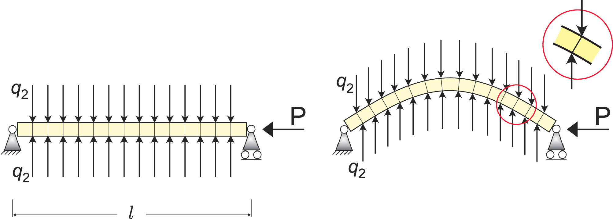
_图注: Fig. 1 In addition to a compressive axial force P , a doubly supported elastic rod is subjected to two uniformly distributed loads ± q 2 (illustrated with a negative sign) acting in opposite directions, one applied at the extrados and the other at the intrados of the rod. The loads q 2 are dead loads, meaning that their direction is fixed in the reference configuration (left) and their point of application moves with the deformation of the rod (right). The present article shows that the transverse loads ± q 2 strongly influence the deformation of the rod, which is still governed by the Euler elastica, but with q 2 effectively added to the axial force P . Consequently, even the sole application of the transverse load may induce the structure to buckle and develop full postcritical behavior, as the deformation causes the transverse dead load to act as a couple distribution (see inset)._
_选图理由: 首图优先视作摘要附近概览图_
图像角色: 模型/方法图
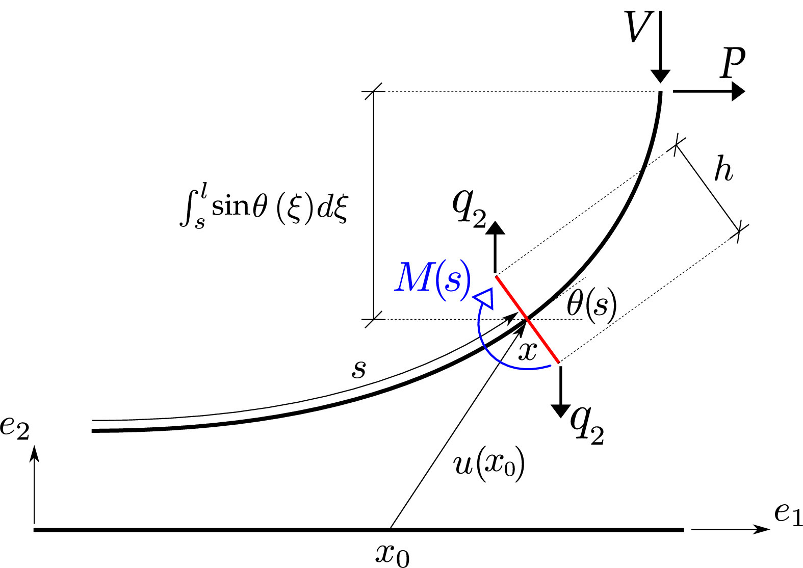
_图注: Fig. 3 A model of elastica with a transverse cross-section of height h , which defines the extrados and intrados, where the uniform dead loads q 2 (shown positive) are applied._
_选图理由: 图注偏方法或结构示意；第二图优先视作模型或方法图_
图像角色: 结果/实验图
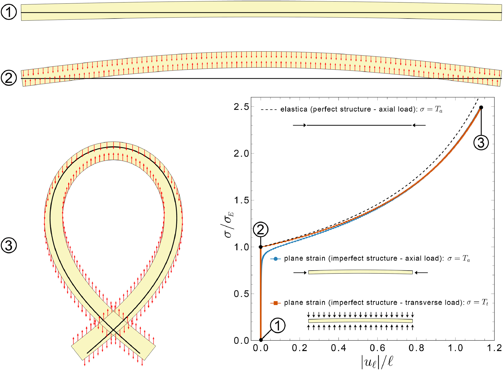
_图注: Fig. 5 A numerical simulation shows that a slender elastic layer subject to transverse dead forces behaves as predicted by the generalized elastica, eq. (1) . Upper part: The elastic layer in the unloaded configuration (sketched in yellow, point 1) used for the finite element model. The initial geometric imperfection, mimicking the first buckling mode, appears as a deviation from the black line representing the perfectly straight elastica. Central part: at the critical load of the perfect elastica (still straight), the imperfect elastic layer already exhibits a finite deflection (point 2); red arrows (not to scale) denote the applied self-equilibrated transverse load. Lower left: comparison between the deformed elastic layer and the perfect elastica at 2.5 times the critical buckling load (point 3) shows excellent agreement. Lower right: comparison between three curves, transverse loading (red curve) and axial loading (blue curve), both referring to the elastic layer and solved using the same initial imperfection, and the perfect elastica (black curve), computed without imperfection; stress σ (divided by the value at buckling) is plotted versus end displacement u ℓ (divided by the initial length of the layer) traced up to 2.5 times the critical load; slight deviations at higher loads arise from the different models employed (two-dimensional plane strain for the elastic layer versus one-dimensional beam formulation for the elastica); these differences diminish and eventually vanish as the slenderness of the rod increases._
_选图理由: 图注含 results/experiment/validation 强信号；图注偏结果或响应展示；后续图优先视作结果或实验图_
- 自动生成流程图:
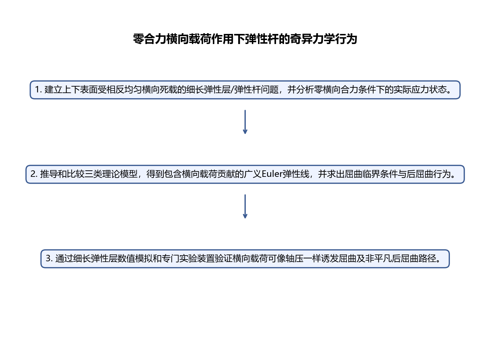

#### 基于全场变形测量的黏弹性材料参数机器学习提取
- 英文标题: Machine learning extraction of viscoelastic material properties from full-field deformation measurements
- 期刊: Journal of the Mechanics and Physics of Solids
- 日期/期次: 2026-06-01 / Volume 212
- DOI: 10.1016/j.jmps.2026.106589
- 分类: Machine Learning in Mechanics, 机器学习材料表征, 黏弹性本构反演
- 关注关键词: N/A
- 价值分: 45
- 链接: https://doi.org/10.1016/j.jmps.2026.106589
- 一句话摘要: 该文提出两种基于深度学习的框架，从全场变形数据中高效反演黏弹性材料性质，适用于已知与未知本构形式两类问题。
- 核心内容: 本文面向黏弹性材料表征这一传统上依赖迭代建模和高计算成本的问题，提出了两个深度学习框架，用于从全场变形测量中提取材料参数。对于本构关系已知的情形，Deep-VM-FE针对Kelvin-Voigt模型将应力分解为速率无关项和速率相关项，并由双通道网络分别学习；对于未知显式控制方程的情形，Deep-VM-FD直接从点式时空场数据学习应力演化。作者还引入梯度池化以增强空间邻域信息利用，使模型能够处理更一般的场数据问题。方法在解析数据库、有限元模拟以及气泡空穴实验数据上均表现出与真值高度一致的预测能力。
- 图像摘要: 首图直接对比了黏弹性建模中的正问题与逆问题。上半部分(a)表示正问题：给定本构关系（图中以Kelvin-Voigt型弹簧-阻尼元件示意，参数为μ和η）以及边界条件，从而得到应力场和变形场；下半部分(b)表示逆问题：以全场变形数据为输入，通过深度学习算法反推出应力场并进一步识别本构关系，因此图像清楚传达了本文的核心目标是“从位移/变形反演材料性质”。根据图注，第二图应进一步给出完整工作流：根据本构形式是否已知，在Deep-VM-FE与Deep-VM-FD之间选择合适算法，并由DIC等全场测量数据驱动；第三图则展示Deep-VM-FD在一维蠕变模型上的验证，包括有限元网格、反力衰减曲线和关键时刻的验证点，用于证明其时变场预测能力。
- 模型/流程摘要: 整体流程是先从DIC或仿真获得全场变形数据，再根据材料本构形式是否已知选择不同算法分支；若本构关系已知，则采用Deep-VM-FE，把总应力分解为速率无关和速率相关两部分并用双通道网络学习；若本构关系未知，则采用Deep-VM-FD，直接利用点式时变场数据学习应力演化，并通过梯度池化融合邻域空间信息；最后将预测结果用于黏弹性参数识别和材料表征，并在解析、数值和实验数据上验证。
- 与关注方向的关系: 这篇文章与关注方向高度契合，因为它直接面向 constitutive model 和 surrogate/inverse characterization 问题。虽然不是PINN，但它属于典型的物理启发型材料参数反演方法，尤其适合借鉴到黏弹性、黏塑性以及更一般复杂本构模型的全场识别与代理建模中。
- 方法关键词: Deep-VM-FD结合梯度池化的场数据驱动学习框架, Deep-VM-FE双通道黏弹性学习框架
- 应用方向: 基于DIC全场变形测量的黏弹性材料参数识别, 水凝胶、蠕变/松弛问题及气泡空穴实验中的材料表征
- 前沿要点: 提出了面向已知和未知本构形式的双分支学习框架，使黏弹性材料反演不再局限于单一模型假设。；通过将速率无关项与速率相关项解耦学习，以及在场数据框架中引入梯度池化，提升了模型对复杂时空黏弹性响应的表达能力。；实现了解析、有限元和实验全场数据的一体化利用，为基于DIC的高效材料参数识别提供了可推广的机器学习范式。
- 图像要点: 图1最核心的信息是把传统“本构+边界条件→变形”的正问题，转换为“变形+深度学习→应力/本构”的逆问题表征思路。；图中Kelvin-Voigt元件符号与应力、变形云图并列出现，强调本文并非只做位移预测，而是面向材料本构关系与黏弹性参数识别。
- 研究流程: 采集或生成全场变形数据，并判断待分析材料的本构关系是否已知。 -> 若本构形式已知则采用Deep-VM-FE进行双通道应力分解学习，若未知则采用Deep-VM-FD直接学习应力时空演化并结合梯度池化提取邻域信息。 -> 利用训练后的网络反演应力场和黏弹性参数，并通过解析解、有限元结果及实验观测进行验证。
- 论文图像:
图像角色: 摘要/概览图
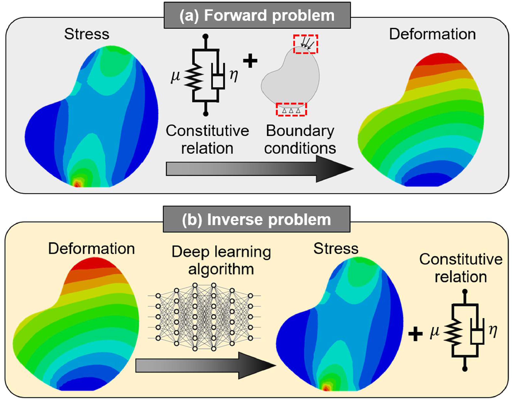
_图注: Fig. 1 Comparison of the (a) forward and (b) inverse problems in viscoelastic material modeling._
_选图理由: 图注含 results/experiment/validation 强信号；为满足展示顺序补足“摘要/概览图”_
图像角色: 模型/方法图
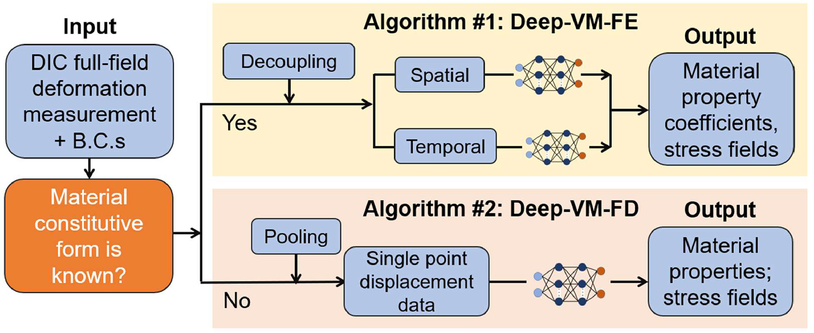
_图注: Fig. 2 Workflow of the proposed deep learning framework. Based on whether the material's constitutive form is known, the appropriate algorithm is selected from the input DIC deformation data. Deep-VM-FE is used for known model forms, while Deep-VM-FD is used for unknown models to determine material properties and stress fields._
_选图理由: 图注含 framework/workflow/model 强信号；图注偏方法或结构示意；第二图优先视作模型或方法图_
图像角色: 结果/实验图
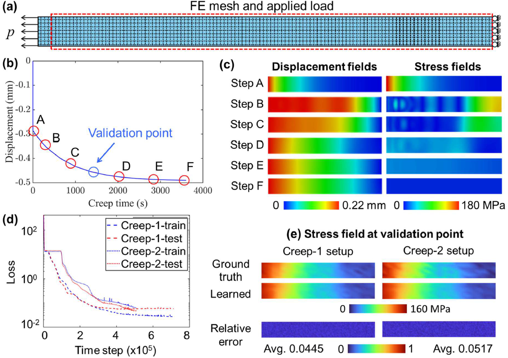
_图注: Fig. 5 Validation of the Deep-VM-FD algorithm for 1D creep model. (a) The finite element (FE) mesh and (b) the corresponding reaction force decay curve for the simulation. Points A-F are critical time steps, with the blue “Validation point” used for validation. (c) Snapshots of displacement and stress fields at the marked time steps. (d) Convergence plots for the Creep-1 and Creep-2 training strategies. (e) The resulting learned stress fields for both strategies show excellent agreement with the ground truth at the validation time step, with low average relative errors of 4.45% and 5.17%, respectively._
_选图理由: 图注含 results/experiment/validation 强信号；图注偏结果或响应展示；后续图优先视作结果或实验图_
- 自动生成流程图:
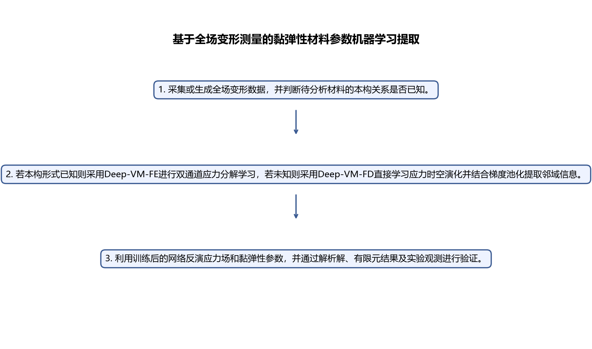

#### 粒子-连续体耦合模拟揭示玻璃态聚合物裂尖变形转变与断裂机制
- 英文标题: Crack-tip deformation transitions and fracture mechanisms in glassy polymers revealed by particle-continuum coupling simulations
- 期刊: Journal of the Mechanics and Physics of Solids
- 日期/期次: 2026-06-01 / Volume 212
- DOI: 10.1016/j.jmps.2026.106595
- 分类: 多尺度断裂力学, 聚合物本构与粒子-连续体耦合
- 关注关键词: N/A
- 价值分: 35
- 链接: https://doi.org/10.1016/j.jmps.2026.106595
- 一句话摘要: 该文通过FE-MD粒子-连续体耦合框架揭示了玻璃态聚合物裂尖从早期塑性、稳定颈缩到原纤维失稳的三阶段变形与断裂机制。
- 核心内容: 本文采用将分子动力学区域嵌入有限元区域的粒子-连续体耦合方法，研究玻璃态聚合物在裂尖附近的多尺度变形与断裂行为。该方法既保留了裂尖强非均匀区的分子分辨率，又能描述周围大尺度连续体约束，是单独MD或单独连续体模型难以覆盖的区域。研究发现，在不同温度、链长、断键准则和几何约束下，裂尖变形都可归纳为三个稳定阶段：早期塑性、稳定颈缩和原纤维失稳。各阶段分别对应局部原子膨胀与非仿射重排、缠结链段承载导致的稳定颈缩，以及高度局域化的链解缠诱发的原纤维破坏。
- 图像摘要: 首图是完整方法概览图。左上(a)给出分子动力学体系，一个立方体粒子域用于生成玻璃态聚合物的细观响应；右上(b)把这些MD数据抽象为连续体本构模型，图中用弹簧-阻尼元件组合表示具有黏弹/历史效应的本构关系；下方(c)则展示断裂模拟中的FE-MD耦合结构，在有限元网格中嵌入中央分子域，并在中部预裂区域附近实现裂尖高分辨率模拟，左右箭头表示拉伸加载。结合图注，第二图应对比纯MD与本构模型在不同温度和应变率下的应力-应变曲线，用于验证本构拟合质量；第三图则进一步给出实际断裂用的FE-MD耦合几何与预裂设置，说明该框架如何把本构标定与裂纹扩展分析连接起来。
- 模型/流程摘要: 整体流程是先在独立MD体系中获取玻璃态聚合物在不同加载条件下的细观应力-应变与分子变形信息，再据此建立连续体本构模型；随后把局部分子域嵌入有限元裂纹模型中，形成FE-MD耦合框架，使裂尖附近保留分子尺度分辨率而远场采用连续体描述；最后在该多尺度模型中分析裂尖区从塑性启动、局部颈缩到原纤维破坏的阶段性转变，并解释相应断裂机制。
- 与关注方向的关系: 这篇文章与关注方向高度相关，因为它同时涉及 multiscale、constitutive model 和 damage/fracture 机制分析。它不是PINN或纯代理模型论文，但其“分子机制—本构抽象—裂纹模拟”的桥接思路，对发展聚合物高保真本构、细观断裂模型和多尺度耦合计算都很有借鉴价值。
- 方法关键词: FE-MD粒子-连续体耦合模拟, 基于MD数据的玻璃态聚合物连续体本构建模
- 应用方向: 玻璃态聚合物裂尖区局部变形与断裂机制研究, 高分子材料的多尺度本构标定与断裂模拟
- 前沿要点: 将分子动力学与有限元在裂尖附近直接耦合，突破了单纯连续体模型难以分辨链缠结、解缠和局部非仿射重排的限制。；系统揭示了玻璃态聚合物裂尖变形的三阶段转变规律，并指出阶段跃迁由少量高活性局部区域触发，而稳定阶段由系统集体响应主导。；建立了从MD数据、本构抽象到断裂模拟的一体化多尺度框架，为聚合物断裂机理研究和高保真本构建模提供了新路径。
- 图像要点: 图1最关键的信息是三段式流程：MD体系提供材料细观数据，本构模型完成向连续体的桥接，最终服务于嵌入式裂尖断裂模拟。；下方耦合图强调裂纹问题不是全域MD，而是只在裂尖局部保留分子尺度，其余区域由有限元承担，从而兼顾机理分辨率和计算效率。
- 研究流程: 通过分子动力学模拟获取玻璃态聚合物在不同温度、应变率和分子结构条件下的细观力学响应。 -> 基于MD结果构建连续体本构模型，并将其与有限元区域耦合，在裂尖附近嵌入高分辨率MD子域。 -> 在FE-MD耦合断裂模拟中追踪裂尖局部变形演化，识别早期塑性、稳定颈缩和原纤维失稳三阶段机制。
- 论文图像:
图像角色: 摘要/概览图
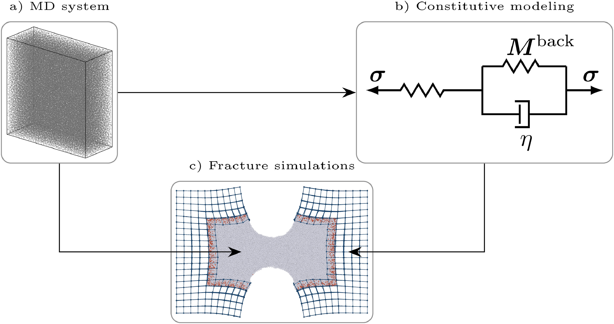
_图注: Fig. 1 Schematic representation of the multiscale FE-MD coupling framework. The MD simulations provide the MD data for constitutive modeling, which supplies the continuum domain with spatially varying boundary conditions._
_选图理由: 图注含 framework/workflow/model 强信号；图注偏方法或结构示意；首图也常承载总体方法示意；为满足展示顺序补足“摘要/概览图”_
图像角色: 模型/方法图
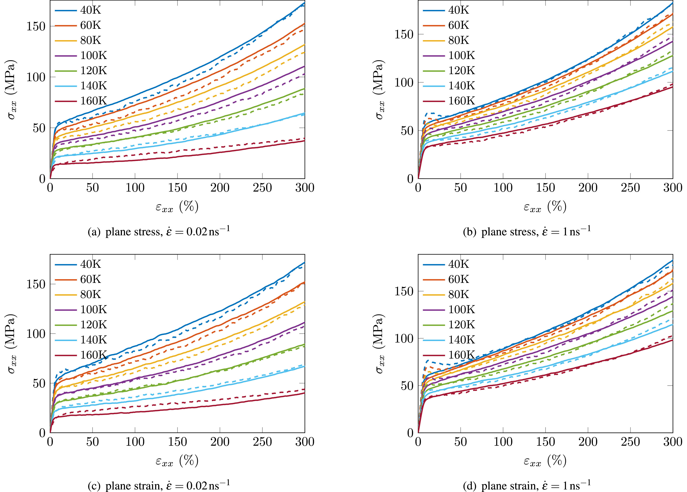
_图注: Fig. 4 Stress-strain responses obtained from pure MD simulations (dashed lines) and the constitutive model (solid lines) under uniaxial tension along x -direction at various temperatures and strain rates. Results are shown for (a,b) plane stress and (c,d) plane strain conditions along z -direction._
_选图理由: 图注含 framework/workflow/model 强信号；图注偏方法或结构示意；第二图优先视作模型或方法图_
图像角色: 结果/实验图
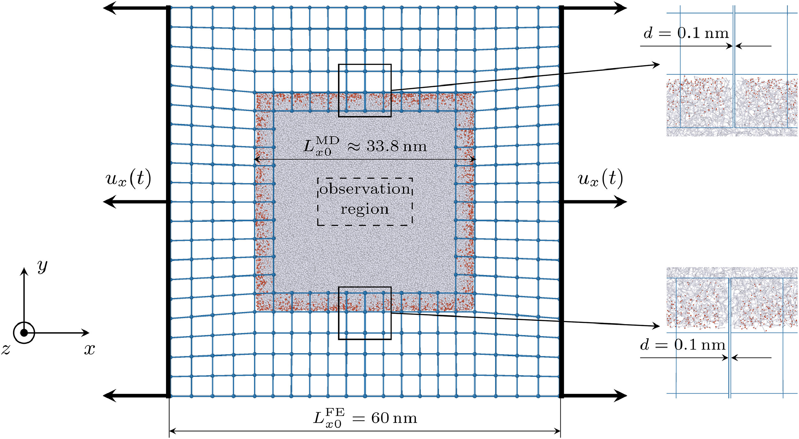
_图注: Fig. 3 FE-MD coupled system used for fracture simulations. The molecular domain containing two pre-cracks of width d = 0.1 nm is embedded within the finite element region to capture localized deformation and failure. The system is loaded via a prescribed displacement u x ( t ) applied to the boundaries perpendicular to the x -axis. An observation region with the size of L x obs = 10 n m , L y obs = 5 n m , and L z obs = L z MD is defined at the system center to evaluate the stress and microscopic quantities. A defect-free configuration with the same geometry is also analyzed for validation._
_选图理由: 图注含 results/experiment/validation 强信号；图注偏结果或响应展示；后续图优先视作结果或实验图_
- 自动生成流程图:
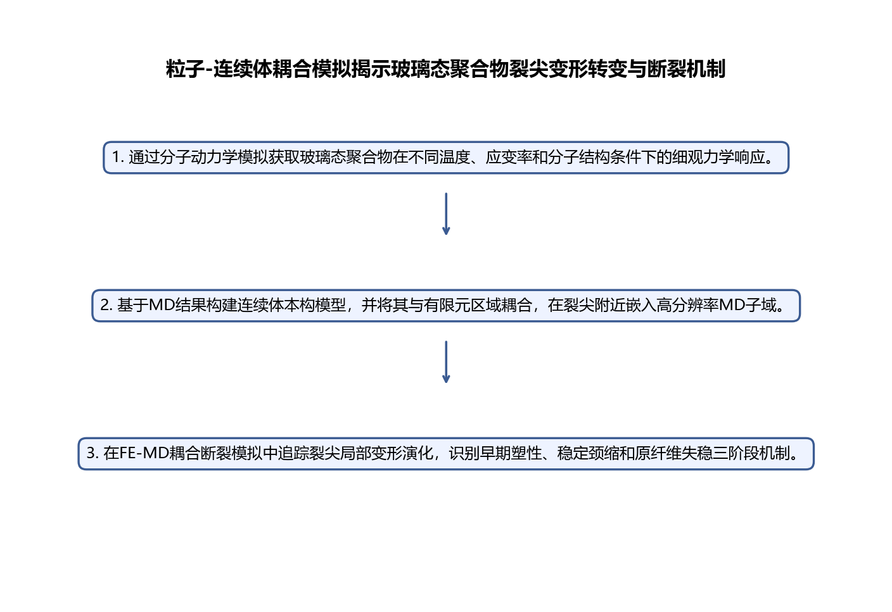

#### 本刊其余论文速览
#### 考虑多个黏聚长度的各向异性断裂变分相场模型
- 英文标题: A variational phase-field model for anisotropic fracture accounting for multiple cohesive lengths
- 期刊: Journal of the Mechanics and Physics of Solids
- 日期/期次: 2026-06-01 / Volume 212
- DOI: 10.1016/j.jmps.2026.106585
- 分类: 各向异性断裂力学, 相场损伤建模
- 关注关键词: N/A
- 价值分: 35
- 链接: https://doi.org/10.1016/j.jmps.2026.106585
- 一句话摘要: 该文提出一种单损伤变量的多黏聚长度各向异性相场断裂模型，可沿主材料方向独立调控裂纹起裂应力与扩展行为。
- 核心内容: 本文提出了一种新的各向异性断裂变分相场模型，目标是在不引入多个损伤变量的前提下，更灵活地标定各向异性材料的裂纹起裂行为。该模型在传统各向异性相场框架的基础上，保留各向异性弹性与结构张量描述的断裂能，同时通过具有不同主方向黏聚长度的退化函数引入新的断裂各向异性。这样可以分别控制不同材料方向上的临界应力，从而实现起裂与扩展的解耦调节。论文通过齐次解稳定性分析、强度曲面对比以及二维和三维数值算例，证明了该模型在复杂各向异性断裂问题中的适用性。

#### Less In More Out人工心脏的力学：织物型软体机器人器件建模
- 英文标题: The mechanics of the Less In More Out artificial heart: Modeling fabric-based soft robotic devices
- 期刊: Journal of the Mechanics and Physics of Solids
- 日期/期次: 2026-06-01 / Volume 212
- DOI: 10.1016/j.jmps.2026.106565
- 分类: 生物医疗器械结构优化, 软体机器人力学建模
- 关注关键词: N/A
- 价值分: 35
- 链接: https://doi.org/10.1016/j.jmps.2026.106565
- 一句话摘要: 该文建立了织物驱动软人工心室的计算力学框架，用于预测其充气变形、压力-容积响应、应力热点、屈曲与疲劳寿命，并指导结构优化。
- 核心内容: 本文围绕Less In More Out软体全人工心脏，建立了一个用于分析其内部力学行为的计算模型。该装置通过流体驱动的囊袋阵列在生理压力条件下产生正向流体杠杆效应，但实验本身难以解析内部应力集中、应变路径和耐久性限制。作者的模型能够重现实验观测到的非线性膨胀变形和压力-容积关系，并系统评估不同设计参数对搏出量、峰值von Mises应力和疲劳寿命的影响。结果表明，囊袋数较少虽能提高搏出量，但会显著提高局部应力；热封缝和局部屈曲区是主要耐久性瓶颈，而调整阀支撑长宽比和内外织物顺应性可在保持生理输出的同时降低峰值应力并提高效率。

#### 高能X射线“本征应变层析成像”及其他逆本征应变问题中解的唯一性：反例与适定性的必要条件
- 英文标题: Uniqueness of solutions in high-energy x-ray based ‘eigenstrain tomography’ and other inverse eigenstrain problems: Counter examples and necessary conditions for well-posedness
- 期刊: Journal of the Mechanics and Physics of Solids
- 日期/期次: 2026-06-01 / Volume 212
- DOI: 10.1016/j.jmps.2026.106596
- 分类: 残余应力与本征应变理论, 逆问题与场重建
- 关注关键词: N/A
- 价值分: 35
- 链接: https://doi.org/10.1016/j.jmps.2026.106596
- 一句话摘要: 该文通过构造反例系统揭示高能X射线本征应变层析中的非唯一性，并给出逆本征应变问题适定所需的最小测量条件。
- 核心内容: 本文研究本征应变层析成像这一逆问题的核心理论基础，即由衍射测得的应变信息反演三维残余应力场时解是否唯一。作者构造了明确的反例，证明仅依赖单个测得应变分量的高能X射线本征应变层析重建 generally 并不唯一。进一步分析表明，对于各向同性样品，若能够测得完整弹性应变张量中的三个分量，则可实现唯一重建，且三个位移剪应变分量或三个法向分量都足够。论文还证明了任意残余应力场都可由对角本征应变生成，而并非所有残余应力场都能由各向同性本征应变产生，从而为该类反问题建立了严格的适定性条件。

#### 异质金属玻璃中剪切转变区动力学的数值谱模型
- 英文标题: A numerical spectral model for shear transformation zone dynamics in heterogeneous metallic glasses
- 期刊: Journal of the Mechanics and Physics of Solids
- 日期/期次: 2026-06-01 / Volume 212
- DOI: 10.1016/j.jmps.2026.106604
- 分类: 多尺度材料力学, 金属玻璃塑性与局部化建模
- 关注关键词: N/A
- 价值分: 35
- 链接: https://doi.org/10.1016/j.jmps.2026.106604
- 一句话摘要: 该文构建了基于FFT谱微观力学与动力学STZ机制的数值模型，用于研究弹性异质性和孔隙对金属玻璃剪切局部化及力学响应的影响。
- 核心内容: 本文针对金属玻璃中的剪切转变区（STZ）演化与剪切带形成，提出了一种结合快速傅里叶变换谱求解器和动力学Monte Carlo机制的数值模型。模型将局部剪切事件表示为塑性本征应变，并在小变形、异质弹性框架下求解应力平衡，从而模拟低温低应变率下的应变局部化。作者系统分析了局部刚度异质性和孔隙对2D与3D金属玻璃响应的影响，发现二者均可延缓剧烈局部化并改善整体塑性，而其联合作用更有利于保持高强度。三维结果进一步表明，虽然软区STZ团簇能使弹塑过渡更平滑，但最终仍会形成更强、更波状的剪切带。

#### 构型力解释软材料中的阶梯裂纹
- 英文标题: Configurational forces explain echelon cracks in soft materials
- 期刊: Journal of the Mechanics and Physics of Solids
- 日期/期次: 2026-06-01 / Volume 212
- DOI: 10.1016/j.jmps.2026.106549
- 分类: 断裂力学, 软材料非线性失效
- 关注关键词: N/A
- 价值分: 35
- 链接: https://doi.org/10.1016/j.jmps.2026.106549
- 一句话摘要: 该文利用构型力方法解释软材料在I+III混合模加载下的裂纹前沿分段与阶梯裂纹形貌形成机制。
- 核心内容: 本文研究高可变形软材料在I+III混合模断裂下出现的阶梯裂纹现象。作者基于构型力力学框架，在有限元模拟后处理中计算裂尖与裂纹前沿上的构型力，从而判断裂纹在最大能量释放率方向上的扩展趋势。结果表明，面外剪切会使原本平面裂纹前沿分段为一系列倾斜小裂面，而这些小裂面之间的相互作用及后续并合过程决定了最终的阶梯形断裂形貌。研究还揭示了裂面并合导致的构型力非对称再分布，为理解软脆性材料中的混合模断裂提供了新的物理解释。

#### 一种热力学一致且对长度尺度不敏感的相场方法：适用于弹塑性耦合驱动力下的延性断裂
- 英文标题: A thermodynamically consistent and length scale-insensitive phase-field methodology suitable for ductile fracture with coupled elastic-plastic driving forces
- 期刊: Journal of the Mechanics and Physics of Solids
- 日期/期次: 2026-06-01 / Volume 212
- DOI: 10.1016/j.jmps.2026.106591
- 分类: Composite Structures, 延性断裂相场建模, 热力学一致弹塑性损伤力学
- 关注关键词: N/A
- 价值分: 45
- 链接: https://doi.org/10.1016/j.jmps.2026.106591
- 一句话摘要: 该文提出一种同时考虑弹性能与塑性功驱动、且对正则化长度不敏感的延性断裂相场框架，可统一描述脆性到延性失效转变。
- 核心内容: 本文针对传统延性断裂相场模型对正则化长度过度敏感、依赖经验塑性功阈值以及难以完整描述软化行为等问题，提出了一个新的热力学一致相场框架。该模型同时将弹性能和塑性功作为断裂驱动力，并通过各自独立的退化函数与起裂阈值控制裂纹萌生，而不需要任意调参。作者还将刚度退化与相场变量解耦，引入独立变量，从而弱化几何长度尺度约束并提高计算灵活性。该方法可通过特征函数适配任意软化规律，并在ABAQUS/Explicit中实现，验证了其在金属和UHPC等伪弹塑性材料中的广泛适用性。

#### 凝胶孔隙-黏弹连续体模型的数值实验
- 英文标题: Numerical experiments with a poro-viscoelastic continuum model for gels
- 期刊: Journal of the Mechanics and Physics of Solids
- 日期/期次: 2026-06-01 / Volume 212
- DOI: 10.1016/j.jmps.2026.106600
- 分类: Multiscale Mechanics, 孔弹性-黏弹性多场耦合, 软材料本构建模
- 关注关键词: N/A
- 价值分: 45
- 链接: https://doi.org/10.1016/j.jmps.2026.106600
- 一句话摘要: 该文提出一个三维热力学一致的孔隙-黏弹凝胶连续体模型，用于统一描述凝胶中分子重排与流体扩散耦合引起的时间依赖力学响应。
- 核心内容: 本文建立了一个以平衡溶胀态为参考构型的三维孔隙-黏弹连续体模型，用于描述凝胶材料中黏弹性与孔弹性的耦合作用。模型满足热力学约束，能够处理聚合物凝胶、纤维凝胶和刷状凝胶等多类体系的时变响应。数值结果表明，该模型可以重现聚合物凝胶拉伸流变中的细丝变细现象，以及纤维凝胶阶跃压缩下的应力松弛行为。作者还指出，对于固定小应变剪切模量的刷状凝胶，速率效应主要由G2控制，硬化程度主要由β控制，但由于黏弹部分采用等容假设，模型对强拉伸硬化和拉伸致体胀的描述仍有限。

#### 通过增量能量最小化在Cosserat晶体塑性中选择变形图样
- 英文标题: Selecting deformation patterns in Cosserat crystal plasticity by incremental energy minimization
- 期刊: Journal of the Mechanics and Physics of Solids
- 日期/期次: 2026-06-01 / Volume 212
- DOI: 10.1016/j.jmps.2026.106569
- 分类: Composite Structures, 局部化与图样形成, 晶体塑性本构建模
- 关注关键词: N/A
- 价值分: 45
- 链接: https://doi.org/10.1016/j.jmps.2026.106569
- 一句话摘要: 该文建立了严格变分、率无关的Cosserat晶体塑性框架，并通过增量能量最小化自发预测金属单晶中的变形带层状图样。
- 核心内容: 本文提出一种严格变分的率无关微极（Cosserat）晶体塑性框架，用于描述金属单晶中自发形成的变形带图样。作者将增量能量最小化方法嵌入含能量共轭力的梯度塑性热力学框架中，使平衡方程、本构不等式以及一致性条件都可由同一个增量能量泛函的最小化自然导出。理论分析表明，当滑移系交叉硬化强于自硬化且带状波长超过某个最小阈值时，形成变形带在能量上更有利。有限元实现进一步显示，无需任何人为扰动或几何缺陷，模型即可自动生成交替滑移活化的层状变形带图样。

#### 软材料深压入的统一尺度律与几何映射框架
- 英文标题: Universal scaling laws and a geometric mapping framework for deep indentation of soft materials
- 期刊: Journal of the Mechanics and Physics of Solids
- 日期/期次: 2026-06-01 / Volume 212
- DOI: 10.1016/j.jmps.2026.106572
- 分类: Multiscale Mechanics, 软材料接触力学, 非线性大变形理论
- 关注关键词: N/A
- 价值分: 45
- 链接: https://doi.org/10.1016/j.jmps.2026.106572
- 一句话摘要: 该文提出一种基于变形构型的几何映射接触理论，用于统一描述软材料在大压入深度下的接触压力、接触半径与载荷响应。
- 核心内容: 本文针对软材料深压入问题中经典Hertz理论在大变形条件下失效的局限，提出了一种几何映射框架。该方法在变形后的构型中建立类似Hertz型的法向压力分布，从而推导出适用于极大压入深度的接触压力、接触力和接触半径解析表达式。作者指出，当压入深度接近甚至超过压头半径时，主导因素是几何非线性而非材料本构非线性。有限元和实验结果进一步表明，不同聚合物、食品和生物组织的测试数据能够塌缩到统一主曲线上，揭示了软材料深压入的普适尺度律。

#### 嵌入创新框架中的cGAN用于薄膜起皱图样实时预测：从二维结果到三维形貌
- 英文标题: Real-time prediction of thin-film wrinkling pattern by cGAN embedded into an innovative framework from 2D results to 3D morphology
- 期刊: Journal of the Mechanics and Physics of Solids
- 日期/期次: 2026-06-01 / Volume 212
- DOI: 10.1016/j.jmps.2026.106584
- 分类: Multiscale Mechanics, 代理模型与科学机器学习, 薄膜失稳与起皱力学
- 关注关键词: N/A
- 价值分: 45
- 链接: https://doi.org/10.1016/j.jmps.2026.106584
- 一句话摘要: 该文提出一种将二维张力场有限元结果映射为三维起皱形貌的cGAN框架，实现薄膜起皱图样的实时预测。
- 核心内容: 本文针对薄膜起皱三维后屈曲有限元模拟收敛困难、计算代价高的问题，提出了一种AI增强的快速预测方法。作者首先基于张力场理论获得二维有限元结果，再结合起皱应变概念和满足物理一致性的约束构建三维起皱数据库，随后利用条件生成对抗网络（cGAN）学习从二维结果到三维皱纹形貌的映射。为提升精度，文中设计了深度卷积条件网络结构、对抗损失与像素级L1重构混合损失，并引入可融合少量实验或理论数据的微调策略。结果表明，该方法相较传统后屈曲有限元分析在效率上提升了数个数量级，同时保持了较好的三维皱纹形貌预测能力。

#### 由预压缩曲梁结构实现的可编程机械超表面
- 英文标题: Programmable mechanical metasurfaces enabled by pre-compressed curved beam architectures
- 期刊: Journal of the Mechanics and Physics of Solids
- 日期/期次: 2026-06-01 / Volume 212
- DOI: 10.1016/j.jmps.2026.106566
- 分类: Multiscale Mechanics, 机械超材料与超表面, 非线性稳定性与形貌编程
- 关注关键词: N/A
- 价值分: 45
- 链接: https://doi.org/10.1016/j.jmps.2026.106566
- 一句话摘要: 该文基于预压缩曲梁的可调双稳态机制，提出了一种可通过边界载荷或局部膨胀实现图样重构的可编程机械超表面设计方法。
- 核心内容: 本文系统研究了弹性梁中的双稳态现象，重点关注一种兼具可调性和势能非对称性的预压缩曲梁结构。作者通过解析建模、有限元仿真和实验验证，揭示了双稳态出现的条件，并构建了区分双稳态与非双稳态区域的判别曲面。不同于传统需依赖横向加载跨越能垒的双稳态系统，该结构可通过调节轴向预压缩来重塑势能景观，从而实现稳定态之间的受控切换。基于这一机制，论文进一步设计了耦合梁超表面单元，并展示了可通过边界驱动或局部扩张实现多种可重构图样的二维可编程机械超表面。

#### 极端静态与动态条件下氧化钨的结构转变路径
- 英文标题: Structural transition paths of tungsten oxide under static and dynamic extreme conditions
- 期刊: Journal of the Mechanics and Physics of Solids
- 日期/期次: 2026-06-01 / Volume 212
- DOI: 10.1016/j.jmps.2026.106602
- 分类: Multiscale Mechanics, 材料相变与结构演化, 极端条件材料力学
- 关注关键词: N/A
- 价值分: 45
- 链接: https://doi.org/10.1016/j.jmps.2026.106602
- 一句话摘要: 该文比较了γ-WO3纳米颗粒在静态压缩/加热与声冲击动态载荷下的相变路径，揭示其稳定性排序会因动态超热效应而发生反转。
- 核心内容: 本文研究了γ-WO3纳米颗粒在极端静态与动态条件下的结构和形貌响应，并与受冲击的锐钛矿TiO2纳米颗粒进行对比。结果表明，在静态压缩和加热实验中，材料稳定性排序为anatase-TiO2高于γ-WO3；但在声冲击动态条件下，这一排序发生反转，表现为γ-WO3更稳定。作者采用与热导率相关的超热机制来解释这种差异，说明动态冲击条件会显著改变固体的相稳定顺序与转变路径。该工作为理解纳米氧化物在静态与冲击载荷下的相变机制提供了新的物理框架。

#### 可展曲面与曲线折纸的精确降维动力学理论
- 英文标题: An exact dimension-reduced dynamic theory for developable surfaces and curve-fold origami
- 期刊: Journal of the Mechanics and Physics of Solids
- 日期/期次: 2026-06-01 / Volume 212
- DOI: 10.1016/j.jmps.2026.106593
- 分类: Multiscale Mechanics, 可展结构与折纸力学, 降维动力学理论
- 关注关键词: N/A
- 价值分: 45
- 链接: https://doi.org/10.1016/j.jmps.2026.106593
- 一句话摘要: 该文建立了一种针对可展曲面与曲线折纸的精确一维降阶动力学理论，以较低计算代价准确描述宽面板结构的动态响应。
- 核心内容: 本文针对曲线折纸和可展曲面动力学中缺乏精确统一理论的问题，提出了一种严格的降维动力学框架。作者利用可展曲面的内在一维性质，将整个宽面板的运动、速度场、动能和弹性能都表示为参考曲线的泛函，从而把问题从二维曲面动力学精确降为一维曲线动力学。该理论在拉格朗日和欧拉描述下都得到了验证，并进一步推广到由曲线折痕连接的双杆耦合系统。结果表明，该模型能够准确捕捉宽面板曲线折纸中曲率、挠率和局部标架运动耦合导致的复杂动态行为，同时保持较低计算成本。

#### 透明导电薄膜的微波损伤机制
- 英文标题: Microwave damage mechanisms of transparent conductive films
- 期刊: Journal of the Mechanics and Physics of Solids
- 日期/期次: 2026-06-01 / Volume 212
- DOI: 10.1016/j.jmps.2026.106575
- 分类: Multiscale Mechanics, 功能薄膜失效机制, 多物理场损伤力学
- 关注关键词: N/A
- 价值分: 45
- 链接: https://doi.org/10.1016/j.jmps.2026.106575
- 一句话摘要: 该文通过原位实验与多物理场分析揭示了ITO透明导电薄膜在微波辐照下由热点、放电到开裂扩展的热-电-力耦合损伤机制。
- 核心内容: 本文针对透明导电薄膜在高频电磁环境中的稳定性问题，研究了ITO薄膜在微波辐照下的损伤演化与失效机理。作者建立了可同步原位监测温度和损伤的实验系统，并结合模拟分析，揭示了从边缘热点形成、到边缘中部微波放电、再到基底开裂扩展的连续损伤链条。研究指出，导电率变化会促使加热机制从介质损耗主导转变为导电损耗主导，从而诱发边缘热点；随后，热点处拉应力引发ITO层微裂纹，裂纹尖端导致电场集中并触发放电。进一步地，放电局部高温引起的热应力集中驱动基底裂纹扩展，而增加薄膜厚度可作为抑制微裂纹形成的一种策略。

#### 通过耦合溶质拖曳效应的晶体塑性模型揭示淬火-配分钢的负应变率敏感性
- 英文标题: Unraveling negative strain-rate sensitivity of a quenching &amp; partitioning steel by a crystal plasticity model coupling solute-drag effect
- 期刊: Journal of the Mechanics and Physics of Solids
- 日期/期次: 2026-06-01 / Volume 212
- DOI: 10.1016/j.jmps.2026.106588
- 分类: 多相钢显微组织力学, 晶体塑性本构建模
- 关注关键词: N/A
- 价值分: 35
- 链接: https://doi.org/10.1016/j.jmps.2026.106588
- 一句话摘要: 该文提出一种耦合溶质拖曳效应的多相晶体塑性模型，用于解释Q&P钢中反常的负应变率敏感性及其微观来源。
- 核心内容: 本文针对淬火-配分（Q&P）钢中出现的反常负应变率敏感性问题，建立了一个显式耦合溶质拖曳机制的晶体塑性框架。作者将碳原子在位错周围形成和演化的气团与位错等待时间联系起来，并通过核心交叉扩散和连续体扩散两种机制描述其时空演化。模型同时考虑了Q&P钢多相组织中的马氏体滑移、残余奥氏体滑移以及形变诱导马氏体相变，并用统一参数集重现了不同应变率和温度下的应力-应变响应。结果表明，负应变率敏感性的主要来源是在高应变率下某些临界滑移系上的溶质拖曳急剧局部减弱。

#### 通过黏弹性黏附捕获飞行物体
- 英文标题: Capturing flying objects through viscoelastic adhesion
- 期刊: Journal of the Mechanics and Physics of Solids
- 日期/期次: 2026-06-01 / Volume 212
- DOI: 10.1016/j.jmps.2026.106574
- 分类: 仿生动态捕获机制, 黏弹性接触与界面力学
- 关注关键词: N/A
- 价值分: 35
- 链接: https://doi.org/10.1016/j.jmps.2026.106574
- 一句话摘要: 该文建立了一个统一的黏附碰撞理论框架，用于解释黏弹性基底如何通过耗散与界面黏附协同作用实现飞行物体动态捕获。
- 核心内容: 本文针对利用黏附捕获飞行物体的动力学机制，建立了一个基于Maugis-Dugdale模型的平头压头-黏弹性基底黏附碰撞理论框架。作者通过渐近分析分别推导了JKR样和DMT样两种黏附区间下的解，并揭示了阻止物体反弹的两类主要机制。对于JKR样区间，黏弹耗散会在脱离过程中扩大黏聚区，从而增强动态黏附；对于DMT样区间，长程界面牵引起主导作用并促进捕获。研究还表明，临界捕获速度在黏弹松弛时间与弹性碰撞时间相当时达到峰值，并在适当归一化后实现从JKR极限到DMT极限的连续过渡。

#### 由应变梯度弹性控制的非均质介质的有效行为
- 英文标题: Effective behavior of heterogeneous media governed by strain gradient elasticity
- 期刊: Journal of the Mechanics and Physics of Solids
- 日期/期次: 2026-06-01 / Volume 212
- DOI: 10.1016/j.jmps.2026.106583
- 分类: 多尺度连续体力学, 非局部与数据驱动代理建模
- 关注关键词: N/A
- 价值分: 35
- 链接: https://doi.org/10.1016/j.jmps.2026.106583
- 一句话摘要: 该文研究微观尺度服从应变梯度弹性的周期非均质介质，揭示其宏观有效行为一般并不保持应变梯度弹性形式，而可由分数阶梯度模型或Fourier神经算子更好表征。
- 核心内容: 本文关注材料异质尺度、观测尺度与长度尺度效应之间的耦合关系，研究对象是一维周期非均质介质，其微观层面服从应变梯度弹性。数值实验表明，对这类介质进行平均后，宏观有效行为通常不能仍用经典应变梯度弹性来描述，即该类理论在该尺度下对平均操作并不封闭。作者进一步发现，核函数型非局部弹性可以拟合整体行为，但其核高度振荡且衰减缓慢，解释和使用都不够方便。为此，论文提出两条替代路线：在有限尺度范围内用分数阶应变梯度弹性描述宏观响应，并用Fourier神经算子在多尺度范围内进行数据驱动表征。

#### 被困流体与干区：黏附在软润滑失稳中的作用
- 英文标题: Trapped fluids and dry zones: Adhesion’s role in soft lubrication instabilities
- 期刊: Journal of the Mechanics and Physics of Solids
- 日期/期次: 2026-06-01 / Volume 212
- DOI: 10.1016/j.jmps.2026.106570
- 分类: 多场耦合失稳分析, 软润滑与界面力学
- 关注关键词: N/A
- 价值分: 35
- 链接: https://doi.org/10.1016/j.jmps.2026.106570
- 一句话摘要: 该文揭示了黏附力如何在软润滑中诱发界面失稳、形成干区与困液区，并推动接触动力学从弹流润滑向混合润滑转变。
- 核心内容: 本文研究软润滑体系中黏附相互作用对接触流体排出和界面稳定性的影响。作者将黏附力引入Reynolds润滑理论，并通过线性稳定性分析识别出控制小扰动增长的无量纲参数α。进一步地，论文构建了一个有限差分-有限元耦合求解器，以分析界面失稳的非线性演化过程。结果表明，当α大于1时，仅靠黏附作用就能在光滑界面上形成近乎零液膜厚度的干接触区，并在其间困住流体，从而显著延长排液时间并改变润滑机制。

#### 利用各向异性相场模型耦合晶体塑性研究增材制造钛合金中的短裂纹扩展行为
- 英文标题: A study of short-crack growth behaviour in an AM Ti alloy using an anisotropic phase field model coupled with crystal plasticity
- 期刊: Journal of the Mechanics and Physics of Solids
- 日期/期次: 2026-06-01 / Volume 212
- DOI: 10.1016/j.jmps.2026.106573
- 分类: 晶体塑性与显微组织相关建模, 短裂纹与断裂力学
- 关注关键词: N/A
- 价值分: 35
- 链接: https://doi.org/10.1016/j.jmps.2026.106573
- 一句话摘要: 该文提出一种各向异性相场-非局部晶体塑性耦合模型，用于揭示增材制造α′钛合金中微观短裂纹从缺陷萌生并受组织控制扩展的机制。
- 核心内容: 本文研究增材制造α′相钛合金中显微组织尺度短裂纹的扩展机理，这类裂纹对航空发动机关键构件寿命评估至关重要。作者建立了一个新的各向异性相场模型，并与非局部晶体塑性耦合，以描述增材缺陷附近裂纹在微观组织约束下的萌生与扩展。该热力学一致框架被嵌入有限元中，用于分析短裂纹路径选择、局部储能驱动力以及微观组织对热点和微裂纹萌生位置的影响。结果表明，最大主应力方向和最大累积塑性滑移面法向是定义局部裂纹扩展方向的关键度量，而局部储存应变能则是增材缺陷附近短裂纹生长的重要驱动力。

#### 规则化裂纹的起裂可由耦合准则解释
- 英文标题: Initiation of regularized cracks is explained by the coupled criterion
- 期刊: Journal of the Mechanics and Physics of Solids
- 日期/期次: 2026-06-01 / Volume 212
- DOI: 10.1016/j.jmps.2026.106576
- 分类: 准脆性损伤与起裂准则, 相场断裂力学
- 关注关键词: N/A
- 价值分: 35
- 链接: https://doi.org/10.1016/j.jmps.2026.106576
- 一句话摘要: 该文将匹配渐近展开与相场规则化结合，扩展了考虑初始过程区的耦合准则，用于解释准脆性材料中的规则化裂纹起裂行为。
- 核心内容: 本文将匹配渐近展开与相场规则化方法结合，提出了一种可考虑初始过程区存在的耦合准则实现方式。作者通过在裂纹起始位置附近施加相场Dirichlet边界条件来引入初始过程区，从而统一研究尖锐裂纹起裂与规则化裂纹起裂问题。结果表明，随着初始相场值增大，有效过程区扩大，V形缺口尖端的应力奇异性被逐步削弱，即使没有塑性规则化，非均匀刚度也足以缓解奇异应力。研究还发现，过程区会降低增量能量释放率，使得起裂所需的广义应力强度因子高于无初始过程区情形。

#### 动态聚合物网络黏塑性响应的统一瞬态网络理论
- 英文标题: A unified transient network theory for viscoplastic response of dynamic polymer networks
- 期刊: Journal of the Mechanics and Physics of Solids
- 日期/期次: 2026-06-01 / Volume 212
- DOI: 10.1016/j.jmps.2026.106599
- 分类: 聚合物本构建模, 黏塑性与多尺度连续体理论
- 关注关键词: N/A
- 价值分: 35
- 链接: https://doi.org/10.1016/j.jmps.2026.106599
- 一句话摘要: 该文构建了一个统一的瞬态网络理论框架，用于从可逆键断裂-重组动力学出发描述动态聚合物网络的黏塑性流动行为。
- 核心内容: 本文围绕动态聚合物网络的力学建模，系统比较了瞬态网络理论（TNT）与传统有限黏塑性理论的异同。作者从连续介质力学角度重新表述TNT，并将其与经典乘法分解和最大塑性耗散框架建立明确联系，形成了一个统一的理论框架。该框架保留了TNT自下而上的分子物理基础，能够把宏观黏塑流动解释为链级可逆键解离与重组的涌现结果。研究还将统一TNT扩展到可压缩与不可压缩材料，并通过动力学Monte Carlo模拟验证其合理性，揭示了链重组和链解离在宏观流动中扮演的不同角色。

## 全量论文索引

#### 基于分层物理递归神经网络的机织复合材料多尺度分析
- 英文标题: Multiscale analysis of woven composites using hierarchical physically recurrent neural networks
- 期刊: Computer Methods in Applied Mechanics and Engineering
- 日期/期次: 2026-07-01 / Volume 456
- DOI: 10.1016/j.cma.2026.118939
- 分类: Composite Structures, Machine Learning in Mechanics, Multiscale Mechanics, 多尺度力学, 数据驱动本构与代理建模
- 关注关键词: constitutive model, multiscale, surrogate model
- 价值分: 100
- 链接: https://doi.org/10.1016/j.cma.2026.118939
- 一句话摘要: 该文提出分层物理递归神经网络（HPRNN），在微-介-宏多尺度之间嵌入物理约束，实现机织复合材料非线性弹塑性响应的高效、可解释代理预测。
- 核心内容: 本文面向机织复合材料多尺度均匀化中细观计算代价高的问题，提出了分层物理递归神经网络（HPRNN）框架。第一层利用PRNN学习经纱与纬纱在微观力学数据驱动下的非线性弹塑性本构响应，第二层再将纱线代理模型与基体本构模型结合，完成介观到宏观的尺度过渡。该方法把物理性质直接编码进潜在空间，因此比纯数据驱动RNN或Transformer更不容易出现非物理预测。结果上，该框架在复杂循环载荷下具有更好的泛化能力，同时兼顾计算效率与可解释性。

#### 基于深度神经网络融合多求解器的多保真延迟接受：用于贝叶斯逆问题的分层MCMC采样
- 英文标题: Multi-fidelity delayed acceptance: Hierarchical MCMC sampling for Bayesian inverse problems combining multiple solvers through deep neural networks
- 期刊: Computer Methods in Applied Mechanics and Engineering
- 日期/期次: 2026-07-01 / Volume 456
- DOI: 10.1016/j.cma.2026.118916
- 分类: Machine Learning in Mechanics, 代理模型与贝叶斯反演, 多保真计算与不确定性量化
- 关注关键词: surrogate model
- 价值分: 57
- 链接: https://doi.org/10.1016/j.cma.2026.118916
- 一句话摘要: 该文提出一种将多保真神经网络嵌入分层延迟接受MCMC中的贝叶斯反演框架，以低成本近似高保真似然并加速后验采样。
- 核心内容: 本文针对基于偏微分方程的贝叶斯逆问题中高保真求解器反复调用代价过高的问题，提出了多保真延迟接受（MFDA）方法。该方法在多层延迟接受MCMC框架下，引入多保真神经网络，将多个低保真求解器的输出映射为更接近高保真模型的似然评估结果。其核心思想是在离线阶段使用有限的高保真数据训练代理网络，而在线采样阶段仅调用粗尺度求解器和训练好的网络，从而避免额外高保真仿真。结果表明，该策略能够改善粗模型的近似精度，提升链的混合性与子链长度，并在地下水流和反应-扩散反演问题中实现显著加速。

#### 面向数据驱动计算力学中PDE约束优化问题的变分多尺度方法
- 英文标题: A variational multiscale approach to PDE-constrained optimization problems arising in data-driven computational mechanics
- 期刊: Computer Methods in Applied Mechanics and Engineering
- 日期/期次: 2026-07-01 / Volume 456
- DOI: 10.1016/j.cma.2026.118944
- 分类: Multiscale Mechanics, PDE约束优化与数据驱动计算力学, 多尺度有限元方法
- 关注关键词: multiscale
- 价值分: 57
- 链接: https://doi.org/10.1016/j.cma.2026.118944
- 一句话摘要: 该文针对数据驱动计算力学中的反应-扩散型PDE约束优化，构建了基于变分多尺度稳定化的原始-对偶有限元框架。
- 核心内容: 本文研究了数据驱动计算力学中由PDE约束优化引出的最优性条件，并将其专门化到反应-扩散问题背景下。作者从连续层面分析了原始形式与对偶形式的适定性，随后基于变分多尺度（VMS）思想提出稳定且一致的有限元离散方法。文中重点考察了两类典型子网格尺度设计，即代数子网格尺度（ASGS）和正交子网格尺度（OSGS），并讨论了它们在拟一致网格上的理论性质。数值实验通过多个渐进复杂案例比较原始与对偶离散方案的误差场、网格收敛和稳定性表现，验证了所提方法的有效性。

#### 用于双相肿瘤生长建模的DeepONet增强贝叶斯推断
- 英文标题: DeepONet-enhanced bayesian inference for biphasic tumor growth modeling
- 期刊: Computer Methods in Applied Mechanics and Engineering
- 日期/期次: 2026-07-01 / Volume 456
- DOI: 10.1016/j.cma.2026.118919
- 分类: Machine Learning in Mechanics, 代理模型与算子学习, 生物力学中的贝叶斯反演
- 关注关键词: surrogate model
- 价值分: 57
- 链接: https://doi.org/10.1016/j.cma.2026.118919
- 一句话摘要: 该文将连续介质双相肿瘤生长模型、DeepONet代理和贝叶斯推断结合起来，以更低代价完成肿瘤生长参数识别与预测。
- 核心内容: 本文提出了一个面向肿瘤生长建模的数据驱动计算框架，将双相肿瘤生长模型、免疫微环境耦合机制和贝叶斯参数推断结合起来。其核心困难在于肿瘤生长模型由多个强耦合非线性PDE组成，直接用于贝叶斯反演计算成本很高。为此，作者引入DeepONet作为算子代理模型，在保持高保真模拟精度的同时显著加速肿瘤体积随时间演化的预测。最终，该框架可利用实验数据反演关键模型参数，为个体化癌症建模与数据同化提供高效路径。

#### 具有载荷诱导边界转角缺陷的全连接晶格屈曲研究
- 英文标题: Buckling of fully-connected lattices with load-induced boundary rotation imperfections
- 期刊: International Journal of Solids and Structures
- 日期/期次: 2026-06-01 / Volume 334
- DOI: 10.1016/j.ijsolstr.2026.113961
- 分类: Machine Learning in Mechanics, 晶格超材料与仿生层级结构, 结构稳定性与屈曲力学
- 关注关键词: pinn
- 价值分: 57
- 链接: https://doi.org/10.1016/j.ijsolstr.2026.113961
- 一句话摘要: 该文针对无关节全连接晶格中的载荷诱导边界转角效应，建立解析与半解析屈曲模型并揭示其会显著降低承载能力。
- 核心内容: 本文研究全连接、无关节晶格结构中一个常被忽略的失稳来源：相邻杆件变形会对原本笔直受压杆施加随载荷演化的端部转角，从而形成载荷诱导的边界转角缺陷。作者将这种效应与传统预存几何初始缺陷区分开来，推导了带规定边界转角的柱体非线性载荷-挠度闭式解，并进一步发展了考虑柱长缩短的半解析方法。随后通过非线性有限元分析对理论结果进行验证，并在多种代表性工况下系统评估临界载荷下降规律。结果表明，这类由边界耦合变形引起的旋转缺陷会显著削弱全连接晶格和机械超材料的抗屈曲能力。

#### 玻璃态聚合物中水解降解与黏塑性的本构建模：一种有效温度方法
- 英文标题: Constitutive modelling of hydrolytic degradation and viscoplasticity in glassy polymers: An effective temperature approach
- 期刊: International Journal of Plasticity
- 日期/期次: 2026-06-01 / Volume 201
- DOI: 10.1016/j.ijplas.2026.104690
- 分类: 本构建模, 聚合物降解与多物理耦合力学
- 关注关键词: constitutive model
- 价值分: 47
- 链接: https://doi.org/10.1016/j.ijplas.2026.104690
- 一句话摘要: 该文提出一种耦合水扩散、水解断链与黏塑性变形的玻璃态聚合物本构模型，并用有效温度统一表征降解对力学性能的影响。
- 核心内容: 本文针对可降解玻璃态聚合物在水环境中的水解劣化行为，建立了一个同时考虑水扩散、水解链断裂和黏塑性变形的耦合本构模型。作者用有效温度来刻画吸水和分子量下降导致的玻璃化转变温度降低，从而把降解状态与力学响应联系起来。模型利用PLA在干燥未降解和湿态降解条件下的热-力学实验数据进行了标定，并较好重现了分子量、水浓度分布及不同降解阶段的变形行为。文中还通过代表性案例展示了该模型在弱耦合模拟中的应用潜力，为可降解聚合物器件设计提供了实用工具。

#### 硅橡胶中的变形诱导畴
- 英文标题: Deformation-induced domains in silicone rubber
- 期刊: Journal of the Mechanics and Physics of Solids
- 日期/期次: 2026-06-01 / Volume 212
- DOI: 10.1016/j.jmps.2026.106592
- 分类: 本构模型, 软材料中的相变与局域化力学
- 关注关键词: constitutive model
- 价值分: 47
- 链接: https://doi.org/10.1016/j.jmps.2026.106592
- 一句话摘要: 该文结合原位X射线断层观测与本构建模，揭示硅橡胶中可移动相取向切换所诱发的力学畴形成与空间非均匀变形机制。
- 核心内容: 本文研究了一类含可移动相的硅橡胶在受载时出现的空间非均匀变形现象。作者通过原位X射线计算机断层成像和示踪掺杂实验表明，这种非均匀性与材料内部可移动相的迁移和重排有关，并提出其可能表现出类似液晶的向列畴行为。基于这一认识，文中建立了含可移动相的橡胶本构模型，并针对轴对称单轴加载进行了分析。模型给出了一个相图，将响应划分为三种变形区域，并成功解释了拉伸与压缩下试样芯部和外层体积变化相反的现象。

#### 用于非线性复合材料并发多尺度建模的热力学信息引导注意力网络
- 英文标题: Thermodynamics-informed attention networks for concurrent multiscale modeling of nonlinear composites
- 期刊: International Journal of Plasticity
- 日期/期次: 2026-06-01 / Volume 201
- DOI: 10.1016/j.ijplas.2026.104681
- 分类: Composite Structures, Machine Learning in Mechanics, Multiscale Mechanics, 多尺度力学, 物理约束代理本构模型
- 关注关键词: multiscale
- 价值分: 77
- 链接: https://doi.org/10.1016/j.ijplas.2026.104681
- 一句话摘要: 该文提出MulTIAN热力学信息引导双注意力网络，用于任意加载路径下非线性单向复合材料及结构的并发多尺度建模。
- 核心内容: 本文提出一种新的并发多尺度神经网络框架MulTIAN，用于预测单向复合材料在复杂加载-卸载路径下的非弹性响应。其核心是双网络结构：主注意力网络用于预测表征历史效应的内部状态变量，辅助网络用于预测Helmholtz自由能势，并由此导出本构关系。作者在损失函数中显式嵌入热力学约束，使模型在数据驱动预测的同时保持物理一致性。该框架还被集成到ABAQUS中，用于结构尺度分析，并在多个典型复合材料结构与实验测试中验证了精度，同时实现了显著的时间和内存节省。

#### 基于直接循环分析的全时域全局-局部耦合：用于多尺度安定评估及接触问题应用
- 英文标题: Global-in-time global-local coupling using direct cyclic analysis for multiscale shakedown assessment and application to problems with contact
- 期刊: Computer Methods in Applied Mechanics and Engineering
- 日期/期次: 2026-07-01 / Volume 456
- DOI: 10.1016/j.cma.2026.118940
- 分类: Multiscale Mechanics, 多尺度力学, 循环塑性与结构安定分析
- 关注关键词: multiscale
- 价值分: 57
- 链接: https://doi.org/10.1016/j.cma.2026.118940
- 一句话摘要: 该文将全局-局部迭代耦合推广到全时域直接循环框架，以高效评估含局部弹塑性与接触非线性的结构安定极限循环。
- 核心内容: 本文针对整体上线性、局部存在弹塑性非线性区域的循环受载结构，提出了一种基于直接循环分析（DCA）的全时域全局-局部耦合方法。作者将传统Global-Local Iterative Coupling（GLIC）扩展为可直接求解稳定极限循环的框架，从而避免了增量式时间同步带来的计算负担。该方法在全局问题和局部问题中均采用DCA，因此能够高效捕捉局部非线性对整体稳定循环响应的影响。方法已在Abaqus/Standard中实现，并通过多个算例及含接触情形验证了精度、效率和适用性。

#### 用于变分多尺度湍流建模的半显式Runge-Kutta积分器：迈向时空高阶精度
- 英文标题: Half-explicit Runge-Kutta integrators for variational multiscale turbulence modeling: Toward higher-order accuracy in space and time
- 期刊: Computer Methods in Applied Mechanics and Engineering
- 日期/期次: 2026-07-01 / Volume 456
- DOI: 10.1016/j.cma.2026.118930
- 分类: Multiscale Mechanics, 多尺度数值方法, 计算流体力学与湍流建模
- 关注关键词: multiscale
- 价值分: 57
- 链接: https://doi.org/10.1016/j.cma.2026.118930
- 一句话摘要: 该文将半显式Runge-Kutta时间积分一致地引入残差型变分多尺度湍流模型，以提升大涡模拟在时空上的精度、稳定性与流动结构保真度。
- 核心内容: 本文针对残差型变分多尺度（VMS）湍流大涡模拟在时间离散上长期局限于二阶隐式格式的问题，提出了与VMS框架一致耦合的半显式Runge-Kutta积分方法。作者在Rothe方法指导下，选用适用于指标2微分-代数方程的半显式RK格式，并据此推导了新的子网格尺度模型。与传统基于线性化或扰动展开的处理不同，该方法在显式处理非线性项的同时保持了清晰的空间问题结构，并表明子网格参数不依赖于网格尺寸。数值结果在Taylor-Green涡和开腔流中显示，该方法在动能演化、能谱、涡结构以及极限环捕捉方面均优于传统VMS格式。

#### 利用深度算子网络学习隐藏物理规律与系统参数
- 英文标题: Learning hidden physics and system parameters with deep operator networks
- 期刊: Computer Methods in Applied Mechanics and Engineering
- 日期/期次: 2026-07-01 / Volume 456
- DOI: 10.1016/j.cma.2026.118926
- 分类: Machine Learning in Mechanics, 算子学习与物理发现, 逆问题与参数识别
- 关注关键词: pinn
- 价值分: 57
- 链接: https://doi.org/10.1016/j.cma.2026.118926
- 一句话摘要: 该文提出基于DeepONet的两套框架，在稀疏观测下同时实现未知物理算子发现与系统参数高精度反演。
- 核心内容: 本文针对从稀疏观测中发现隐藏物理规律和识别控制参数这一关键问题，提出了两种基于深度算子网络的统一框架。第一种方法Deep Hidden Physics Operator（DHPO）将隐藏物理发现扩展到算子学习范式中，用于识别不同PDE族中的未知算子项；第二种方法则结合预训练DeepONet与物理约束反演，实现从少量传感器数据中直接识别系统参数。相比PINN和稀疏回归等传统数据驱动方法，该方法减少了重复训练需求，并提升了对噪声和方程族变化的泛化能力。作者在反应-扩散方程、Burgers方程、二维热传导方程和二维Helmholtz方程上验证了方法的有效性，在有限且含噪观测下仍取得较高精度。

#### 在近乎完全再结晶的DED镍基多主元合金中调控层错能与分级析出相
- 英文标题: Engineering stacking fault energy and hierarchical precipitates in a near-fully recrystallized DED Ni-based multi-principal element alloy
- 期刊: International Journal of Plasticity
- 日期/期次: 2026-06-01 / Volume 201
- DOI: 10.1016/j.ijplas.2026.104682
- 分类: Multiscale Mechanics, 增材制造金属材料, 多尺度材料力学
- 关注关键词: multiscale
- 价值分: 57
- 链接: https://doi.org/10.1016/j.ijplas.2026.104682
- 一句话摘要: 该文通过调控层错能和分级析出相，促进DED镍基多主元合金动态再结晶，并实现强度与塑性的协同提升。
- 核心内容: 本文针对激光增材制造镍基多主元合金中快速凝固、元素偏析和残余应力导致的组织不稳定与性能劣化问题，提出了通过调控层错能与分级析出相来促进近乎完全再结晶的设计策略。作者结合相图计算和第一性原理计算，设计了以Ni-Cr-Fe-Co为基体并添加Al/Ti/V的合金体系，使其保持中等层错能并在直接能量沉积过程中原位形成分级析出相。析出相主要在晶内均匀形核，抑制晶界处过度析出，从而有利于严重塑性变形条件下的动态再结晶。最终，材料获得约92%的再结晶晶粒，并表现出较高的屈服强度、抗拉强度和均匀延伸率，显示出优异的强塑协同性能。

#### 镍基高温合金中非Schmid效应分析
- 英文标题: Analysis of non-Schmid effects in a Ni-based superalloy
- 期刊: International Journal of Plasticity
- 日期/期次: 2026-06-01 / Volume 201
- DOI: 10.1016/j.ijplas.2026.104683
- 分类: Multiscale Mechanics, 多尺度力学, 晶体塑性本构建模
- 关注关键词: multiscale
- 价值分: 57
- 链接: https://doi.org/10.1016/j.ijplas.2026.104683
- 一句话摘要: 该文结合原子模拟、晶体塑性有限元与实验，建立了面向Ni基合金690非Schmid效应的原子信息驱动多尺度晶体塑性框架。
- 核心内容: 本文围绕固溶强化Ni基合金690中的非Schmid效应展开研究，综合使用分子动力学、晶体塑性有限元分析和单轴拉压实验揭示其屈服张压不对称机理。作者首先通过室温单晶分子动力学模拟展示了屈服应力的拉压不对称性，并基于滑移系与分解应力分析提出能够预测塑性起始阶段非Schmid效应的单晶滑移启动准则。进一步地，文中分析了不同取向和加载条件下孪晶变体的激活规律，并用原子模拟标定晶体塑性屈服准则中的非Schmid系数及位错滑移活化能参数。最终，原子信息驱动的晶体塑性模型在室温准静态拉伸和压缩实验中得到了验证，表明该多尺度框架能够较好预测多晶Alloy 690的非Schmid响应。

#### 考虑拉压不对称与成形取向效应的LPBF AlSi10Mg合金各向异性本构模型
- 英文标题: An anisotropic constitutive model for LPBF AlSi10Mg alloy considering tension-compression asymmetry and build-orientation effect
- 期刊: International Journal of Plasticity
- 日期/期次: 2026-06-01 / Volume 201
- DOI: 10.1016/j.ijplas.2026.104677
- 分类: Multiscale Mechanics, 增材制造金属材料力学, 本构模型
- 关注关键词: constitutive model
- 价值分: 57
- 链接: https://doi.org/10.1016/j.ijplas.2026.104677
- 一句话摘要: 该文针对LPBF AlSi10Mg合金的成形取向相关拉压不对称与循环软硬化行为，提出了一个各向异性弹塑性循环本构模型。
- 核心内容: 本文通过单调拉伸、压缩和对称应变控制循环试验，揭示了LPBF成形AlSi10Mg合金的力学响应显著依赖于成形取向和加载方式。实验表明，该材料在0°、45°和90°三种成形方向下均表现出明显的屈服应力差异、拉压不对称性以及先循环软化后循环硬化的特征。为描述这些复杂行为，作者基于修正Hill48屈服准则构建了一个新的各向异性弹塑性本构模型，并结合非关联流动法则、各向异性修正Chaboche运动硬化、各向同性与畸变硬化以及记忆面机制。结果显示，该模型能够较准确地再现LPBF AlSi10Mg合金在不同成形取向和循环加载条件下的各向异性循环变形特征。

#### 基于任意曲梁晶格通用非线性力学框架的仿生网络超材料物理引导逆向设计
- 英文标题: Physics-guided inverse design of bio-inspired network metamaterials via a general non-linear mechanical framework for arbitrary curved-beam lattices
- 期刊: Journal of the Mechanics and Physics of Solids
- 日期/期次: 2026-06-01 / Volume 212
- DOI: 10.1016/j.jmps.2026.106571
- 分类: Multiscale Mechanics, 仿生网络超材料设计, 多尺度力学
- 关注关键词: multiscale
- 价值分: 57
- 链接: https://doi.org/10.1016/j.jmps.2026.106571
- 一句话摘要: 该文提出一种面向任意曲梁周期网络的通用非线性力学框架，并据此实现仿生网络超材料的高效物理引导逆向设计。
- 核心内容: 本文受生物软组织分级纤维结构启发，研究由任意曲梁构成的周期性网络超材料的非线性力学行为与逆向设计问题。作者建立了一个通用非线性力学框架，能够从单根曲梁的力学响应出发，系统连接到晶格层级的相互作用与有限变形下的整体响应，从而捕捉多尺度变形传递机制。该框架突破了以往仅适用于特定理想几何的模型局限，并通过有限元模拟和实验在多类网络构型与载荷条件下验证了预测能力。基于这一物理可解释框架，论文进一步发展出高效逆向设计方法，可按目标力学性能精确调控网络结构，适用于软机器人、生物电子和组织工程等场景。

#### 铜中电塑性效应的多尺度研究：实验与晶体塑性建模
- 英文标题: A multiscale investigation into the electroplastic effects in copper: Experiments and crystal plasticity modeling
- 期刊: Journal of the Mechanics and Physics of Solids
- 日期/期次: 2026-06-01 / Volume 212
- DOI: 10.1016/j.jmps.2026.106597
- 分类: Multiscale Mechanics, 多尺度力学, 晶体塑性本构建模
- 关注关键词: multiscale
- 价值分: 57
- 链接: https://doi.org/10.1016/j.jmps.2026.106597
- 一句话摘要: 该文结合温控脉冲电流辅助变形实验与电耦合晶体塑性模型，系统揭示了铜中电塑性无热机制与位错演化之间的关联。
- 核心内容: 本文针对金属电塑性效应机理仍不清晰的问题，以铜为对象开展了实验与计算结合的多尺度研究。作者通过温度受控的脉冲电流辅助变形试验尽可能突出无热贡献，并结合大面积EBSD、双束TEM和高分辨EBSD表征织构演化、滑移系活动和位错密度变化。随后构建了包含电塑性相关机制及热力学演化关系的晶体塑性模型，用于解释实验中观察到的应力响应波动和加工硬化减弱现象。研究表明，脉冲电流诱导的统计存储位错恢复是宏观软化与两阶段应力下降行为的重要来源。

#### 作为分岔现象的损伤局部化及其在软材料中的断裂图样
- 英文标题: Damage localization as a bifurcation phenomenon and the resulting fracture patterns in soft materials
- 期刊: Journal of the Mechanics and Physics of Solids
- 日期/期次: 2026-06-01 / Volume 212
- DOI: 10.1016/j.jmps.2026.106567
- 分类: 损伤力学与断裂, 软材料非线性失稳
- 关注关键词: constitutive model
- 价值分: 47
- 链接: https://doi.org/10.1016/j.jmps.2026.106567
- 一句话摘要: 该文将软材料中的损伤局部化视为一种分岔失稳现象，并通过梯度损伤-超弹性框架揭示径向膨胀下多瓣断裂图样的形成机制。
- 核心内容: 本文研究软不可压圆柱体在径向膨胀过程中出现的损伤局部化与断裂图样演化问题。作者采用梯度损伤模型与超弹性本构耦合，从分岔角度分析对称空腔扩张何时转变为局部化的多瓣断裂模式。理论分析明确指出，几何尺寸、材料韧性以及内禀损伤长度尺度共同决定了分岔阈值与断裂花样选择。与有限元结果的比较还表明，现有数值方法会推迟预测分岔起始点，凸显了解析基准在断裂起裂预测中的重要性。

#### 用于模拟润湿液滴诱导膜重塑与拓扑变化的相场模型
- 英文标题: A phase-field model to simulate membrane remodeling and topology changes induced by wetting droplets
- 期刊: Computer Methods in Applied Mechanics and Engineering
- 日期/期次: 2026-07-01 / Volume 456
- DOI: 10.1016/j.cma.2026.118938
- 分类: Multiscale Mechanics, 相场方法与界面演化, 膜力学与多物理耦合
- 关注关键词: N/A
- 价值分: 45
- 链接: https://doi.org/10.1016/j.cma.2026.118938
- 一句话摘要: 该文提出一个耦合三相Cahn–Hilliard流动与膜力学的相场框架，用于模拟液滴润湿驱动下的膜出芽、融合和断裂等拓扑变化。
- 核心内容: 本文研究液态生物分子凝聚体与膜之间的相互作用，重点关注润湿液滴如何诱导膜发生出芽、融合和剪切断裂等复杂重塑行为。作者建立了一个相场模型，将三相Cahn–Hilliard描述与热力学一致的膜力学相耦合，显式考虑弯曲刚度、高斯曲率、不可伸长性和线张力等效应。为处理高曲率界面和拓扑变化，方法采用自适应有限元离散，在保证精度的同时提高了计算效率。基准测试表明该模型能够准确重现平衡润湿构型和理论形状预测，并进一步揭示液滴润湿与膜性质共同控制的非线性形态演化机制。

#### 基于Gap–Shifted Boundary Method的任意加密与参数化等几何多补丁耦合
- 英文标题: Isogeometric multipatch coupling with arbitrary refinement and parametrization using the Gap–Shifted Boundary Method
- 期刊: Computer Methods in Applied Mechanics and Engineering
- 日期/期次: 2026-07-01 / Volume 456
- DOI: 10.1016/j.cma.2026.118913
- 分类: Multiscale Mechanics, 嵌入式高阶数值方法, 等几何分析与多补丁耦合
- 关注关键词: N/A
- 价值分: 45
- 链接: https://doi.org/10.1016/j.cma.2026.118913
- 一句话摘要: 该文提出一种基于Gap–SBM的等几何多补丁嵌入式耦合方法，可在任意网格尺度、阶次和参数化不匹配条件下实现稳健高阶耦合。
- 核心内容: 本文提出一种新的等几何多补丁耦合技术Gap–SBM，用于处理非一致补丁之间的高阶嵌入式耦合问题。与传统需要严格水密接口和匹配节点向量的方法不同，该方法允许补丁在单元尺寸、多项式阶次、方向和参数化上任意不一致，同时无需引入额外自由度。其核心是通过无罚Nitsche形式在间隙区域内积分，并借助移位边界思想保持离散系统的良好条件性。数值结果表明，该方法即使在薄间隙和高度非协调补丁条件下，仍能实现最优收敛和稳定线性系统。

#### 面向几何非线性结构的非侵入式无数据参数化降阶模型
- 英文标题: Non-intrusive data-free parametric reduced order model for geometrically nonlinear structures
- 期刊: Computer Methods in Applied Mechanics and Engineering
- 日期/期次: 2026-07-01 / Volume 456
- DOI: 10.1016/j.cma.2026.118937
- 分类: Multiscale Mechanics, 几何非线性结构计算, 降阶代理模型
- 关注关键词: N/A
- 价值分: 45
- 链接: https://doi.org/10.1016/j.cma.2026.118937
- 一句话摘要: 该文提出一种完全非侵入、无需额外数据采样的参数化降阶建模方法，用于高效预测具有几何变化的几何非线性结构响应。
- 核心内容: 本文提出了一种针对几何非线性结构的非侵入式参数化降阶模型（PROM）方法，适用于存在几何参数变化的结构分析。方法以由振型和模态导数构建的Galerkin降阶模型为基础，并从标准有限元输出中识别线性刚度、二次/三次非线性张量、Rayleigh阻尼参数和降阶基等算子。作者进一步利用径向基函数对这些降阶算子进行参数空间插值，并通过两层POD压缩和基于MAC的重排序策略构建全局平滑降阶基。数值结果表明，该方法在曲面板和翼盒等算例上与高保真模拟高度一致，同时显著降低参数分析的计算成本。

#### 动态碎裂中相场裂纹展宽起源的解释
- 英文标题: Origins of phase-field crack widening in dynamic fragmentation explained
- 期刊: Computer Methods in Applied Mechanics and Engineering
- 日期/期次: 2026-07-01 / Volume 456
- DOI: 10.1016/j.cma.2026.118942
- 分类: Multiscale Mechanics, 损伤力学与断裂, 相场方法与动态碎裂
- 关注关键词: N/A
- 价值分: 45
- 链接: https://doi.org/10.1016/j.cma.2026.118942
- 一句话摘要: 该文揭示动态相场断裂中裂纹弥散区异常展宽源于弹性波的非物理滞留，并提出通过质量侵蚀抑制伪损伤扩散。
- 核心内容: 本文研究相场断裂方法在动态裂纹扩展与碎裂模拟中的一个关键问题：裂纹正则化区会随时间逐渐变宽。作者指出，这种展宽并非真实断裂物理，而是由于损伤区内对弹性波的非物理困陷，导致波与损伤场相互作用并诱发额外损伤。为减弱这一伪扩散现象，论文提出采用质量侵蚀策略，使受损区域中的弹性波速得到合理保持，从而抑制裂纹带异常增宽。数值结果还表明，在正则化长度足够小且网格足够细时，无论是否采用质量侵蚀，动态裂纹速度和能量释放率都可收敛到线弹性断裂力学预测。

#### 用于物理信息前向与逆问题学习的条件自适应增广拉格朗日方法
- 英文标题: Conditionally adaptive augmented Lagrangian method for physics-informed learning of forward and inverse problems
- 期刊: Computer Methods in Applied Mechanics and Engineering
- 日期/期次: 2026-07-01 / Volume 456
- DOI: 10.1016/j.cma.2026.118953
- 分类: Machine Learning in Mechanics, 前向与逆问题约束优化, 物理信息神经网络与科学机器学习
- 关注关键词: N/A
- 价值分: 45
- 链接: https://doi.org/10.1016/j.cma.2026.118953
- 一句话摘要: 该文在PECANN框架中提出条件自适应增广拉格朗日策略CAPU，并结合约束聚合、Fourier特征与时间窗推进，提升复杂PDE前向和逆问题的物理信息学习能力。
- 核心内容: 本文对Physics and Equality Constrained Artificial Neural Networks（PECANN）框架进行了系统扩展，以提高其求解复杂偏微分方程前向与逆问题的鲁棒性和效率。核心改进包括：支持多独立罚参数的增广拉格朗日方法、缓解逐点约束低效性的约束聚合策略、用于高频多尺度解的单次Fourier特征映射，以及适用于长时间输运问题的时间窗方法。最关键的是，作者提出了条件自适应罚参数更新策略CAPU，可针对违反更严重的约束更快增长拉格朗日乘子，并协调多个罚参数的更新。该框架在跨声速稀疏波、可逆涡旋平流、高波数Helmholtz/Poisson方程以及逆热源识别中都表现出有竞争力的精度与效率。

#### 基于样条最小二乘形式的弹性杆网络快速仿真与设计优化
- 英文标题: Accelerated simulation and design optimization of elastic rod networks with a spline-based least-squares formulation
- 期刊: Computer Methods in Applied Mechanics and Engineering
- 日期/期次: 2026-07-01 / Volume 456
- DOI: 10.1016/j.cma.2026.118925
- 分类: Multiscale Mechanics, 弹性杆网络与形状优化, 非线性结构力学
- 关注关键词: N/A
- 价值分: 45
- 链接: https://doi.org/10.1016/j.cma.2026.118925
- 一句话摘要: 该文提出一种基于Bezier样条与最小二乘Kirchhoff杆边值求解的高效方法，用于多稳态弹性杆网络的快速仿真与形状优化。
- 核心内容: 本文针对多稳态弹性杆网络在仿真和设计优化中面临的强非线性与不稳定平衡附近雅可比病态问题，提出了一种高效稳健的计算框架。方法将Kirchhoff杆边值问题改写为最小二乘求解形式，并用Bezier曲线建立由bigon单元组成的杆网络模型。基于这一求解器，作者进一步构建了面向目标曲线和目标端平面的形状优化方法，把形状目标直接并入最小二乘函数中。数值实验和实体原型表明，该方法相比传统边值问题求解器更高效、更抗噪，并能有效实现多稳态弹性杆网络的物理驱动设计。

#### 任意弹性失配下受压纤维增强双层体系起皱的尺度律揭示
- 英文标题: Unveiling scaling laws for wrinkling in compressed fiber-reinforced bilayers at any elastic mismatch
- 期刊: Journal of the Mechanics and Physics of Solids
- 日期/期次: 2026-06-01 / Volume 212
- DOI: 10.1016/j.jmps.2026.106564
- 分类: Multiscale Mechanics, 多尺度稳定性与分岔力学, 纤维增强复合材料建模
- 关注关键词: N/A
- 价值分: 45
- 链接: https://doi.org/10.1016/j.jmps.2026.106564
- 一句话摘要: 该文建立了纤维增强双层材料在任意弹性失配下受压起皱的统一理论，并给出了临界应变与临界波数的两类尺度律及其转变判据。
- 核心内容: 本文研究纤维增强双层体系在横向压缩下的起皱分岔问题，目标是在从高失配到中低失配的全范围内建立统一的尺度律。作者将上层薄膜建模为可轴向变形且具有弯曲刚度的弹性板，下层基底则采用有限弹性中的标准增强模型来描述纤维增强各向异性。通过对小应变与有限应变分岔起始进行渐近分析，论文得到了临界应变和临界波数的两组尺度律，分别对应薄膜主导区和基底主导区。研究还给出了两种机制之间的解析转变阈值，为生物组织和工程双层复合体中的起皱预测提供了统一判据。

#### 零合力横向载荷作用下弹性杆的奇异力学行为
- 英文标题: The strange mechanics of an elastic rod under null-resultant transverse loads
- 期刊: Journal of the Mechanics and Physics of Solids
- 日期/期次: 2026-06-01 / Volume 212
- DOI: 10.1016/j.jmps.2026.106590
- 分类: Multiscale Mechanics, 细长体与弹性层力学, 非线性结构稳定性
- 关注关键词: N/A
- 价值分: 45
- 链接: https://doi.org/10.1016/j.jmps.2026.106590
- 一句话摘要: 该文揭示了在净横向合力为零时，作用于杆上下表面的相反分布载荷仍可像轴压一样诱发屈曲和后屈曲变形。
- 核心内容: 本文研究了一种反直觉的载荷情形：在弹性杆上下表面分别施加大小相等、方向相反的横向分布死载荷，使得单位长度上的横向合力为零。传统观点通常认为这种横向应力对整体结构响应影响不大，但作者通过弹性层渐近分析、三种不同杆模型以及数值和实验验证表明，它实际上会产生与轴向载荷等效的力学效应。特别是，当这种横向作用表现为压缩效应时，它会进入广义Euler弹性线方程并导致屈曲和显著的后屈曲演化。研究还指出，该失稳在杆厚趋于零时依然存在，因此对薄膜、弹性层及微纳器件都具有潜在影响。

#### 基于全场变形测量的黏弹性材料参数机器学习提取
- 英文标题: Machine learning extraction of viscoelastic material properties from full-field deformation measurements
- 期刊: Journal of the Mechanics and Physics of Solids
- 日期/期次: 2026-06-01 / Volume 212
- DOI: 10.1016/j.jmps.2026.106589
- 分类: Machine Learning in Mechanics, 机器学习材料表征, 黏弹性本构反演
- 关注关键词: N/A
- 价值分: 45
- 链接: https://doi.org/10.1016/j.jmps.2026.106589
- 一句话摘要: 该文提出两种基于深度学习的框架，从全场变形数据中高效反演黏弹性材料性质，适用于已知与未知本构形式两类问题。
- 核心内容: 本文面向黏弹性材料表征这一传统上依赖迭代建模和高计算成本的问题，提出了两个深度学习框架，用于从全场变形测量中提取材料参数。对于本构关系已知的情形，Deep-VM-FE针对Kelvin-Voigt模型将应力分解为速率无关项和速率相关项，并由双通道网络分别学习；对于未知显式控制方程的情形，Deep-VM-FD直接从点式时空场数据学习应力演化。作者还引入梯度池化以增强空间邻域信息利用，使模型能够处理更一般的场数据问题。方法在解析数据库、有限元模拟以及气泡空穴实验数据上均表现出与真值高度一致的预测能力。

#### 粒子-连续体耦合模拟揭示玻璃态聚合物裂尖变形转变与断裂机制
- 英文标题: Crack-tip deformation transitions and fracture mechanisms in glassy polymers revealed by particle-continuum coupling simulations
- 期刊: Journal of the Mechanics and Physics of Solids
- 日期/期次: 2026-06-01 / Volume 212
- DOI: 10.1016/j.jmps.2026.106595
- 分类: 多尺度断裂力学, 聚合物本构与粒子-连续体耦合
- 关注关键词: N/A
- 价值分: 35
- 链接: https://doi.org/10.1016/j.jmps.2026.106595
- 一句话摘要: 该文通过FE-MD粒子-连续体耦合框架揭示了玻璃态聚合物裂尖从早期塑性、稳定颈缩到原纤维失稳的三阶段变形与断裂机制。
- 核心内容: 本文采用将分子动力学区域嵌入有限元区域的粒子-连续体耦合方法，研究玻璃态聚合物在裂尖附近的多尺度变形与断裂行为。该方法既保留了裂尖强非均匀区的分子分辨率，又能描述周围大尺度连续体约束，是单独MD或单独连续体模型难以覆盖的区域。研究发现，在不同温度、链长、断键准则和几何约束下，裂尖变形都可归纳为三个稳定阶段：早期塑性、稳定颈缩和原纤维失稳。各阶段分别对应局部原子膨胀与非仿射重排、缠结链段承载导致的稳定颈缩，以及高度局域化的链解缠诱发的原纤维破坏。

#### 考虑多个黏聚长度的各向异性断裂变分相场模型
- 英文标题: A variational phase-field model for anisotropic fracture accounting for multiple cohesive lengths
- 期刊: Journal of the Mechanics and Physics of Solids
- 日期/期次: 2026-06-01 / Volume 212
- DOI: 10.1016/j.jmps.2026.106585
- 分类: 各向异性断裂力学, 相场损伤建模
- 关注关键词: N/A
- 价值分: 35
- 链接: https://doi.org/10.1016/j.jmps.2026.106585
- 一句话摘要: 该文提出一种单损伤变量的多黏聚长度各向异性相场断裂模型，可沿主材料方向独立调控裂纹起裂应力与扩展行为。
- 核心内容: 本文提出了一种新的各向异性断裂变分相场模型，目标是在不引入多个损伤变量的前提下，更灵活地标定各向异性材料的裂纹起裂行为。该模型在传统各向异性相场框架的基础上，保留各向异性弹性与结构张量描述的断裂能，同时通过具有不同主方向黏聚长度的退化函数引入新的断裂各向异性。这样可以分别控制不同材料方向上的临界应力，从而实现起裂与扩展的解耦调节。论文通过齐次解稳定性分析、强度曲面对比以及二维和三维数值算例，证明了该模型在复杂各向异性断裂问题中的适用性。

#### Less In More Out人工心脏的力学：织物型软体机器人器件建模
- 英文标题: The mechanics of the Less In More Out artificial heart: Modeling fabric-based soft robotic devices
- 期刊: Journal of the Mechanics and Physics of Solids
- 日期/期次: 2026-06-01 / Volume 212
- DOI: 10.1016/j.jmps.2026.106565
- 分类: 生物医疗器械结构优化, 软体机器人力学建模
- 关注关键词: N/A
- 价值分: 35
- 链接: https://doi.org/10.1016/j.jmps.2026.106565
- 一句话摘要: 该文建立了织物驱动软人工心室的计算力学框架，用于预测其充气变形、压力-容积响应、应力热点、屈曲与疲劳寿命，并指导结构优化。
- 核心内容: 本文围绕Less In More Out软体全人工心脏，建立了一个用于分析其内部力学行为的计算模型。该装置通过流体驱动的囊袋阵列在生理压力条件下产生正向流体杠杆效应，但实验本身难以解析内部应力集中、应变路径和耐久性限制。作者的模型能够重现实验观测到的非线性膨胀变形和压力-容积关系，并系统评估不同设计参数对搏出量、峰值von Mises应力和疲劳寿命的影响。结果表明，囊袋数较少虽能提高搏出量，但会显著提高局部应力；热封缝和局部屈曲区是主要耐久性瓶颈，而调整阀支撑长宽比和内外织物顺应性可在保持生理输出的同时降低峰值应力并提高效率。

#### 高能X射线“本征应变层析成像”及其他逆本征应变问题中解的唯一性：反例与适定性的必要条件
- 英文标题: Uniqueness of solutions in high-energy x-ray based ‘eigenstrain tomography’ and other inverse eigenstrain problems: Counter examples and necessary conditions for well-posedness
- 期刊: Journal of the Mechanics and Physics of Solids
- 日期/期次: 2026-06-01 / Volume 212
- DOI: 10.1016/j.jmps.2026.106596
- 分类: 残余应力与本征应变理论, 逆问题与场重建
- 关注关键词: N/A
- 价值分: 35
- 链接: https://doi.org/10.1016/j.jmps.2026.106596
- 一句话摘要: 该文通过构造反例系统揭示高能X射线本征应变层析中的非唯一性，并给出逆本征应变问题适定所需的最小测量条件。
- 核心内容: 本文研究本征应变层析成像这一逆问题的核心理论基础，即由衍射测得的应变信息反演三维残余应力场时解是否唯一。作者构造了明确的反例，证明仅依赖单个测得应变分量的高能X射线本征应变层析重建 generally 并不唯一。进一步分析表明，对于各向同性样品，若能够测得完整弹性应变张量中的三个分量，则可实现唯一重建，且三个位移剪应变分量或三个法向分量都足够。论文还证明了任意残余应力场都可由对角本征应变生成，而并非所有残余应力场都能由各向同性本征应变产生，从而为该类反问题建立了严格的适定性条件。

#### 异质金属玻璃中剪切转变区动力学的数值谱模型
- 英文标题: A numerical spectral model for shear transformation zone dynamics in heterogeneous metallic glasses
- 期刊: Journal of the Mechanics and Physics of Solids
- 日期/期次: 2026-06-01 / Volume 212
- DOI: 10.1016/j.jmps.2026.106604
- 分类: 多尺度材料力学, 金属玻璃塑性与局部化建模
- 关注关键词: N/A
- 价值分: 35
- 链接: https://doi.org/10.1016/j.jmps.2026.106604
- 一句话摘要: 该文构建了基于FFT谱微观力学与动力学STZ机制的数值模型，用于研究弹性异质性和孔隙对金属玻璃剪切局部化及力学响应的影响。
- 核心内容: 本文针对金属玻璃中的剪切转变区（STZ）演化与剪切带形成，提出了一种结合快速傅里叶变换谱求解器和动力学Monte Carlo机制的数值模型。模型将局部剪切事件表示为塑性本征应变，并在小变形、异质弹性框架下求解应力平衡，从而模拟低温低应变率下的应变局部化。作者系统分析了局部刚度异质性和孔隙对2D与3D金属玻璃响应的影响，发现二者均可延缓剧烈局部化并改善整体塑性，而其联合作用更有利于保持高强度。三维结果进一步表明，虽然软区STZ团簇能使弹塑过渡更平滑，但最终仍会形成更强、更波状的剪切带。

#### 构型力解释软材料中的阶梯裂纹
- 英文标题: Configurational forces explain echelon cracks in soft materials
- 期刊: Journal of the Mechanics and Physics of Solids
- 日期/期次: 2026-06-01 / Volume 212
- DOI: 10.1016/j.jmps.2026.106549
- 分类: 断裂力学, 软材料非线性失效
- 关注关键词: N/A
- 价值分: 35
- 链接: https://doi.org/10.1016/j.jmps.2026.106549
- 一句话摘要: 该文利用构型力方法解释软材料在I+III混合模加载下的裂纹前沿分段与阶梯裂纹形貌形成机制。
- 核心内容: 本文研究高可变形软材料在I+III混合模断裂下出现的阶梯裂纹现象。作者基于构型力力学框架，在有限元模拟后处理中计算裂尖与裂纹前沿上的构型力，从而判断裂纹在最大能量释放率方向上的扩展趋势。结果表明，面外剪切会使原本平面裂纹前沿分段为一系列倾斜小裂面，而这些小裂面之间的相互作用及后续并合过程决定了最终的阶梯形断裂形貌。研究还揭示了裂面并合导致的构型力非对称再分布，为理解软脆性材料中的混合模断裂提供了新的物理解释。

#### 带环的压扁行为
- 英文标题: Flattening of tape-rings
- 期刊: International Journal of Solids and Structures
- 日期/期次: 2026-06-01 / Volume 334
- DOI: 10.1016/j.ijsolstr.2026.113969
- 分类: 薄壁曲面与失稳分析, 非线性结构力学
- 关注关键词: N/A
- 价值分: 35
- 链接: https://doi.org/10.1016/j.ijsolstr.2026.113969
- 一句话摘要: 该文研究一种环形带簧结构在双板压扁过程中的弯曲-拉伸耦合与屈曲行为，并通过解析、有限元和实验进行验证。
- 核心内容: 本文研究了一类由环面帽形几何构成的新型带环（tape-ring）结构在两平板之间被压扁时的力学响应。作者指出，该问题不同于常规带簧弯曲，压扁过程中高斯曲率变化会引发显著的弯曲-拉伸耦合：外缘受拉、内缘受压。由此，结构会出现内缘周向屈曲；若强制轴对称，则会转化为截面横向屈曲。论文给出了压扁应变与压扁力的解析预测，并证明其与有限元结果及实体实验吻合良好。

#### 用于准静态裂纹扩展相场模拟的路径跟踪方法
- 英文标题: Path-following methods for phase-field simulation of quasi-static crack propagation
- 期刊: International Journal of Solids and Structures
- 日期/期次: 2026-06-01 / Volume 334
- DOI: 10.1016/j.ijsolstr.2026.113974
- 分类: 相场断裂, 非线性路径跟踪与失稳分析
- 关注关键词: N/A
- 价值分: 35
- 链接: https://doi.org/10.1016/j.ijsolstr.2026.113974
- 一句话摘要: 该文系统研究相场断裂中的路径跟踪策略，以在裂纹突跳和回跳阶段保持准静态平衡并准确追踪平衡路径与耗散能。
- 核心内容: 本文针对相场断裂模拟中传统增量加载容易引发不稳定裂纹扩展、破坏准静态假设的问题，研究并比较了多种路径跟踪方法。作者重点关注可与交替迭代求解器方便耦合的分区式位移控制策略，并提出一种新的路径跟踪方法，其特点是限制裂纹区外的最大应变增量。论文进一步借助向尖锐裂纹模型的Γ收敛观点，在多个复杂度递增的断裂问题上评估这些方法。结果表明，所提方法能够更稳健地追踪平衡路径、保持力平衡，并更准确地估计回跳失稳过程中的耗散能。

#### 面向最大一阶固有频率的三维连续纤维增强复合材料GPU加速大规模拓扑优化
- 英文标题: GPU-accelerated large-scale topology optimization of 3D continuous fiber-reinforced composites for maximum fundamental eigenfrequency
- 期刊: Computer Methods in Applied Mechanics and Engineering
- 日期/期次: 2026-07-01 / Volume 456
- DOI: 10.1016/j.cma.2026.118895
- 分类: Composite Structures, 复合材料结构优化, 高性能计算与拓扑优化
- 关注关键词: N/A
- 价值分: 45
- 链接: https://doi.org/10.1016/j.cma.2026.118895
- 一句话摘要: 该文提出一种GPU加速的大规模三维连续纤维增强复合材料拓扑优化框架，以高效求解最大化基频的密度-纤维取向协同设计问题。
- 核心内容: 本文针对三维连续纤维增强复合材料在最大一阶固有频率目标下的拓扑优化计算量巨大的问题，提出了一种GPU加速求解框架。核心思想是采用SIAD方法，把近似特征值分析与设计变量更新合并到单循环中，替代传统昂贵的双循环流程。作者进一步结合多重网格预条件共轭梯度求解器、基于Taylor近似改进的单元刚度矩阵计算方法，以及面向密度和纤维取向的解耦更新策略，显著提升了效率与可扩展性。数值算例表明，该方法不仅能够处理数百万单元的大规模问题，而且优化得到的复合材料结构可在更低质量下获得高于铝结构的基频。

#### 复合材料板裂纹演化建模：基于高阶板理论的分层相场方法
- 英文标题: Modeling of crack evolution in composite plates: A layerwise phase field approach with higher order plate theory
- 期刊: Computer Methods in Applied Mechanics and Engineering
- 日期/期次: 2026-07-01 / Volume 456
- DOI: 10.1016/j.cma.2026.118935
- 分类: Composite Structures, 复合材料断裂力学, 相场损伤建模
- 关注关键词: N/A
- 价值分: 45
- 链接: https://doi.org/10.1016/j.cma.2026.118935
- 一句话摘要: 该文提出一种结合高阶板理论与分层各向异性相场的复合层合板裂纹演化模型，可预测纤维方向敏感的层间/层内损伤路径及多次跳跃失稳平衡路径。
- 核心内容: 本文建立了一个面向层合复合材料板裂纹演化的三维分层各向异性相场框架。位移场采用三阶剪切变形板理论，并加入厚度拉伸和zig-zag项，以描述层间处面内位移斜率不连续等特征。相场变量在厚度方向采用二次分布，并结合各向异性裂纹表面密度函数，从而能够刻画单层内受纤维取向控制的损伤扩展，并抑制垂直纤维方向的裂纹传播。作者基于有限元、交替最小化与弧长法实现求解，并通过文献中的解析、数值和实验结果验证，表明该方法能够有效预测不同铺层角和长厚比条件下的裂纹路径、层状损伤和多次snap-through平衡路径。

#### 一种热力学一致且对长度尺度不敏感的相场方法：适用于弹塑性耦合驱动力下的延性断裂
- 英文标题: A thermodynamically consistent and length scale-insensitive phase-field methodology suitable for ductile fracture with coupled elastic-plastic driving forces
- 期刊: Journal of the Mechanics and Physics of Solids
- 日期/期次: 2026-06-01 / Volume 212
- DOI: 10.1016/j.jmps.2026.106591
- 分类: Composite Structures, 延性断裂相场建模, 热力学一致弹塑性损伤力学
- 关注关键词: N/A
- 价值分: 45
- 链接: https://doi.org/10.1016/j.jmps.2026.106591
- 一句话摘要: 该文提出一种同时考虑弹性能与塑性功驱动、且对正则化长度不敏感的延性断裂相场框架，可统一描述脆性到延性失效转变。
- 核心内容: 本文针对传统延性断裂相场模型对正则化长度过度敏感、依赖经验塑性功阈值以及难以完整描述软化行为等问题，提出了一个新的热力学一致相场框架。该模型同时将弹性能和塑性功作为断裂驱动力，并通过各自独立的退化函数与起裂阈值控制裂纹萌生，而不需要任意调参。作者还将刚度退化与相场变量解耦，引入独立变量，从而弱化几何长度尺度约束并提高计算灵活性。该方法可通过特征函数适配任意软化规律，并在ABAQUS/Explicit中实现，验证了其在金属和UHPC等伪弹塑性材料中的广泛适用性。

#### 凝胶孔隙-黏弹连续体模型的数值实验
- 英文标题: Numerical experiments with a poro-viscoelastic continuum model for gels
- 期刊: Journal of the Mechanics and Physics of Solids
- 日期/期次: 2026-06-01 / Volume 212
- DOI: 10.1016/j.jmps.2026.106600
- 分类: Multiscale Mechanics, 孔弹性-黏弹性多场耦合, 软材料本构建模
- 关注关键词: N/A
- 价值分: 45
- 链接: https://doi.org/10.1016/j.jmps.2026.106600
- 一句话摘要: 该文提出一个三维热力学一致的孔隙-黏弹凝胶连续体模型，用于统一描述凝胶中分子重排与流体扩散耦合引起的时间依赖力学响应。
- 核心内容: 本文建立了一个以平衡溶胀态为参考构型的三维孔隙-黏弹连续体模型，用于描述凝胶材料中黏弹性与孔弹性的耦合作用。模型满足热力学约束，能够处理聚合物凝胶、纤维凝胶和刷状凝胶等多类体系的时变响应。数值结果表明，该模型可以重现聚合物凝胶拉伸流变中的细丝变细现象，以及纤维凝胶阶跃压缩下的应力松弛行为。作者还指出，对于固定小应变剪切模量的刷状凝胶，速率效应主要由G2控制，硬化程度主要由β控制，但由于黏弹部分采用等容假设，模型对强拉伸硬化和拉伸致体胀的描述仍有限。

#### 通过增量能量最小化在Cosserat晶体塑性中选择变形图样
- 英文标题: Selecting deformation patterns in Cosserat crystal plasticity by incremental energy minimization
- 期刊: Journal of the Mechanics and Physics of Solids
- 日期/期次: 2026-06-01 / Volume 212
- DOI: 10.1016/j.jmps.2026.106569
- 分类: Composite Structures, 局部化与图样形成, 晶体塑性本构建模
- 关注关键词: N/A
- 价值分: 45
- 链接: https://doi.org/10.1016/j.jmps.2026.106569
- 一句话摘要: 该文建立了严格变分、率无关的Cosserat晶体塑性框架，并通过增量能量最小化自发预测金属单晶中的变形带层状图样。
- 核心内容: 本文提出一种严格变分的率无关微极（Cosserat）晶体塑性框架，用于描述金属单晶中自发形成的变形带图样。作者将增量能量最小化方法嵌入含能量共轭力的梯度塑性热力学框架中，使平衡方程、本构不等式以及一致性条件都可由同一个增量能量泛函的最小化自然导出。理论分析表明，当滑移系交叉硬化强于自硬化且带状波长超过某个最小阈值时，形成变形带在能量上更有利。有限元实现进一步显示，无需任何人为扰动或几何缺陷，模型即可自动生成交替滑移活化的层状变形带图样。

#### 软材料深压入的统一尺度律与几何映射框架
- 英文标题: Universal scaling laws and a geometric mapping framework for deep indentation of soft materials
- 期刊: Journal of the Mechanics and Physics of Solids
- 日期/期次: 2026-06-01 / Volume 212
- DOI: 10.1016/j.jmps.2026.106572
- 分类: Multiscale Mechanics, 软材料接触力学, 非线性大变形理论
- 关注关键词: N/A
- 价值分: 45
- 链接: https://doi.org/10.1016/j.jmps.2026.106572
- 一句话摘要: 该文提出一种基于变形构型的几何映射接触理论，用于统一描述软材料在大压入深度下的接触压力、接触半径与载荷响应。
- 核心内容: 本文针对软材料深压入问题中经典Hertz理论在大变形条件下失效的局限，提出了一种几何映射框架。该方法在变形后的构型中建立类似Hertz型的法向压力分布，从而推导出适用于极大压入深度的接触压力、接触力和接触半径解析表达式。作者指出，当压入深度接近甚至超过压头半径时，主导因素是几何非线性而非材料本构非线性。有限元和实验结果进一步表明，不同聚合物、食品和生物组织的测试数据能够塌缩到统一主曲线上，揭示了软材料深压入的普适尺度律。

#### 嵌入创新框架中的cGAN用于薄膜起皱图样实时预测：从二维结果到三维形貌
- 英文标题: Real-time prediction of thin-film wrinkling pattern by cGAN embedded into an innovative framework from 2D results to 3D morphology
- 期刊: Journal of the Mechanics and Physics of Solids
- 日期/期次: 2026-06-01 / Volume 212
- DOI: 10.1016/j.jmps.2026.106584
- 分类: Multiscale Mechanics, 代理模型与科学机器学习, 薄膜失稳与起皱力学
- 关注关键词: N/A
- 价值分: 45
- 链接: https://doi.org/10.1016/j.jmps.2026.106584
- 一句话摘要: 该文提出一种将二维张力场有限元结果映射为三维起皱形貌的cGAN框架，实现薄膜起皱图样的实时预测。
- 核心内容: 本文针对薄膜起皱三维后屈曲有限元模拟收敛困难、计算代价高的问题，提出了一种AI增强的快速预测方法。作者首先基于张力场理论获得二维有限元结果，再结合起皱应变概念和满足物理一致性的约束构建三维起皱数据库，随后利用条件生成对抗网络（cGAN）学习从二维结果到三维皱纹形貌的映射。为提升精度，文中设计了深度卷积条件网络结构、对抗损失与像素级L1重构混合损失，并引入可融合少量实验或理论数据的微调策略。结果表明，该方法相较传统后屈曲有限元分析在效率上提升了数个数量级，同时保持了较好的三维皱纹形貌预测能力。

#### 由预压缩曲梁结构实现的可编程机械超表面
- 英文标题: Programmable mechanical metasurfaces enabled by pre-compressed curved beam architectures
- 期刊: Journal of the Mechanics and Physics of Solids
- 日期/期次: 2026-06-01 / Volume 212
- DOI: 10.1016/j.jmps.2026.106566
- 分类: Multiscale Mechanics, 机械超材料与超表面, 非线性稳定性与形貌编程
- 关注关键词: N/A
- 价值分: 45
- 链接: https://doi.org/10.1016/j.jmps.2026.106566
- 一句话摘要: 该文基于预压缩曲梁的可调双稳态机制，提出了一种可通过边界载荷或局部膨胀实现图样重构的可编程机械超表面设计方法。
- 核心内容: 本文系统研究了弹性梁中的双稳态现象，重点关注一种兼具可调性和势能非对称性的预压缩曲梁结构。作者通过解析建模、有限元仿真和实验验证，揭示了双稳态出现的条件，并构建了区分双稳态与非双稳态区域的判别曲面。不同于传统需依赖横向加载跨越能垒的双稳态系统，该结构可通过调节轴向预压缩来重塑势能景观，从而实现稳定态之间的受控切换。基于这一机制，论文进一步设计了耦合梁超表面单元，并展示了可通过边界驱动或局部扩张实现多种可重构图样的二维可编程机械超表面。

#### 极端静态与动态条件下氧化钨的结构转变路径
- 英文标题: Structural transition paths of tungsten oxide under static and dynamic extreme conditions
- 期刊: Journal of the Mechanics and Physics of Solids
- 日期/期次: 2026-06-01 / Volume 212
- DOI: 10.1016/j.jmps.2026.106602
- 分类: Multiscale Mechanics, 材料相变与结构演化, 极端条件材料力学
- 关注关键词: N/A
- 价值分: 45
- 链接: https://doi.org/10.1016/j.jmps.2026.106602
- 一句话摘要: 该文比较了γ-WO3纳米颗粒在静态压缩/加热与声冲击动态载荷下的相变路径，揭示其稳定性排序会因动态超热效应而发生反转。
- 核心内容: 本文研究了γ-WO3纳米颗粒在极端静态与动态条件下的结构和形貌响应，并与受冲击的锐钛矿TiO2纳米颗粒进行对比。结果表明，在静态压缩和加热实验中，材料稳定性排序为anatase-TiO2高于γ-WO3；但在声冲击动态条件下，这一排序发生反转，表现为γ-WO3更稳定。作者采用与热导率相关的超热机制来解释这种差异，说明动态冲击条件会显著改变固体的相稳定顺序与转变路径。该工作为理解纳米氧化物在静态与冲击载荷下的相变机制提供了新的物理框架。

#### 可展曲面与曲线折纸的精确降维动力学理论
- 英文标题: An exact dimension-reduced dynamic theory for developable surfaces and curve-fold origami
- 期刊: Journal of the Mechanics and Physics of Solids
- 日期/期次: 2026-06-01 / Volume 212
- DOI: 10.1016/j.jmps.2026.106593
- 分类: Multiscale Mechanics, 可展结构与折纸力学, 降维动力学理论
- 关注关键词: N/A
- 价值分: 45
- 链接: https://doi.org/10.1016/j.jmps.2026.106593
- 一句话摘要: 该文建立了一种针对可展曲面与曲线折纸的精确一维降阶动力学理论，以较低计算代价准确描述宽面板结构的动态响应。
- 核心内容: 本文针对曲线折纸和可展曲面动力学中缺乏精确统一理论的问题，提出了一种严格的降维动力学框架。作者利用可展曲面的内在一维性质，将整个宽面板的运动、速度场、动能和弹性能都表示为参考曲线的泛函，从而把问题从二维曲面动力学精确降为一维曲线动力学。该理论在拉格朗日和欧拉描述下都得到了验证，并进一步推广到由曲线折痕连接的双杆耦合系统。结果表明，该模型能够准确捕捉宽面板曲线折纸中曲率、挠率和局部标架运动耦合导致的复杂动态行为，同时保持较低计算成本。

#### 透明导电薄膜的微波损伤机制
- 英文标题: Microwave damage mechanisms of transparent conductive films
- 期刊: Journal of the Mechanics and Physics of Solids
- 日期/期次: 2026-06-01 / Volume 212
- DOI: 10.1016/j.jmps.2026.106575
- 分类: Multiscale Mechanics, 功能薄膜失效机制, 多物理场损伤力学
- 关注关键词: N/A
- 价值分: 45
- 链接: https://doi.org/10.1016/j.jmps.2026.106575
- 一句话摘要: 该文通过原位实验与多物理场分析揭示了ITO透明导电薄膜在微波辐照下由热点、放电到开裂扩展的热-电-力耦合损伤机制。
- 核心内容: 本文针对透明导电薄膜在高频电磁环境中的稳定性问题，研究了ITO薄膜在微波辐照下的损伤演化与失效机理。作者建立了可同步原位监测温度和损伤的实验系统，并结合模拟分析，揭示了从边缘热点形成、到边缘中部微波放电、再到基底开裂扩展的连续损伤链条。研究指出，导电率变化会促使加热机制从介质损耗主导转变为导电损耗主导，从而诱发边缘热点；随后，热点处拉应力引发ITO层微裂纹，裂纹尖端导致电场集中并触发放电。进一步地，放电局部高温引起的热应力集中驱动基底裂纹扩展，而增加薄膜厚度可作为抑制微裂纹形成的一种策略。

#### 基于逆微分求积的壳体强统一形式用于复合壳结构三维应力分析
- 英文标题: Inverse differential quadrature based shell strong unified formulation for 3D stress analysis of composite shell structures
- 期刊: International Journal of Solids and Structures
- 日期/期次: 2026-06-01 / Volume 334
- DOI: 10.1016/j.ijsolstr.2026.113882
- 分类: Composite Structures, 复合材料壳体分析, 高阶结构数值方法
- 关注关键词: N/A
- 价值分: 45
- 链接: https://doi.org/10.1016/j.ijsolstr.2026.113882
- 一句话摘要: 该文提出SSUF-iDQM强形式框架，以极低自由度实现复合与夹层壳结构高精度三维应力恢复分析。
- 核心内容: 本文针对复合壳结构中厚径比、铺层构型和弯曲主导效应导致的复杂三维应力问题，提出了一种新的强形式分析框架SSUF-iDQM。该方法将可变阶运动学的壳体强统一形式（SSUF）与逆微分求积法（iDQM）结合，避免了高阶系统中直接微分带来的误差累积。作者还构建了一个简洁而稳健的三维应力恢复策略，用于准确重建厚度方向层间横向应力及其应力反转行为。结果表明，该框架可适用于球壳、圆柱壳、平板以及软芯夹层壳等多类结构，在远低于三维有限元自由度的前提下仍保持极高精度。

#### 利用算子网络预测复杂几何上的时变流动
- 英文标题: Predicting time-dependent flow over complex geometries using operator networks
- 期刊: Computer Methods in Applied Mechanics and Engineering
- 日期/期次: 2026-07-01 / Volume 456
- DOI: 10.1016/j.cma.2026.118931
- 分类: 算子学习与科学机器学习, 非定常流动代理建模
- 关注关键词: N/A
- 价值分: 35
- 链接: https://doi.org/10.1016/j.cma.2026.118931
- 一句话摘要: 该文提出一种考虑几何信息的时变DeepONet代理模型，用于跨复杂几何快速预测中等雷诺数非定常流场。
- 核心内容: 本文针对复杂几何上的非定常流动快速预测问题，提出了一种时间相关、几何感知的深度算子网络框架。模型利用带符号距离函数编码几何信息，并通过卷积分支网络提取流动历史，从而实现对速度场演化的时序预测。作者基于FlowBench数据集中的841组高保真模拟进行训练，并在262个未见测试几何上验证，获得了约5%的单步相对L2误差和最高约1000倍于CFD的加速比。研究还通过探针相位滞后和Strouhal频率等物理诊断分析长期滚动预测误差，指出尖角几何尾迹中的细尺度误差累积是主要失效模式之一。

#### 利用半范数论证改进混合问题的稳定性估计
- 英文标题: Refined stability estimates for mixed problems by exploiting semi norm arguments
- 期刊: Computer Methods in Applied Mechanics and Engineering
- 日期/期次: 2026-07-01 / Volume 456
- DOI: 10.1016/j.cma.2026.118928
- 分类: 数值分析与有限元理论, 混合问题稳定性分析
- 关注关键词: N/A
- 价值分: 35
- 链接: https://doi.org/10.1016/j.cma.2026.118928
- 一句话摘要: 该文通过在经典混合问题中引入数据泛函半范数，建立了更精细的稳定性估计，并解释了其与特定物理工况及一致性误差之间的联系。
- 核心内容: 本文研究经典混合问题的稳定性分析，并提出一种基于数据泛函半范数的精细估计框架。作者受到不可压Navier–Stokes方程中压力鲁棒离散化研究的启发，强调传统稳定性界中常被忽视的半范数结构具有重要意义。研究表明，这些半范数的核空间与应用中的某些物理工况密切相关，同时也对应于经典混合离散中广为人知的一致性误差来源。基于这一认识，论文得到了对接近这些特殊物理工况的解更为锐利的稳定性估计。

#### 基于表面速度测量的塑性应变局部化四维重建
- 英文标题: Four-dimensional reconstruction of plastic strain localization from surface-velocity measurements
- 期刊: Computer Methods in Applied Mechanics and Engineering
- 日期/期次: 2026-07-01 / Volume 456
- DOI: 10.1016/j.cma.2026.118932
- 分类: 多尺度塑性与位错动力学, 数据同化与逆问题重建
- 关注关键词: N/A
- 价值分: 35
- 链接: https://doi.org/10.1016/j.cma.2026.118932
- 一句话摘要: 该文提出一种基于集合变分数据同化的计算框架，可由高频表面速度测量重建金属材料内部塑性应变局部化及其位错动力学演化。
- 核心内容: 本文面向金属材料失效前的塑性应变局部化问题，提出了一种由表面观测反推内部位错动力学与局部化演化的四维重建方法。核心思路是将高频表面速度测量与集合变分数据同化相结合，从有限表面信息中反演时空演化的内部塑性状态。作者使用三维离散位错弹性动力学模拟生成的合成数据进行测试，结果表明该方法能够较高精度地重建塑性应变局部化。该研究为未来结合声发射、激光干涉等高时间分辨表面测量技术研究不可直接观测的位错活动提供了基础。

#### 用于Brinkman问题速度-压力形式并带压力混合边界条件的基于Nitsche方法和Grad-Div稳定化的有限元方法
- 英文标题: A Nitsche-based FEM with Grad-Div stabilization for the velocity-pressure formulation of the Brinkman problem with mixed boundary conditions on the pressure
- 期刊: Computer Methods in Applied Mechanics and Engineering
- 日期/期次: 2026-07-01 / Volume 456
- DOI: 10.1016/j.cma.2026.118923
- 分类: 多孔介质与混合流动问题, 有限元数值分析
- 关注关键词: N/A
- 价值分: 35
- 链接: https://doi.org/10.1016/j.cma.2026.118923
- 一句话摘要: 该文提出一种结合Nitsche弱施加边界与Grad-Div稳定化的Brinkman方程有限元格式，可稳健处理压力上的混合和非标准边界条件。
- 核心内容: 本文研究Brinkman方程速度-压力形式下的一种新有限元离散方法，重点解决压力变量上混合及非标准边界条件的弱施加问题。作者构造了一种一致且稳定的Nitsche型离散变分格式，并在Babuška-Brezzi理论框架下证明了离散问题的适定性。论文进一步给出了先验误差估计，且相关常数与黏度无关，体现了方法对参数变化的鲁棒性。数值实验验证了理论分析结果，并表明该格式在复杂边界条件处理上具有良好的稳定性和精度。

#### 基于反应-扩散方程的自适应等几何拓扑优化框架
- 英文标题: An adaptive isogeometric framework for topology optimization based on a reaction-diffusion equation
- 期刊: Computer Methods in Applied Mechanics and Engineering
- 日期/期次: 2026-07-01 / Volume 456
- DOI: 10.1016/j.cma.2026.118924
- 分类: 拓扑优化, 等几何分析与自适应数值方法
- 关注关键词: N/A
- 价值分: 35
- 链接: https://doi.org/10.1016/j.cma.2026.118924
- 一句话摘要: 该文提出一种结合CAD精确几何、自适应等几何分析与反应-扩散演化的拓扑优化框架，以更低计算代价获得平滑且可制造的结构拓扑。
- 核心内容: 本文提出了一种面向拓扑优化的自适应等几何框架，将反应-扩散驱动的材料演化与多补丁等几何分析统一起来。该方法在保持原生NURBS几何描述不变的前提下，利用GIFT映射和PHT样条对分析场进行局部层次h加密，实现几何与分析的解耦自适应 refinement。反应-扩散方程通过耦合反应项和扩散项，使材料场能够平滑演化，孔洞可自然生成、合并或消失，而无需显式拓扑操作或经验滤波。数值结果表明，该框架在二维和三维问题中均能显著减少自由度和计算量，同时保持设计质量和清晰的材料-空域边界。

#### 具有五参数可伸长法向矢的变厚度几何精确壳体
- 英文标题: A variable-thickness geometrically exact shell with five-parameter extensible director
- 期刊: Computer Methods in Applied Mechanics and Engineering
- 日期/期次: 2026-07-01 / Volume 456
- DOI: 10.1016/j.cma.2026.118952
- 分类: 几何精确连续体建模, 非线性壳体有限元
- 关注关键词: N/A
- 价值分: 35
- 链接: https://doi.org/10.1016/j.cma.2026.118952
- 一句话摘要: 该文提出一种7自由度几何精确壳单元，通过五参数可伸长法向矢统一描述厚度拉伸与大变形响应，并能直接嵌入三维超弹性本构。
- 核心内容: 本文提出了一种新的7自由度几何精确壳体公式，用五参数可伸长法向矢场描述厚度方向的拉伸与变形。与传统仅在中面定义法向的壳模型不同，该方法在整个壳体域内定义director，使其运动学更接近三维实体单元，同时保留几何精确壳理论中对转动处理的严格性。模型可直接引入完整三维超弹性本构关系，而不依赖平面应力等假设，因此特别适合复杂非线性材料分析。数值结果表明，完整公式在不可压或近不可压材料、强泊松效应以及大变形条件下表现出更优的精度、鲁棒性与收敛性。

#### 基于梯度损伤模型的热-机械疲劳断裂分析计算框架
- 英文标题: A computational framework with gradient damage model for thermo-mechanical fatigue fracture analysis
- 期刊: Computer Methods in Applied Mechanics and Engineering
- 日期/期次: 2026-07-01 / Volume 456
- DOI: 10.1016/j.cma.2026.118941
- 分类: 疲劳断裂与损伤力学, 等几何分析与自适应数值方法
- 关注关键词: N/A
- 价值分: 35
- 链接: https://doi.org/10.1016/j.cma.2026.118941
- 一句话摘要: 该文提出一种结合自适应多补丁等几何分析与梯度损伤模型的非局部计算框架，用于高效预测热-机械疲劳裂纹扩展路径与寿命。
- 核心内容: 本文提出了一种面向热-机械疲劳断裂的非局部计算框架，将自适应多补丁等几何分析与梯度损伤模型相结合。作者引入了新的疲劳退化函数和能量限制理论，以更准确地描述循环热-机械耦合载荷下的材料劣化过程。为处理复杂几何，方法采用Nitsche方法耦合多个几何补丁，同时通过截断层次NURBS实现局部自适应网格加密，并结合自适应循环跳跃策略显著提升计算效率。齿轮齿和缺口板等算例表明，该框架能够较准确预测裂纹路径和疲劳寿命，并将计算时间降低70%以上。

#### 利用监测数据进行可靠性更新
- 英文标题: Reliability updating using monitoring data
- 期刊: Computer Methods in Applied Mechanics and Engineering
- 日期/期次: 2026-07-01 / Volume 456
- DOI: 10.1016/j.cma.2026.118943
- 分类: 结构健康监测与可靠性分析, 贝叶斯不确定性量化
- 关注关键词: N/A
- 价值分: 35
- 链接: https://doi.org/10.1016/j.cma.2026.118943
- 一句话摘要: 该文提出一种基于分层贝叶斯建模的结构可靠性更新框架，以更合理地融合多源监测数据并评估结构安全性。
- 核心内容: 本文针对结构健康监测中多源数据融合下的可靠性更新问题，提出了一种基于分层贝叶斯建模的结构可靠性更新方法。与经典贝叶斯建模相比，该方法通过引入超参数层次结构，显式区分数据集内部不确定性与数据集之间的差异性，从而避免后验分布过窄和不确定性低估。作者还系统比较了渐近近似、变分推断和全采样三种后验推断策略在精度与计算效率上的差异。在线性和非线性多自由度动力系统算例中，该框架表现出更稳健的参数识别能力和更合理的可靠性评估结果。

#### 加速蠕变谱绘：一种高通量温度梯度与应力梯度方法及其在增材和轧制不锈钢中的应用
- 英文标题: Accelerated creep profiling: a high-throughput thermal- and stress-gradient approach applied to additive and wrought stainless steel
- 期刊: International Journal of Plasticity
- 日期/期次: 2026-06-01 / Volume 201
- DOI: 10.1016/j.ijplas.2026.104680
- 分类: 增材制造金属材料力学, 蠕变与黏塑性行为表征
- 关注关键词: N/A
- 价值分: 35
- 链接: https://doi.org/10.1016/j.ijplas.2026.104680
- 一句话摘要: 该文提出一种高通量温度-应力梯度蠕变测试方法，用于快速识别增材与轧制316L不锈钢在近室温条件下的对数蠕变机制差异。
- 核心内容: 本文研究了轧制态和增材制造316L奥氏体不锈钢在接近室温条件下的对数蠕变行为。作者提出了一种高通量蠕变表征方法，通过引入温度梯度来同时获取材料蠕变对应力和温度的依赖关系，并基于104组为期两周的蠕变实验进行了系统分析。结果表明，增材材料相较轧制材料具有更高的激活能和更低的激活体积，说明两者在低于屈服应力条件下的位错滑移蠕变机制存在显著差异。作者将这种差异归因于两类材料在位错胞结构和析出物分布等细观组织上的不同，并指出该高通量方法可为近环境温度高应力服役合金设计提供关键数据。

#### 冲击诱导相变压力范围内钛中与显微组织相关的变形与层裂演化
- 英文标题: Microstructure-dependent evolution of deformation and spallation in titanium across shock-induced phase transition pressures
- 期刊: International Journal of Plasticity
- 日期/期次: 2026-06-01 / Volume 201
- DOI: 10.1016/j.ijplas.2026.104676
- 分类: 冲击动力学与层裂断裂, 显微组织依赖塑性与相变
- 关注关键词: N/A
- 价值分: 35
- 链接: https://doi.org/10.1016/j.ijplas.2026.104676
- 一句话摘要: 该文研究显微组织与冲击诱导相变如何共同控制纯钛与近α钛合金在极端高速加载下的动态变形和层裂行为差异。
- 核心内容: 本文针对钛材料在冲击诱导相变压力范围内的层裂行为，比较了工业纯钛和近α钛合金在高应变率冲击下的动态响应。作者结合软回收平板撞击实验、自由表面测速和事后显微表征，分析了相变、位错、孪生和显微组织特征对层裂强度演化的耦合作用。结果表明，纯钛在α→ω相变前后表现出明显不同的强化机制：相变前主要由T1孪生和柱面<a>滑移引起应变硬化，相变后ω相形成进一步增强材料，但在更高应力下去孪生、动态再结晶和非晶化又会削弱层裂强度。相比之下，近α钛因合金元素稳定作用而不发生该相变，其层裂损伤萌生位置和演化路径更多受马氏体板条和先前β晶界控制。

#### 分子动力学研究各向异性在辐照致脆中的作用
- 英文标题: Molecular dynamics study of the role of anisotropy in radiation-driven embrittlement
- 期刊: International Journal of Plasticity
- 日期/期次: 2026-06-01 / Volume 201
- DOI: 10.1016/j.ijplas.2026.104686
- 分类: 原子尺度塑性与各向异性, 辐照损伤与脆化断裂
- 关注关键词: N/A
- 价值分: 35
- 链接: https://doi.org/10.1016/j.ijplas.2026.104686
- 一句话摘要: 该文利用分子动力学揭示晶体取向如何通过调控位错-缺陷-裂纹过程区相互作用来放大辐照材料的脆化各向异性。
- 核心内容: 本文针对含辐照缺陷的Fe55Ni19Cr26合金晶体，研究了晶体学取向对断裂行为和力学各向异性的影响。作者通过分子动力学在三种高对称取向下模拟拉伸断裂过程，分析辐照缺陷如何改变局部变形机制，并推动延脆转变的各向异性演化。研究采用牵引-分离关系方法定量提取原子尺度断裂能，从而比较不同取向和缺陷条件下的断裂抗力。结果表明，辐照致脆并不能仅用缺陷累积解释，而是由取向敏感的位错活动、缺陷相互作用、应变局部化和裂纹过程区演化共同控制。

#### 通过耦合溶质拖曳效应的晶体塑性模型揭示淬火-配分钢的负应变率敏感性
- 英文标题: Unraveling negative strain-rate sensitivity of a quenching &amp; partitioning steel by a crystal plasticity model coupling solute-drag effect
- 期刊: Journal of the Mechanics and Physics of Solids
- 日期/期次: 2026-06-01 / Volume 212
- DOI: 10.1016/j.jmps.2026.106588
- 分类: 多相钢显微组织力学, 晶体塑性本构建模
- 关注关键词: N/A
- 价值分: 35
- 链接: https://doi.org/10.1016/j.jmps.2026.106588
- 一句话摘要: 该文提出一种耦合溶质拖曳效应的多相晶体塑性模型，用于解释Q&P钢中反常的负应变率敏感性及其微观来源。
- 核心内容: 本文针对淬火-配分（Q&P）钢中出现的反常负应变率敏感性问题，建立了一个显式耦合溶质拖曳机制的晶体塑性框架。作者将碳原子在位错周围形成和演化的气团与位错等待时间联系起来，并通过核心交叉扩散和连续体扩散两种机制描述其时空演化。模型同时考虑了Q&P钢多相组织中的马氏体滑移、残余奥氏体滑移以及形变诱导马氏体相变，并用统一参数集重现了不同应变率和温度下的应力-应变响应。结果表明，负应变率敏感性的主要来源是在高应变率下某些临界滑移系上的溶质拖曳急剧局部减弱。

#### 通过黏弹性黏附捕获飞行物体
- 英文标题: Capturing flying objects through viscoelastic adhesion
- 期刊: Journal of the Mechanics and Physics of Solids
- 日期/期次: 2026-06-01 / Volume 212
- DOI: 10.1016/j.jmps.2026.106574
- 分类: 仿生动态捕获机制, 黏弹性接触与界面力学
- 关注关键词: N/A
- 价值分: 35
- 链接: https://doi.org/10.1016/j.jmps.2026.106574
- 一句话摘要: 该文建立了一个统一的黏附碰撞理论框架，用于解释黏弹性基底如何通过耗散与界面黏附协同作用实现飞行物体动态捕获。
- 核心内容: 本文针对利用黏附捕获飞行物体的动力学机制，建立了一个基于Maugis-Dugdale模型的平头压头-黏弹性基底黏附碰撞理论框架。作者通过渐近分析分别推导了JKR样和DMT样两种黏附区间下的解，并揭示了阻止物体反弹的两类主要机制。对于JKR样区间，黏弹耗散会在脱离过程中扩大黏聚区，从而增强动态黏附；对于DMT样区间，长程界面牵引起主导作用并促进捕获。研究还表明，临界捕获速度在黏弹松弛时间与弹性碰撞时间相当时达到峰值，并在适当归一化后实现从JKR极限到DMT极限的连续过渡。

#### 由应变梯度弹性控制的非均质介质的有效行为
- 英文标题: Effective behavior of heterogeneous media governed by strain gradient elasticity
- 期刊: Journal of the Mechanics and Physics of Solids
- 日期/期次: 2026-06-01 / Volume 212
- DOI: 10.1016/j.jmps.2026.106583
- 分类: 多尺度连续体力学, 非局部与数据驱动代理建模
- 关注关键词: N/A
- 价值分: 35
- 链接: https://doi.org/10.1016/j.jmps.2026.106583
- 一句话摘要: 该文研究微观尺度服从应变梯度弹性的周期非均质介质，揭示其宏观有效行为一般并不保持应变梯度弹性形式，而可由分数阶梯度模型或Fourier神经算子更好表征。
- 核心内容: 本文关注材料异质尺度、观测尺度与长度尺度效应之间的耦合关系，研究对象是一维周期非均质介质，其微观层面服从应变梯度弹性。数值实验表明，对这类介质进行平均后，宏观有效行为通常不能仍用经典应变梯度弹性来描述，即该类理论在该尺度下对平均操作并不封闭。作者进一步发现，核函数型非局部弹性可以拟合整体行为，但其核高度振荡且衰减缓慢，解释和使用都不够方便。为此，论文提出两条替代路线：在有限尺度范围内用分数阶应变梯度弹性描述宏观响应，并用Fourier神经算子在多尺度范围内进行数据驱动表征。

#### 被困流体与干区：黏附在软润滑失稳中的作用
- 英文标题: Trapped fluids and dry zones: Adhesion’s role in soft lubrication instabilities
- 期刊: Journal of the Mechanics and Physics of Solids
- 日期/期次: 2026-06-01 / Volume 212
- DOI: 10.1016/j.jmps.2026.106570
- 分类: 多场耦合失稳分析, 软润滑与界面力学
- 关注关键词: N/A
- 价值分: 35
- 链接: https://doi.org/10.1016/j.jmps.2026.106570
- 一句话摘要: 该文揭示了黏附力如何在软润滑中诱发界面失稳、形成干区与困液区，并推动接触动力学从弹流润滑向混合润滑转变。
- 核心内容: 本文研究软润滑体系中黏附相互作用对接触流体排出和界面稳定性的影响。作者将黏附力引入Reynolds润滑理论，并通过线性稳定性分析识别出控制小扰动增长的无量纲参数α。进一步地，论文构建了一个有限差分-有限元耦合求解器，以分析界面失稳的非线性演化过程。结果表明，当α大于1时，仅靠黏附作用就能在光滑界面上形成近乎零液膜厚度的干接触区，并在其间困住流体，从而显著延长排液时间并改变润滑机制。

#### 利用各向异性相场模型耦合晶体塑性研究增材制造钛合金中的短裂纹扩展行为
- 英文标题: A study of short-crack growth behaviour in an AM Ti alloy using an anisotropic phase field model coupled with crystal plasticity
- 期刊: Journal of the Mechanics and Physics of Solids
- 日期/期次: 2026-06-01 / Volume 212
- DOI: 10.1016/j.jmps.2026.106573
- 分类: 晶体塑性与显微组织相关建模, 短裂纹与断裂力学
- 关注关键词: N/A
- 价值分: 35
- 链接: https://doi.org/10.1016/j.jmps.2026.106573
- 一句话摘要: 该文提出一种各向异性相场-非局部晶体塑性耦合模型，用于揭示增材制造α′钛合金中微观短裂纹从缺陷萌生并受组织控制扩展的机制。
- 核心内容: 本文研究增材制造α′相钛合金中显微组织尺度短裂纹的扩展机理，这类裂纹对航空发动机关键构件寿命评估至关重要。作者建立了一个新的各向异性相场模型，并与非局部晶体塑性耦合，以描述增材缺陷附近裂纹在微观组织约束下的萌生与扩展。该热力学一致框架被嵌入有限元中，用于分析短裂纹路径选择、局部储能驱动力以及微观组织对热点和微裂纹萌生位置的影响。结果表明，最大主应力方向和最大累积塑性滑移面法向是定义局部裂纹扩展方向的关键度量，而局部储存应变能则是增材缺陷附近短裂纹生长的重要驱动力。

#### 规则化裂纹的起裂可由耦合准则解释
- 英文标题: Initiation of regularized cracks is explained by the coupled criterion
- 期刊: Journal of the Mechanics and Physics of Solids
- 日期/期次: 2026-06-01 / Volume 212
- DOI: 10.1016/j.jmps.2026.106576
- 分类: 准脆性损伤与起裂准则, 相场断裂力学
- 关注关键词: N/A
- 价值分: 35
- 链接: https://doi.org/10.1016/j.jmps.2026.106576
- 一句话摘要: 该文将匹配渐近展开与相场规则化结合，扩展了考虑初始过程区的耦合准则，用于解释准脆性材料中的规则化裂纹起裂行为。
- 核心内容: 本文将匹配渐近展开与相场规则化方法结合，提出了一种可考虑初始过程区存在的耦合准则实现方式。作者通过在裂纹起始位置附近施加相场Dirichlet边界条件来引入初始过程区，从而统一研究尖锐裂纹起裂与规则化裂纹起裂问题。结果表明，随着初始相场值增大，有效过程区扩大，V形缺口尖端的应力奇异性被逐步削弱，即使没有塑性规则化，非均匀刚度也足以缓解奇异应力。研究还发现，过程区会降低增量能量释放率，使得起裂所需的广义应力强度因子高于无初始过程区情形。

#### 动态聚合物网络黏塑性响应的统一瞬态网络理论
- 英文标题: A unified transient network theory for viscoplastic response of dynamic polymer networks
- 期刊: Journal of the Mechanics and Physics of Solids
- 日期/期次: 2026-06-01 / Volume 212
- DOI: 10.1016/j.jmps.2026.106599
- 分类: 聚合物本构建模, 黏塑性与多尺度连续体理论
- 关注关键词: N/A
- 价值分: 35
- 链接: https://doi.org/10.1016/j.jmps.2026.106599
- 一句话摘要: 该文构建了一个统一的瞬态网络理论框架，用于从可逆键断裂-重组动力学出发描述动态聚合物网络的黏塑性流动行为。
- 核心内容: 本文围绕动态聚合物网络的力学建模，系统比较了瞬态网络理论（TNT）与传统有限黏塑性理论的异同。作者从连续介质力学角度重新表述TNT，并将其与经典乘法分解和最大塑性耗散框架建立明确联系，形成了一个统一的理论框架。该框架保留了TNT自下而上的分子物理基础，能够把宏观黏塑流动解释为链级可逆键解离与重组的涌现结果。研究还将统一TNT扩展到可压缩与不可压缩材料，并通过动力学Monte Carlo模拟验证其合理性，揭示了链重组和链解离在宏观流动中扮演的不同角色。

#### 薄膜深压入模型：理论、实验与应用
- 英文标题: Deep indentation model of thin film: Theory, experiment and application
- 期刊: International Journal of Solids and Structures
- 日期/期次: 2026-06-01 / Volume 334
- DOI: 10.1016/j.ijsolstr.2026.113972
- 分类: 薄膜与生物软材料力学表征, 非线性接触与压入分析
- 关注关键词: N/A
- 价值分: 35
- 链接: https://doi.org/10.1016/j.ijsolstr.2026.113972
- 一句话摘要: 该文提出一种适用于薄膜大压入深度的AFM力学表征模型，通过考虑有限厚度与法向几何非线性显著提高薄膜刚度测量的稳健性。
- 核心内容: 本文针对传统AFM浅压入法在薄膜杨氏模量测量中受表面粗糙度、表面张力和接触点误判等因素影响较大的问题，提出了一种深压入模型。该模型通过引入有限薄膜厚度效应和法向几何非线性修正，使压入深度可扩展到薄膜厚度的50%，远超传统10%的限制。作者通过PDMS薄膜实验和有限元模拟验证了模型在力-深度关系以及应力应变分布上的准确性。进一步应用于4T1乳腺癌细胞纳米力学表征时，该方法将刚度不确定性降低了十倍以上。

#### 一种用于建筑应用的新型空间填充多面体单元研究
- 英文标题: Investigation of a novel space-filling polyhedral unit for construction applications
- 期刊: International Journal of Solids and Structures
- 日期/期次: 2026-06-01 / Volume 334
- DOI: 10.1016/j.ijsolstr.2026.113949
- 分类: 空间填充单元与桁架设计, 结构几何与机械超材料
- 关注关键词: N/A
- 价值分: 35
- 链接: https://doi.org/10.1016/j.ijsolstr.2026.113949
- 一句话摘要: 该文提出一种新型空间填充八面体及其衍生桁架/超结构，并通过实验与计算评估其力学强度、稳定性和工程应用潜力。
- 核心内容: 本文研究了一种可用于建筑与结构设计的新型空间填充多面体单元，其核心是一个独特的空间填充八面体。基于这一单元，作者进一步构造出一种24面、类似金刚烷笼状的空间填充实体，以及可形成类金刚石超结构的组装体系。由于该几何体具有较高对称性，堆叠后能够实现更均匀的空间力传递，因此适合用于承受复杂载荷或局部损伤的结构。论文结合3D打印实验、测试台测量与计算分析，对其强度、稳定性、材料杨氏模量和结构位移响应进行了系统评估。

#### 压入变形下三维马蹄形微结构晶格的冲击动力学
- 英文标题: Impact dynamics of three-dimensional horseshoe microstructure lattice under indentation deformation
- 期刊: International Journal of Solids and Structures
- 日期/期次: 2026-06-01 / Volume 334
- DOI: 10.1016/j.ijsolstr.2026.113965
- 分类: 冲击动力学与吸能设计, 机械超材料与微结构晶格
- 关注关键词: N/A
- 价值分: 35
- 链接: https://doi.org/10.1016/j.ijsolstr.2026.113965
- 一句话摘要: 该文研究三维马蹄形微结构晶格在不同压头压入冲击下的动态响应与吸能机理，并建立理论模型预测其压入吸能能力。
- 核心内容: 本文针对三维马蹄形微结构晶格在实际冲击场景中可能遭遇的不同压头几何，研究了其压入变形主导下的动态响应与能量吸收行为。作者基于单根梁的变形模式建立理论模型，用于预测晶格在压入条件下的吸能能力。结果表明，冲击下晶格梁会发生显著断裂，且断裂应变与弧角正相关，说明较大曲率可提升柔顺性。研究还揭示，该晶格存在先压入后整体压缩的两阶段变形机制，不同压头几何和最大压入深度会显著改变梁的拉伸、压缩及整体吸能分配。

#### 二维六方压电准晶中任意形状平面裂纹的理论与数值分析
- 英文标题: Theoretical and numerical analysis of arbitrarily shaped planar cracks in 2D hexagonal piezoelectric quasicrystals
- 期刊: International Journal of Solids and Structures
- 日期/期次: 2026-06-01 / Volume 334
- DOI: 10.1016/j.ijsolstr.2026.113975
- 分类: 多场耦合断裂力学, 边界元与奇异积分方法
- 关注关键词: N/A
- 价值分: 35
- 链接: https://doi.org/10.1016/j.ijsolstr.2026.113975
- 一句话摘要: 该文建立了二维六方压电准晶任意形状平面裂纹的多场耦合断裂分析框架，并结合超奇异积分方程与扩展位移间断边界元实现数值预测。
- 核心内容: 本文针对二维六方压电准晶中任意形状平面裂纹问题，构建了一个同时包含电场、声子场和位相子场耦合效应的理论与数值分析框架。作者基于Fabrikant分析方法和超奇异积分方程方法，将常规边界积分方程转化为超奇异形式，从而系统分析裂纹尖端的渐近奇异性并推导相应奇异解。进一步地，论文给出了扩展应力强度因子的表达，并建立了其与能量释放率之间的关系。为支撑理论结果，作者发展了基于扩展位移间断法的边界元数值格式，结果表明该方法能够有效分析多场耦合条件下压电准晶中的任意形状裂纹行为。
